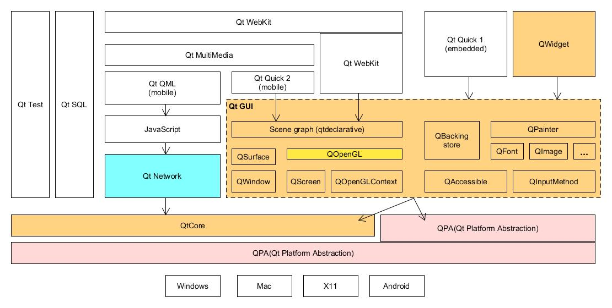

# QT program [[Back](note_qt.md)]

Support **`c++ 11`**

## Qt Framework



## Basic Application

```
#include <QApplication>     // 所有 Qt GUI 應用程序,都需要使用 <QApplication>
#include <QPushButton>      // 使用 push button

int main(int argc, char *argv[])
{
    QApplication    app(argc,argv);                             /* Create a app object */
    QPushButton     pushButton( QObject::tr("Hello Qt !") );    /* Create a button component of widget */

    pushButton.show();  /* display button (default: hide) */

    /* Connect icon (GUI component), event (signal), and method (slot) */
    QObject::connect(&pushButton, SIGNAL(clicked()), &app, SLOT(quit()));

    return app.exec();  /* enter app routine */
}
```

+ Widget module
    > Scenario of graphic components

    - Inheritance(繼承)

        ```
        QPushButton
            -> QButton
               -> QWidget
        ```

+ GUI module
    > Support all kinds of graphic components

+ Core module
    > Support system control API
    > + multi-thread
    > + event/message handshock
    > + state machine
    > + signal and slot
    > + I/O control
    > + Object Inheritance relation


## C++

+ `MainWindow` class
    > Creaded from `QT Designer`

    - Call a component in MainWindow

        ```c++
        MainWindow::MainWindow(QWidget *parent)
          : QMainWindow(parent)
          , ui(new Ui::MainWindow)
        {
            ui->setupUi(this);    // ui is a instance
        }

        MainWindow::~MainWindow()
        {
            delete ui;
        }

        /**
         * objectName is from QT Designer
         * method definition: on_[objectName]_[slot name]()
         */
        void MainWindow::on_open_clicked()
        {
            QString     filePath = QFileDialog::getOpenFileName(this, tr("Open"),
                                                                QDir::homePath(),
                                                                tr("*.bin"));
            if( filePath.isEmpty() )
            return;

            /**
             * call the method of this 'lineEdit' object
             *    'lineEdit' is the objectName of a QLineEdit component
             */
            ui->lineEdit->setText(filePath);
        }
        ```

+ Reference

    - [Qt Tutorials For Beginners - YouTube](https://www.youtube.com/watch?v=EkjaiDsiM-Q&list=PLS1QulWo1RIZiBcTr5urECberTITj7gjA)


## QML

QML(Qt Meta-Object Language,Qt 元對象語言),是用於描述應用程序用戶界面的聲明式可編程語言, 高可讀性, 容易實現復用和自定義.

QML提供了類似JSON的聲明式語法, 提供了必要的**JavaScript**語句和動態屬性綁定的支持.

+ `QtQML` module
    > 定義並實現了QML Language 以及其引擎框架, 允許開發者以自定義類型和集成 `JavaScript` 與`C++`代碼的方式來擴展 QML 語言.

    - 將`QML code`, `JavaScript`和`C++`集成在一起, 既提供了 QML interface, 又提供了 C++ interface.
        > 可以很方便的使用 C++ 擴展 QML, e.g, C++數據模型, C++自定義功能類等,
        >> 其使用 C++ 以一定規則實現後, 並將 C++ class 註冊到 QML 引擎中, 便可以在 QML 中使用 C++ class 中的數據成員, 成員函數, 信號以及槽.

## Reference

+ [零基礎學 qt4 編程](https://wizardforcel.gitbooks.io/wudi-qt4/content/index.html)
+ [Qt參考文檔](https://documentation.help/Qt-3.0.5/index.html)
+ [QT All Classes (official)](https://doc.qt.io/qt-5.15/classes.html)
+ [QT All Modules (official)](https://doc.qt.io/qt-5/qtmodules.html)
