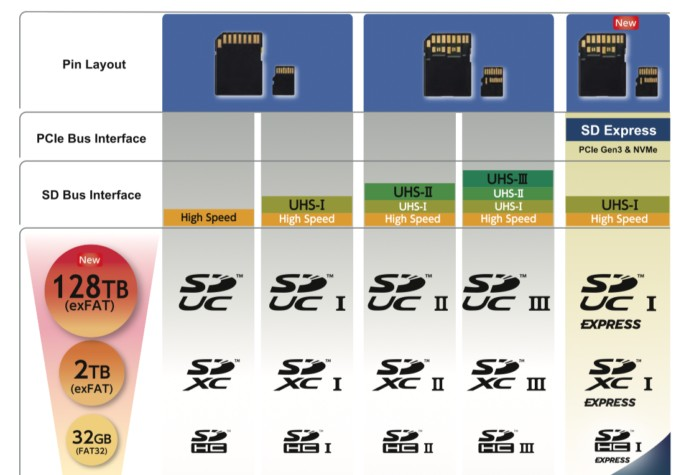
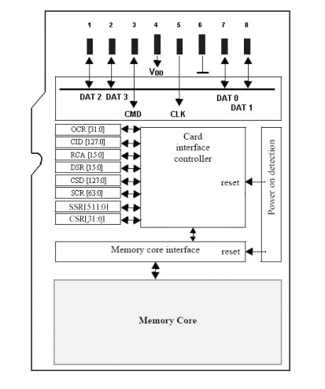

SD/SDIO interface (Secure Digital Input/Output interface)
---

**SD Card(Secure Digital Memory Card)**, 中文翻譯為安全數位卡, 是一種記憶卡, 被廣泛應用於攜帶型裝置上.

**SDIO** 就是 SD 的 I/O interface, 更具體的說 SD 本來是 memory card 的標準, 但也可以把 SD interface 拿來當作上某些週邊介面使用, 這樣的技術便是 SDIO.
> SDIO 本身是一種相當單純的技術, 透過 SD I/O Pins 來連接外部週邊, 並透過 SD I/O Pins 與這些週邊傳輸資料, 而且 SD 協會會員也推出很完整的 SDIO stack driver,
使得 SDIO 週邊(稱為 SDIO 卡)的開發與應用變得相當熱門.

+ SDIO device card

    - GPS receivers
    - digital cameras
    - RFID readers
    - FM radio tuners
    - TV tuners
    - Wi-Fi
    - Bluetooth

## SD card 速度標示制度

| 總線介面標示 |   SD標誌     | 總線標誌  |  總線速度              |   版本      |
| :-           | :-           | :-        | :-                     | :-          |
| Normal Speed | SD/SDHC/SDXC |   -       | 12.5-MB/s              |  1.01       |
| High Speed   | SD/SDHC/SDXC |   -       | 25-MB/s                | 2.00        |
| UHS-I        | SDHC/SDXC    | I         | 50-MB/s (SDR50, DDR50) | 3.01        |
| UHS-I        | SDHC/SDXC    | I         | 104-MB/s (SDR104)      | 3.01        |
| UHS-II       | SDHC/SDXC    | II        | 156-MB/s (FD156)       | 4.00/4.10   |
| UHS-II       | SDHC/SDXC    | II        | 312-MB/s (HD312)       | 4.00/4.10   |
| UHS-III      | SDHC/SDXC    | III       | 312-MByte/s (FD312)    | 6.0         |
| UHS-III      | SDHC/SDXC    | III       | 624-MByte/s (FD624)    | 6.0         |

**SD Throughput**

| 最低寫入速度  |  Speed Class標示法          |UHS Speed Class標示法   | Video Speed Class標示法    |  應用         |
| :-            | :-                          | :-                     | :-                         | :-            |
| 2 MB/s        | SDHC Speed  Class 2 (C2)    | -                      | -                          | 標準畫質拍攝  |
| 4 MB/s        | SDHC Speed  Class 4 (C4)    | -                      | -                          | 高畫質拍攝    |
| 6 MB/s        | SDHC Speed  Class 6 (C6)    | -                      | Video Speed Class 6 (V6)   | 高畫質拍攝    |
| 10 MB/s       | SDHC Speed  Class 10 (C10)  | UHS Speed Class 1 (U1) | Video Speed 10 (V10)       | 超高畫質拍攝(HS), 實時廣播及高畫質影片(UHS) |
| 30 MB/s       | -                           | UHS Class 3 (U3)       | Video Speed Class 30 (V30) | 4K影片 60/120 fps (UHS) |
| 60 MB/s       | -                           | -                      | Video Speed Class 60 (V60) | 8K影片 60/120 fps (UHS) |
| 90 MB/s       | -                           | -                      | Video Speed Class 90 (V90) | 8K影片 60/120 fps (UHS) |

**Logo**

> 
>> 傳統 SD (容量 < 2GBytes)

## SD Card I/O Pinout

Micro SD Card, 原名 `Trans-flash Card (TF)`. 2004 年正式更名為 Micro SD Card, 由 SanDisk 公司發明.

### SD Card Pin Description

+ 傳輸模式
    > + `SPI mode (Required)`
    > + `1-bit mode`
    > + `4-bits mode`

| Pin# | `SD 4-bit` (Pin Name) | `SD 4-bit` (Pin Description) | `SD 1-bit` (Pin Name) | `SD 1-bit` (Pin Description) | `SPI Mode` (Pin Name) | `SPI Mode` (Pin Description) |
| :-   | :-                  | :-                          | :-                  | :-                         | :-                  | :-                         |
| 1    | CD/DAT[3]           | Data Line 3                 | N/C                 | Not Used                   | CS                  | Card Select                |
| 2    | CMD                 | Command Line                | CMD                 | Command Line               | DI                  | Data Input                 |
| 3    | Vss1                | Ground                      | Vss1                | Ground                     | Vss1                | Ground                     |
| 4    | VDD                 | Supply Voltage              | VDD                 | Supply Voltage             | VDD                 | Supply Voltage             |
| 5    | CLK                 | Clock                       | CLK                 | Clock                      | SCLK                | Clock                      |
| 6    | Vss2                | Ground                      | Vss2                | Ground                     | Vss2                | Ground                     |
| 7    | DAT[0]              | Data Line 0                 | DATA                | Data Line                  | DO                  | Data Output                |
| 8    | DAT[1]              | Data Line 1 / Interrupt     | IRQ                 | Interrupt                  | IRQ                 | Interrupt                  |
| 9    | DAT[2]              | Data Line 2 /Read Wait      | RW                  | Read Wait                  | NC                  | Not Used                   |

**SD Memory Card Architecture**

### SD 卡的 PinOut 定義和 `Micro SD (TF)` 卡的 PinOut 定義是不相同

**4-bit Mode**

| Pin#  |  SD卡  |  TF卡(MicroSD卡)|  TF卡(SPI mode)  |
| :-    | :-     | :-              | :-               |
| 1     | DAT[3] | DAT[2]          | Rsv              |
| 2     | CMD    | DAT[3]          | CS               |
| 3     | Vss1   | CMD             | Di               |
| 4     | VDD    | VDD             | VDD              |
| 5     | CLK    | CLK             | SCLK             |
| 6     | Vss2   | Vss2            | Vss              |
| 7     | DAT[0] | DAT[0]          | Do               |
| 8     | DAT[1] | DAT[1]          | Rsv              |
| 9     | DAT[2] | --              | --               |

**MicroSD Memory Card Architecture**

### SD Card Basic Registers

SD card 總共有 8 個 registers, 用於設定或表示 SD 卡資訊 (只有 DSR 是 Optional, 其他皆是 **Mandatory**)

| Reg                                           | bit length | description                                          |
| :-                                            | :-         | :-                                                   |
| CID (Card identification number, 卡識別號)    | 128        | 用來識別的卡的個體號碼 (唯一的)                      |
| RCA (Relative card address, 相對地址)         | 16         | 卡的本地系統地址, 初始化時, 動態地由卡建議, 主機核准 |
| DSR (Driver Stage Register, 驅動級)           | 16         | 組態卡的輸出驅動 (Optional)                          |
| CSD (Card Specific Data, Card 的特定資料)     | 128        | 卡的操作條件資訊                                     |
| SCR (SD Configuration Register, SD 組態)      | 64         | SD 卡特殊特性資訊                                    |
| OCR (Operation conditions register, 操作條件) | 32         | 操作條件                                             |
| SSR (SD Status, SD 狀態)                      | 512        | SD 卡專有特徵的資訊                                  |
| CSR (Card Status,Card 狀態)                   | 32         | 卡狀態資訊                                           |

## [SD-Bus-Protocol](note_SD_SDIO_bus_protocol.md)

## Reference

+ [SD卡](https://zh.m.wikipedia.org/zh-tw/SD%E5%8D%A1#SDIO_.E4.BB.8B.E7.BB.8D)
+ [SD Specifications](https://www.sdcard.org/downloads/pls/)
+ [【SDIO】SD2.0協議分析總結（一）](https://www.cxyzjd.com/article/ZHONGCAI0901/113190393)

