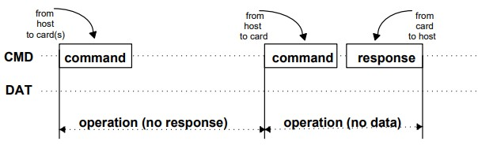
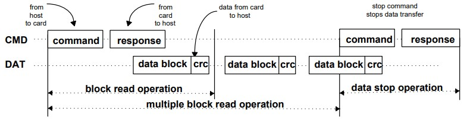
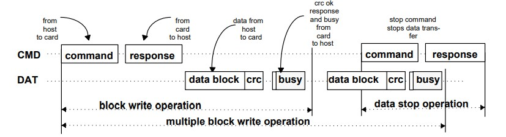
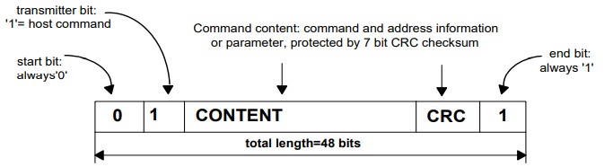
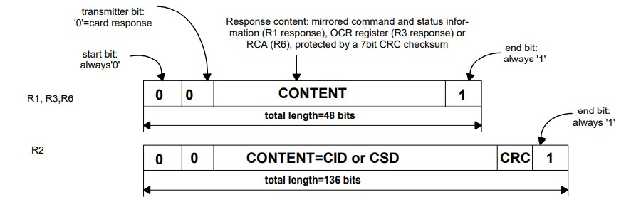
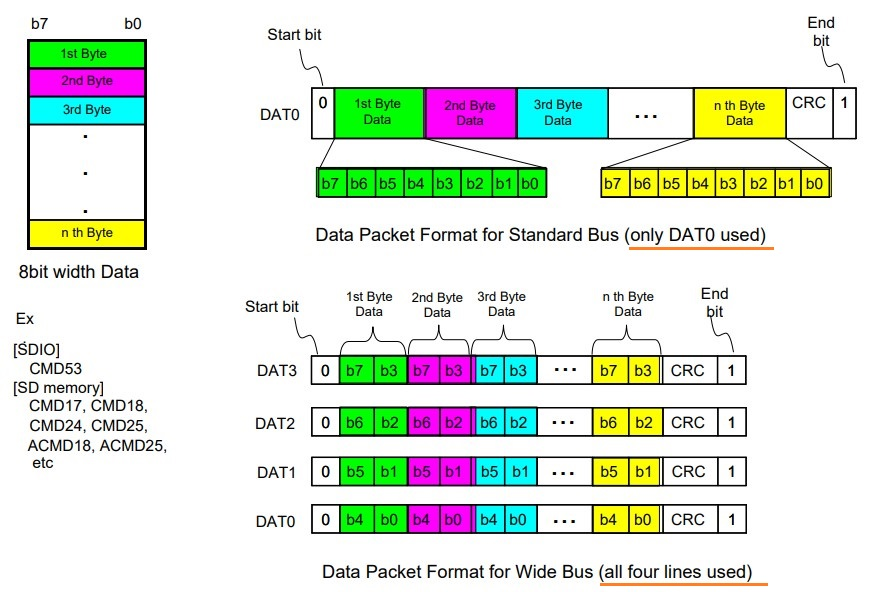
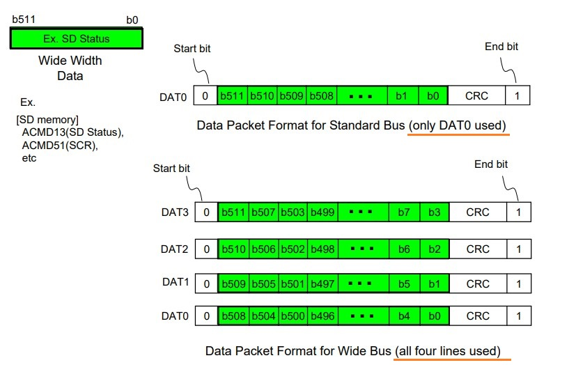
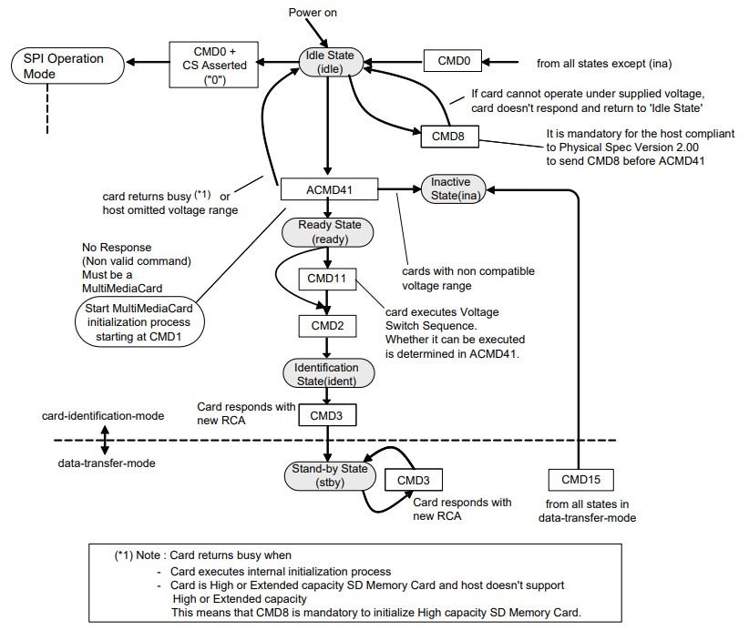
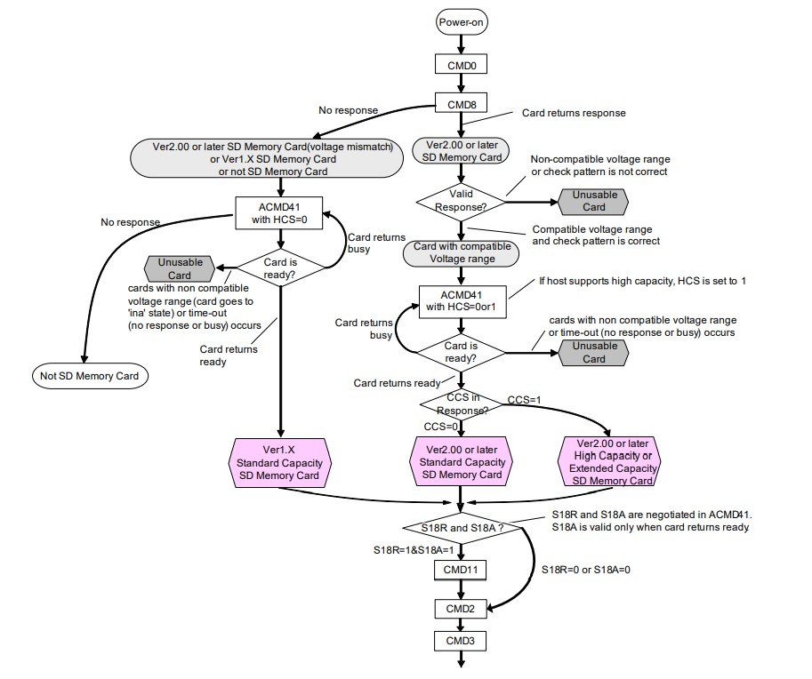

SD/SDIO Bus Protocol [[Back](note_SD_SDIO.md#SD-Bus-Protocol)]
---

SD Bus 上的通訊是基於 `Command` 和 `Data` 傳輸的, 由一個 **開始位('0')** 發起, 由一個 **停止位('1')** 終止.

SD 每次通訊操作, 都是由 Host 在 CMD-Signal 傳送一個 `Command`, Card 在接收到 `Command` 後, 在 CMD-Signal 回應 `Response`, 如果有需要, 則會有 Data 傳輸參與
> + **Command** (在 CMD-Pin 上 Serially Half-duplex xfer)
>> Command 是啟動操作的 token. Command 從 Host 傳送到單個 Card(定址命令) 或所有連接的 Card(廣播命令).
> + **Response** (在 CMD-Pin 上 Serially Half-duplex xfer)
>> Response 是一個 token, 它從一個有地址的 Card 或從所有連接的 Card 傳送到 Host, 作為對先前接收到 Command 的回應.
> + **Data** (在 DATx-Pin Half-duplex xfer)
>> Data 可以在 Card 和 Host 間雙向傳輸

## SD Transaction

SD data 是以 `Black` 形式傳輸的 (SDHC data block 長度一般為 512-bytes), data 可以從 Host 到 Card, 也可以是從 Card 到 Host.
> Data Block 需要 CRC 來保證資料傳輸成功. CRC 由 SD Card 系統 H/w 生成

### Basic Transaction

### Block Read/Write

SD data 傳輸支援 Single/Multiple block Read/Write (各自對應不同的 `Command`)
> + 當使用 Multiple block transmission 時, 需要使用 `Command` 來停止操作.
> + Data 傳輸時, 由 Host 設置使用 `1-bits` or `4-bits mode`
> + SD Card 會藉由 **拉低 DAT[0] Signal 來表示目前 BUSY**
> + Data 寫入前, 需要檢測 SD Card 狀態(Busy or not),
>>因為 SD Card 在接收到資料後, 寫入到儲存區的過程, 需要占用一定的時間

+ **Read**
    > 對於 Read Command, 首先 Host 會向 Card 傳送 `Command`, 緊接著 Card 會先回應一個 `Response`,
    接著 Card 開始傳送 data block 給 Host, 所有 data block 都帶有 CRC(由H/w 自動處理)
    > + Single Block Read 時, Card 發送 1 個 data block 後, 即可以停止, 不需要傳送 STOP Command (CMD12).
    > + Multiple Block Read 時, Card 會一直發送 data block 給 Host (Card 不可占用 CMD-Signal), 直到接到 Host 傳送的 STOP Command (CMD12).

    

+ **Write**
    > + 對於 Write Command, 首先 Host 會向 Card 傳送命令, 緊接著 Card 會返回一個 `Response`.
    當 Host 收到 Card 的 `Response`後, 會將 data 放在 1-bit or 4-bits 的 DATx 上, 在傳送資料的同時會跟隨著 CRC(由H/w 自動處理).
    > + Card 收到 data block 後, 將 `DAT[0] Signal` 拉 low (H/w 自動處理), 表示 Card 目前處於 BUSY, 並開始執行寫入流程;
    寫入完成後, 則將 `DAT[0] Signal` 拉 high (H/w 自動處理), 表示 Card 目前處於 IDLE, Host 可以繼續傳送 data block.
    > + 當整個寫傳送完畢後, Host 會再次傳送一個命令, 通知 Card 操作完畢, Card 同時會返回一個響應.

    

## Command and Response data formate

+ Command type
    - Broadcast commands (bc)
        > **No response**

    - Broadcast commands with response (bcr)

    - Addressed commands (ac)
        > **No data transfer on DATx**

    - Addressed data transfer commands (adtc)
        > Data transfer on DATx

+ Token Format
    > 在 CMD-signal 中, 首先傳輸最高有效位(MSB), 最後傳輸最低有效位(LSB)

    - CMD Token
        > 每個 Cmd 前面都有一個 start bit (0), 後面有一個 end bit (1), 總長度為 48-bits, 每個 Cmd 都被 CRC field 保護.

        

    - Response Token
        > Response 的長度有 48 or 136 bits, 這個取決於 R1/R2/R3... 的 Content 大小

        

        Part1_Physical_Layer_Simplified_Specification
        >`4.9 Responses`

        1. R1 (normal response command) format

            | Bit position |  47      | 46               | [45:40]       | [39:8]       | [7:1] |  0      |
            | :-:          | :-:      | :-:              | :-:           | :-:          | :-:   | :-:     |
            | Width (bits) |  1       | 1                | 6             |   32         | 7     |  1      |
            | Value        | '0'      |'0'               | x             | x            | x     | '1'     |
            | Description  |start bit | transmission bit | command index | card status  | CRC7  | end bit |

        1. R2 (CID, CSD register) format

            | Bit position |  135     | 134              | [133:128]  | [127:1]                                  |  0      |
            | :-:          | :-:      | :-:              | :-:        | :-:                                      | :-:     |
            | Width (bits) |  1       | 1                | 6          | 127                                      |  1      |
            | Value        | '0'      | '0'              | '111111'   | x                                        | '1'     |
            | Description  |start bit | transmission bit | reserved   | CID or CSD register incl.  internal CRC7  | end bit |

        1. R3 (OCR register) format

            | Bit position |  47      | 46               | [45:40]   | [39:8]       | [7:1]     |  0      |
            | :-:          | :-:      | :-:              | :-:       | :-:          | :-:       | :-:     |
            | Width (bits) |  1       | 1                | 6         | 32           | 7         |  1      |
            | Value        | '0'      |'0'               | '111111'  | x            | '1111111' | '1'     |
            | Description  |start bit | transmission bit | reserved  | OCR register | reserved  | end bit |

        1. R6 (Published RCA response)

            | Bit position |  47      | 46               | [45:40]                      | [39:24]      | [23:8]       | [7:1] |  0      |
            | :-:          | :-:      | :-:              | :-:                          | :-:          | :-:          | :-:   | :-:     |
            | Width (bits) |  1       | 1                | 6                            | 16           | 16           | 7     |  1      |
            | Value        | '0'      |'0'               | x                            | x            | x            | x     | '1'     |
            | Description  |start bit | transmission bit | command index  ('000011') | New published RCA [31:16] of the card | [15:0] card status bits: 23,22,19,12:0| CRC7 | end bit |

        1. R7 (Card interface condition) format

            | Bit position | 47        | 46               | [45:40]       | [39:20]       | [19:16]          | [15:8]                     | [7:1] | 0      |
            | :-:          | :-:       | :-:              | :-:           | :-:           | :-:              | :-:                        | :-:   | :-:    |
            | Width (bits) | 1         | 1                | 6             | 20            | 4                | 8                          | 7     | 1      |
            | Value        | '0'       | '0'              | '001000'      | '00000h'      | x                | x                          | x     | '1'    |
            | Description  | Start bit | Transmission bit | Command index | Reserved bits | **Voltage accepted** | Echo-back of check pattern | CRC7  | End bit|

            **Voltage Accepted in R7**

            | Voltage accepted  |  Value Definition               |
            | :-:               | :-:                             |
            | 0000b             | Not Defined                     |
            | 0001b             | 2.7-3.6V                        |
            | 0010b             | Reserved for Low Voltage Range  |
            | 0100b             | Reserved                        |
            | 1000b             | Reserved                        |
            | Others            | Not Defined                     |

## Data Packet Format

使用 4-DAT lines 傳輸時, 每次傳輸 4-bits data, 每根 DAT line 都必須有**Start bit**, **End bit**以及**CRC field**,
> CRC field 每根 DAT line 都要各別檢查, 並把檢查結果彙總後, 在 data 傳輸完後, 通過 DAT0 線回應給 Host.

4-DAT lines 同步傳送, 每根 DAT line 傳送一個 byte 的其中 2-bits, 
> Data 依照 4-DAT line 順序排列傳送 (DAT3 發 High-bit, DAT0 發 Low-bit)

SD Card Packet 有兩種格式,
> + 一種是常規資料 (8bit width)
> + 另外一種是寬位封包格式 (Ex. ACMD13)

+ Data Packet Format for Usual Data (8-bit width)
    > 先發 LSB (Least Significant Byte) 再發 MSB (Most Significant Byte),
    而每個 Byte 則是先發 MSB (Most Significant Bit) 再發 LSB (Least Significant Bit)

    

+ Data Packet Format for Wide Width Data (Ex. ACMD13)
    > 對 SD Card 而言, 寬位封包傳送方式是針對 SSR(SD 狀態) Reg 內容傳送的.
    >> SSR Reg 總共有 512bits, 在 Host 發出**ACMD13**後, SD Card 將 SSR 內容通過 DAT line 傳送給 Host

    

## Card Identification Flow

Part1_Physical_Layer_Simplified_Specification
> `4.2 Card Identification Mode`

### Host 和 SD Card 在通訊之前, 必須知道彼此所支援的工作電壓範圍, 因此會做以下 handshake.

SD Card bus commands
> `4.7.4 Detailed Command Description`

+ Reset SD Card

    - Host 會以默認電壓傳送一個 **CMD0**, 並且 Host 默認 Card 支援該命令
    - 上電或 **CMD0** 後, 所有 SD Card 的 **CMD-signal 設定成 Input mode**, 等待下一條命令
        > 此時會初始化 SD Card 的默認地址(RCA=0x0000)和默認驅動強度改成 400KHz clock frequency,
        並且讓 SD Card 處於 `idle` (不論之前卡是處於 `inactive` 還是其他狀態),
        >> 這時 Host 和 Card 都處在 3.3V 的訊號(signaling)電壓.

+ 如果在傳送 **CMD0** 時, CS(和 DAT3 復用) 又被 pull low , 這時就會進入 SPI mode,
    > 進入 SPI mode 需要重新上電才可以解除, 這種模式使用較少.

+ Host 會傳送 **CMD8**, 藉此將 Host 工作電壓範圍資訊, 告知 SD Card.
    > 如果 SD Card 支援這個工作電壓範圍, 會 response 可支援的電壓參數, 如果不在範圍內則不做響應, 這時 Host 還處在 idle

+ **ACMD41** 是用來識別不匹配 Host 供電電壓的 Card.
    > 如果 SD Card 不在 Host 提供的供電電壓範圍內, SD Card 將進入 `inactive`.
    >> Host 在傳送 **ACMD41**時, 可以將命令中的 OCR 參數設定成 0, 用來查詢 SD Card 所支援的工作範圍.
    Host 查詢到 SD Card 的工作電壓後, 可以作為下次傳送 ACMD41 命令的參數

## Card Initialization and Identification Process

Part1_Physical_Layer_Simplified_Specification
> `4.2.3 Card Initialization and Identification Process`

+ 當 SD Bus 被激活後, Host 就開始處理 SD Card 的初始化和識別.
    > 在 Host 發 **ACMD41** 開始處理 SD Card 初始化時, Host 會在 **ACMD41** 的參數中, 設定它的操作條件和設定 `OCR->HCS field`
    > + `HCS field` = 1, 表示 Host 支援 SDHC 或者 SDXC
    > + `HCS field` = 0, 表示 Host 不支援 SDHC 和 SDXC

+ SD Card 利用 `OCR->busy field` 來通知 Host, **ACMD41**的初始化已經完成
    > + 如果 `busy field` = 0, 表示 SD Card 還在初始化
    > + 如果 `busy field` = 1, 表示 SD Card 初始化已經完成

    > Host 會在 1sec 的時間內, 重複不斷地傳送**ACMD41**, 直到 `busy field` 被置 1 為止.
    >> 但 SD Card 只有在**第一次**收到設定電壓的 **ACMD41**時, 才會去檢查操作條件和 `OCR->HCS field`,
    > 並且在重複傳送**ACMD41**的這段時間裡, Host 不應該傳送任何命令, 除了 **CMD0**

+ 如果 SD Card 能正確響應**CMD8**之後, SD Card 對**ACMD41**的響應會包含一個 `CCS field`, `CCS` 在 SD Card 返回 ready 時(busy == 1)有效
    > + `CCS = 0` 表示 SD Card 是 SDSC
    > + `CCS = 1` 表示 SD Card 是 SDHC 或者 SDXC

+ 在**ACMD41**之後, Host 會傳送**CMD2**, 獲取卡的 `CID`
    > 在 SD Card 傳送它的 `CID`之後, SD Card 會進入識別狀態 (identification State)

+ 接著, Host 傳送**CMD3**, 請求 SD Card 發佈 SD Card 的 RCA
    > `RCA` 是一個比 CID 短且將來在資料傳輸模式中使用的地址

## Reference

+ [【SDIO】SD2.0協議分析總結（一）](https://www.cxyzjd.com/article/ZHONGCAI0901/113190393)
+ [SD卡識別流程簡介](http://www.xxxdk.xyz/xxx/2021/03/SD%E5%8D%A1%E8%AF%86%E5%88%AB%E6%B5%81%E7%A8%8B%E7%AE%80%E4%BB%8B/)
+ [SD卡初始化及讀寫流程](https://www.796t.com/content/1547974278.html)
+ [【科普貼】SD卡介面協議詳解](https://blog.csdn.net/zangqihu/article/details/125321156?spm=1001.2101.3001.6650.2&utm_medium=distribute.pc_relevant.none-task-blog-2%7Edefault%7ECTRLIST%7ERate-2-125321156-blog-60467901.pc_relevant_multi_platform_whitelistv3&depth_1-utm_source=distribute.pc_relevant.none-task-blog-2%7Edefault%7ECTRLIST%7ERate-2-125321156-blog-60467901.pc_relevant_multi_platform_whitelistv3&utm_relevant_index=3)
+ [37. SDIO—SD卡讀寫測試](https://doc.embedfire.com/mcu/stm32/f103badao/std/zh/latest/book/SDIO.html)
