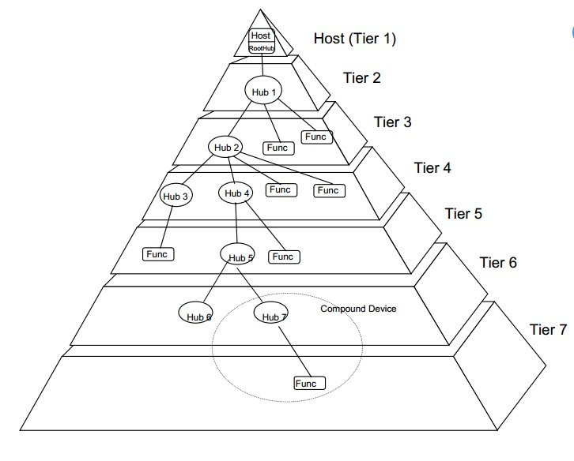
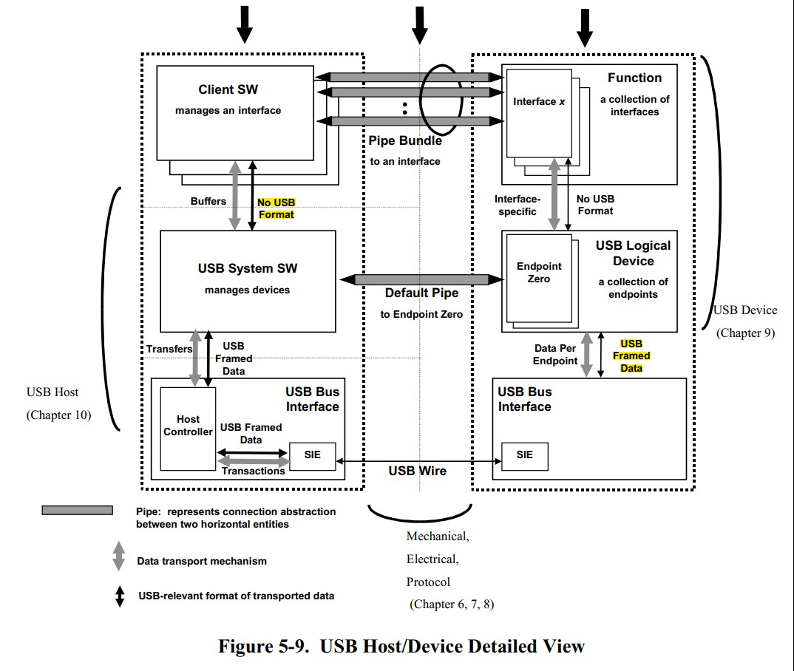
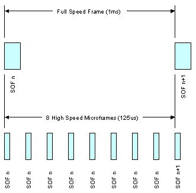

Universal Serial Bus (USB, 通用串行匯流排)
---

USB 採用 Polling(輪詢)的**廣播機制**傳輸數據, 所有的傳輸都由 Host 發起, **USB Devices 沒有主動通知 USB Host 的能力**.<br>
任何時刻整個 USB 體系內, 僅允許一個數據包的傳輸 (Half-Duplex), <br>
即不同物理傳輸線上看到的數據包都是同一被廣播的數據包。

以下是 USB 的版本比較:

| Version  | Throughput | Channel Access | comment   |
| :-:      | :-:        |  :-:           | :-        |
| USB 1.1  | 1.5Mbps    |  Half-Duplex   |  USB Lowl-Speed           |
| USB 2.0  | 12Mbps     |  Half-Duplex   |  USB 2.0 Full-Speed (FS)  |
| USB 2.0  | 480Mbps    |  Half-Duplex   |  USB 2.0 High-Speed (HS)  |
| USB 3.0  | 5Gbps      |  Full-Duplex   |  USB 3.2 Gen1 Super-Speed |
| USB 3.1  | 10Gbps     |  Full-Duplex   |  USB 3.2 Gen2x1           |
| USB 3.2  | 20Gbps     |  Full-Duplex   |  USB 3.2 Gen2x2           |
| USB 4.0  | 40Gbps     |                |  2019年9月3日發佈         |

+ OTG [(On-The-Go)](./note_usb.md#USB-OTG)
    > USB-IF公佈 `USB On-The-Go`(USB OTG, 當前版本 1.0a) 作為 USB 2.0 規範的**補充標準**, 使其能夠用於在 portable devices 之間直接交換數據
    >> Device 可以切換成 Host

# USB topology

USB 的設計為非對稱式的, 它由一個 Host controller 和若干通過集線器設備(Hub), 以樹狀連接的 Devices 組成.
> 考慮訊號傳遞衰減和時間限制, 樹狀架構最多七層

一個 Host controller 最多可以有 5 級 Hub, 包括 Hub 在內, 最多可以連接 128 個 Devices
> 因為使用 `7-bits` 定址欄位 (一個 Device 給一個 address, 也就是識別 ID), 而 Hub 本身 address = 0



+ USB Device 又可以分為

    - Hub
        > 用來連接更多裝置
    - Function
        > 提供特殊功能給系統, e.g. 人機裝置, 影像裝置, 儲存裝置等等.
    - Compound Device
        > 本身擁有功能(Function), 也帶有一個 Hub, 有其他裝置連接時可以作為 Host.
    - Composite Device
        > 提供超過一個功能的裝置.

## USB 類似 network 架構

```
    +-----------+
    | App       |
    +-----------+
    | Transport |
    +-----------+
    | Network   |
    +-----------+
    | Data-Link |
    +-----------+
    | Physical  |
    +-----------+
```

+ Physical Layer
    > 電氣特定協定

    - USB 1.x/2.0 Standard pinout

        |接點 | 功能 (Host)        | 功能 (Device)      |
        | :-  | :-:                | :-:                |
        |1    | Vbus (4.75-5.25 V) | Vbus (4.4-5.25 V)  |
        |2    | D- (Data -)        | D-  (Data -)       |
        |3    | D+ (Data +)        | D+  (Data +)       |
        |4    | 接地               | 接地               |

    - USB 1.x/2.0 Mini/Micro pinout
        > Mini USB (A/B type) 除了第 4 pin 外, 其他接口功能皆與標準 USB 相同. <br>
        第 4 pin 成為 ID, 地線在 mini-A 上連接到第 5 pin, 在 mini-B 可懸空也可連接到第 5 pin

        |接點 | 功能 (Host)        | 功能 (Device)      |
        | :-  | :-:                | :-:                |
        |1    | Vbus (4.4-5.25 V)  | Vbus (4.4-5.25 V)  |
        |2    | D-                 | D-                 |
        |3    | D+                 | D+                 |
        |4    | ID                 | ID                 |
        |5    | 接地               | 接地               |

        1. Controller 通過判斷 ID pin 的電平來判斷插入設備
            > + High 電平, 則是 type-B 接頭插入
            > + Low 電平, 則是 type-A 接口插入


+ Data-Link Layer

    - Media Access Control (MAC, 媒介存取控制)
        > Modulate/Demodulate 資料, 並收發到 Physical layer

        1. 採用 [**NRZI Coding**](./note_usb.md#編碼模式) 編解碼

    - Logical Link Control (LLC, 邏輯連結控制)
        > frame fragment/assemble, 錯誤通知, 資料流控制

+ Network Laye

    - Addressing and routing

+ Transport Layer (Packet Protocol)

    - Handshake
    - USB Descriptors

+ App layer

    - Device classes type


# 編碼模式

NRZI Coding (Non Return to Zero Invert, 不歸零就反向) 無需同步的時脈信號, 也能產生同步的資料存取
> NRZI Coding 規則是, 當 data bit 為 `1` 時, 電位不轉換; 為 `0` 時, 電位再作轉換

為了防止出現過長時間電位不變化現象, 在發送 data時, 採用 bit padding 處理
> 當遇見連續 6 個高電位時, 就強制插入一個 0.
經過 bit padding 後的數據, 由串行接口引擎(SIE)將 data 串行化和 NRZI coding 後, 發送到 USB 的差動數據線上.
>> 接收端完成的過程和發送端剛好相反

# Role type

USB 是一種 **Polled Bus**, 由 Host 啟動(Initiates)資料傳輸, 而 Device 做出回應
> 此處的 Polling(輪詢)是在 Host Controller 來執行, 當 Bus 需要被注意時, 會發出中斷讓 OS 處理



## 名詞解釋

+ USB Host
    > 實際的 Host 裝置, e.g. windows, linux, ...etc.

    - Client Software
        > USB application program

    - USB System Software
        > The middleware of USB Host application program

        1. 管理多個 USB device
        1. 管理 Resource, e.g. buffer memory

    - HCD (Host Controller Driver)
        > driver of H/w controller of Host

+ USBD (USB Device)
    > USB Physical Device

    - Endpoint
        > 類似 network 中的 port, 是 USB device 中, 可以進行數據收發的最小單元, 支持單向或者雙向的數據傳輸.

        - endpoint_0 用於控制傳輸, 可雙向傳輸
        - 除了 endpoint0 以外, 其他 endpoint_x 只支持一個方向的數據傳輸

    - Interface
        > 多個 Endpoints 集合成一個 interface
        >> 也可以將 Interface 看作是一種 function of device

+ Pipe
    > USB 系統中 data 的傳輸, 巨觀來看是在 Host 和 USB func device 之間進行;
    微觀來看是在 System S/w 的 Buffer 和 USB func device 的 Endpoint 之間進行.<br>

    > 一般來說 Endpoint 都有 Buffer, 因此可認為**USB 通訊就是 System S/w Buffer 和 Device Endpoint Buffer 之間的數據交換**,
    可以抽象化為兩者間使用 End to End 的 pipe 傳遞;

    > System S/w 通過和 Device 之間的數據交換, 來完成 Device 的控制和數據傳輸, 這通常需要多個 pipes 來完成數據交換
    >> 因為一個 pipe 只支持一種類型的 data 傳輸, 同時一個 pipe 會連接到一個 Endpoint; 而集合多個 Endpoints 則稱為 Device interface;
    這就是 Endpoint, Pipe 和 Interface 的關系

    - Stream Pipe (Raw data)
    - Message Pipe (有固定格式)
        > 任何 USB Device 一旦上電就存在一個信息管道, 即默認的控制管道;
        USB Host 通過該管道, 來獲取 Device 的描述, 配置, 和狀態;
        並對 Device 進行配置.

+ Frame and Microframe
    > 為了確保同步, USB 把時間切割成固定長度的 time slot.
    > + Low-Speed 和 Full-Speed 的時候是以 `1 ms` 為單位, 稱為一個 Frame
    > + High-Speed 時再把一個 Frame 切成 8 等分, 一個 `0.125 ms` 為單位, 稱為 `Microframe`

    

    > SOF (Start-of-Frame packet) 是一種特殊的封包, 他在每一個 frame 開始時發送

## Host Controller

在 USB Host端, 幾家大廠制定了 HCD (Host Controller Driver) 的規範
> + OHCI/UHCI 都是 USB1.1 的介面標準
> + EHCI 是對應 USB2.0 的介面標準
> + xHCI 則是 USB3.0 的介面標準

+ OHCI (Open Host Controller Interface)
    > 支援 USB1.1, 但它不僅僅是針對 USB, 還支援其他的一些介面, e.g. Apple的火線 (Firewire, IEEE 1394)介面. <br>
    與 UHCI 相比, OHCI 的硬體較複雜 (硬體做的事情多), 所以實現對應的 S/w driver, 就相對較簡單. <br>
    主要用於**非x86**的 USB, e.g. 擴展卡, embedded system 的 USB 主控.

+ UHCI (Universal Host Controller Interface)
    > 由 Intel 主導的 USB1.0/1.1 的介面標準, **與 OHCI 不相容**. <br>
    UHCI 的 H/w 較簡單, 將多數的處理都轉由 S/w 來做, 是一種低成本的 USB Host controller. <br>
    Intel 和 VIA 使用 UHCI, 而其餘的硬體提供商則使用 OHCI.

+ EHCI (Enhanced Host Controller Interface)
    > 由 Intel 主導的 USB2.0 的介面標準. **EHCI 只提供 USB2.0 的 High-Speed 功能**, 而依靠 UHCI 或 OHCI 來提供對 Full-Speed 或 Low-Speed 設備的支援.

+ xHCI (eXtensible Host Controller Interface),
    > 是 USB3.0 的介面標準, 它在速度, 節能, 虛擬化等方面, 都比前面 3 種有較大的提高. <br>
    xHCI 支援所有種類速度的 USB devices (USB 3.0 SuperSpeed, USB 2.0 Low/Full/High Speed, USB 1.1 Low/Full Speed). <br>
    xHCI 的目的是為了替換前面 3種(UHCI/OHCI/EHCI).

## Device

# [Protocol](note_usb_protocol.md)


# USB-OTG

OTG device 使用插頭中的 ID pin 來區分 type A/B Device.
> + **ID 接地**被稱作為 type A-Device, 為連接時候的 `USB Host`, type A-Device 始終為 USB bus **提供電力**
> + **ID 懸空**被稱作為 type B-Device, 為連接時候的 `USB Device`

設備的USB Host/USB Device 角色可以通過 HNP 切換

USB OTG 與 USB2.0 相比, 多三種新的傳輸協定。


# Reference

+ [USB (Universal Serial Bus)-成大資工 WiKi](http://wiki.csie.ncku.edu.tw/embedded/USB)
+ [USB 枚舉過程介紹](https://www.wpgdadatong.com/tw/blog/detail?BID=B4561)
+ [OSI七層簡介](https://giboss.pixnet.net/blog/post/26798748-osi%E4%B8%83%E5%B1%A4%E7%B0%A1%E4%BB%8B)

