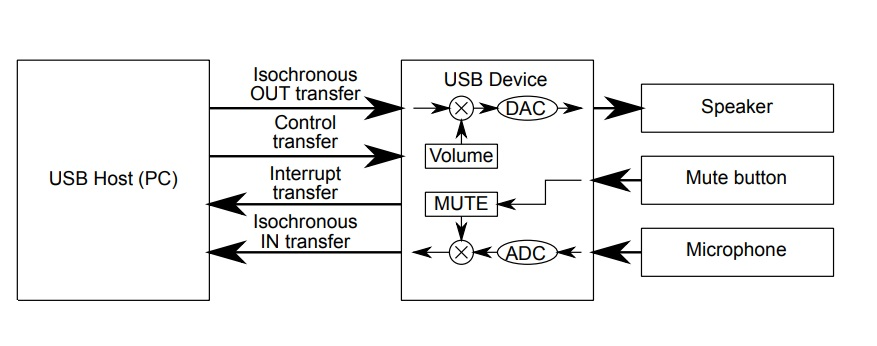
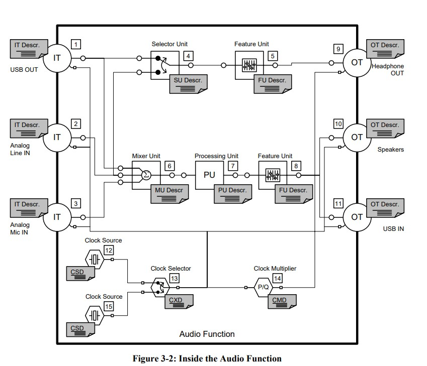
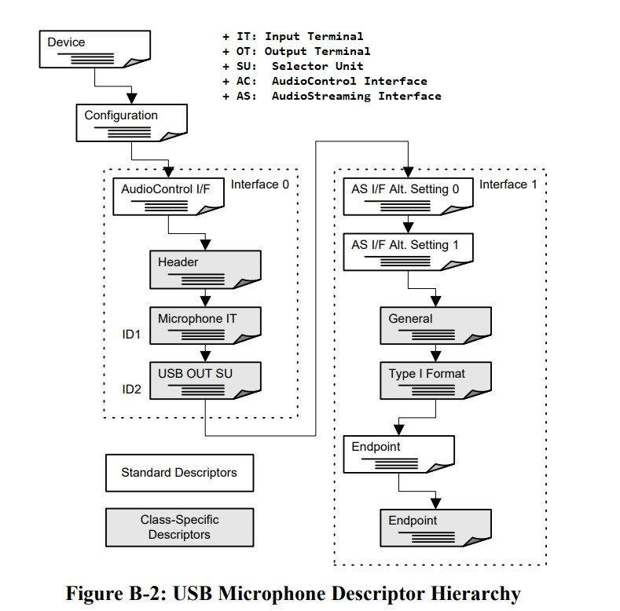

UAC (USB Audio Class) [[Back](note_usb_device.md#UAC)]
---

`UAC`(USB Audio Class) 有時也叫 `UAD`(USB Audio Device)
> UAC 目前的發展已經經歷了 `1.0`, `2.0`(Win10 目前只支援到 UAC2.0) 到現在的 `3.0`.

通過 UAC 可以實現即時獲取音訊裝置的音訊資料(Isochronous Transfers), 並且也可藉 UAC 實現操控裝置的 `Volume`, `Sample Rate`, 等參數.
> 從使用功能來說, 主要包括 USB 麥克風, USB 音效卡和其它音訊裝置的功能控制和介面標準




## UAC Host/Device 資料同步

UAC 對 real-time 的需求較高, 因此使用 Isochronous Transfers
> Isochronous Transfers 特性
> + 可容忍一定程度的錯誤
> + 沒有 Handshaking 機制 (不重傳, 同時重傳也會造成 AV-Sync 的 effort), 低延遲 (USB cable 品質要求高)
> + Isochronous Transfers 在所有傳輸中 priority 最高

### 造成不同的原因

+ Host/Device CPU 執行時, 程式流程造成的 loading 差異
+ Host/Device 本身的 system clock 就存在誤差
    > 會導致 Device 端 data buffer 出現 Over-Run 或 Under-Run
    > + Over-Run: 來不及輸出, 造成 Drop data
    > + Under-Run: 來不及輸入, 造成 buffer empty

    - 比如 PC 播放一個 48KHz 的 audio, 假設 USB Host 按照標準的 48K sample rate 傳送封包, 而 USB Device 用 I2S 播放 audio data.
        > 假定 audio data 是`雙通道`, `16-bits/sample`, I2S 理想的 clock 為 `48K * 2 * 16 = 1536KHz`

    - USB Device 因製程的物理特性, 只能產生 clock 1530KHz, 造成 Device 比 Host 處理慢, 而出現 USB Device Over-Run

### UAC 定義的同步機制

> + UAC1.0 3.3 Audio Synchronization Types
> + UAC2.0 3.11 Audio Synchronization Types

+ Asynchronous (可由 F/w 實作)
    > 在 Asynchronous 模式下, Host 藉由一個 endpoint 來獲得 Device 的實際資料傳送率, 並即時調整自身的資料傳送率.
    Device 能依據這一點, 來保證自身 buffering 的穩定性, 進而解決資料同步的問題.
    >> e.g. Host 傳送速率為 48KHz, Device 反饋實際播放速率為 46KHz, 那麼 Host 就會調整自身傳送速率到 46KHz

    ```
    +--------------+                      +------------------+
    |   Host       | feedback bit-rate    |       Device     |
    |   Sync_Ep_IN +<---------------------+ Sync_Ep_IN       |
    |              |                      |                  | I2S
    |        Ep_OUT+--------------------->+ Ep_OUT -> Buffer-+------> Audio Codec
    |              | audio data           |                  |
    +--------------+                      +------------------+
    ```

+ Synchronous (data 有可能有損失)
    > Device 根據 Host 傳送的 SOF frame 來同步資料的傳送.
    >> SOF 是資料的起始 frame, 對於 USB Full-Speed, Host 以 `1.00 ms ±0.0005 ms` 的間隔傳送 SOF, 對於 High-Speed, 間隔是 `125 µs ±0.0625 µs`

    > 以 Full-Speed 來說明 Synchronous 同步方式; 假設 Device 的 Sync OUT endpoint 設定的資料間隔也為 1ms(一個 SOF 傳輸一次資料),
    每隔一個 SOF, Device 接收一 frame data 後, 重新啟動一次 DMA 傳輸, 這樣 Device 的資料傳送率, 就依據 Host 的 SOF 來同步.

    > 但由於 Host 資料傳送的不穩定情況和 Device 自身傳送 clock 的不同步問題, 仍然會導致 Device buffering 的 Over-Run 或 Under-Run.
    一般的解決辦法, 是採用 resample 的方式, 來保證 Device 的資料依穩定 clock 傳送
    >> 在 Over-Run 時, Drip 某些 samples, 而 Under-Run 時, 插入某些 samples


+ Adaptive (data 有可能有損失)
    > 自適應模式, 即 Device 自動適應 Host 的資料傳送率
    > + 雖然 Host 資料傳送不穩定, Device 主動調整自身資料傳送 clock, 來適應 Host 的資料傳送率
    > + Device 通過 resample 的方式, Insert/Drop buffer 內的 samples 來保證自身資料傳送率的穩定性


## Throughput of UAC

| UAC ver | USB                     | Isochronous Endpoint                             |
| :-      | :-                      | :-                                               |
| UAC1    | Full Speed (12Mbps)     | ≤8.2Mbit/s                                       |
| UAC2    | High Speed (480Mbps )   | Standard: ≤65.5Mbit/s <br>High-BW: ≤196.6Mbit/s  |


目前 UAC 1.0 spec 規定每隔 1ms 可以傳送一筆資料, High-Speed 下單筆資料是 `1024-Bytes/ms`, 因此最大為 (1024 * 8 * 1000) bits/sec.
> 理論上 UAC1.0 可支援 (須符合 1024-Bytes 的限制), `2-Ch * 16-bits * 192 KHz = 6144 Kbits/sec = 768-Bytes/ms`
>> UAC1.0 最高只支援到 `2-Channels/192-Khz/16-bits` 的 audio, UAC2.0 則最高支援 `15-Channels/384-Khz/32bits`

UAC2.0 spec 是可以每隔 125us 傳送一筆資料, High-Speed 下標準為單筆資料是 1024-Bytes/125us, 因此最大為(1024 * 8 * 8 * 1000) bits/sec
最大情況: 單次可以傳送 3 筆資料, 所以為(1024 * 8 * 8 * 1000 * 3) bits/sec

## UAC SubClass

UAC 定義在 Interface layer, 而 UAC 又分為不同的 SubClass, 以便於進一步的細節 enumeration 和設定.
所有 USB 音訊的功能, 都被包括在 UAC 的 SubClass 中
> USB 定義了 3 種不同的 Audio SubClass
> + AudioControl Interface Subclass (音訊控制介面子類, AC Interface Subclass)
>> 控制特定 Audio 的功能行為, Host 可以操縱 Clock 實體, 單元以及音訊功能內部的終端
> + AudioStreaming Interface Subclass (音訊流介面子類, AS Interface Subclass)
>> 傳輸 Audio streaming 資料. 一個 UAC 裝置可以有多個 Audio Stream 介面, 每個 Audio Stream 介面可以傳輸不同的音訊資料格式
> + MIDIStreaming Interface Subclass (MIDI流介面子類)

## Audio Function Topology

Audio data 處理是以 Pipline 的方式 (like DirectShow), 由 Terminals (Input/Output) 及 Units (Filters) 來達成 pipline 的目的.
> Pipline 在 UAC 中稱為 `Audio-Function Topology` (Terminals 及 Units 的組成結構)

UAC 定義特定目的的 Terminals 及 Units, 來囊括絕大部分的 audio 訊號處理

+ Terminal
    > 用來表示 Audio-Function data 的輸入與輸出
    >> 這裡的 input/output 使以 UAC Device 本身的角度來看

    - Input Terminal (IT)
        > 輸入 `Audio-Function` 的方式, 可以是 Analog signal line (e.g. Microphone), 也可以是 Host USB OUT-Eendpoint

    - Output Terminal (OT)
        > 輸出 `Audio-Function` 的方式, 可以是播放裝置 (e.g. speaker, headset/headphones), 也可以是 Host USB IN-Endpoint

+ Unit
    > 用來表示 data 經過某些訊號處理

    - Mixer Unit (MU)
        > 混合多個訊號到一個輸出端 (多進一出)
    - Selector Unit (SU)
        > 濾除不要的 Channels (多進一出)
    - Feature Unit (FU)
        > 改變訊號特性(一進一出), 基本可包括
        > + Volume
        >> 音量
        > + Mute
        >> 靜音
        > + Tone Control (Bass, Mid, Treble)
        >> 音調控制 (低音、中音、高音)
        > + Graphic Equalizer
        >> 圖形均衡器
        > + Automatic Gain Control
        >> 自動增益控制
        > + Delay
        >> 延遲
        > + Bass Boost
        >> 低音增強
        > + Loudness
        >> 響度
        > + Input Gain (UVC2.0)
        >> 輸入增益
        > + Input Gain Pad (UVC2.0)
        >> 輸入增益墊
        > + Phase Inverter (UVC2.0)
        >> 相逆變器

    - Sampling Rate Converter Unit (RU, UAC2.0)
        > 改變 sample rate, 指示在 `Audio-Function` 中 改變 Sample Rate 的確切位置
    - Effect Unit (EU, UAC2.0 從 PU 獨立出來)
        > 改變訊號特性的高級功能 (一進一出)
        > + Parametric Equalizer Section
        >> 參數均衡器
        > + Reverberation
        >> 混響/迴響
        > + Modulation Delay
        >> 調製延遲
        > + Dynamic Range Compressor
        >> 動態範圍壓縮

    - Processing Unit (PU)
        > Dolby 或立體聲處理 (多進一出)
        > + Up/Down-mix
        >> 上下混音
        > + Dolby Prologic
        >> 杜比解碼
        > + Stereo Extender
        >> 立體聲擴展

    - Extension Unit (XU)
        > Vendor 自訂

+ Clock Entities (UAC2.0)

    - Clock Source (CS)
        > 從外部提供獨立的 sampling clock 訊號
    - Clock Selector (CX)
        > 選擇主要的 sampling clock 訊號
    - Clock Multiplier (CM)
        > 倍頻 sampling clock 訊號

+ Example of Audio Function Topology (from UVC2.0 spec)

    


## UAC Descriptor



+ AC Interface Descriptor Subtypes (bDescriptorSubtype)

    | Descriptor Subtype        | Value |
    | :-                        | :-    |
    | AC_DESCRIPTOR_UNDEFINED   | 0x00  |
    | HEADER                    | 0x01  |
    | INPUT_TERMINAL            | 0x02  |
    | OUTPUT_TERMINAL           | 0x03  |
    | MIXER_UNIT                | 0x04  |
    | SELECTOR_UNIT             | 0x05  |
    | FEATURE_UNIT              | 0x06  |
    | PROCESSING_UNIT           | 0x07  |
    | EXTENSION_UNIT            | 0x08  |

+ AS Interface Descriptor Subtypes (bDescriptorSubtype)

    | Descriptor Subtype        | Value |
    | :-                        | :-    |
    |AS_DESCRIPTOR_UNDEFINED    | 0x00  |
    |AS_GENERAL                 | 0x01  |
    |FORMAT_TYPE                | 0x02  |
    |FORMAT_SPECIFIC            | 0x03  |

+ Audio Class-Specific Descriptor Types (bDescriptorType, Class layer)

    | Descriptor Type    | Value  |
    | :-                 | :-     |
    | CS_UNDEFINED       | 0x20   |
    | CS_DEVICE          | 0x21   |
    | CS_CONFIGURATION   | 0x22   |
    | CS_STRING          | 0x23   |
    | CS_INTERFACE       | 0x24   |
    | CS_ENDPOINT        | 0x25   |


+ Audio Class-Specific Request Codes

    | Audio Class Request Code  | Value |
    | :-                        | :-    |
    | REQUEST_CODE_UNDEFINED    | 0x00  |
    | SET_CUR                   | 0x01  |
    | GET_CUR                   | 0x81  |
    | SET_MIN                   | 0x02  |
    | GET_MIN                   | 0x82  |
    | SET_MAX                   | 0x03  |
    | GET_MAX                   | 0x83  |
    | SET_RES                   | 0x04  |
    | GET_RES                   | 0x84  |
    | SET_MEM                   | 0x05  |
    | GET_MEM                   | 0x85  |
    | GET_STAT                  | 0xFF  |

+ Format Type Codes (bFormatType)

    | Format Type Code          | Value  |
    | :-                        | :-     |
    | FORMAT_TYPE_UNDEFINED     | 0x00   |
    | FORMAT_TYPE_I             | 0x01   |
    | FORMAT_TYPE_II            | 0x02   |
    | FORMAT_TYPE_II            | 0x03   |

+ Audio Data Format Type I Codes (wFormatTag)

    | Name               |  wFormatTag  |
    | :-                 | :-           |
    | TYPE_I_UNDEFINED   |  0x0000      |
    | PCM                |  0x0001      |
    | PCM8               |  0x0002      |
    | IEEE_FLOAT         |  0x0003      |
    | ALAW               |  0x0004      |
    | MULAW              |  0x0005      |

+ Audio Class-Specific Endpoint Descriptor Subtypes

    | Descriptor Subtype     | Value  |
    | :-                     | :-     |
    | DESCRIPTOR_UNDEFINED   | 0x00   |
    | EP_GENERAL             | 0x01   |


### Examples

#### USB Microphone

ref. UVC1.0 -> Appendix B. Example 1: USB Microphone -> B.3 Descriptors

#### Speeker Device with Asynchronous (雙聲道, 16-bits/sample, 44.1/48 KHz SampleRate)

+ UAC Device Configuration Descriptor

    ```c
    #define AUDIO_CONFIG_DESC_SIZE      109

    /* Configuration 1 */
    0x09,                               /* bLength */
    USB_CONFIGURATION_DESCRIPTOR_TYPE,  /* bDescriptorType = 2, Standard Descriptor  */
    LOBYTE(AUDIO_CONFIG_DESC_SIZE),     /* wTotalLength = 109 bytes*/
    HIBYTE(AUDIO_CONFIG_DESC_SIZE),
    0x02,                               /* bNumInterfaces, AC and AS interfaces */
    0x01,                               /* bConfigurationValue */
    0x00,                               /* iConfiguration */
    0xC0,                               /* bmAttributes BUS Powred*/
    0x32 * 5,                           /* bMaxPower = 100 mA*/
    ```

+ UAC Device interface Descriptor

    - AC interface

        ```c
        #define AUDIO_INTERFACE_DESC_SIZE           9
        #define AUDIO_SUBCLASS_AUDIO_CONTROL        0x01
        #define AUDIO_SUBCLASS_AUDIO_STREAMING      0x02

        /* USB Speaker Standard interface descriptor */
        AUDIO_INTERFACE_DESC_SIZE,      /* bLength = 9 */
        USB_INTERFACE_DESCRIPTOR_TYPE,  /* bDescriptorType = 4, Standard Descriptor */
        0x00,                           /* bInterfaceNumber */
        0x00,                           /* bAlternateSetting */
        0x00,                           /* bNumEndpoints */
        USB_DEVICE_CLASS_AUDIO,         /* bInterfaceClass = 0x1 */
        AUDIO_SUBCLASS_AUDIO_CONTROL,   /* bInterfaceSubClass = 0x1 */
        AUDIO_PROTOCOL_UNDEFINED,       /* bInterfaceProtocol = 0x0 */
        0x00,                           /* iInterface */
        ```

        1. Class-Specific AC Interface Descriptor

            ```c
            /* USB Speaker Class-specific AC Interface Descriptor */
            AUDIO_INTERFACE_DESC_SIZE,          /* bLength = 9 */
            AUDIO_INTERFACE_DESCRIPTOR_TYPE,    /* bDescriptorType = CS_INTERFACE, Class layer */
            AUDIO_CONTROL_HEADER,               /* bDescriptorSubtype */
            0x00,                               /* bcdADC, UAC1.00 */
            0x01,
            0x27,                               /* wTotalLength = 39*/
            0x00,
            0x01,                               /* bInCollection */
            0x01,                               /* baInterfaceNr */
            ```

        1. Descriptor Subtype (Audio Functions)

            ```c
            /* USB Speaker Input Terminal (IT) Descriptor */
            AUDIO_INPUT_TERMINAL_DESC_SIZE,     /* bLength = 12 */
            AUDIO_INTERFACE_DESCRIPTOR_TYPE,    /* bDescriptorType = CS_INTERFACE, Class layer */
            AUDIO_CONTROL_INPUT_TERMINAL,       /* bDescriptorSubtype = INPUT_TERMINAL */
            0x01,                               /* bTerminalID */
            0x01,                               /* wTerminalType AUDIO_TERMINAL_USB_STREAMING   0x0101 */
            0x01,
            0x00,                               /* bAssocTerminal */
            0x02,                               /* bNrChannels */
            0x03,                               /* wChannelConfig 0x0000  Mono */
            0x00,
            0x00,                               /* iChannelNames */
            0x00,                               /* iTerminal */
            ```

            ```c
            /* USB Speaker Audio Feature Unit (FU) Descriptor */
            0x09,                               /* bLength */
            AUDIO_INTERFACE_DESCRIPTOR_TYPE,    /* bDescriptorType = CS_INTERFACE, Class layer */
            AUDIO_CONTROL_FEATURE_UNIT,         /* bDescriptorSubtype = FEATURE_UNIT */
            AUDIO_OUT_STREAMING_CTRL,           /* bUnitID */
            0x01,                               /* bSourceID */
            0x01,                               /* bControlSize */
            AUDIO_CONTROL_MUTE,                 /* bmaControls(0) */
            0x00,                               /* bmaControls(1) */
            0x00,                               /* iTerminal */
            ```

            ```c
            /*USB Speaker Output Terminal (OT) Descriptor */
            0x09,                               /* bLength */
            AUDIO_INTERFACE_DESCRIPTOR_TYPE,    /* bDescriptorType = CS_INTERFACE, Class layer */
            AUDIO_CONTROL_OUTPUT_TERMINAL,      /* bDescriptorSubtype = OUTPUT_TERMINAL */
            0x03,                               /* bTerminalID */
            0x01,                               /* wTerminalType  0x0301*/
            0x03,
            0x00,                               /* bAssocTerminal */
            0x02,                               /* bSourceID */
            0x00,                               /* iTerminal */
            ```

    - AS interface (Setting 0/1)

        ```c
        /* USB Speaker Standard AS Interface Descriptor - Audio Streaming Zero Bandwith */
        /* Interface 1, Alternate Setting 0                                             */
        AUDIO_INTERFACE_DESC_SIZE,            /* bLength = 9 */
        USB_INTERFACE_DESCRIPTOR_TYPE,        /* bDescriptorType = 4, Standard Descriptor */
        0x01,                                 /* bInterfaceNumber */
        0x00,                                 /* bAlternateSetting, Setting_ID 0x0 */
        0x00,                                 /* bNumEndpoints */
        USB_DEVICE_CLASS_AUDIO,               /* bInterfaceClass = 0x1 */
        AUDIO_SUBCLASS_AUDIO_STREAMING,       /* bInterfaceSubClass = 0x2 */
        AUDIO_PROTOCOL_UNDEFINED,             /* bInterfaceProtocol = 0x0 */
        0x00,                                 /* iInterface */


        /* USB Speaker Standard AS Interface Descriptor - Audio Streaming Operational */
        /* Interface 1, Alternate Setting 1                                           */
        AUDIO_INTERFACE_DESC_SIZE,            /* bLength = 9 */
        USB_INTERFACE_DESCRIPTOR_TYPE,        /* bDescriptorType = 4, Standard Descriptor */
        0x01,                                 /* bInterfaceNumber */
        0x01,                                 /* bAlternateSetting, Setting_ID 0x1 */
        0x02,                                 /* bNumEndpoints */
        USB_DEVICE_CLASS_AUDIO,               /* bInterfaceClass = 0x1 */
        AUDIO_SUBCLASS_AUDIO_STREAMING,       /* bInterfaceSubClass = 0x2 */
        AUDIO_PROTOCOL_UNDEFINED,             /* bInterfaceProtocol = 0x0 */
        0x00,                                 /* iInterface */
        ```

        1. Class-Specific AS Interface Descriptor

            ```c
            /* USB Speaker Audio Streaming Interface Descriptor */
            AUDIO_STREAMING_INTERFACE_DESC_SIZE,  /* bLength = 7 */
            AUDIO_INTERFACE_DESCRIPTOR_TYPE,      /* bDescriptorType = CS_INTERFACE, Class layer */
            AUDIO_STREAMING_GENERAL,              /* bDescriptorSubtype = AS_GENERAL */
            0x01,                                 /* bTerminalLink */
            0x01,                                 /* bDelay */
            0x01,                                 /* wFormatTag AUDIO_FORMAT_PCM  0x0001*/
            0x00,
            ```

        1. Type I Format Type Descriptor

            ```c
            /* USB Speaker Audio Type I Format Interface Descriptor */
            0x0B + 3,                           /* bLength */
            AUDIO_INTERFACE_DESCRIPTOR_TYPE,    /* bDescriptorType = CS_INTERFACE, Class layer */
            AUDIO_STREAMING_FORMAT_TYPE,        /* bDescriptorSubtype = FORMAT_TYPE */
            AUDIO_FORMAT_TYPE_I,                /* bFormatType = FORMAT_TYPE_I */
            0x02,                               /* bNrChannels */
            0x02,                               /* bSubFrameSize: 2 Bytes per frame (16bits) */
            16,                                 /* bBitResolution (16-bits per sample) */
            0x02,                               /* bSamFreqType only one frequency supported */
            SAMPLE_FREQ(48000),                 /* Audio sampling frequency coded on 3-bytes */
            SAMPLE_FREQ(44100),                 /* Audio sampling frequency coded on 3-bytes */
            ```

        1. Endpoint Descriptors

            ```c
            /* ## Endpoint 1 - Standard Descriptor */
            AUDIO_STANDARD_ENDPOINT_DESC_SIZE,          /* bLength = 9 */
            USB_ENDPOINT_DESCRIPTOR_TYPE,               /* bDescriptorType = 5, Standard Descriptor */
            AUDIO_OUT_EP,                               /* bEndpointAddress 1 out endpoint*/

            USB_ENDPOINT_TYPE_ISOCHRONOUS  | 0x04,      /* bmAttributes
                                                            Bits[1:0] Transfer Type
                                                                0 = Control
                                                                1 = Isochronous
                                                                2 = Bulk
                                                                3 = Interrupt
                                                            Bits[3:2] Synchronization Type
                                                                0 = No Synchronization
                                                                1 = Asynchronous
                                                                2 = Adaptive
                                                                3 = Synchronous
                                                            Bits[5:4] Usage Type
                                                                0 = Data endpoint
                                                                1 = Feedback endpoint
                                                                2 = Implicit feedback Data endpoint
                                                                3 = Reserved
                                                         */
            (u8)(USB_OTG_MAX_RX_SIZE & 0xff), (u8)((USB_OTG_MAX_RX_SIZE >> 8) & 0xff), /* wMaxPacketSize */

            0x01,                                       /* bInterval */
            0x0,                                        /* bRefresh */
            AUDIO_FEED_UP_EP,                           /* bSynchAddress */
            ```

            ```c
            /* Class-Specific AS Isochronous Audio Data Endpoint Descriptor */
            AUDIO_STREAMING_ENDPOINT_DESC_SIZE,   /* bLength = 7 */
            AUDIO_ENDPOINT_DESCRIPTOR_TYPE,       /* bDescriptorType = CS_ENDPOINT, Class layer */
            AUDIO_ENDPOINT_GENERAL,               /* bDescriptorSubtype = EP_GENERAL */
            0x01,                                 /* bmAttributes */
            0x00,                                 /* bLockDelayUnits */
            0x00,                                 /* wLockDelay */
            0x00,
            ```

            ```c
            /* ## Endpoint 2 for feedback - Standard Descriptor */
            AUDIO_STANDARD_ENDPOINT_DESC_SIZE,    /* bLength = 9 */
            USB_ENDPOINT_DESCRIPTOR_TYPE,         /* bDescriptorType = 5, Standard Descriptor */
            AUDIO_FEED_UP_EP,                     /* bEndpointAddress 2 in endpoint */
            0x11,                                 /* bmAttributes
                                                     Bits[1:0] Transfer Type
                                                         0 = Control
                                                         1 = Isochronous
                                                         2 = Bulk
                                                         3 = Interrupt
                                                     Bits[3:2] Synchronization Type
                                                         0 = No Synchronization
                                                         1 = Asynchronous
                                                         2 = Adaptive
                                                         3 = Synchronous
                                                     Bits[5:4] Usage Type
                                                         0 = Data endpoint
                                                         1 = Feedback endpoint
                                                         2 = Implicit feedback Data endpoint
                                                         3 = Reserved
                                                   */
            3, 0,                                 /* wMaxPacketSize = 3 (unit: Bytes) */
            1,                                    /* bInterval 1ms */
            FEED_RATE,                            /* bRefresh 1 ~ 9,power of 2 */
            0x00,                                 /* bSynchAddress */
            ```

# Reference

+ [UAC介紹及實現](https://blog.csdn.net/xyzahaha/article/details/123813609)
+ [usb audio(1) -- 非同步方式介紹](https://blog.csdn.net/xjq163/article/details/75530686)
+ [usb audio(2) --非同步傳輸方式描述符說明](https://blog.csdn.net/xjq163/article/details/75531022)
+ [USB音訊類描述符(Usb Audio Device Descriptor)](http://www.xinsi.ltd/wiki/doku.php?id=library:usb:audioclass)
+ [UAC 拓撲結構](https://www.usbzh.com/article/detail-272.html)


