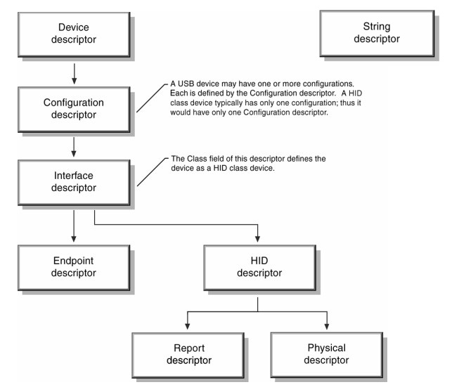

USB Clesses [[Back]](note_usb.md#USB-Class)
---

USB 定義 Class/Subclass/Protocol Code 來區分 Device 的功能性
> + Members of Device Descriptor
>> bDeviceClass, bDeviceSubClass, bDeviceProtocol
> + Members of Interface Descriptor
>> bInterfaceClass, bInterfaceSubClass, bInterfaceProtocol

擴展的 Descriptors 就需要在適當的 usage, 去識別 class code, 以 HID Class 為例  

+ Base Class Codes

    | Base Class Codes | Descriptor Usage    | Description
    | :-               | :-                  | :-
    | 00h              | Device              | Use class information in the Interface Descriptors
    | 01h              | Interface           | Audio
    | 02h              | Both                | Communications and CDC Control
    | 03h              | Interface           | HID (Human Interface Device)
    | 05h              | Interface           | Physical
    | 06h              | Interface           | Image
    | 07h              | Interface           | Printer
    | 08h              | Interface           | Mass Storage
    | 09h              | Device              | Hub
    | 0Ah              | Interface           | CDC-Data
    | 0Bh              | Interface           | Smart Card
    | 0Dh              | Interface           | Content Security
    | 0Eh              | Interface           | Video
    | 0Fh              | Interface           | Personal Healthcare
    | 10h              | Interface           | Audio/Video Devices
    | 11h              | Device              | Billboard Device Class
    | 12h              | Interface           | USB Type-C Bridge Class
    | 13h              | Interface           | USB Bulk Display Protocol Device Class
    | 3Ch              | Interface           | I3C Device Class
    | DCh              | Both                | Diagnostic Device
    | E0h              | Interface           | Wireless Controller
    | EFh              | Both                | Miscellaneous
    | FEh              | Interface           | Application Specific
    | FFh              | Both                | Vendor Specific

# Reference

+ [Defined Class Codes](https://www.usb.org/defined-class-codes)

