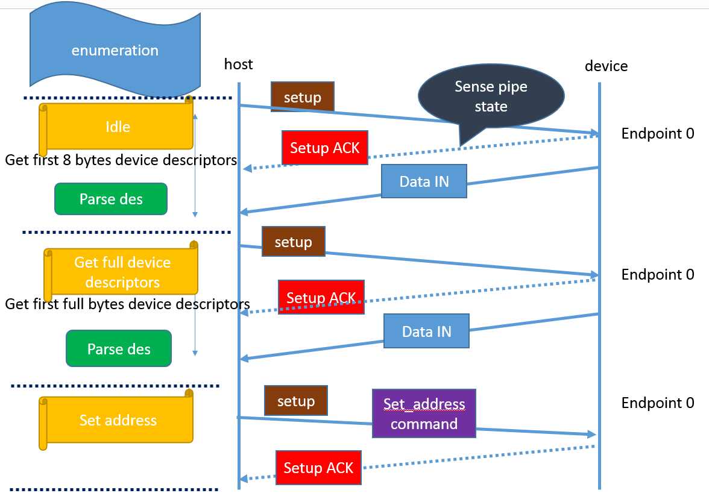
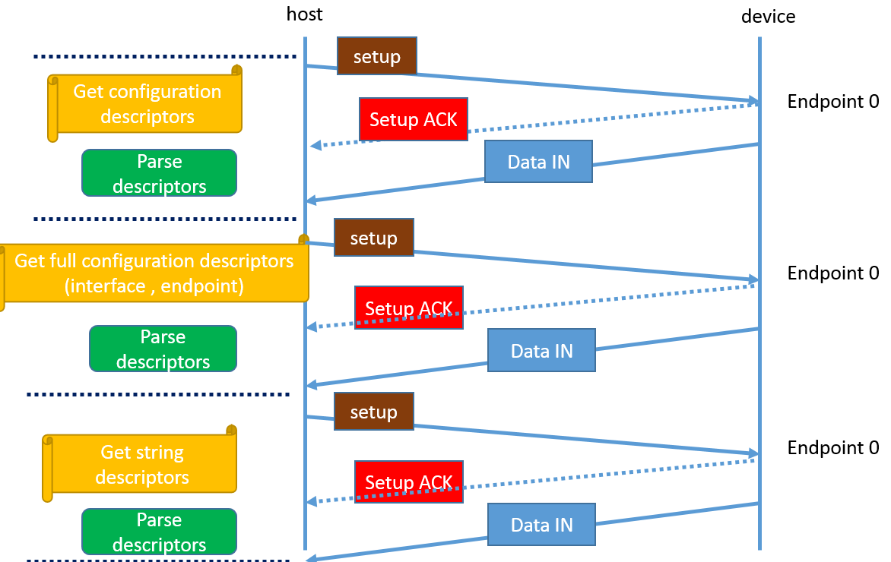

USB Packets [[Back]](note_usb_protocol.md#Packets)
---

Packet 被視為每次傳輸的最小單位, 傳送時 LSB 先傳.

```
            +------------+-----------+-----+
Bus idle    | sync patt  | Data Area | EOP |   Bus idle
----------  +------------+-----------+-----+  ----------
```

> + Packet 是以同步訊號 (Sync Pattern) 為開頭
>> 由 Phy layer 自動添加
> + 接著是 data area,
> + 最後以 EOP 訊號(End of Packet)結尾, 完成一個 packet 的傳輸, Bus 回到 idle 的狀態
>> 由 Phy layer 自動添加

依特性 可分為 Token, Data, and Status (Handshake) Packet

# 名詞解釋

+ PID (Packet Identifier)

    | Type       | PID value(`msb-first`) |  Transmitted byte (`lsb-first`) | Name    | Description                                                   |
    | :-         | :-:                    | :-:                             | :-:     | :-                                                            |
    | Reserved   | 0000                   | `0000` 1111                     |         |                                                               |
    | Token      | 1000                   | `0001` 1110                     | SPLIT   | High-bandwidth (USB 2.0) split transaction                    |
    |            | 0100                   | `0010` 1101                     | PING    | Check if endpoint can accept data (USB 2.0)                   |
    | Special    | 1100                   | `0011` 1100                     | PRE     | Low-bandwidth USB preamble                                    |
    | Handshake  | 1100                   | `0011` 1100                     | ERR     | Split transaction error (USB 2.0)                             |
    |            | 0010                   | `0100` 1011                     | ACK     | Data packet accepted                                          |
    |            | 1010                   | `0101` 1010                     | NAK     | Data packet not accepted; please retransmit                   |
    |            | 0110                   | `0110` 1001                     | NYET    | Data not ready yet (USB 2.0)                                  |
    |            | 1110                   | `0111` 1000                     | STALL   | Transfer impossible; do error recovery                        |
    | Token      | 0001                   | `1000` 0111                     | OUT     | Address for host-to-device transfer                           |
    |            | 1001                   | `1001` 0110                     | IN      | Address for device-to-host transfer                           |
    |            | 0101                   | `1010` 0101                     | SOF     | Start of frame marker (sent each ms)                          |
    |            | 1101                   | `1011` 0100                     | SETUP   | Address for host-to-device control transfer                   |
    | Data       | 0011                   | `1100` 0011                     | DATA0   | Even-numbered data packet                                     |
    |            | 1011                   | `1101` 0010                     | DATA1   | Odd-numbered data packet                                      |
    |            | 0111                   | `1110` 0001                     | DATA2   | Data packet for high-bandwidth isochronous transfer (USB 2.0) |
    |            | 1111                   | `1111` 0000                     | MDATA   | Data packet for high-bandwidth isochronous transfer (USB 2.0) |


+ ADDR (Address)
+ ENDP (Endpoint number)
+ CRCx (Cyclic Redundancy Checks X bits)

# Token Packet

每個 Transaction 以 Token Packet 做起始, Token Packet 定義 Device, Endpoint數量, 傳輸的方向
> 用 PID 來識別 OUT, IN, SOF, 和 SETUP 處理
> + 對於`OUT`和`SETUP`處理, ADDR 與 ENDP 欄位用來選擇接收資料的 Endpoint
> + 對於`IN`處理, ADDR 與 ENDP 欄位用來選擇傳送資料的 Endpoint

```
Token Format

LSB                                                            MSB
+--------------+---------------+---------------+---------------+
| PID (8-bits) | ADDR (7-bits) | ENDP (4-bits) | CRC5 (5-bits) |
+--------------+---------------+---------------+---------------+
```

+ SOF(Start-of-Frame)
    > 為一個特別的 Token 封包類型, 包含目前的 Frame Number, Host 每隔一段很小的間隔就會 broadcast 一次 SOF packet, 所有 Devices 以及 Hub 都會收到 SOF packet. <br>
    > 對只需要時間資訊的裝置而言, 只需要知道 PID 為 SOF 即可, 剩餘的資訊皆可忽略

    ```
    SOF format

    LSB                                                 MSB
    +--------------+---------------------+---------------+
    | PID (8-bits) | Frame Num (11-bits) | CRC5 (5-bits) |
    +--------------+---------------------+---------------+
    ```


# Data Packet

```
Data format

LSB                                                 MSB
+--------------+----------------------+-----------------+
| PID (8-bits) | Data (0 ~ 1023 bits) | CRC16 (16-bits) |
+--------------+----------------------+-----------------+
```

+ Data packet size

    | Speed      | Max length of data packet |
    | :-:        | :-                        |
    | Low-Speed  | 8-bytes                   |
    | Full-Speed | 1023-bytes                |
    | High-Speed | 1024-bytes 以上           |

    - 其中 `PID = Data0` 及 `PID = Data1` 是兩個基本的資料封包, 藉由這些 Data Packets 來提供一個資料切換同步的機制,
        > 確認將 Transmitter 和 Receiver 之間的資料, 切換同步(data toggle synchronization)

    - 在 USB2.0 當中更增加了 `PID = Data2` 及 `PID = MData` 資料 packet, 用於執行高速的即時傳輸 (Isochronous Transfers)

# Status (Handshake) Packet

```
Handshake format

LSB           MSB
+--------------+
| PID (8-bits) |
+--------------+
```

除了即時型傳輸(Isochronous)外, 所有的傳輸都保證資料的傳遞正確, 如 Handshake Packet 回應資料是否正確的被收到, **若執行處理動作中發生錯誤, 處理動作將重新執行**

Handshake Packet 由一個 PID 所組成, 用來表示資料傳輸的狀態, 部分 Handshake Packet 說明如下
> + `ACK` 表示 Data packet 沒有 bit stuff 或是 CRC 錯誤 (也就是 PID 欄位以及 Data 欄位沒有出現錯誤)
> + `NAK` 表示裝置無法從主機接收資料, 或是無資料可以傳輸到主機
>> `NAK` 也被當作流量控制的用途來使用, 表示裝置暫時無資料傳送或無法接收資料
> + `STALL` 表示裝置無法傳送或接收資料, 需要 Host 介入來清除延遲狀況

# 封包傳遞說明




# Reference

+ [USB2.0包Packet的組成](https://www.usbzh.com/article/detail-459.html)
+ [USB 列舉(USB Enumeration)](https://www.perytech.com/Language/tw/USB-Enumeration.htm)
+ [201112-USB20_Protocol_Analyzer](http://www.zeroplus.com.tw/E-paper/201112/images/201112-USB20ProtocolAnalyzer.pdf)
