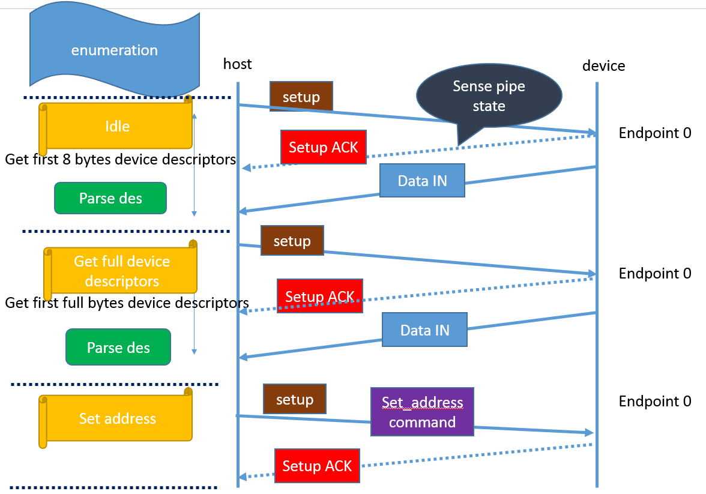
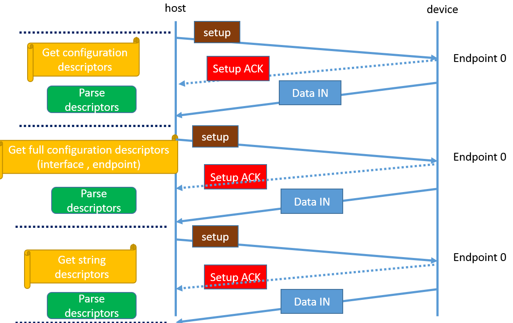
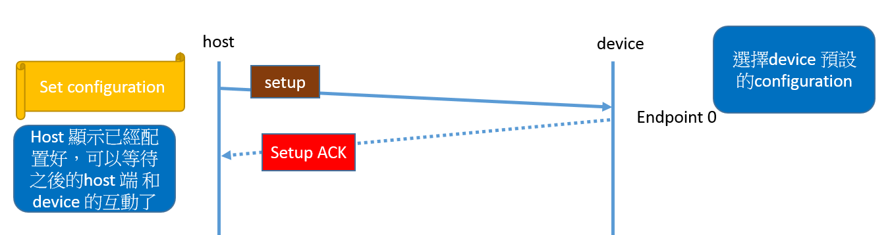

USB Protocol [[Back]](note_usb.md#Protocol)
---

+ Frame and Microframe
    > 為了確保同步, USB 把時間切割成固定長度的 time slot.
    > + Low-Speed 和 Full-Speed 的時候是以 `1 ms` 為單位, 稱為一個 Frame
    > + High-Speed 時再把一個 Frame 切成 8 等分, 一個 `0.125 ms` 為單位, 稱為 `Microframe`

    

    > SOF (Start-of-Frame packet) 是一種特殊的封包, 他在每一個 frame 開始時發送

+ Endpoint (端點)是 USB Device 中的可以進行數據收發的最小單元, 支持單向或者雙向的數據傳輸
    > Device 支持 Endpoint 的數量是有限制的, 除 Endpoint0 外
    > + Low-Speed Device 最多支持 2 組 Endpoints (In * 2, OUT * 2)
    > + Full/High Speed Device 最多支持 15 組 Endpoints


# USB plug-in probe

+ 沒有 Device 連接 Host 時, Host 的 `D+` and `D-`為 0, USB Bus 處於 SE0 狀態, 此狀態持續一段時間, Host 認為斷線;

+ 當 Device 連接 Host 時, Host 檢測到相應 data pins 拉高, 認為設備連接, 此時 Host 必須在 reset Device 前取樣數據線並判斷 Device 速度;
    > + Full/High Speed `D+` 上拉
    > + Low-Speed `D-` 上拉


# Transfer types

USB 使用 `endpoint + pipe` 來傳輸, 其中 pipe 的傳輸方向有 IN/OUT
> 傳輸方向都是**基於 USB Host** 來說的, e.g. read USB storage, 傳輸方向就是 IN.

USB pipe 傳輸類型有 Bulk/Control/Isochronous/Interrupt.

## Bulk Transfer (批量傳輸)

用於大量資料傳輸且需要確保資料無誤(e.g. 傳給印表機或隨身碟), 沒有速度限制, 若傳輸失敗就會重傳以確保正確性


Bulk Transfer 是一種可靠的單向傳輸, 但**延遲沒有保證**, 它盡量利用可以利用的 bandwidth 來完成傳輸, 適合數據量比較大的傳輸.
> + Low-Speed Device 不支持 Bulk Transfer
> + Full-Speed Device 最大 packet length 可以為 8/16/32/64 Bytes
> + High-Speed Device 最大 packet length 為 512 Bytes


## Control Transfer (控制傳輸)

用於控制傳輸命令及狀態操作; 像是設定裝置, 取得裝置資訊, 發送指令到裝置等.
每個 USB Devicd 都有一個 Endpoint0, USB Host 就是使用 Endpoint0 在裝置插入後進行設定.

+ Control Transfer 對於 packet 最大長度有固定要求
    - Low-Speed Device 長度為 8 Bytes
    - High-Speed Device 長度為 64 Bytes
    - Full-Speed Device 長度可以為 8/16/32/64 Bytes

## Isochronous Transfer (實時傳輸)

同樣用於大量資料傳輸, 但不保證資料是否到達 (like UDP).
> 例如 USB Video Device, 使用者會期望傳輸 audio or video 的速率是穩定的, 若有幾張 frames 遺失, CRC 驗證失敗, 資料也不會重傳.

Isochronous Transfer 是一種實時但不可靠的傳輸, 不支持錯誤重發機制; 只有 Full/High Speed Device 支持同步傳輸
> + Full/High Speed Device 長度為 1024 Bytes
> + Low-Speed Device 長度為 1023 Bytes

## Interrupt Transfer (中斷傳輸)

與一般常見的中斷不同, 需要 Host 端先詢問(Polling)才會執行
> 用一個固定速率, 傳輸少量資料, 像是 USB Keyboard/Mouse 就是屬於這種方式

Interrupt Transfer 也是 Host 發起的傳輸, 採用 Polling(輪詢)的方式, 詢問 Device 是否有數據發送, 若有則傳輸數據, 否則 NAK 主機.
> Interrupt Transfer 並不代表傳輸過程中, Device 會先中斷 HOST, 再通知 HOST 啟動傳輸 (Devices 沒有主動通知 Host 的能力)


# Transaction

Transaction 指 USB 資料的傳輸, 大部分的傳輸包含了三種封包
> + Token packet
> + Data packet
> + Status packet or Handshake

Transaction 可能是從 Host 傳向 Device, 或是從 Device 傳向 Host. 傳送方向是在 Token packet 中指定
> 一般來說, 目標端利用 Handshake (Status packet) 來判斷本次傳輸是否成功

```
+-- Pipe -------------------------------------------------------------------------------+
| +** Transfer ************************************************+  +** Transfer **+      |
| |                                                            |  |              |      |
| |  +== Transaction ====================================+     |  |              |      |
| |  ; +--------------+-------------+---------------+    ;     |  |              |      |
| |  ; | Token packet | Data packet | Status packet |... ; ... |  |  ...         | ...  |
| |  ; +--------------+-------------+---------------+    ;     |  |              |      |
| |  +===================================================+     |  |              |      |
| |                                                            |  |              |      |
| +************************************************************+  +**************+      |
+---------------------------------------------------------------------------------------+
```


## Packet

Packet 被視為每次傳輸的最小單位

Packet 是以同步訊號 (Sync Pattern) 為開頭, 接著是 data area (Big-endian), 最後以 EOP 訊號(End of Packet)結尾, 完成一個 packet 的傳輸, Bus 回到 idle 的狀態
```
            +-------+------------+-----+
Bus idle    | sync  | Data Bytes | EOP |   Bus idle
----------  +-------+------------+-----+ ----------
```

+ Token Packet
+ Data Packet
+ Status (Handshake) Packet


## Handshake

+ USB Enumeration (列舉)

    
    
    


