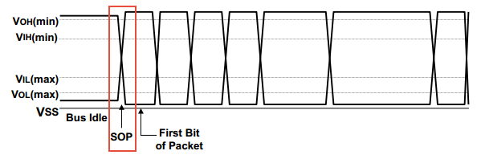

USB Protocol [[Back]](note_usb.md#Protocol)
---

+ Frame and Microframe
    > 為了確保同步, USB 把時間切割成固定長度的 time slot.
    > + Low-Speed 和 Full-Speed 的時候是以 `1 ms` 為單位, 稱為一個 Frame
    > + High-Speed 時再把一個 Frame 切成 8 等分, 一個 `0.125 ms` 為單位, 稱為 `Microframe`

    

    > SOF (Start-of-Frame packet) 是一種特殊的封包, 他在每一個 frame 開始時發送

+ Endpoint (端點)是 USB Device 中的可以進行數據收發的最小單元, 支持單向或者雙向的數據傳輸
    > Device 支持 Endpoint 的數量是有限制的, 除 Endpoint0 外
    > + Low-Speed Device 最多支持 2 組 Endpoints (In * 2, OUT * 2)
    > + Full/High Speed Device 最多支持 15 組 Endpoints


# USB plug-in probe

+ 沒有 Device 連接 Host 時, Host 的 `D+` and `D-`為 0, USB Bus 處於 SE0 狀態, 此狀態持續一段時間, Host 認為斷線;

+ 當 Device 連接 Host 時, Host 檢測到相應 data pins 拉高, 認為設備連接, 此時 Host 必須在 reset Device 前取樣數據線並判斷 Device 速度;
    > + Full/High Speed `D+` 上拉
    > + Low-Speed `D-` 上拉

# USB Stream Architecture

由多個 packets 組成一個 Transaction (事務), 多個 Transactions 組成 Transfer (傳輸), 多個 Transfers 組成 Pipe


+ USB Analyzer tool


# Transfer types

USB 使用 `endpoint + pipe` 來傳輸, 其中 pipe 的傳輸方向有 IN/OUT
> 傳輸方向都是**基於 USB Host** 來說的, e.g. read USB storage, 傳輸方向就是 IN.

USB pipe 傳輸類型有 Bulk/Control/Isochronous/Interrupt.

## Bulk Transfer (批量傳輸)

用於大量資料傳輸且需要確保資料無誤(e.g. 傳給印表機或隨身碟), 沒有速度限制, 若傳輸失敗就會重傳以確保正確性


Bulk Transfer 是一種可靠的單向傳輸, 但**延遲沒有保證**, 它盡量利用可以利用的 bandwidth 來完成傳輸, 適合數據量比較大的傳輸.
> + Low-Speed Device 不支持 Bulk Transfer
> + Full-Speed Device 最大 packet length 可以為 8/16/32/64 Bytes
> + High-Speed Device 最大 packet length 為 512 Bytes


## Control Transfer (控制傳輸)

用於控制傳輸命令及狀態操作; 像是設定裝置, 取得裝置資訊, 發送指令到裝置等.
每個 USB Device 都有一個 Endpoint0, USB Host 就是使用 Endpoint0 在裝置插入後進行設定.

Control Transfer 是一種可靠的**雙向傳輸**, 傳輸過程中傳輸的數據是有格式定義, Host/Device 可根據格式定義解析其含義 (其他三種傳輸類型都沒有格式定義).
一次 Control Transfer 可分為三個階段
> + 第一階段為從 HOST 到 Device 的 SETUP Transaction 傳輸, 這個階段指定了此次控制傳輸的 Request 類型
> + 第二階段為數據(DATA0)階段, 也有些 Request 沒有數據階段
> + 第三階段為狀態階段, 通過一次 `IN/OUT` 傳輸表明請求是否成功完成


+ Control Transfer 對於 packet 最大長度有固定要求
    > 最大 packet size 代表一個 endpoint 單次接收/發送數據的能力, 實際上反應的是該 endpoint 對應的 Buffer 大小. <br>
    當通過一個 endpoint 進行 data 傳輸時, 若 data 的大小超過最大 packet size 時, 需將 data 做 fragment(分成多個 data packet 傳輸),
    並且要求除最後一個 packet 外, 所有的 packet size 都等於該最大 packet size.
    >> 如果一個 endpoint 收到/發送了一個**長度小於最大packet size 的 packet, 即代表 data 傳輸結束**

    | Speed      | Max packet size  |
    | :-         | :-               |
    | Low-Speed  | 8 Bytes          |
    | High-Speed | 64 Bytes         |
    | Full-Speed | 8/16/32/64 Bytes |

- Control Transfer 限制
    > 在一個 Frame 內, 如果有多餘的未用時間, 並且沒有同步和中斷傳輸時, 可以用來進行控制傳輸.
    > + High-Speed 時, 不能佔用超過 20% 的 micro-frame
    > + Low/Full Speed 時, 不能佔用超過 10% 的 micro-frame


## Isochronous Transfer (實時傳輸)

同樣用於大量資料傳輸, 但不保證資料是否到達 (like UDP).
> 例如 USB Video Device, 使用者會期望傳輸 audio or video 的速率是穩定的, 若有幾張 frames 遺失, CRC 驗證失敗, 資料也不會重傳.

Isochronous Transfer 是一種實時但不可靠的傳輸, 不支持錯誤重發機制; 只有 Full/High Speed Device 支持同步傳輸
> + Full/High Speed Device 長度為 1024 Bytes
> + Low-Speed Device 長度為 1023 Bytes

## Interrupt Transfer (中斷傳輸)

與一般常見的中斷不同, 需要 Host 端先詢問(Polling)才會執行
> 用一個固定速率, 傳輸少量資料, 像是 USB Keyboard/Mouse 就是屬於這種方式

Interrupt Transfer 也是 Host 發起的傳輸, 採用 Polling(輪詢)的方式, 詢問 Device 是否有數據發送, 若有則傳輸數據, 否則 NAK 主機.
> Interrupt Transfer 並不代表傳輸過程中, Device 會先中斷 HOST, 再通知 HOST 啟動傳輸 (Devices 沒有主動通知 Host 的能力)


# Transaction

Transaction (事務) 指 USB 資料的傳輸, 大部分的傳輸包含了三種封包
> + Token packet
>> 通知 device, 現在 Host 想做什麼事, e.g. SOF, OUT, IN, SETUP
> + Data packet
>> 如果 tocken 為 IN, device 傳出資料; 如果 tocken 為 OUT, host 傳出資料
> + Status packet or Handshake
>> 接收方要傳 ACK, 讓資料傳送方確認已接收到

Transaction 可能是從 Host 傳向 Device, 或是從 Device 傳向 Host. 傳送方向是在 Token packet 中指定
> 一般來說, 目標端利用 Handshake (Status packet) 來判斷本次傳輸是否成功


# [Packets](note_usb_packets.md)

Packet 被視為每次傳輸的最小單位, 傳送時 LSB 先傳.

```
            |<--    SYNC   --> |
            +-----+------------+-----------+-----+
Bus idle    | SOP | sync patt  | Data Area | EOP |   Bus idle
----------  +-----+------------+-----------+-----+  ----------
```

> + Packet 是以同步訊號 (Sync Pattern) 為開頭
>> 由 Phy layer 自動添加
> + 接著是 data area,
> + 最後以 EOP 訊號(End of Packet)結尾, 完成一個 packet 的傳輸, Bus 回到 idle 的狀態
>> 由 Phy layer 自動添加

+ SOP (Start Of Packet)
    > 是 SYNC 的一部分, 通過將 `D+`和`D-` pins 從 Idle 驅動到相反的邏輯電平(K狀態), 由始發端口發信號通知分組的開始(SOP), 此開關級別表示 SYNC 字段的第一位.
    當重新傳輸到`小於 ±5 ns`時, 集線器必須限制 SOP 第一位寬度的變化.
    通過將通過集線器的標稱數據延遲, 與集線器的輸出使能延遲相匹配, 可以最小化失真

    

+ Sync Pattern
    > 同步域(SYNC), 這個域固定為 `0000 0001`, 這個域通過 NRZI 編碼之後, 就是一串方波(NRZI 遇 0 翻轉遇 1 不變), 接受者可以用這個 SYNC 域來同步之後的數據信號.

    >> 因為在 USB 的 NRZI 編碼下, 邏輯 0 會造成電平翻轉, 所以在接受數據的同時, 根據接收到的翻轉信號不斷調整同步頻率, 保證數據傳輸正確. <br>
    但這樣還是會有一個問題, 就是雖然接受者可以主動和發送者的頻率匹配, 但是兩者之間總會有誤差. <br>
    假如數據信號是 1000 個邏輯 1, 經過 USB 的 NRZI 編碼之後, 就是很長一段沒有變化的電平,
    在這種情況下, 即使接受者的頻率和發送者相差千分之一, 就會造成把數據采樣成 1001 個或者 999 個 1 了. <br>
    USB 對這個問題的解決辦法, 就是強制插 0, 也就是傳說中的 bit-stuffing; <br>
    如果要傳輸的數據中有 7 個連續的 1, 發送前就會在第 6 個 1 後面, 強制插入一個 0, 讓發送的信號強製出現翻轉, 從而強制接受者進行頻率調整.
    接受者只要刪除 6 個連續 1 之後的 0, 就可以恢復原始的數據了.

    - Low/Full Speed 的同步域為 `00000001`
    - High-Speed 的同步域為 31 個 0, 後面為一個 1 (00000000000000000000000000000001)


+ EOP (End of Packet)

    

    - Low/Full Speed: SE0 狀態用於發信號通知分組結束(EOP)
        > 通過將`D+`和`D-`驅動到 SE0 狀態兩位時間, 然後將線路驅動到 J 狀態一位時間來發信號通知EOP.
        從 SE0 到 J 狀態的轉換, 定義了接收器處的分組的結束. <br>
        J 狀態被置位一個位時間, 然後 `D+`和`D-`輸出驅動器都處於高阻態. Bus 終端電阻將 Bus 保持在空閒狀態
        >> SE0 的意思是`D+`和`D-`都表示為低電平

    - High-Speed:
        > 在高速信號中, 以從 EOP 之前的最後一個符號, 到相反符號的轉換開始. 這個相反的符號是 EOP 模式中的第一個符號對於 SOF 以外的高速數據包.
        故意生成位填充錯誤以指示EOP. 需要接收器將任何位錯誤解釋為 EOP. 發送的 EOP 定界符必須是沒有位填充的 NRZ 字節 `01111111`. <br>
        例如, 如果 EOP 字段之前的最後一個符號是 J, 則這將導致 EOP 為 KKKKKKKK.
        對於高速 SOF, 傳輸的 EOP 分隔符需要 5 個 NRZ 字節, 而不需要填充 bit, 由 `01111111 11111111 11111111 11111111 11111111`組成.
        因此, 如果 EOP 字段之前的最後一位是 J, 這將導致線路上有 40 個 K 狀態, 線路必須返回到高速空閒狀態.
        額外的 EOP 長度對接收器沒有意義, 它用於斷開檢測.

# LeCroy USB Advisor


# Reference

+ [USB (Universal Serial Bus)-成大資工 WiKi](http://wiki.csie.ncku.edu.tw/embedded/USB)
+ [USB2.0包Packet的組成](https://www.usbzh.com/article/detail-459.html)
+ [USB 列舉(USB Enumeration) -> 如何分析USB封包?](https://www.perytech.com/Language/tw/USB-Enumeration.htm)


