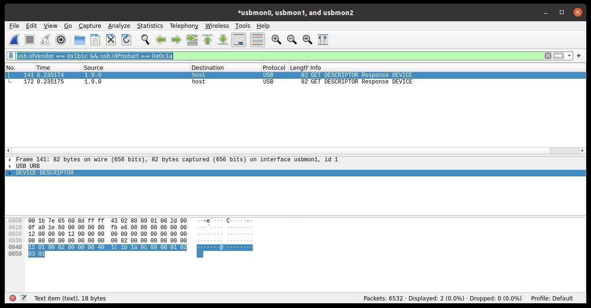
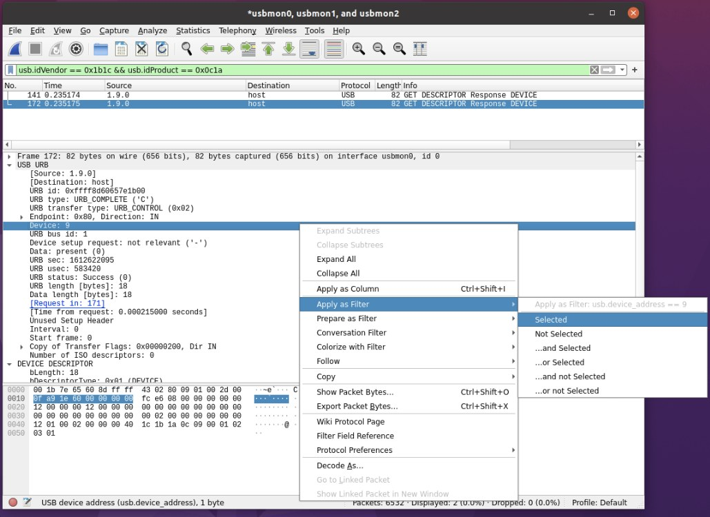
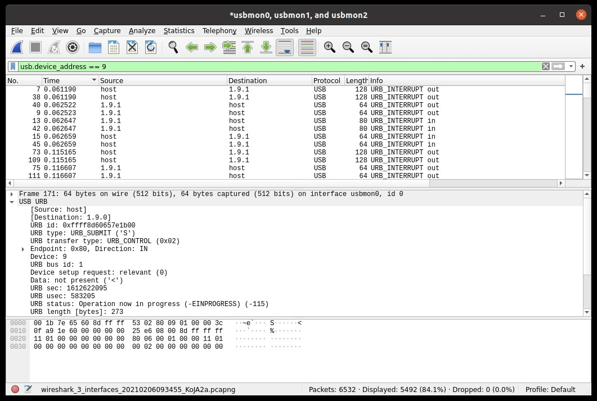

USB WireShark
---

## Finding the target device

+ 使用 Vendor/Product ID 來找 device

    ```
    usb.idVendor == 0x1b1c && usb.idProduct == 0x0c1a
    ```

    

+ 找 device 的 address
    > + 選擇一個 `GET DESCRIPTOR response` packet,
    > + 在 `USB URB section` 找 `Device: #` (device address number)
    > + 點選`Device: #`並右鍵 `Apply As Filter`

    

+ Filter with device address

    

# Reference

+ [Capturing USB traffic](https://github.com/liquidctl/liquidctl/blob/main/docs/developer/capturing-usb-traffic.md#finding-the-target-device)
