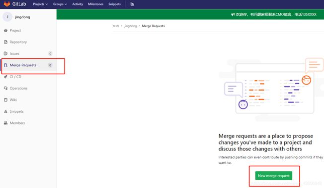
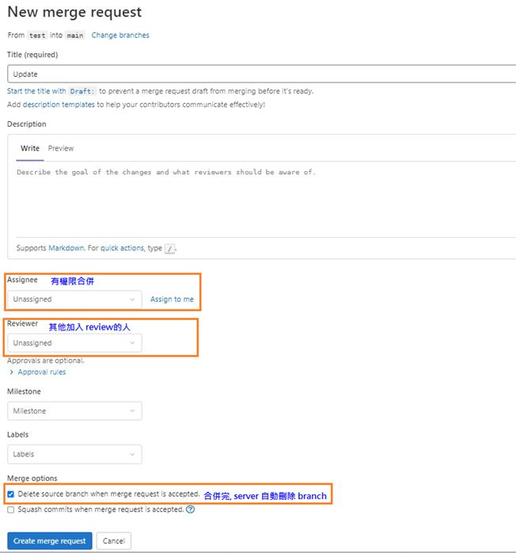
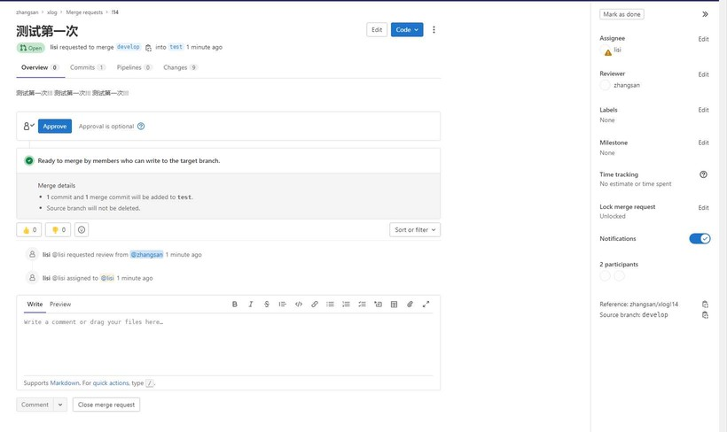
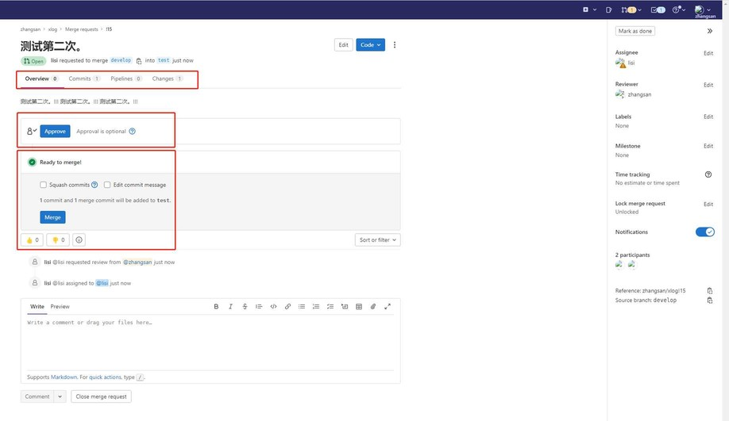

GitLab Merge Requests (MR)
---

# Flow

+ Sync with remote

    ```
    $ git pull origin master
    ```

    - `git pull`
        > pull 是整合兩個 commands
        > + `git fetch origin master`
        > + `git merger origin/master`

        ```
        $ git fetch         # 將 remote 的最新程式碼拉取到 local
        $ git pull --all    # 將 remote 的所有程式碼與分支都拉取到 local
        ```

+ Create a new branch for `MR` from master branch

    ```
    $ git checkout -b mr/xxx
    ```

+ Develop feature

    ```
    $ git add .
    $ git commit -m '
    > feat: Add a new feature
    >
    > customer request a feature
    >'

    $ git commit -amend
    ```

+ Sync the lastest master

    ```
    $ git checkout master
    $ git pull origin master
    $ git checkout mr/xxx
    $ git merge master
    $ git commit -m "resolve conflict" --> 解決 conflict
    ```

+ Combine commit message
    > 在 local 操作 rebase, 一但上傳到 remote 後, 就不建議再使用 rebase
    >> 如果是在自己獨立的 brach (不會與他人混合 commit),

    - 假設 `mr/xxx` 有 4 筆 commit messages

        ```
        $ git log
        commit 34d364d9d51dc94b264e99f7a92add50dd2c3987
        Author: Aeo <A_doz@126.com>
        Date: Sun Jun 25 12:27:02 2016 +0800
        misc: forth commit

        commit 27322cb4b3f99226ffa98240460b90d92ed55a17
        Author: Aeo <A_doz@126.com>
        Date: Sun Jun 25 12:26:42 2016 +0800
        misc: third commit

        commit 405b957a96a7dbe352cf7da9a422312a735f6081
        Author: Aeo <A_doz@126.com>
        Date: Sun Jun 25 12:26:16 2016 +0800
        misc: second commit

        commit cc12fc86a7738ee2f9a8a48c31a9435232c2b08f
        Author: Aeo <A_doz@126.com>
        Date: Sun Jun 25 12:25:53 2016 +0800
        misc: first commit
        ```

    - 合併 4 筆 commit

        ```
        $ git rebase -i HEAD~4  ----> 進入 vi 編輯模式, 順序會從時間最早的 node 開始
            pick cc12fc8 misc: first commit
            pick 405b957 misc: second commit
            pick 27322cb misc: third commit
            pick 34d364d misc: forth commit
            # Rebase 2763481..34d364d onto 2763481 (4 command(s))
            # #
            Commands:
            # p, pick = 使用該提交
            # r, reword = 使用該提交，但需要編輯提交信息
            # e, edit = 使用該提交，但此處暫停並提供修改機會
            # s, squash = 使用該提交，但合併到上一個提交記錄中
            # f, fixup = 類似 squash，但丟棄當前提交記錄的提交信息
            # x, exec = 執行 shell 命令
            # d, drop = 移除當前提交
        ```

        1. 修改 message 屬性

            ```
            pick cc12fc8 misc: first commit
            squash 405b957 misc: second commit      --> 從 pick 改成 squash
            squash 27322cb misc: third commit       --> 從 pick 改成 squash
            squash 34d364d misc: forth commit       --> 從 pick 改成 squash
            # Rebase 2763481..34d364d onto 2763481 (4 command(s))
            # #
            Commands:
            # p, pick = 使用該提交
            # r, reword = 使用該提交，但需要編輯提交信息
            # e, edit = 使用該提交，但此處暫停並提供修改機會
            # s, squash = 使用該提交，但合併到上一個提交記錄中
            # f, fixup = 類似 squash，但丟棄當前提交記錄的提交信息
            # x, exec = 執行 shell 命令
            # d, drop = 移除當前提交
            ```

        1. 編輯最終 message
            > `#` 字首標示 git 註解, 不會出現在 message 中

            ```
            # This is a combinatin of 4 commits.
            # This is the 1st commit message:

            misc: first commit

            # This is the commit message #2:
            misc: second commit

            # This is the commit message #3:
            misc: third commit

            # This is the commit message #4:
            misc: forth commit
            ```

            ```
            # This is a combinatin of 4 commits.
            # This is the 1st commit message:

            feat: Add a feature from customer request
            ```

        1. check message after combine

            ```
            $ git log
            commit da473276aa981f6e29577aa09a525109971547f2
            Author: Aeo <A_doz@126.com>
            Date: Sun Jun 25 12:50:53 2016 +0800
            misc: first commit
            ```


+ Push MR branch to remote

    ```
    $ git push origin mr/xxx
    ```

+ GitLab triggers a **Merge Request**

    - Create a new merge request

        

    - Select `Source` branch to merge to `target` branch

        

    - 填寫 MR 的信息，指定審核人（Maintainer 以上的權限）

        

    - Reviewer Appove

        

    - Maintainer Merge

        


# Reference

+ [git mr 怎樣合併部分_Git開髮指南(涵蓋GitLab的merge request(簡稱：mr))](https://blog.csdn.net/weixin_39791225/article/details/111842944?spm=1001.2101.3001.6650.5&utm_medium=distribute.pc_relevant.none-task-blog-2%7Edefault%7ECTRLIST%7ERate-5-111842944-blog-83752955.pc_relevant_3mothn_strategy_and_data_recovery&depth_1-utm_source=distribute.pc_relevant.none-task-blog-2%7Edefault%7ECTRLIST%7ERate-5-111842944-blog-83752955.pc_relevant_3mothn_strategy_and_data_recovery&utm_relevant_index=8)
+ [Gitlab中merge request操作說明](https://blog.csdn.net/qusikao/article/details/128297269?spm=1001.2101.3001.6650.2&utm_medium=distribute.pc_relevant.none-task-blog-2%7Edefault%7EYuanLiJiHua%7EPosition-2-128297269-blog-85489257.pc_relevant_recovery_v2&depth_1-utm_source=distribute.pc_relevant.none-task-blog-2%7Edefault%7EYuanLiJiHua%7EPosition-2-128297269-blog-85489257.pc_relevant_recovery_v2&utm_relevant_index=3)


