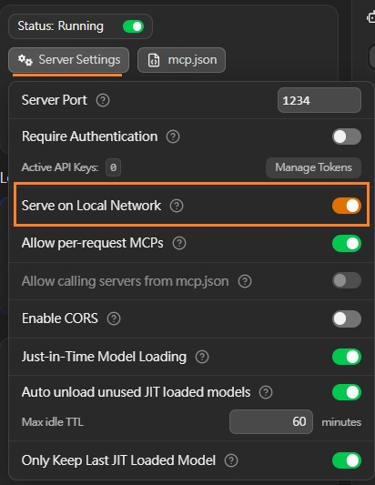
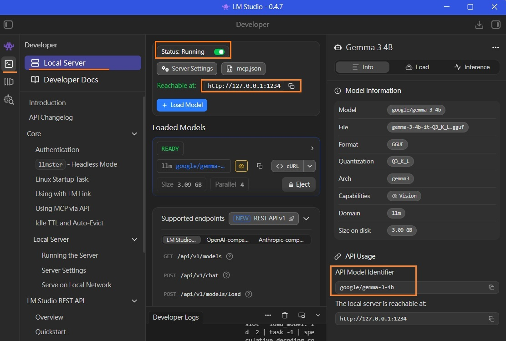

note_openclaw
---

```
OpenClaw:
    +-------------+         +----------+                        +-------------------+
    | Front-End   |         | OpenClaw |  local LLM server IP   |    Local LLM      |
    | + CLI       | ------> |  Gateway | ---------------------> |      Server       |
    | + WebUI     |         +----------+                        | (attach AI-Model) |
    +-------------+                                             +-------------------+

```

# Prerequisites

OpenClaw 基於 [Node.js](https://nodejs.org/zh-tw/download) 運行, 且部分組件(如本地模型支持)需要編譯環境

+ `Node.js 22` 或以上版本
    > 安裝後開啟 `PowerShell` 輸入 `node -v` 確認版本

+ Windows 11 開啟指令執行權限

    ```PowerShell
    # 使用管理者權限
    > Set-ExecutionPolicy RemoteSigned -Scope CurrentUser
    ```

+ Local LLM module with [LM-Studio](https://lmstudio.ai/download)

    - LM-Studio enables the local network feature

        

        1. Sever on Local Network
            > + OFF: 使用 IP `127.0.0.1`, 僅限本機存取
            > + ON: 自動偵測區網 IP, 可在區網服務 (會因外部防火牆而效能大幅降低)


    - Local server configuration in LM-Studio

        


# Setup OpenClaw

+ OpenClaw 官方安裝腳本 (一鍵安裝)

    - Windows

        ```PowerShell
        > irm https://openclaw.ai/install.ps1 | iex
        ```
    - Linux

        ```shell
        $ curl -fsSL https://openclaw.ai/install.sh | bash
        ```

+ first execute openclaw

    ```
    PS > openclaw onboard

    🦞 OpenClaw 2026.3.13 (61d171a) — The only crab in your contacts you actually want to hear from. 🦞

    Windows detected - OpenClaw runs great on WSL2!
    Native Windows might be trickier.
    Quick setup: wsl --install (one command, one reboot)
    Guide: https://docs.openclaw.ai/windows
    ▄▄▄▄▄▄▄▄▄▄▄▄▄▄▄▄▄▄▄▄▄▄▄▄▄▄▄▄▄▄▄▄▄▄▄▄▄▄▄▄▄▄▄▄▄▄▄▄▄▄▄▄
    ██░▄▄▄░██░▄▄░██░▄▄▄██░▀██░██░▄▄▀██░████░▄▄▀██░███░██
    ██░███░██░▀▀░██░▄▄▄██░█░█░██░█████░████░▀▀░██░█░█░██
    ██░▀▀▀░██░█████░▀▀▀██░██▄░██░▀▀▄██░▀▀░█░██░██▄▀▄▀▄██
    ▀▀▀▀▀▀▀▀▀▀▀▀▀▀▀▀▀▀▀▀▀▀▀▀▀▀▀▀▀▀▀▀▀▀▀▀▀▀▀▀▀▀▀▀▀▀▀▀▀▀▀▀
                      🦞 OPENCLAW 🦞

    T  OpenClaw onboarding
    |
    o  Security -----------------------------------------------+
    |                                                          |
    |  Security warning — please read.                         |
    ....
    |                                                          |
    |  Must read: https://docs.openclaw.ai/gateway/security    |
    |                                                          |
    +----------------------------------------------------------+
    |
    o  I understand this is personal-by-default and shared/multi-user use requires lock-down. Continue?
    |  Yes
    |
    o  Onboarding mode
    |  QuickStart
    |
    o  Existing config detected ---------+
    |                                    |
    |  workspace: ~\.openclaw\workspace  |
    |  model: lmstudio/liquid/lfm2-1.2b  | <--- modul identity
    |  gateway.mode: local               |
    |  gateway.port: 18789               |
    |  gateway.bind: loopback            |
    |  skills.nodeManager: npm           |
    |                                    |
    +------------------------------------+
    |
    o  Config handling
    |  Use existing values
    |
    o  QuickStart -----------------------------+
    |                                          |
    |  Keeping your current gateway settings:  |
    |  Gateway port: 18789                     |
    |  Gateway bind: Loopback (127.0.0.1)      |
    |  Gateway auth: Token (default)           |
    |  Tailscale exposure: Off                 |
    |  Direct to chat channels.                |
    |                                          |
    +------------------------------------------+
    |
    o  Model/auth provider
    |  Skip for now
    |
    o  Filter models by provider
    |  All providers
    |
    o  Default model
    |  Keep current (lmstudio/liquid/lfm2-1.2b)
    |
    o  Channel status ----------------------------+
    |                                             |
    |  Telegram: needs token                      |
    |  WhatsApp (default): not linked             |
    ...
    +---------------------------------------------+
    |
    o  How channels work -------------------------+
    | ...                                         |
    +---------------------------------------------+
    |
    o  Select channel (QuickStart)
    |  Skip for now
    Config overwrite: C:\Users\whi\.openclaw\openclaw.json (sha256 exxx4 -> dxxx0, backup=C:\Users\whi\.openclaw\openclaw.json.bak)
    Updated ~\.openclaw\openclaw.json
    Workspace OK: ~\.openclaw\workspace
    Sessions OK: ~\.openclaw\agents\main\sessions
    |
    o  Web search --------------------------+
    |                                       |
    ...
    +---------------------------------------+
    |
    o  Search provider
    |  Skip for now
    |
    o  Skills status -------------+
    |                             |
    ...
    +-----------------------------+
    |
    o  Configure skills now? (recommended)
    |  No
    |
    o  Hooks -------------------------------+
    |                                       |
    ...
    +---------------------------------------+
    |
    o  Enable hooks?
    |  Skip for now
    Config overwrite: C:\Users\whi\.openclaw\openclaw.json (sha256 dxxx0 -> 6xxx4, backup=C:\Users\whi\.openclaw\openclaw.json.bak)
    |
    o  Gateway service runtime --------------------------------------------+
    |                                                                      |
    |  QuickStart uses Node for the Gateway service (stable + supported).  |
    |                                                                      |
    +----------------------------------------------------------------------+
    |
    o  Gateway service already installed
    |  Restart
    |
    0  Restarting Gateway service…Restarted Scheduled Task: OpenClaw Gateway
    o  Gateway service restarted.
    |
    o
    Agents: main (default)
    Heartbeat interval: 30m (main)
    Session store (main): C:\Users\whi\.openclaw\agents\main\sessions\sessions.json (1 entries)
    - agent:main:main (13m ago)
    |
    o  Optional apps ------------------------+
    |                                        |
    ...
    +----------------------------------------+
    |
    o  Control UI --------------------------------------------+
    |                                                         |
    |  Web UI: http://127.0.0.1:18789/                        |
    |  Web UI (with token):                                   |
    |  http://127.0.0.1:18789/#token=d...7                    |
    |  Gateway WS: ws://127.0.0.1:18789                       |
    |  Gateway: reachable                                     |
    |  Docs: https://docs.openclaw.ai/web/control-ui          |
    |                                                         |
    +---------------------------------------------------------+
    |
    o  Start TUI (best option!) ---------------------------+
    |                                                      |
    ...
    +------------------------------------------------------+
    |
    o  Token ----------------------------------------------+
    |                                                      |
    ...
    +------------------------------------------------------+
    |
    o  How do you want to hatch your bot?
    |  Open the Web UI
    |
    o  Dashboard ready ----------------------------------------------+
    |                                                                |
    |  Dashboard link (with token):                                  |
    |  http://127.0.0.1:18789/#token=d...7                           |
    |  Opened in your browser. Keep that tab to control OpenClaw.    |
    |                                                                |
    +----------------------------------------------------------------+
    |
    o  Workspace backup ------------------------------+
    |                                                 |
    ...
    +-------------------------------------------------+
    |
    o  Security --------------------------------------+
    |                                                 |
    ...
    +-------------------------------------------------+
    |
    o  Web search ------------------------------------+
    |                                                 |
    ...
    +-------------------------------------------------+
    |
    o  What now --------------------------------------+
    |                                                 |
    ...
    +-------------------------------------------------+
    |
    —  Onboarding complete. Dashboard opened; keep that tab to control OpenClaw.

    PS >
    ```

+ start openclaw

    ```
    > openclaw gateway start
        OpenClaw 2026.3.13 (61d171a) — Automation with claws: minimal fuss, maximal pinch.

    Restarted Scheduled Task: OpenClaw Gateway

    > openclaw dashboard

        OpenClaw 2026.3.13 (61d171a) — Self-hosted, self-updating, self-aware (just kidding... unless?).

    Dashboard URL: http://127.0.0.1:18789/#token=1...1
    Copied to clipboard.
    Opened in your browser. Keep that tab to control OpenClaw.
    ```

+ Re-Configure

    - guide of quickstart
        ```
        > openclaw onboard --flow quickstart
        ```

    - Modify configuration file
        > `<user>/.openclaw/openclaw.json`

        1. example of `openclaw.json`

            ```json
            {
              "meta": {
                "lastTouchedVersion": "2026.3.13",
                "lastTouchedAt": "2026-03-22T09:31:40.764Z"
              },
              "wizard": {
                "lastRunAt": "2026-03-22T09:31:40.756Z",
                "lastRunVersion": "2026.3.13",
                "lastRunCommand": "onboard",
                "lastRunMode": "local"
              },
              "models": {
                "mode": "merge",
                "providers": {
                  "lmstudio": {
                    "baseUrl": "http://192.168.56.1:1234/v1", <---- LM-Studio "Reachable at", "/v1" is necessary
                    "apiKey": "lmstudio",                     <---- APIs version
                    "api": "openai-responses",
                    "models": [
                      {
                        "id": "liquid/lfm2-1.2b",             <---- Model ID
                        "name": "liquid/lfm2-1.2b",           <---- Model ID
                        "reasoning": false,
                        "input": [
                          "text"
                        ],
                        "cost": {
                          "input": 0,
                          "output": 0,
                          "cacheRead": 0,
                          "cacheWrite": 0
                        },
                        "contextWindow": 131072,
                        "maxTokens": 4096
                      }
                    ]
                  }
                }
              },
              "agents": {
                "defaults": {
                  "model": {
                    "primary": "lmstudio/liquid/lfm2-1.2b"    <---- <apiKey>/<Model ID>
                  },
                  "models": {
                    "lmstudio/liquid/lfm2-1.2b": {}           <---- <apiKey>/<Model ID>
                  },
                  "workspace": "C:\\Users\\whi\\.openclaw\\workspace"
                }
              },
              "tools": {
                "profile": "coding"
              },
              "commands": {
                "native": "auto",
                "nativeSkills": "auto",
                "restart": true,
                "ownerDisplay": "raw"
              },
              "session": {
                "dmScope": "per-channel-peer"
              },
              "gateway": {
                "port": 18789,
                "mode": "local",
                "bind": "loopback",
                "auth": {
                  "mode": "token",
                  "token": "d....7"
                },
                "tailscale": {
                  "mode": "off",
                  "resetOnExit": false
                }
              },
              "skills": {
                "install": {
                  "nodeManager": "npm"
                }
              }
            }

            ```


        1. launch configuration file

            ```
            > openclaw setup
                Config OK: ~/.openclaw/openclaw.json
                Workspace OK: ~/.openclaw/workspace
                Sessions: OK: ~/.openclaw/agents/main/sessions
            ```

# Skills

> configuration files `<user-name>/.openclaw/skills/`

+ Install skill

    - Use front-end of OpenClaw

        1. `install [技能名稱] skill`
            > 自動從 [ClawHub](https://docs.openclaw.ai/tools/clawhub) 下載並引導您完成設定

            ```WebUI
            install calendar skill
            ```

   - CLI
        > `<skill-slug>` 改為 skill-name 即可

        ```
        PS > openclaw skills install <skill-slug>
        PS > openclaw skills search "calendar"
        PS > openclaw skills update --all
        ```

+ Un-Install skill

    - Manually un-install
        > Remove the directory of skill-name in `<user-name>/.openclaw/skills/`

        ```
        # e.g.
        $ rm -rf ~/.openclaw/skills/google-calendar
        ```

+ 停止 gateway

    ```
    PS > openclaw gateway stop
    ```

+ 查詢 skill

    - List installed skills

        ```
        PS > openclaw skills list --eligible
        ```

    - Info a skill

        ```
        PS > openclaw skills info <skill-name>
        ```

## Skills collection

> + [GitHub - VoltAgent/awesome-openclaw-skills · GitHub](https://github.com/VoltAgent/awesome-openclaw-skills)
> + [ClawHub - OpenClaw official skills](https://clawhub.ai/skills?sort=downloads)

+ `skill-vetter`
    > 在安裝前對 ClawHub 上的技能做安全審計,識別潛在的惡意指示與風險

    ```
    PS > npx clawhub@latest install skill-vetter
    ```

+ `find-skills`
    > 讓 AI Agent 自己去 ClawHub 搜並安裝所需的 skill,解決**不知道用哪個工具**的痛點

    ```
    PS > npx clawhub@latest install find-skills
    ```

+ `tavily-search`
    > 讓 Agent 能聯網並實時搜索,查最新資訊、數據

    ```
    PS > npx clawhub@latest install tavily-search
    ```

+ `summarize`
    > 內容總結,快速消化,資訊降噪神器,快速提煉核心價值,支援格式有: 網頁、文件(Word/PDF)、郵件、長文、視訊字幕(需搭配 OCR 技能)

    ```
    PS > npx clawhub@latest install summarize
    ```

+ `proactive-agent`
    > 給 Agent 加**自主思考**能力,從**被動執行** 到**主動規劃**,加**主動性**和**自我迭代**能力,能記住歷史、優化行為、減少重複問,長期用會很香

    ```
    PS > clawhub install proactive-agent
    ```

# Reference

+ [OpenClaw 安裝教學：打造你的個人 AI 助理（2026 更新）](https://vocus.cc/article/69a81841fd897800016d184d)
+ [Openclaw 本地安装 Windows 快速部署深度详细全程演示 超强爆火个人 AI 助理（原 clowdbot moltbot） - YouTube](https://www.youtube.com/watch?v=8DJfvK4QK5M)
+ [OpenClaw + LM Studio Tutorial: Free Local AI Setup (No OpenAI/Gemini/Claude) - YouTube](https://www.youtube.com/watch?v=Bn_hkXCwO-U)


