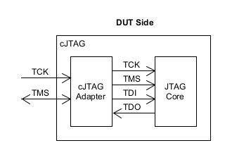
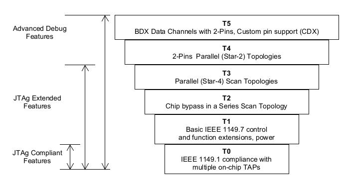
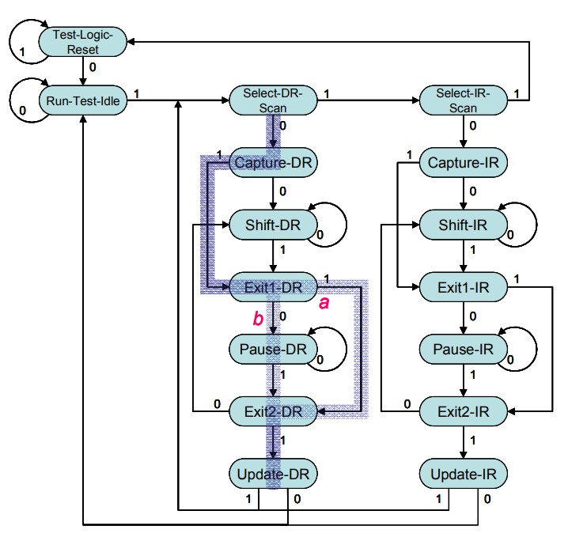
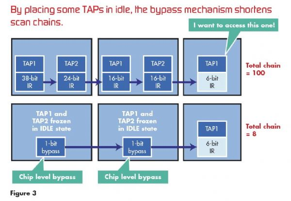

cJTAG (Compact JTAG)
---

因應現代多核心的普遍及封裝技術進步, e.g. SiP (System-in-Package), POP (Package-on-Package), 每個 Core 中的 TAP controllers 會在 SOC 內部串接起來.
> 提高不同拓樸串接的 TAP controllers 間的效率, 已成為課題

cJTAG (IEEE 1149.7) 是在 JTAG (IEEE 1149.1) 基礎上延伸出來, 並進一步提高效率
> 增加基本特性:
> + 可設定 TAP 不同 Low-Power 模式 (可更精準驗證功耗)
> + 大幅提高 Scan-Chain 的效能, 更迅速存取特定的 TAP
> + 導入星狀拓樸, 提高 layout 的彈性
> + 可將 4-Pins 漸少到 2-Pins

  
Fig-1. Architecturt of cJTAG

+ 市場上已有的 Device
    > + Ti CC2538 use cJTAG Debug Interface

## Six classes

cJTAG (IEEE 1149.7) 將支援功能分成 6 個層級, 上層需包含下層的功能

  
Fig-2. The classes of cJTAG

+ Class T0
    > Class T0 可確保符合業界現行根據 `IEEE 1149.1`的測試基礎架構
    >> 在 Class T0 中, 經過 Test-Logic-Reset 進行重設後, 所有 `IEEE 1149.7` 多階裝置, 強制性必須遵循 `IEEE 1149.1` 指令行為, 並根據旁路指令執行 1-bit DR 掃描

+ Class T1
    > Class T1 可定義後續等級的進階功能, 與其所依據的控制系統.

    > 簡單說, 此一系統使用與 `IEEE 1149.1` 相容的**TAP狀態順序**及**偏移狀態監視**, 來建立控制系統.
    其中使用零位元 DR 掃描(Zero-Bit-Scan, ZBS), 來設定 IEEE 1149.7 相容晶片的狀態, 而使 IEEE 1149.1 相容晶片完全不受影響

      
    Fig-3. Zero-bit scan (ZBS)

    > ZBS 狀態順序很少搭配 `IEEE 1149.1` 中的 BYPASS 及 IDCODE 指令一起使用, 而且不會執行任何實際功能(請參考 Fig-3).
    這是因為含有這些良性指令的 ZBS, 並不會實際變更測試邏輯的狀態

    > ZBS 會先從 `Select-DR-Scan state` 開始, 一直到 `Exit state`, 然後繼續進行到 `Update-DR state`, 其間不會變更 TAP controller 的任何內容.
    就 `IEEE 1149.1` 標準而言, 沒有需要特別注意的事項.

    > 然而, Fig-3 中藍線表示的邏輯, 會持續計算 ZBS 狀態順序起始的次數
    若 ZBS 順序中斷, 從 Capture-DR state 移至 Shift-DR state, 該邏輯便會鎖定 ZBS 計數.
    > 鎖定 ZBS 計數會啟動等於 ZBS 計數(1~7)的控制層級。 控制層級 2 可用以建立 IEEE 1149.7 系統的指令.
    > 當發生某些事件時, 會結束控制層級. 這些事件包括 Select-IR-Scan state, Test-Logic-Reset state, 及同步處理等級T4和T5控製器運作的某些控製器指令與事件

    > Class T1 也可用以控制功耗. IEEE 1149.7 定義 4 個針對使用情形設計的功耗降低模式, e.g. 電路板測試, 晶片測試, 應用程式除錯.
    >> 針對除錯邏輯定義的功耗降低模式, 可用以減少系統功耗, 並提供 1 種標準方式讓工具廠商能夠使用功耗降低的裝置

+ Class T2

    > 透過 chip level bypass, Class T2 可大幅縮短掃描鏈, 以提升高 chip 計數應用的除錯效能

      
    Fig-4. Chip level bypass example

    > 由於各個 chip 中的 TAP controller 皆以序列方式串接, 因此, 在IEEE 1149.7 之前, 含有許多裝置的設計, 都會針對掃描鏈中的各個裝置納入 TAP controller.

    > Fig-4 中所示的系統範例有3個裝置, 共有5個核心, 並總共將 100-bits 傳輸至 Scan-Chain.
    若開發人員想檢視掃描鏈中的最後 1 個裝置, 每次都必須掃描 100-bits. 因此相當沒有效率, 並使嵌入式軟體開發人員無法迅速進行裝置存取
    > IEEE 1149.7 的 Chip level bypass 功能可凍結非重要裝置中的 TAP controller, 並將掃描位元數從 100 降低至 8 (Fig-4)
    這可減少需要偏移出系統的 bit 數, 因此可大幅提升掃描鏈的效能.

    > 此一機制也可發揮防火牆的效用. 防火牆可用於運作中目標電路板的熱連接.
    在 IEEE 1149.1 中, 連接到執行中的目標會導致無法預期的結果, 原因可能是擾亂除錯邏輯的連接所造成的電子問題

    > 由於 bypass 機制做為防火牆使用, 因此只有在預定的順序起始後, 才能溝通 Chip TAP controller.
    這個步驟可確保只有在目標有穩定的電子連接後, 除錯測試系統才進行連接

+ Class T3
    > 透過 Chip Selection 機制及連結 ID 組態,  Class T3 能讓開發人員建立星狀拓樸, 而非 IEEE 1149.1 標準的傳統序列組態.

    > 為建立星狀拓樸, 須涉及的晶片編號. 不過在啟動時, TAP controller 不會有晶片編號.
    Class T3 會定義指派晶片編號的方法, 主要是透過根據 IDCODE 及 UID 進行消除的程序.

    > Class T3 會建立星狀拓樸, 可讓 Class T4 執行雙接腳運作.
    此外必須注意的是, 一旦接通電源後, IEEE 1149.7 系統便會與 IEEE 1149.1 相容.
    透過 ZBS 組態 IEEE 1149.7 邏輯後, 即可使用 IEEE 1149.7 的進階功能。

+ Class T4
    > Class T0 至 T3 可當作 `IEEE 1149.1` 標準的延伸, 而 Class T4 則在功能方面有極大的變化.

    > Class T4 中主要優點, 是將所需的 Pins 從 4 減少到 2, 並採用支援最佳化異動的新掃描格式, 這可維持及提升降低接腳數的組態中所發揮的效能.

    > 若 DUT 為堆疊式晶片封裝時, 最好儘可能保持最少的連接器數目, 以免增加堆疊晶片的困難度
    >> 連接數的數目愈少, 工作愈簡易, 因為每加入1個連接器, 就會額外增加成本.

    > 2-Pins 的關鍵在於, 取消原有的資料線路(TDI/TDO), 以及透過 TMS 線路進行的序列化資料雙向傳輸.

    > 對於使用堆疊式晶片及多重晶片模組的系統設計人員而言, 減少無黏接星狀組態的接腳數是相當重要的功能,
    因為這可簡化掛載點上除錯接腳的組態, 並降低零件製造、掛載與庫存的困難度及成本。

    > 除降低 Pin 數之外, Class T4 也定義最佳化的下載特定掃描模式; 在這些模式中, 只會下載有用的資訊.
    為提升降低 Pin 數運作的效能, 可將 CLK 加倍。

+ Class T5
    > Class T5 可使測試連接埠同時執行除錯及儀器運作, 以減少儀器專用 Pin 數.
    由於儀器資料是在閒置時間內傳輸, 對於工作而言相當充裕, 因此 Pin 數得以減少
    >> 一般而言, 兩個接腳都專供儀器使用

    > Class T5 也允許自訂的通訊協定. 此項功能大致上已整合於此標準中, 因為工作團隊瞭解許多裝置廠商都有自訂的通訊協定.
    等級T5將此程序標準化, 因此能夠使用自訂的通訊協定, 並可確實執行啟用這些通訊協定的業界標準方法

# Reference

+ [如何以新問世IEEE 1149.7標準 設計JTAG進行SoC除錯](https://www.digitimes.com.tw/tech/dt/n/shwnws.asp?id=0000151958_Y9F8A9HJ6PRXJY7Q6SIA0)
+ [基於IEEE1149.7標準的CJTAG測試設計方法研究-AET-電子技術應用](https://m.chinaaet.com/article/211091)
+ [Silvaco - IEEE 1149.7 Compact TAP](https://silvaco.com/wp-content/uploads/product/ip/pdf/70006_IEEE_1149.7_Compact_TAP_brief.pdf)