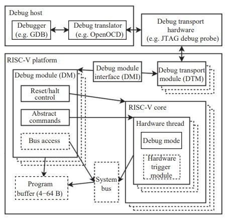
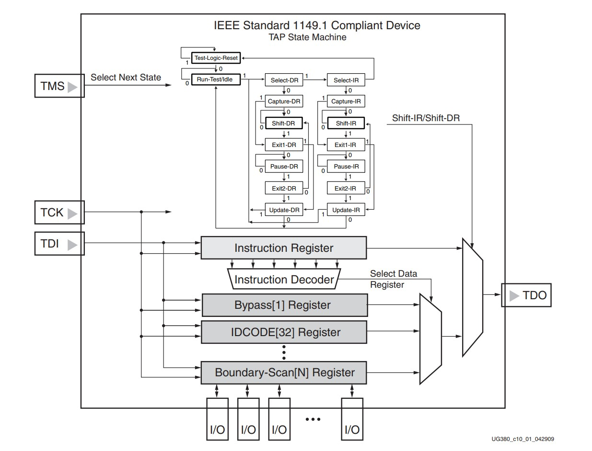
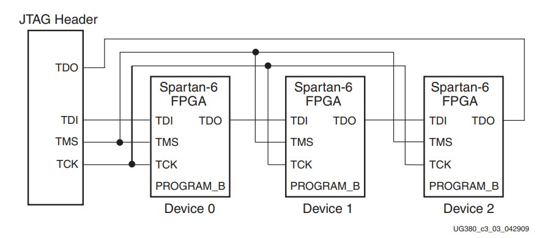
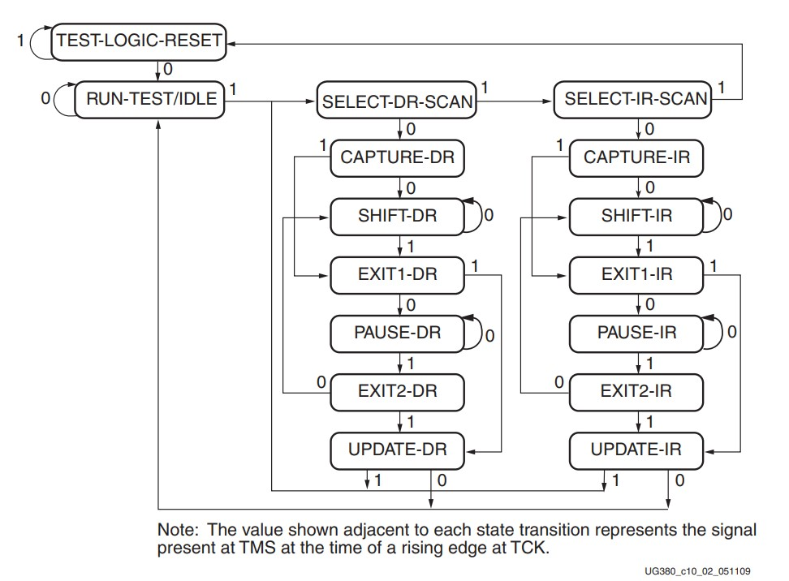

jTag
---
JTAG (Joint Test Action Group) 是一個在 1985 年成立的電子工業協會, 致力於發展產品製造後, 如何驗證設計及測試印刷電路板接線的方法.

在 1990 年結果寫成 **`IEEE Standard 1149.1-1990`**, 標題是`Standard Test Access Port and Boundary-Scan Architecture`, 但坊間仍俗稱 JTAG.

JTAG 除了可用來作 Boundary-Scan Test, 也就是測試電路板上元件間的接線是否正確外, 常常擴充提供許多廠商自定的功能, 例如 燒錄, In-Circuit Emulation 等.



## TAP (Test Access Port)

JTAG 存取介面稱為 TAP (Test Access Port), 包括
> + 外部通訊的序列訊號接腳
> + 內部的狀態機器
> + 暫存器


 <br>
Fig-1. Typical JTAG Architecture

TAP 接腳有 TCK, TMS, TDI, TDO 四個訊號 (Fig-1), 透過控制 TAP 狀態機器來存取 TAP 暫存器.
> 所有 JTAG 功能都透過這四個訊號完成

+ TCK (Test Clock) input(DUT side)
    > TAP 的運作時脈

+ TMS (Test Mode Select) input(DUT side)
    > 選擇下個 TAP 狀態轉移, `TCK Rising Edge` 動作.

    - TAP 採用序列狀態機, 下個狀態只依據 `TMS 只有 0 跟 1 兩種選擇`.
        > TMS 持續輸入 1 可回復 reset 狀態, 一般會有內部 pull-up 提供邏輯 1 輸入.

+ TDI (Test Data In) input(DUT side)
    > Serial data be moved into TAP Register
    >> `TCK Rising Edge` trigger

+ TDO (Test Data Out) output(DUT side)
    > TAP Register data be moved out to Serial
    >> `TCK Falling Edge` trigger, 且只有在位移輸出 Register 時才驅動輸出

另外可能還有 TRST (Test Reset) Pin, 強制 TAP 重設, 但 TMS 持續輸入 1 也可以重設, 所以不是必要的.

多個 JTAG 可以串接使用 (like SPI), 其中 TCK 跟 TMS 是共用, 而 TDI 跟 TDO 則是串接 (Fig-2)

 <br>
Fig-2. Boundary-Scan Chain of Devices


## TAP Registers

TAP Registers 會有一個 Instruction Register(IR), 其它為 Data Register(DR).
> DR 數目不一定, 可能有 BYPASS, IDCODE, EXTEST, INTEST, ...etc, 有些是 IEEE 定義的, 其它則廠商自己定義
>> TAP 狀態跟 IR 的內容, 決定 TDI 輸入到哪個暫存器 或 TDO 輸出自哪個暫存器

+ IR (Instruction Register)
    > 至少 2-bit, 由廠商決定長度, 不同指令選擇不同的資料暫存器, 而有不同的功能

+ BYPASS
    > `IEEE Std 1149.1` 定義的標準暫存器, 只有 `1-bit`
    >> 作為多個 JTAG 元件串接時, 把 TDI 跟 TDO 以序列方式串起來, 來 bypass 特定元件, 在 CAPTURE-DR 時會初始化為 0.

+ IDCODE
    > 大部分 JTAG 相容元件都有 `32-bit` IDCODE, 儲存元件特定的識別碼, 可看出製造商及元件型號

+ Bound-Scan Register (BSR)
+ EXTEST, INTEST, SAMPLE, USERCODE, and HIGHZ

JTAG 相容元件用 Boundary Scan Description Language (BSDL) 檔案定義其功能, BSDL 用 VHDL 語言撰寫, 描述元件的接腳及 boundary-scan 暫存器


## State Machine of TAP

 <br>
Fig-3. Boundary-Scan TAP Controller

TAP 有 16 種狀態, 由 TCK 時脈的 `Rising-Edge` 及 TMS 是 0 或 1, 來決定狀態的轉換

主要有兩種 path, 分別是要對 IR 或 DR 的 data(57-bits Shift-Register) 做 shift parsing
>
> IR 在實作上可能分成兩部份, 一是解碼使用的 IR, 另一是位移的時候用
>> DR 未必有這樣的設計


+ Test-Logic-Reset (TLR) state
    > 測試邏輯於 reset 狀態, 也就是測試邏輯電路是關閉的, 此時元件可正常使用

    > 不論目前在哪個狀態, 只要 5 次 `TMS == 1` 就會進入 Test-Logic-Reset 狀態
    >> 持續 1 維持在 Test-Logig-Reset, 0 離開

+ Run-Test/Idle (RTI) state
    > 在特定的指令下, 進入並停留在此狀態來執行測試 (Run-Test), 直到 `TMS == 1` 結束此 State
    >> 其它指令則為 Idle

+ Select-IR-Scan and Select-DR-Scan state
    > 選擇是否進入 IR or DR 路徑


+ Capture-IR 或 Capture-DR state
    > 擷取 Serial Data 做為 IR 或 DR 使用,
    >> `Rising Edge of TCK`

    - 當 Serial Data 做為 IR 用時, Capture-IR 階段會 Parsing Serial Data (unit: Bit) 做預處理 (配合 Instruction Decoder 格式)
        > Instruction code shift and or LSB[1:0] = 0x1

        ```
        opcode = (opcode << 2) | 0x1;
        ```

    - 當 Capture-DR 時, 會將 IR 對應的 DR 做為輸出

+ Shift-IR 或 Shift-DR
    > 此時暫存器跟接腳 TDI 及 TDO 串起來進行內容 Shift
    >> `TMS == 0` 時持續進行位移, 為 `TMS == 1` 時結束

+ Exit1-IR 或 Exit1-DR
    > 控制是要進入 Pause-IR (Pause-DR) 還是 Update-IR (Update-DR)

+ Pause-IR 或 Pause-DR
    > 暫停位移

+ Exit2-IR 或 Exit2-DR
    > 控制是要進入 Shift-IR (Shift-DR), 還是進入 Update-IR (Update-DR)

+ Update-IR 或 Update-DR
    > 在 TCK falling edge 完成更新 IR 或 DR


### Example of read IDCODE

| TAP Step state     | TDI        |  TMS | #TCK (T) | 說明
| :-                 | :-:        | :-:  | :-:      | :-
| any                | x          |  1   |  5       | 回復到 reset 狀態
| Test-Logic-Reset   | x          |  0   |  1       |
| Run-Test/Idle      | x          |  1   |  1       |
| Select-DR-Scan     | x          |  1   |  1       |
| Select-IR-Scan     | x          |  0   |  1       |
| Capture-IR         | x          |  0   |  1       |
| Shift-IR           | b'01001'   |  0   |  5       | 從 LSB 開始位移 IDCODE 指令
| Shift-IR           | 0          |  1   |  1       | 位移 IDCODE 指令最後 MSB, 並離開位移狀態
| Exit1-IR           | x          |  1   |  1       | 更新指令為 IDCODE = 0x09
| Update-IR          | x          |  1   |  1       |
| Select-DR-Scan     | x          |  0   |  1       |
| Capture-DR         | x          |  0   |  1       |
| Shift-DR           | ?          |  0   |  31      | TDO 從 LSB 開始位移出 IDCODE
| Shift-DR           | ?          |  1   |  1       | TDO 位移出 IDCODE 最後 bit, 並離開位移狀態
| Exit1-DR           | x          |  1   |  1       |
| Update-DR          | x          |  0   |  1       | 回到 Run-Test/Idle 完成動作
| Run-Test/Idle      |            |  0   |  1       |


## Chain Devices

如果多個元件串接時, 由於 TMS 是接在一起的, 所以`每個元件的 TAP 停留的狀態是一致的`, 只差在讀寫暫存器所需要位移的長度變長

+ 當寫入 Instruction 時, 需要依照 Devices 串接的順序排指令碼
    > 若 IR 寫入指令 IDCODE 時, Target Device 填 IDCODE opcode, others 則填 BYPASS opcode
    >> BYPASS 指令碼都是 1, 只是不同元件 IR 的長度會有所不同

+ 當 Host 讀出 IDCODE 的 DR 時, Host 需要把讀到的 BYPASS 過濾掉, 每個 BYPASS 佔 1-bit。

JTAG 雖然有 16 種狀態, 除了重設及 Run-Test 外, 其它都是為了存取 IR 及 DR
> JTAG 訊號很像 SPI, 多了 TMS 來轉移狀態, 多了 IR/DR 可無限擴充可能的功能


# Reference

+ [JTAG | 小蘿蔔工作室 Little Robot Studio](https://lirobo.blogspot.com/2015/11/jtag.html)
+ [Spartan-6 FPGA Configuration User Guide](http://www.xilinx.com/support/documentation/user_guides/ug380.pdf)

