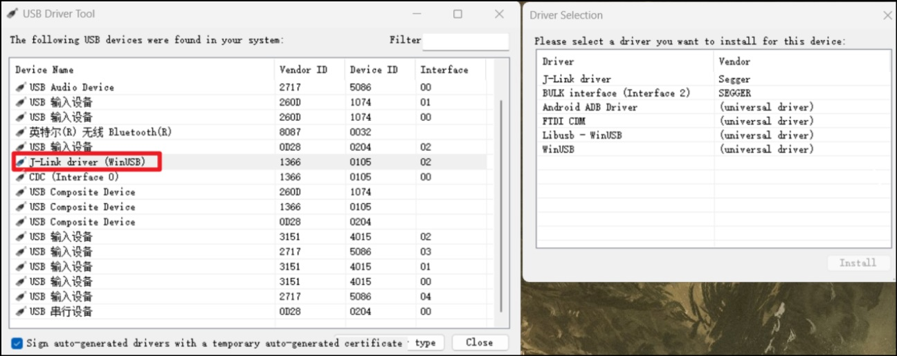
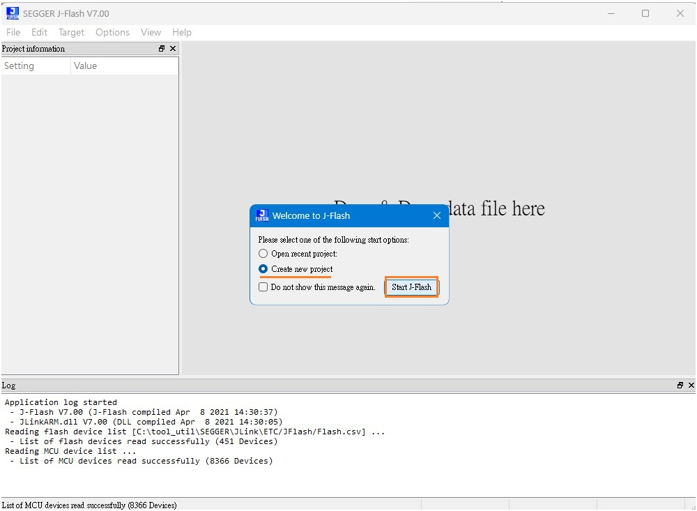
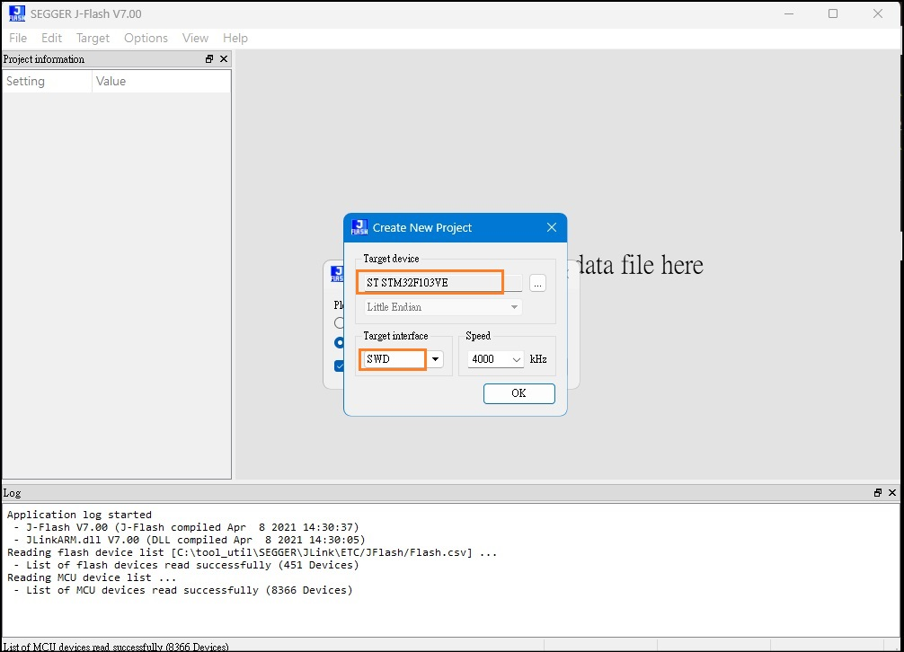
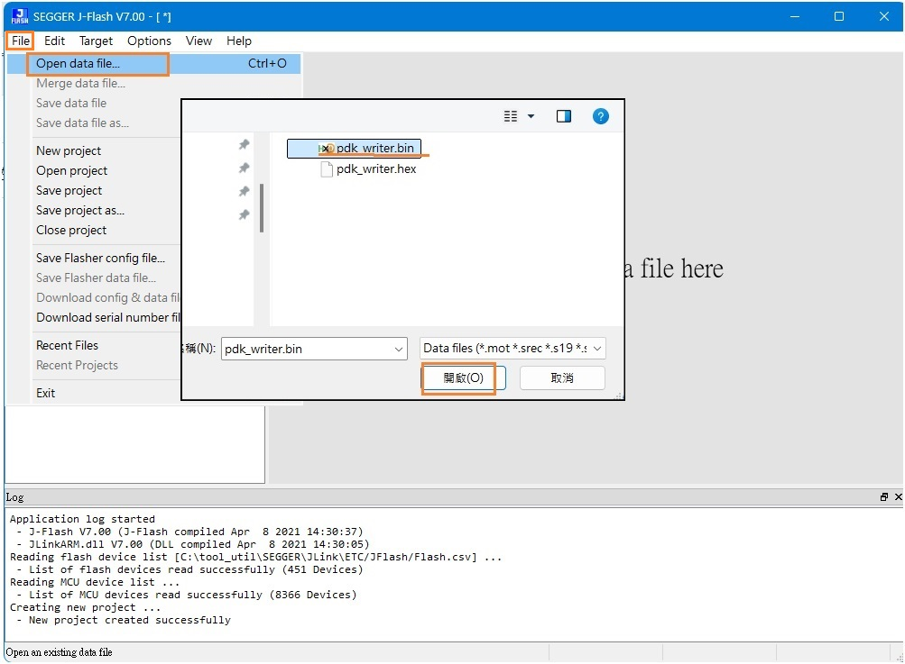
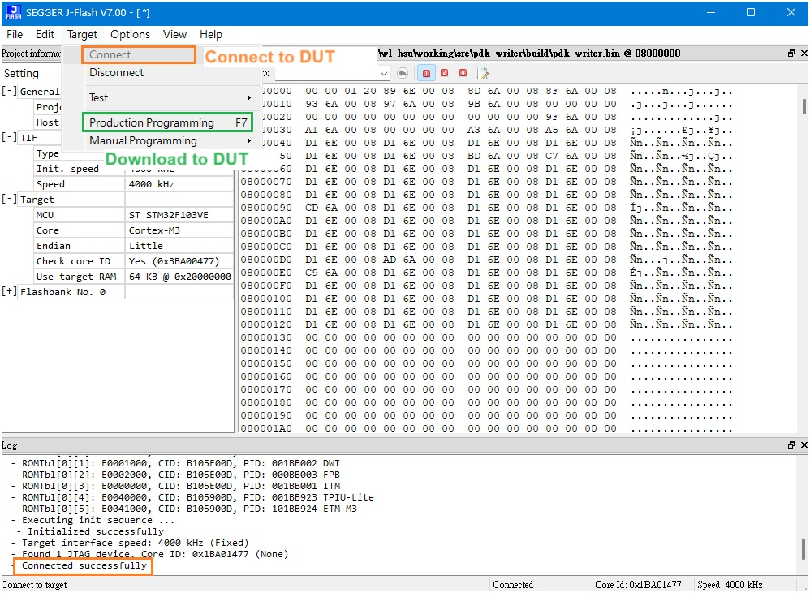

jLink
---

The `VTref` pin is input mode in Official jLink
> `VTref` pin should link to VSS of DUT
>> 盜版反而用 `VTref` 來供電給 DUT

[SEGGER j-Link Pack](https://www.segger.com/downloads/jlink/#J-LinkSoftwareAndDocumentationPack)


# Setup Environment

## Windows


### Troubleshooting

+ OpenOCD with jLink

    ```
    Warn : Failed to open device: LIBUSB_ERROR_NOT_SUPPORTED ，
    Error: No J-Link device found
    ```

    > 因為 OpenOCD 使用 jlink 的方式很低級, 所以我們需要把 j-link 原來的驅動,
    更換為 WinUSB 驅動才可以被 OpenOCD 識別
    >> 更換為 WinUSB 後, 有可能造成 Keil/j-Scope 識別不到 jLink


    - [USB Dirver Tool](https://visualgdb.com/UsbDriverTool/)
        > 可更換回原本的驅動

        

### jLink connet to DUT

```
> JLink.exe

SEGGER J-Link Commander V7.98g (Compiled Sep  5 2024 11:51:10)
DLL version V7.98g, compiled Sep  5 2024 11:50:17

Connecting to J-Link via USB...Updating firmware:  J-Link V11 compiled Sep  3 2024 10:40:48
Replacing firmware: J-Link V11 compiled May 28 2024 15:36:02
Waiting for new firmware to boot
New firmware booted successfully
O.K.
Firmware: J-Link V11 compiled Sep  3 2024 10:40:48
Hardware version: V11.00
J-Link uptime (since boot): 0d 00h 00m 00s
S/N: 601003134
License(s): RDI, FlashBP, FlashDL, JFlash, GDB
USB speed mode: High speed (480 MBit/s)
VTref=3.290V


Type "connect" to establish a target connection, '?' for help
J-Link>connect      <---- User type

Please specify device / core. <Default>: STM32F103RB
Type '?' for selection dialog
Device>STM32F103RB  <---- User type
Please specify target interface:
  J) JTAG (Default)
  S) SWD
  T) cJTAG
TIF>S               <---- User type
Specify target interface speed [kHz]. <Default>: 4000 kHz
Speed>
Device "STM32F103RB" selected.


Connecting to target via SWD
InitTarget() start
SWD selected. Executing JTAG -> SWD switching sequence.
DAP initialized successfully.
InitTarget() end - Took 9.24ms
Found SW-DP with ID 0x1BA01477
DPIDR: 0x1BA01477
CoreSight SoC-400 or earlier
Scanning AP map to find all available APs
AP[1]: Stopped AP scan as end of AP map has been reached
AP[0]: AHB-AP (IDR: 0x14770011, ADDR: 0x00000000)
Iterating through AP map to find AHB-AP to use
AP[0]: Core found
AP[0]: AHB-AP ROM base: 0xE00FF000
CPUID register: 0x411FC231. Implementer code: 0x41 (ARM)
Found Cortex-M3 r1p1, Little endian.
FPUnit: 6 code (BP) slots and 2 literal slots
CoreSight components:
ROMTbl[0] @ E00FF000
[0][0]: E000E000 CID B105E00D PID 001BB000 SCS
[0][1]: E0001000 CID B105E00D PID 001BB002 DWT
[0][2]: E0002000 CID B105E00D PID 000BB003 FPB
[0][3]: E0000000 CID B105E00D PID 001BB001 ITM
[0][4]: E0040000 CID B105900D PID 001BB923 TPIU-Lite
Memory zones:
  Zone: "Default" Description: Default access mode
Cortex-M3 identified.
J-Link>
```

### Download Bin to DUT with `jFlash` (on Windows Platform)

正版 jLink-Plus/jLink-Pro/jLink-Ultra+ 才能使用
> jLink-Base 功能被鎖, 盜版可以使用


+ Open jFlash

    ```
    .../SEGGER/JLink/JFlash.exe
    ```

+ Create a project of jFlash

    

+ Select the target device of jFlash

    

+ Select the bin file

    

+ Download data to DUT

    


## Ubuntu

### dependency

如果有缺 dependency lib

+ 查看 installed libs

    ```
    $ dpkg -l | grep libusb
    ```

+ libusb

    - apt install

        ```
        $ sudo apt install libusb
        ```

    - source code install

        ```
        $ tar jxvf libusb-1.0.21.tar.bz2
        $ cd libusb-1.0.21/
        $ ./configure  # ./configure --disable-udev
        $ make
        $ sudo make install
        ```

+ libreadline

    ```
    $ sudo apt-get install libreadline6-dev
    ```

### Install jlink deb

```
$ sudo dpkg -i xxxx.deb
```

+ 安裝在 `/opt/SEGGER/`
+ Run jlink

    ```
    $ JLinkExe
        SEGGER J-Link Commander V7. 0 (Compiled Apr  8 2021 14:33:59)
        DLL version V7.00, compiled Apr  8 2021 14:33:43

        Connecting to J-Link via USB...JLinkGUIServerExe: cannot connect to X server
        FAILED: Cannot connect to J-Link.
        J-Link>
    ```

# JLink Commander
---

> + windowns: `JLink.exe`
> + linux: `JLinkExe`

### 常用指令

+ JLink Commander CLI

    ```
    J-Link>
    ```

    - `?`
        > Show information about all or specific commands

        ```
        ? [<Command>]
        ```

    - Configuration

        1. `Connect`
            > Connect to target device

        1. `Device`
            > Select specific device J-Link shall connect to

            ```
            Device <DeviceName>
            ```

        1. `USB`
            > Connect to J-Link via USB

            ```
            USB [<SN>]
            ```

        1. `SelectInterface`
            > Select target interface

            ```
            SelectInterface <Interface>
            ```

        1. `LE`
            > Change mode to little endian.
        1. `BE`
            > Change mode to big endian.

        1. `Speed`
            > Set target interface speed

            ```
            Speed <freq|auto|adaptive>
            ```

        1. `Log`
            > Enables log to file

            ```
            Log <filename>
            ```

    - System operation

        1. `Halt`
            > Halt CPU

        1. `Reset`
            > Reset CPU

        1. `Exit`
            > Close J-Link connection and quit

        1. `Sleep`
            > Waits the given time (in milliseconds)

            ```
            Sleep <Delay>
            ```

        1. `ShowFWInfo`
            > Show firmware info


    - dump/load operation

        1. `LoadFile`
            > Load data file into target memory.
            >> Supported ext.: `*.bin`, `*.mot`, `*.hex`, `*.srec`, `*.elf`, `*.out`, `*.axf`

            ```
            > LoadFile <FileName>, [<Addr> (.bin only)]
            ```

        1. `SaveBin`
            > Save target memory range into binary file

            ```
            > SaveBin <filename>, <addr>, <NumBytes>
            ```
        1. `VerifyBin`
            > Verfy if specified .bin file is at the specified target memory location

            ```
            > VerifyBin <filename>, <addr>
            ```

    - trace operation

        1. `Go`
            > Start CPU if halted

        1. `Step`
            > Execute step(s) on the CPU

            ```
            Step [<NumSteps> (decimal)] (default is 1)
            ```

        1. `SetBP`
            > Set breakpoint

            ```
            SetBP <addr> [A/T] [S/H]
            ```

        1. `ClearBP`
            > Clear breakpoint

            ```
            ClearBP <BP_Handle>
            ```

        1. `SetWP`
            > Set Watchpoint

            ```
            SetWP <Addr> [R/W] [<Data> [<D-Mask>] [A-Mask]]
            ```

        1. `ClearWP`
            > Clear watchpoint

            ```
            ClearWP <WP_Handle>
            ```

    - memory operation

        1. `Mem`
            > Read memory and show corresponding ASCII values

            ```
            Mem  [<Zone>:]<Addr>, <NumBytes> (hex)
            ```

        1. `Mem8`
            > Read  8-bit items

            ```
            Mem8  [<Zone>:]<Addr>, <NumBytes> (hex)
            ```

        1. `Mem16`
            > Read 16-bit items

            ```
            Mem16 [<Zone>:]<Addr>, <NumItems> (hex)
            ```

        1. `Mem32`
            > Read 32-bit items

            ```
            Mem32 [<Zone>:]<Addr>, <NumItems> (hex)
            ```

        1. `Write1`
            > Write  8-bit items

            ```
            W1 [<Zone>:]<Addr>, <Data> (hex)
            ```

        1. `Write2`
            > Write 16-bit items

            ```
            W2 [<Zone>:]<Addr>, <Data> (hex)
            ```

        1. `Write4`
            > Write 32-bit items

            ```
            W4 [<Zone>:]<Addr>, <Data> (hex)
            ```

        1. `Write8`
            > Write 64-bit items

            ```
            W8 [<Zone>:]<Addr>, <Data> (hex)
            ```

        1. `Erase`
            > Erase flash (range) of selected device

            ```
            Erase [<SAddr>, <EAddr>]
            ```

    - CPU register operation

        1. `Regs`
            > Display CPU register contents

        1. `RReg`
            > Read register

            ```
            RReg <RegName>
            ```

        1. `WReg`
            > Write register

            ```
            WReg <RegName>, <Value>
            ```

        1. `MoE`
            > Shows mode-of-entry (CPU halt reason)


### 使用 Command-Line 結合 JLink 自動下載韌體

+ 支援將指令腳本

    - `stm32F1_download_flash.jlink`

        ```
        Reset
        Halt
        LoadFile D:\Project.bin 0x08000000
        Go
        Exit
        ```

+ download bin to target flash with jLink

    ```
    # windows
    > JLink.exe -AutoConnect 1 -Device STM32F103VE -If SWD -Speed 4000 -CommandFile stm32F1_download_flash.jlink

    # ubunbu
    $ JLinkExe -AutoConnect 1 -Device STM32F103VE -If SWD -Speed 4000 -CommandFile stm32F1_download_flash.jlink
    ```

+ Batch file

    ```
    set PATH=D:/Keil_v5/Arm/Segger/;
    JLink.exe -AutoConnect 1 -device STM32F103VE -If swd -Speed 4000 -CommandFile .\stm32F1_download_flash.jlink
    ```

### Reference
    - [如何使用JLink Commander或JFlash下载GR5xxx系列SoC的固件](https://developers.goodix.com/zh/bbs/blog_detail/dec074dacb414d4c9c2114f3029d4d97)
    - [【Jlink】J-Link Commander 命令行脚本使用例子 下载烧录 芯片解锁 芯片加锁](https://www.cnblogs.com/xuejiangqiang/p/16582478.html)


# Reference
---

+ [RT-Thread-Ubuntu 18.04 JLink 下載韌體RT-Thread問答社區 - RT-Thread](https://club.rt-thread.org/ask/article/e9b65fc6241bc83b.html)
+ [如何使用JLink Commander或JFlash下载GR5xxx系列SoC的固件 | 技术文章 | 汇顶科技开发者社区](https://developers.goodix.com/zh/bbs/blog_detail/dec074dacb414d4c9c2114f3029d4d97)
+ [【Jlink】J-Link Commander 命令行脚本使用例子 下载烧录 芯片解锁 芯片加锁 - 嵌入式单片机实验室 - 博客园](https://www.cnblogs.com/xuejiangqiang/p/16582478.html)


