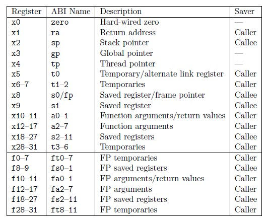

GD32VF103 interrupt analysis
---

## 概述

在處理 RISC-V 中斷的時候, 需要弄清楚兩個概念:
> + 向量中斷
> + 非向量中斷

### 向量中斷

對於向量中斷, 其中斷發生後, `$pc` 會根據中斷的類型, 跳轉到 `Vector Base + IRQ * 4` 的 address 去執行 ISR.

當然 RISC-V 也可以支援這種 Vector Interrupt, 這樣每個地址處會安排一個特定的 ISR, 當中斷發生後, 跳轉到特定的 ISR 去執行即可.

### Non-Vectored 中斷

對於非向量中斷, 則表示中斷發生後, **只有一個入口**, 需要在這一個 ISR 中, 去判斷具體 IRQ
> 這種行為, 可以在常見的 mips, sparc 中看到

既然 RISC-V 可支援這兩種中斷處理方式, GD32VF103 也實現了這兩種機制, 那麼就分析一下實現的策略

## 中斷向量表初始化

任何程式碼在最初的 Assembly 等級的初始化時, 都會指定 Vector Base, 當然 RISC-V 也不例外

對於向量中斷來說

```
/*
 * Intialize ECLIC vector interrupt
 * base address mtvt to vector_base
 */
la t0, vector_base
csrw CSR_MTVT, t0
```

這裡向 CSR_MTVT 中存放 vector_base, 該處存放向量地址入口, 每個向量中斷發生, 則根據偏移執行對應的 ISR.
> CSR_MTVT 和 CSR_MTVT2 是 vendor 自行實作

```asm
    .globl vector_base
    .type vector_base, @object
vector_base:
#if defined(DOWNLOAD_MODE) && (DOWNLOAD_MODE != DOWNLOAD_MODE_FLASH)
    j _start                                        /* 0: Reserved, Jump to _start when reset for ILM/FlashXIP mode.*/
    .align LOG_REGBYTES                             /*    Need to align 4 byte for RV32, 8 Byte for RV64 */
#else
    DECLARE_INT_HANDLER     default_intexc_handler  /* 0: Reserved, default handler for Flash download mode */
#endif
    DECLARE_INT_HANDLER     default_intexc_handler  /* 1: Reserved */
    DECLARE_INT_HANDLER     default_intexc_handler  /* 2: Reserved */
    DECLARE_INT_HANDLER     eclic_msip_handler      /* 3: Machine software interrupt */

    DECLARE_INT_HANDLER     default_intexc_handler  /* 4: Reserved */
    DECLARE_INT_HANDLER     default_intexc_handler  /* 5: Reserved */
    ...
```

下面非向量中斷的入口

```asm
    /*
     * Set ECLIC non-vector entry to be controlled
     * by mtvt2 CSR register.
     * Intialize ECLIC non-vector interrupt
     * base address mtvt2 to irq_entry.
     */
    la t0, irq_entry
    csrw CSR_MTVT2, t0
    csrs CSR_MTVT2, 0x1
```

其中 `irq_entry` 表示了非向量的 ISR.
> `csrs CSR_MTVT2, 0x1` 該指令的解析如下:
> + `CSR_MTVT2[0] == 0`時, 中斷入口使用 `CSR_MTVEC`
> + `CSR_MTVT2[0] == 1`時, 中斷入口則為 `CSR_MTVT2[31:2]`

## 分析 `irq_entry.S`

分析非向量中斷的行為, 可以更好的理解 RISC-V 的中斷底層的處理機制,
從中斷處理的原理上來講, 中斷處理分三部分:
> + 保存當前現場
> + 進入 ISR
> + 恢復現場

```asm
.global irq_entry
/* This label will be set to MTVT2 register */
irq_entry:

    /************************************
     *  儲存需要的 GPRs 及 CSRx 的資訊到 stack
     */
    /* Save the caller saving registers (context) */
    SAVE_CONTEXT
    /* Save the necessary CSR registers */
    SAVE_CSR_CONTEXT

    /************************************
     *  藉由 CSR_JALMNXTI, 讓 RISC-V 去對應 IRQ 和 Vector table
     */
    /* This special CSR read/write operation, which is actually
     * claim the CLIC to find its pending highest ID, if the ID
     * is not 0, then automatically enable the mstatus.MIE, and
     * jump to its vector-entry-label, and update the link register
     */
    csrrw ra, CSR_JALMNXTI, ra

    /* Critical section with interrupts disabled */
    DISABLE_MIE     /* 關中斷, 因為 CSR_JALMNXTI 會自動 開中斷  */

    /************************************
     *  從 stack 取回需要的 GPRs 及 CSRx 的資訊
     */
    /* Restore the necessary CSR registers */
    RESTORE_CSR_CONTEXT
    /* Restore the caller saving registers (context) */
    RESTORE_CONTEXT

    /* Return to regular code */
    mret

/**
 * \brief  Macro for save necessary CSRs to stack
 * \details
 * This macro store MCAUSE, MEPC, MSUBM to stack.
 */
.macro SAVE_CSR_CONTEXT
    /* Store CSR mcause to stack using pushmcause */
    csrrwi  x0, CSR_PUSHMCAUSE, 11
    /* Store CSR mepc to stack using pushmepc */
    csrrwi  x0, CSR_PUSHMEPC, 12
    /* Store CSR msub to stack using pushmsub */
    csrrwi  x0, CSR_PUSHMSUBM, 13
.endm

/**
 * \brief  Macro for restore necessary CSRs from stack
 * \details
 * This macro restore MSUBM, MEPC, MCAUSE from stack.
 */
.macro RESTORE_CSR_CONTEXT
    LOAD x5,  13*REGBYTES(sp)
    csrw CSR_MSUBM, x5
    LOAD x5,  12*REGBYTES(sp)
    csrw CSR_MEPC, x5
    LOAD x5,  11*REGBYTES(sp)
    csrw CSR_MCAUSE, x5
.endm
```

其中 `SAVE_CONTEXT` 是保存上下文現場的方式

```asm
.macro SAVE_CONTEXT
    csrrw sp, CSR_MSCRATCHCSWL, sp
    /* Allocate stack space for context saving */
#ifndef __riscv_32e
    addi sp, sp, -20*REGBYTES
#else
    addi sp, sp, -14*REGBYTES
#endif /* __riscv_32e */

    STORE x1, 0*REGBYTES(sp)
    STORE x4, 1*REGBYTES(sp)
    STORE x5, 2*REGBYTES(sp)
    STORE x6, 3*REGBYTES(sp)
    STORE x7, 4*REGBYTES(sp)
    STORE x10, 5*REGBYTES(sp)
    STORE x11, 6*REGBYTES(sp)
    STORE x12, 7*REGBYTES(sp)
    STORE x13, 8*REGBYTES(sp)
    STORE x14, 9*REGBYTES(sp)
    STORE x15, 10*REGBYTES(sp)
#ifndef __riscv_32e
    STORE x16, 14*REGBYTES(sp)
    STORE x17, 15*REGBYTES(sp)
    STORE x28, 16*REGBYTES(sp)
    STORE x29, 17*REGBYTES(sp)
    STORE x30, 18*REGBYTES(sp)
    STORE x31, 19*REGBYTES(sp)
#endif /* __riscv_32e */
.endm
```

按照 RISC-V 的資料模型, 可分為 RV32I (integer) 和 RV32E (Embedded)
> RV32I 和 RV32E 的主要差異在於 GPRs 的數量上:
> + 在 RV32I 中, 總共有 32 個 32-bits 的 GPRs
> + 在 RV32E 只支援 16 個 32-bits 的 GPRs
>> 較少的 GPRs, 在 Push/Pop 時, 速度較快, RV32E 只會 Push/Pop 10 個 GPRs

<br>
Fig 1. RISC-V GPRs

Fig 1. 中, caller 代表中斷上層函數, 可以使用的暫存器, 所以

`x1, x5, x6, x7, x10, x11, x12, x13, x14, x15` 這 10 個 GPRs 會保存
> 上述程序多保存了`x4`


下面理解一下中斷的處理, 通過`csrrw ra, CSR_JALMNXTI, ra`該指令進行分析,
可發現這指令是來自**自訂擴展指令**
> `CSR_JALMNXTI = 0x7ed`


那麼一條指令, 是如何實現中斷的處理的呢 ?
> 實際上該指令, 首先會判斷當前 `eclic (Enhanced Core Local Interrupt Controller)` 中是否有 pending 未處理的中斷,
如果沒有, 那這條指令向下執行, 並不會處理任何事情;
一旦存在 pending 的中斷, 那麼會跳轉到 eclic 的中斷向量的入口, 這裡便是關鍵的地方了.

> 另外需要注意的是, default 在一進入中斷時, CPU 會關閉中斷,
當執行 `csrrw ra, CSR_JALMNXTI, ra`時, CPU 會開啟中斷, 然後判斷是否還有中斷未響應,
因此當 ISR 執行完成後, 又會回到該指令執行一次, 判斷是否還需要處理中斷
>> 如此可以達到 `SAVE_CONTEXT` -> ISR_n() -> ISR_m() -> `RESTORE_CONTEXT` 的效率提升,
這一切的行為, 都是由 H/w 完成, 大大提高中斷處理的效率


# RV-Start 環境建置

## Windows

> Environment `cmder`
> + SDK: nuclei-sdk-0.6.0
> + EVB: RV-Start

+ Set toolchain

    ```batch
    rem nuclei-sdk-0.6.0/setup.bat
    set NUCLEI_TOOL_ROOT=<your\NucleiStudio\toolchain>
    ...
    ```

+ open cmder in `nuclei-sdk-0.6.0`

    - Build sdk

        ```
        λ .\setup.bat
        λ riscv64-unknown-elf-gcc.exe --version
            riscv64-unknown-elf-gcc.exe (gbedea461d) 13.1.1 20230713
            Copyright (C) 2023 Free Software Foundation, Inc.
            This is free software; see the source for copying conditions.  There is NO
            warranty; not even for MERCHANTABILITY or FITNESS FOR A PARTICULAR PURPOSE.

        λ make SOC=gd32vf103 BOARD=gd32vf103v_rvstar all  # 第一次執行
        λ make SOC=gd32vf103 all  # 第二次執行, 可偷懶
        ```

    - Run Application

        ```
        λ make SOC=gd32vf103 BOARD=gd32vf103v_rvstar upload
            make -C application/baremetal/helloworld upload
            make[1]: Entering directory 'D:/nuclei-sdk-0.6.0/application/baremetal/helloworld'
            "Compiling  : " main.c
            "Linking    : " helloworld.elf
               text    data     bss     dec     hex filename
              13936     104    4664   18704    4910 helloworld.elf
            "Download and run helloworld.elf"   <-------- Burn-Img
            riscv64-unknown-elf-gdb
              -ex "set remotetimeout 240"
              -ex "target remote | openocd
                            -c \"; gdb_port pipe; log_output openocd.log\"
                            -f ../../../SoC/gd32vf103/Board/gd32vf103v_rvstar/openocd_gd32vf103.cfg"
              --batch
              -ex 'thread apply all monitor reset halt'
              -ex 'thread apply all info reg pc'
              -ex 'thread 1' -ex 'load helloworld.elf'
              -ex 'file helloworld.elf'
              -ex 'thread apply all set $pc=_start'
              -ex 'thread apply all info reg pc'
              -ex 'thread 1'
              -ex 'monitor resume'
              -ex 'quit'
            Open On-Chip Debugger 0.11.0+dev-02400-g1dac85c02 (2024-06-26-07:36)
            Licensed under GNU GPL v2
            For bug reports, read
                    http://openocd.org/doc/doxygen/bugs.html
            warning: No executable has been specified and target does not support
            determining executable automatically.  Try using the "file" command.
            0x080001c2 in ?? ()

            Thread 1 (Remote target):
            JTAG tap: riscv.cpu tap/device found: 0x1000563d (mfg: 0x31e (Andes Technology Corporation), part: 0x0005, ver: 0x1)
            JTAG tap: auto0.tap tap/device found: 0x790007a3 (mfg: 0x3d1 (GigaDevice Semiconductor (Beijing) Inc), part: 0x9000, ver: 0x7)

            Thread 1 (Remote target):
            pc             0x80001c2        0x80001c2
            [Switching to thread 1 (Remote target)]
            #0  0x080001c2 in ?? ()
            Loading section .init, size 0x2f4 lma 0x8000000
            Loading section .text, size 0x337c lma 0x8000300
            Loading section .data, size 0x68 lma 0x8003680
            Start address 0x08000180, load size 14040
            Transfer rate: 9 KB/sec, 4680 bytes/write.
        ```

        1. Log message of DUT

            ```
            Nuclei SDK Build Time: Sep 30 2024, 11:38:15
            Download Mode: FLASHXIP
            CPU Frequency 108000000 Hz
            Nuclei SDK Build Time: Sep 30 2024, 13:14:49

            Download Mode: FLASHXIP
            CPU Frequency 108000000 Hz
            Cluster 0, Hart 0, MISA: 0x40901105
            MISA: RV32IMACUX
            Got rand integer 2097151 using seed 760716930.
            0: Hello World From Nuclei RISC-V Processor!
            1: Hello World From Nuclei RISC-V Processor!
            2: Hello World From Nuclei RISC-V Processor!
            3: Hello World From Nuclei RISC-V Processor!
            4: Hello World From Nuclei RISC-V Processor!
            5: Hello World From Nuclei RISC-V Processor!
            6: Hello World From Nuclei RISC-V Processor!
            7: Hello World From Nuclei RISC-V Processor!
            8: Hello World From Nuclei RISC-V Processor!
            9: Hello World From Nuclei RISC-V Processor!
            10: Hello World From Nuclei RISC-V Processor!
            11: Hello World From Nuclei RISC-V Processor!
            12: Hello World From Nuclei RISC-V Processor!
            13: Hello World From Nuclei RISC-V Processor!
            14: Hello World From Nuclei RISC-V Processor!
            15: Hello World From Nuclei RISC-V Processor!
            16: Hello World From Nuclei RISC-V Processor!
            17: Hello World From Nuclei RISC-V Processor!
            18: Hello World From Nuclei RISC-V Processor!
            19: Hello World From Nuclei RISC-V Processor!
            ```

    - Debug Application

        ```
        λ make SOC=gd32vf103 BOARD=gd32vf103v_rvstar debug
            make -C application/baremetal/helloworld debug
            make[1]: Entering directory 'D:/nuclei-sdk-0.6.0/application/baremetal/helloworld'
            "Download and debug helloworld.elf"
            riscv64-unknown-elf-gdb helloworld.elf
                -ex "set remotetimeout 240"
                -ex "target remote | openocd
                        -c \"; gdb_port pipe; log_output openocd.log\"
                        -f ../../../SoC/gd32vf103/Board/gd32vf103v_rvstar/openocd_gd32vf103.cfg"
            GNU gdb (GDB) 13.2.90.20230712-git
            Copyright (C) 2023 Free Software Foundation, Inc.
            License GPLv3+: GNU GPL version 3 or later <http://gnu.org/licenses/gpl.html>
            This is free software: you are free to change and redistribute it.
            There is NO WARRANTY, to the extent permitted by law.
            Type "show copying" and "show warranty" for details.
            This GDB was configured as "--host=i686-w64-mingw32 --target=riscv64-unknown-elf".
            Type "show configuration" for configuration details.
            For bug reporting instructions, please see:
            <https://www.gnu.org/software/gdb/bugs/>.
            Find the GDB manual and other documentation resources online at:
                <http://www.gnu.org/software/gdb/documentation/>.

            For help, type "help".
            Type "apropos word" to search for commands related to "word"...
            Reading symbols from helloworld.elf...
            Remote debugging using | openocd
                        -c "; gdb_port pipe; log_output openocd.log"
                        -f ../../../SoC/gd32vf103/Board/gd32vf103v_rvstar/openocd_gd32vf103.cfg
            Open On-Chip Debugger 0.11.0+dev-02400-g1dac85c02 (2024-06-26-07:36)
            Licensed under GNU GPL v2
            For bug reports, read
                    http://openocd.org/doc/doxygen/bugs.html
            _start0800 () at ../../../SoC/gd32vf103/Common/Source/GCC/startup_gd32vf103.S:374
            374         j 1b
            (gdb)
        ```


# Reference

+ [【Perf-V評測】蜂鳥E203的異常(中斷)處理 - FPGA/CPLD - 電子工程世界-論壇](http://bbs.eeworld.com.cn/thread-1173506-1-1.html)
+ [從riscv底層原理分析gd32vf103的中斷行為\_\_專欄\_RISC-V MCU中文社區](https://www.rvmcu.com/column-topic-id-467.html)
