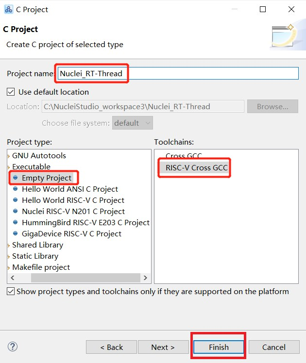
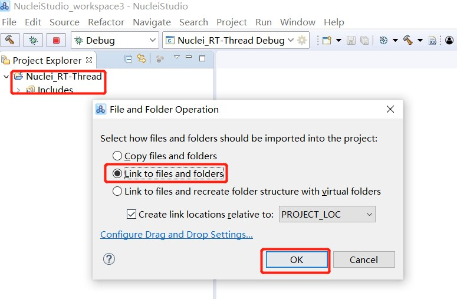
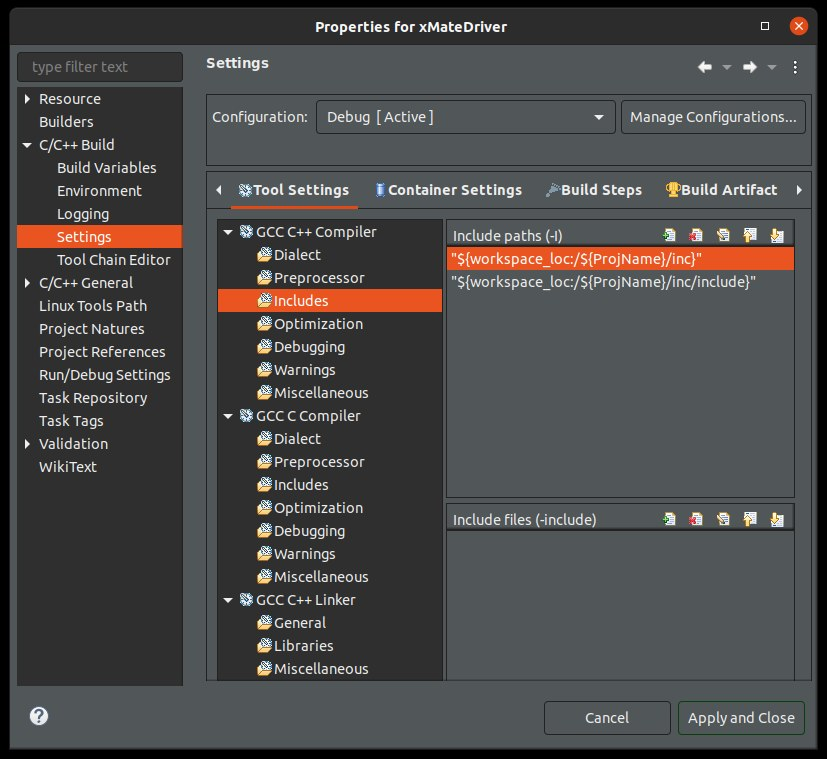
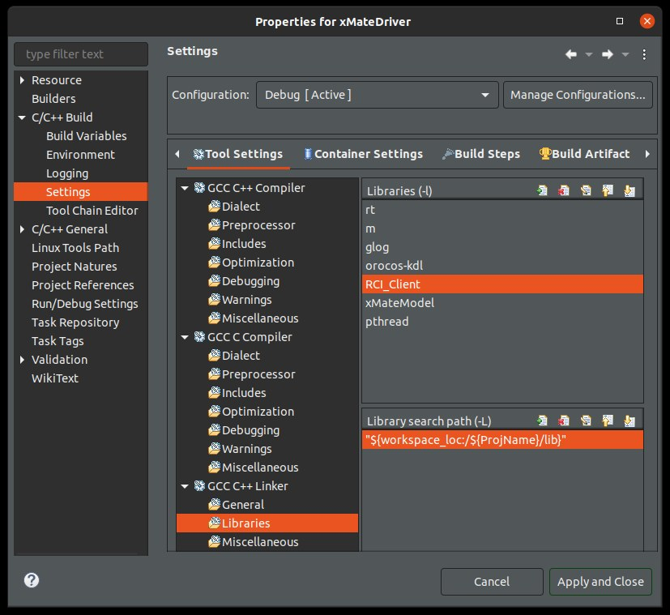

eclipse_intro
---

[Eclipse IDE for Embedded C/C++ Developers](https://www.eclipse.org/downloads/packages/release/2024-06/r/eclipse-ide-embedded-cc-developers)
> dependency libraries
> + [jdk-8u101-windows-x64](https://www.oracle.com/tw/java/technologies/javase/javase8-archive-downloads.html)
> + [The xPack Windows Build Tools](https://xpack.github.io/dev-tools/windows-build-tools/releases/)

# Eclipse Configurateion

+ Build tool (Globle)
    > `Windows -> Preferences-> tab MCU -> Global Build Tools Path`, 設定全域編譯工具的路徑

    

+ Toolchain
    > `Windows -> Preferences-> tab MCU-> Global RISC-V Toolchains Path`, 設定全域 toolchain 的路徑

    

+ OpenOCD
    > `Windows -> Preferences-> tab MCU-> Global OpenOCD Path`, 設定全域 openocd 路徑

    

# Import project

## Existing projects

> `File->Import`

## Create a new project

> `File -> New -> C/C++ Project`

+ In the C Project window:

    

+ Include Existing Directories(Files):
    > + Select the project (依附在哪個 project)
    > + `File -> New -> Folder`

    

+ Include Existing Files:
    > + `File -> Import`
    > + Select the directory (加到哪個目錄下)
    > + Select `File System`

    

    > + 勾選 Files
    >> + `From directory` 選擇實體的檔案路徑
    >> + `Into folder` 可以選擇加到哪個目錄下

    

## Create a project with existing files

+ Create a empty project file
    > `File -> New -> C/C++ Project`

    

+ 將 source code 目錄, 用**滑鼠左鍵拖到新建立的 project 中**, 需選擇 `Link to files and folders`

    

+ Configure compile properties

    - Include header path
        > `Project -> Properties -> C/C++ Build -> Setting -> Tool Setting -> GCC C Complier -> Includes -> Include paths (-I)`

        1. 用 `+` 新增路徑

        

    - link libraries and library paths
        > + `Project -> Properties -> C/C++ Build -> Setting -> Tool Setting -> GCC C++ Linker -> Libraries -> Libraries (-l)`
        > + `Project -> Properties -> C/C++ Build -> Setting -> Tool Setting -> GCC C++ Linker -> Libraries -> Libraries search path(-L)`

        1. 用 `+` 新增
            > 使用 static lib 時, compiler 會自動補 prefix `lib` and suffix `.a`, 新增 lib 時, 需去除 lib name 的 prefix and suffix
            >> e.g. `lib`gcc`.a`

        

# Tips

+ 目錄結構 project windows-build-tools/releases/
    > Eclipse 中一個工程, package 層次默認為 Flat,
    >> 也就是完成名稱, 但是這種顯示會讓包結構非常複雜, 而且非常不好找,

    > 將其組態為 Hierarchical (即分樹狀層次的)
    >> 路徑在 `Windows->Navigation->Show View Menu->Package Presentation->Hierarchical` 下 (快速鍵 `Ctrl + F10`),
    調整後, 目錄會按資料夾樣式樹狀顯示

+ Font and color
    > `Windows -> Preferences-> tab General -> Appearance -> Colors and Fonts`

+ function 跳轉
  - jump to Function Definition
    > `Ctrl + 滑鼠右鍵`
  - back
    > `Alt + 方向左鍵` or `Back` icon

# Reference

+ [手把手教你搭建織女星開發板RISC-V開發環境](https://www.cnblogs.com/whik/p/10952292.html)
+ [Nuclei-Software/nuclei-studio: Discussions For Nuclei Studio](https://github.com/Nuclei-Software/nuclei-studio)
+ [Nuclei Studio IDE偵錯](https://github.com/RT-Thread/rt-thread/tree/master/bsp/nuclei/gd32vf103_rvstar#nuclei-studio-ide%E8%B0%83%E8%AF%95)
+ [Eclipse IDE for C/C++ Developers新增標頭檔和庫檔案](https://www.cnblogs.com/xi-jiajia/p/13921122.html)

