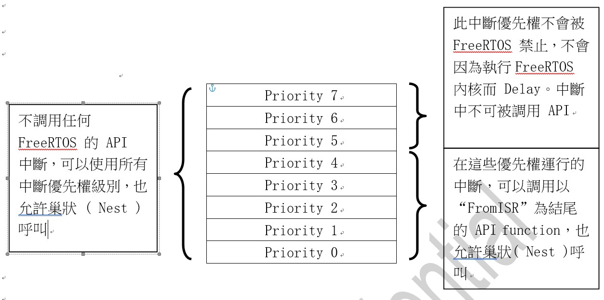

Freertos Compile Options [[Back](note_freertos_guide.md)]
---

定義在 `FreeRTOSConfig.h`

# configUSE_PREEMPTION

設置為 1 以使用搶佔式 (preempty) RTOS 調度程序, 或設置為 0 以配合的方式使用 RTOS 調度程序.

搶佔式 (preempty) 表示 OS 完全決定 task 調度方案, OS 可以剝奪耗時長的 task 的時間片 (time slot), 提供給其它 task ;
配合的方式 (協作式) 表示下一個 task 被調度的前提是當前 task 主動放棄時間片;


# configUSE_PORT_OPTIMISED_TASK_SELECTION

+ 通用方式(沒有優化), `configUSE_PORT_OPTIMISED_TASK_SELECTION = 0`
    > 所有平台的移植文件都可以配置為 0 (因為這是通用方式), 純C編寫, 比專用方式效率低. 可用的優先級數量不限制.

+ 專用方式(進行優化), `configUSE_PORT_OPTIMISED_TASK_SELECTION = 1`
    > 部分平台支持. 這些平台架構有專用的彙編指令, 比如 CLZ(Count Leading Zeros)指令, 通過這些指令可以加速算法執行速度. 比通用方式有效率.


# **configUSE_TICKLESS_IDLE**

+ 當 `configUSE_TICKLESS_IDLE = 2`, 那麼用戶可以自定義 tickless 低功耗模式的實現.


+ 當 `configUSE_TICKLESS_IDLE = 1` 且系統運行滿足以下兩個條件時, 系統內核會自動的調用低功耗宏定義函數 `portSUPPRESS_TICKS_AND_SLEEP()`
    > + 當前 Idle task (空閒 task )正在運行, 所有其它的 tasks 處在 suspend (掛起狀態)或者 blocking (阻塞狀態, delay or wait event).
    > + 根據用戶配置 `configEXPECTED_IDLE_TIME_BEFORE_SLEEP` 的大小, 只有當系統可運行於低功耗模式的 system tick 大於等於這個參數時, 系統才可以進入到低功耗模式.

    `configEXPECTED_IDLE_TIME_BEFORE_SLEEP` 默認已經在 FreeRTOS.h 文檔進行定義了, 下面是具體的定義內容, 當然, 用戶也可以在 FreeRTOSConfig.h 文檔中重新定義：

    ```c
    /* 默認定義的大小是 2 個 system tick, 且用戶自定義的話, 不可以小於 2 個 system tick */

    #ifndef configEXPECTED_IDLE_TIME_BEFORE_SLEEP
        #define configEXPECTED_IDLE_TIME_BEFORE_SLEEP 2
    #endif

    #if configEXPECTED_IDLE_TIME_BEFORE_SLEEP < 2
        #error configEXPECTED_IDLE_TIME_BEFORE_SLEEP must not be less than 2
    #endif
    ```


    - `portSUPPRESS_TICKS_AND_SLEEP` 是 FreeRTOS 實現 tickles 模式的關鍵, 此函數被 Idle task 調用, 其定義是在 portmacro.h 中
        > `vPortSuppressTicksAndSleep()` 是實際的低功耗執行代碼, 在 port.c 文件中定義,
        參數 xExpectedIdleTime 就是系統可以處於低功耗模式的 system ticks

        ```c
        /* Tickless idle/low power functionality. */

        #ifndef portSUPPRESS_TICKS_AND_SLEEP
            extern void vPortSuppressTicksAndSleep( TickType_t xExpectedIdleTime );
            #define portSUPPRESS_TICKS_AND_SLEEP( xExpectedIdleTime ) vPortSuppressTicksAndSleep( xExpectedIdleTime )
        #endif
        ```

        > FreeRTOS 實現 tickless 模式的框架對 Cortex-M3 和 M4 內核的單片機來説, FreeRTOS 已經提供了 tickless 低功耗模式的代碼.
        FreeRTOS 提供的 `vTaskStepTick()` 和 `eTaskConfirmSleepModeStatus` 用來協助低功耗的實現
        對於沒有支持的單片機, 用戶可以在 FreeRTOSConfig.h 文檔中配置 `portSUPPRESS_TICKS_AND_SLEEP`, 來映射實際執行函數.

        > 如果用戶不想使用 FreeRTOS 提供的的 tickless 也可以自定義, 方法也是在 FreeRTOSConfig.h 中配置`portSUPPRESS_TICKS_AND_SLEEP`, 來映射實際執行函數.


+ FreeRTOS 的低功耗模式配置 (跟此參數有關, 在這裡說明一下)

    關於 FreeRTOS 低功耗的配置主要涉及到以下幾個問題.

    - SysTick timer 與 system (CPU) clock  的關係
        > 對於 Cortex-M3 和 M4 內核的單片機來説, RTOS 一般都是採用 SysTick timer 做系統時鐘, FreeRTOS 也不例外.
        SysTick timer 是一個 24 bits 的遞減計數器, 有兩種 clock source 可選擇, 一個是 SystemClock, 另一個是 `SystemClock / 8`,
        默認的 port.c 移植文檔中是用的 SystemClock.

        1. SysTick timer 的 clock source 選擇 system (CPU) clock
            > 如果 SysTick timer 選擇 system clock 的話, 那麼需要配置 `configSYSTICK_CLOCK_HZ == configCPU_CLOCK_HZ`,
            >> 這種關係已經在 Source/portable/RVDS/ARM_CM4F/fsl_tickless_generic.h 文檔中進行默認配置了

            ```c
            #ifndef configSYSTICK_CLOCK_HZ
                #define configSYSTICK_CLOCK_HZ  configCPU_CLOCK_HZ

                /* Ensure the SysTick is clocked at the same frequency as the core. */
                #define portNVIC_SYSTICK_CLK_BIT (1UL << 2UL)
            #else
                /* The way the SysTick is clocked is not modified in case it is not the same as the core. */
                #define portNVIC_SYSTICK_CLK_BIT (0)
            #endif
            ```

            > 其中系統主頻 **configCPU_CLOCK_HZ** 是在 `FreeRTOSConfig.h` 中進行定義的.
            有些 DEMO code 也會直接將 **configSYSTICK_CLOCK_HZ** 在 `FreeRTOSConfig.h` 中進行定義.
            這種情況的話, 需要用戶在 FreeRTOSConfig.h 文檔中專門配置 configSYSTICK_CLOCK_HZ 為實際的頻率.


        1. 不使用 SysTick timer (e.g. ARM926)
            > 使用 peripheral timer (PCLK), **configSYSTICK_CLOCK_HZ** (at FreeRTOSConfig.h) 需要設定和 peripheral timer 同頻


## 如何使用單片機其它低功耗模式

前面我們説了, 對 Cortex-M3 和 M4 內核來説, FreeRTOS 自帶的低功耗模式是通過指令 `WFI` 讓系統進入睡眠模式,
如果想讓系統進入 Stop 模式, 又該怎麼修改呢?

FreeRTOS 為我們提供了兩個函數：

`configPRE_SLEEP_PROCESSING( xExpectedIdleTime )` 和 `configPOST_SLEEP_PROCESSING( xExpectedIdleTime )`

這兩個函數的預設是在 FreeRTOS.h 定義的, 什麼都沒有執行

```c
#ifndef configPRE_SLEEP_PROCESSING
    #define configPRE_SLEEP_PROCESSING( x )
#endif

#ifndef configPOST_SLEEP_PROCESSING
    #define configPOST_SLEEP_PROCESSING( x )
#endif
```

如果需要實際執行代碼需要用戶在 `FreeRTOSConfig.h`中重新進行宏定義, 將其對應到一個實際的函數中.


+ **configPRE_SLEEP_PROCESSING( xExpectedIdleTime )**

    執行低功耗模式前, 用戶可以在這個函數裡面關閉外設時鐘來進一步降低系統功耗.

    設置其它低功耗方式也是在這個函數裡面, 用戶只需設置參數 `xExpectedIdleTime = 0` 即可屏蔽掉默認的 WFI ( Wait for interrupt ) 指令執行方式,
    因為退出這個函數後會此參數是否大於 0,

    因此, 如果用戶想實現其它低功耗模式還是比較方便的, 配置好其它低功耗模式後, 設置參數 `xExpectedIdleTime = 0` 即可,
    但不可將此參數隨意設置為 0 以外的其它數值.

+ **configPOST_SLEEP_PROCESSING ( xExpectedIdleTime )**

退出低功耗模式後, 此函數會先調用.

之前在 configPRE_SLEEP_PROCESSING 裡面關閉的外設時鍾, 可以在此函數裡面重新打開, 讓系統恢復到正常運行狀態.


# configUSE_IDLE_HOOK

掛載 user 的 hook function (鉤子函數) 到 Idle task


# configUSE_MALLOC_FAILED_HOOK

定義了`configUSE_MALLOC_FAILED_HOOK = 1`後,  當申請失敗的時候會調用 hook function, 也可以自己添加其他處理代碼.

```c
// at heap_1.c, heap_2.c, heap_3.c, heap_4.c and heap_5.c
void *pvPortMalloc( size_t xWantedSize )
{
...
    #if( configUSE_MALLOC_FAILED_HOOK == 1 )
    {
        if( pvReturn == NULL )
        {
            extern void vApplicationMallocFailedHook( void );
            vApplicationMallocFailedHook();
        }
    }
    #endif
...
    return pvReturn;
}
```


每當一個 task , 隊列, 信號量被創建時, 內核若使用 pvPortMalloc 分配內存的話, FreeRTOS 提供了5個簡單內存分配策略 (只能使用其中1種)

+ Heap_1
    > 比較簡單, 按順序分配, 所以只需要判斷剩下的內存夠大, 直接切出來, 更新已分配大小的值, 返回地址就可以了

+ Heap_2
    > 內存分配使用最佳匹配算法(best fit algorithm),
    比如我們申請 35K 的內存, 而可申請內存中有四塊對應大小 25K, 50K, 75K 和 100K,
    按照最小匹配, 這時候會把 50K 進行分割並返回申請內存的地址, 剩餘部分插回 link Table留待下次申請.

    > Heap_2 支持內存回收, 但是不會把合併內存, 對於每次申請內存大小都比較固定的, 這個方式是沒有問題的.

+ Heap_3
    > 實現是直接對標準庫的 malloc() 進行封裝, 保證流程安全.
    這種模式下, 堆疊大小不再由 FreeRTOSConfig.h 中定義的常量 `configTOTAL_HEAP_SIZE` 決定, 而是由 link script 或者 startup.S 決定.

+ Heap_4
    > 與 Heap_2 相似, 相比 Heap_2, Heap_4 能夠把內存碎片合併成大塊內存.
    為了實現這個合併算法, 空閒內存的 link table 是按內存地址大小進行存儲的 (Heap_2　是按照內存塊大小進行存儲).
    相比 Heap_2 差別不大, 主要是在分配過程多了一個位標記防止出錯.

+ Heap_5
    > 是允許使用多個不連續的區域組成 heap pool (堆疊), 與前面方式 heap1, heap2 和 heap4 方式都是靜態申請一個 array 作為 heap pool (堆疊)不同,
    pvPortMalloc 函數前, 必須通過函數 vPortDefineHeapRegions() 取得多個不連續的區域並進行設置, 但不支援`不連續區域的使用優先權`.
    之後其他操作, 和 Heap_4 基本一致.


# configUSE_DAEMON_TASK_STARTUP_HOOK

如果 **configUSE_TIMERS** 和 **configUSE_DAEMON_TASK_STARTUP_HOOK** 都設置為 1,
那麼應用程序必須定義一個鉤子函數 `void void vApplicationDaemonTaskStartupHook( void )`

當 RTOS TimerTask 第一次執行時, vApplicationDaemonTaskStartupHook() 將被調用一次.  

需要 RTOS 運行的任何應用程序初始化代碼都可以放在hook函數中.


# configUSE_TICK_HOOK

在每次 OS tick (時間片) 發生時, 調用 `void vApplicationTickHook( void )`, 需注意的是此調用是在 ISR 中執行
   

# configCPU_CLOCK_HZ

寫入實際的 CPU 內核 clock, 也就是 CPU 指令執行頻率. 配置此值是為了正確的配置 system tick 中斷週期.

```c
#define configCPU_CLOCK_HZ  ( SystemCoreClock )
```


# configTICK_RATE_HZ

RTOS 系統自己的 Heartbeat 中斷的頻率, 即一秒中斷的次數, 每次中斷 RTOS 都會進行 task 調度.
系統 Heartbeat 中斷用來測量時間, 因此, 越高的頻率意味著可測到越高的分辨率時間.

但系統 Heartbeat 高頻率中斷也意味著 RTOS 內核佔用更多的 CPU 時間, 因而降低效率.
RTOS demo 都是使用系統 Heartbeat 中斷頻率為 1000 HZ, 這是為了測試 RTOS 內核, 比實際使用的要高 (實際使用時不用這麼高的系統節拍中斷頻率).

多個 tasks 可以共享一個優先級, RTOS 調度器為相同優先級的 task 分享 CPU 時間, 在每一個 RTOS 系統 Heartbeat 中斷到來時, 進行 task 切換. 高頻率的系統 Heartbeat 中斷會降低分配給每一個 task 的 tick slot (時間片) 持續時間.


# configMAX_PRIORITIES

配置應用程序有效的 priority levels. 任何數量的 task 都可以共享一個優先級, 使用協程可以單獨的給與它們優先權. 見configMAX_CO_ROUTINE_PRIORITIES.
在 RTOS 內核中, 每個有效優先級都會消耗一定量的 RAM, 因此這個值不要超過你的應用實際需要的優先級數目.   

每一個 task 都會被分配一個優先級, 優先級值從 `0 ~ (configMAX_PRIORITIES - 1)`之間. 像 Idle task 的優先級為 0 (tskIDLE_PRIORITY), 是最低優先級 task.

FreeRTOS 調度器將確保處於 Ready (就緒) 狀態或 Running (運行)狀態的高優先級 task 比同樣處於 Ready (就緒)狀態的低優先級 task 優先獲取處理器時間.
換句話說, 處於 Running　(運行)狀態的 task 永遠是高優先級 task . 處於 Ready (就緒)狀態的相同優先級 task 使用 tick slot 調度機制共享處理器時間.   


# configMINIMAL_STACK_SIZE

task stack (堆棧)的大小, FreeRTOS 根據這個參數來給 idle task 分配 stack (堆棧)空間.
這個值如果設置的比實際需要的空間小, 會導致程序 overflow. 因此, 最好不要減小 Demo 程序中給出的大小.


# configMAX_TASK_NAME_LEN

task 名稱最大的長度, 這個長度是以 char (字節)為單位的, 並且包括最後的 NULL 結束字節.


# configUSE_TRACE_FACILITY

如果程序中需要用到 TRACE 功能, 則需將這個宏設為 1, 否則設為 0.
開啟 TRACE 功能後, 會激活一些附加的結構體成員和函數, RAM 佔用量會增大許多.


# configUSE_STATS_FORMATTING_FUNCTIONS

設置 configUSE_TRACE_FACILITY 和 configUSE_STATS_FORMATTING_FUNCTIONS 為 1,
將加入編譯 `vTaskList()`和`vTaskGetRunTimeStats()`.


# configUSE_16_BIT_TICKS

設置 system tick 變量的數據類型, 系統節拍計數器變量類型為 16 bits or 32 bits (設 1 為16 bits)

# configIDLE_SHOULD_YIELD

設定 task 處在 IDLE task 時, 讓給其他同等優先級的 task.

+ `0`： 空閒 task 不為其他同優先級的 task 讓出CPU使用權.
+ `1`： 空閒 task 會為其他同優先級的 task 讓出CPU使用權, 花費在空閒 task 上的時間會變少, 也有了副作用如圖.


優先權 **B > C > A = I**, A 和 I 的優先權相同且同時使用了一個時間片段 (T2 ~ T3, T5 ~ T6), 造成了 A 的時間變短了, 讓給 I 使用.


# configUSE_TASK_NOTIFICATIONS

設置為 1, 啟動 task 通知功能, 相關 API 會被編譯.
開啟此功能, 每個 task 會多增加 8-bytes 的 RAM 使用空間.


# configUSE_MUTEXES

設置為 1, 使用 Mutex 信號量, 為 0 使用 BinarySemaphore


BinarySemaphore 和 Mutex 非常相似, 但也有細微的區別
Mutex 具有優先級繼承機制, BinarySemaphore 沒有這個機制這使得二進制信號量更適合用於同步 (task 之間或者 task 和中斷之間), Mutex 更適合互鎖.
Mutex 和 BinarySemaphore 都是 SemaphoreHandle_t 類型.

+ BinarySemaphore
    > 一旦獲得二進制信號量後不需要恢復, 一個 task 或中斷不斷的產生信號, 而另一個 task 不斷的取走這個信號, 通過這樣的方式來實現同步.

+ Mutex
    > 互斥量是一個包含優先級繼承機制的二進制信號量.
    >> **優先級繼承**大致原理是, 讓低優先級線程在獲得同步資源的時候(如果有高優先級的線程也需要使用該同步資源時),
    臨時提升其優先級. 使其能更快的執行並釋放同步資源, 釋放同步資源後再恢復其原來的優先級.

若用於實現同步(task 之間或者 task 與中斷之間)的, 優先考慮使用 BinarySemaphore, Mutex 通常用於簡單的互鎖.
中斷不能因為等待 Mutex 而阻塞. 低優先級 task 擁有 Mutex 的時候, 如果另一個高優先級 task 也企圖獲取這個 Mutex,
則低優先級 task 的優先級會被臨時提高, 提高到和高優先級 task 相同的優先級.
這意味著 Mutex 必須要釋放, 否則高優先級 task 將不能獲取這個 Mutex,
並且那個擁有 Mutex 的低優先級 task 也永遠不會被剝奪, 這就是 OS 中的優先級反轉.


# configUSE_RECURSIVE_MUTEXES

設置為1, 啟用遞迴互斥信號量


# configUSE_COUNTING_SEMAPHORES

是否用計數式的 semaphores, semaphores 也是 task 間通訊的一種方式

semaphore 用來讓一個 task 喚醒(wake)另一個 task 做事

+ 1：使用計數訊號量
+ 0： 不使用


# configUSE_ALTERNATIVE_API

Alternative Queue functions (**替代**隊列函數)已經被棄用, 在新的設計中不要使用它. 替代 API 在 queue.h 中有詳細描述.

+ 1 表示使用**替代**隊列函數 ('alternative' queue functions)
+ 0 不使用.

# configCHECK_FOR_STACK_OVERFLOW

每個 task 維護自己的 stack (棧空間),  task 創建時會自動分配 task 需要的佔內存, 分配內存大小由 xTaskCreate() 的一個參數指定.
stack overflow 是設備運行不穩定的最常見原因, 因此 FreeeRTOS 提供了兩個可選機制用來輔助檢測和改正堆棧溢出.
配置宏 configCHECK_FOR_STACK_OVERFLOW 為不同的常量來使用不同堆棧溢出檢測機制.

注意, 這個選項僅適用於**內存映射未分段**的微處理器架構. 並且在 RTOS 檢測到堆棧溢出發生之前, 一些處理器可能先產生故障(fault)或異常(exception)來反映堆棧使用的惡化.
如果 configCHECK_FOR_STACK_OVERFLOW 沒有設置成 0, 用戶必須提供一個 stack overflow hook function,
這個鉤子函數的函數名和參數必須如下所示:

```c
void vApplicationStackOverflowHook(TaskHandle_t xTask,
                                   signed char *pcTaskName);
```


參數**xTask**和**pcTaskName**為發生 stack 溢出的 task 的 handle (句柄)名字.
> 請注意, 如果溢出非常嚴重, 這兩個參數信息也可能是錯誤的! 在這種情況下, 可以直接檢查 pxCurrentTCB 變量.

推薦僅在開發或測試階段使用 stack overflow 檢查, 因為堆棧溢出檢測會增大上下文切換開銷.

+ `configCHECK_FOR_STACK_OVERFLOW = 1`
    > task 切換出去後, 該 task 的 context 被保存到自己的 stack, 這時很可能堆棧的使用量達到了最大(最深)值.
    在這個時候, RTOS 內核會檢測 stack pointer 是否還指向有效的堆棧空間.
    如果 stack pointer 指向了有效 stack 以外的地方, stack overflow hook function 會被調用.
    這個方法速度很快, 但是不能檢測到所有堆棧溢出情況(e.g. stack overflow 發生在上下文切換以外的情況, 也就是 call function時).

+ `configCHECK_FOR_STACK_OVERFLOW = 2`
    > 當堆棧首次創建時, 在它的堆棧區中填充一些已知值(標記).
    當 task 切換時, RTOS 內核會檢測堆棧最後的 16-bytes, 確保標記數據沒有被覆蓋.
    如果這 16-bytes 有任何一個被改變, 則調用堆棧溢出鉤子函數. 這個方法比第一種方法要慢, 但也相當快了.
    它能有效捕捉堆棧溢出事件(即使堆棧溢出沒有發生在上下文切換時), 但是理論上它也不能百分百的捕捉到所有堆棧溢出(比如堆棧溢出的值和標記值相同, 當然, 這種情況發生的概率極小).


# configQUEUE_REGISTRY_SIZE

此參數是記錄 Queue (佇列)和訊號量的最大數目, 隊列記錄有兩個目的, 都涉及到 RTOS 內核的調試

+ 它允許在調試 GUI 中使用一個隊列的文本名稱來簡單識別隊列
+ 包含調試器需要的每一個記錄隊列和信號量定位信息

除了進行內核調試外, 隊列記錄沒有其它任何目的, configQUEUE_REGISTRY_SIZE 定義可以記錄的隊列和信號量的最大數目.
如果你想使用 RTOS 內核調試器查看隊列和信號量信息, 則必須先將這些隊列和信號量進行註冊, 只有註冊後的隊列和信號量才可以使用 RTOS 內核調試器查看.
> 查看 API 參考手冊中的 `vQueueAddToRegistry()` 和`vQueueUnregisterQueue()`函數獲取更多信息.


# configUSE_QUEUE_SETS

使用 queue set 功能 (可以整合多個隊列和信號量到一個 queue set), 需配合 **configQUEUE_REGISTRY_SIZE** 使用.


# configUSE_TIME_SLICING

默認情況下(configUSE_TIME_SLICING 未定義或者 configUSE_TIME_SLICING = 1), FreeRTOS 使用基於 time slice 的優先級 preempty (搶佔式)調度器.
這意味著 RTOS 調度器總是運行處於最高優先級的 ready task , 在每個 RTOS 系統 Heartbeat 中斷時, 在相同優先級的多個 task 間進行 task 切換.
如果 `configUSE_TIME_SLICING = 0`, RTOS 調度器仍然總是運行處於最高優先級的就緒 task , 但是當 RTOS 系統 Heartbeat 中斷發生時, 相同優先級的多個 task 之間不再進行 task 切換.


# configENABLE_BACKWARD_COMPATIBILITY

FreeRTOS.h 包含一系列 Macro definitions, 用來映射版本 V8.0.0 和 V8.0.0 之前版本的數據類型名字.
這些 Macro 可以確保 RTOS 內核升級到 V8.0.0 或以上版本時, 之前的應用代碼不用做任何修改.

在FreeRTOSConfig.h 文件中設置 `configENABLE_BACKWARD_COMPATIBILITY = 0` 會去掉這些宏定義, 並且需要用戶確認升級之前的應用沒有用到這些名字.


# configNUM_THREAD_LOCAL_STORAGE_POINTERS

設置每個 task 的本地存儲 Index array 大小, 可用來紀錄 `user private data of a task` 或是 `global variables of a task`.

FreeRTOS 提供了一個靈活的機制, 使得應用程序可以使用 task 本地存儲 Index pointer 來讀寫線程本地存儲.
task 本地存儲允許應用程序在 task 的 TCB 中存儲一些值, 每個 task 都有自己獨立的儲存空間,
configNUM_THREAD_LOCAL_STORAGE_POINTERS 指定每個 task 線程本地存儲 Index pointer array 的大小.

+ `vTaskSetThreadLocalStoragePointer()`用於向 Index pointer array 中寫入值,
+ `pvTaskGetThreadLocalStoragePointer()`用於從Index pointer array 中讀取值.

> 比如許多庫函數都包含一個叫做 errno 的全局變量. 某些庫函數使用 errno 返回庫函數錯誤信息, 應用程序檢查這個全局變量來確定發生了那些錯誤.
在單線程程序中, 將 errno 定義成全局變量是可以的;
但是在多線程應用中, 每個線程(task)必須具有自己獨有的 errno 值, 否則一個 task 可能會讀取到另一個 task 的 errno 值.


# configSUPPORT_STATIC_ALLOCATION

使用靜態方式創建 task 時需要使`configSUPPORT_STATIC_ALLOCATION = 1`, 即使用靜態內存.

同時還需要實現`vApplicationGetIdleTaskMemory()`和 `ApplicationGetTimerTaskMemory()`.

通過這兩個函數來給 Idle task 和 S/w timer 的 task stack pool 和 task TCB.
> 在 APP 中進行定義, 然後將這些內存傳遞給函數參數.


# configSUPPORT_DYNAMIC_ALLOCATION

`configSUPPORT_DYNAMIC_ALLOCATION = 1`時, FreeRTOS 支持 5 種動態內存管理方案, 分別為 heap_1, heap_2, heap_3, heap_4 和 heap_5 實現


# configTOTAL_HEAP_SIZE

heap1 ~ heap4 所使用的 heap pool 大小


# configAPPLICATION_ALLOCATED_HEAP

`configAPPLICATION_ALLOCATED_HEAP = 1`時, 可以從 APP 設置 Heap pool, 堆內存的詳細代碼在 heap_1.c 到 heap_5.c 中.


# configGENERATE_RUN_TIME_STATS

`configGENERATE_RUN_TIME_STATS = 1`時, 開啟 Tasks 時間統計功能(相應的 API 函數會被編譯),
**可在固定時間內**, 統計每個 task 所佔用的時間 (CPU usage), 同時有兩個 marco 必須被定義

+ `portCONFIGURE_TIMER_FOR_RUN_TIME_STATS()`
    > APP 需要提供一個基準 timer, portCONFIGURE_TIMER_FOR_RUN_TIME_STATS() 完成初始化基準 timer 功能.
    因為運行時間統計需要一個比 SysTick 中斷頻率還要高分辨率的基準 timer, 否則, 統計可能不精確.
    基準 timer 中斷頻率要比 SysTick 中斷快 10 ~ 100 倍. 基準定時器中斷頻率越快, 統計越精準,
    但能統計的運行時間也越短, e.g. 基準 timer 每 10ms 中斷一次, 8-bits 無符號整形變量可以計到 2.55 秒,
    但如果是 1 秒中斷一次, 8-bits 無符號整形變量可以統計到 255 秒.


+ `portGET_RUN_TIME_COUNTER_VALUE()`
    > APP 需要提供一個可回傳目前基準 timer 時間的函數

舉個例子, 假如我們配置了一個 timer, 每 500us 中斷一次; 在 timer ISR 中簡單的累加 ulHighFrequencyTimerTicks.
那麼上面提到兩個 Marco 定義如下(可在 FreeRTOSConfig.h 中添加)

```c
extern volatile unsigned long       ulHighFrequencyTimerTicks;
#define portCONFIGURE_TIMER_FOR_RUN_TIME_STATS()    ( ulHighFrequencyTimerTicks = 0UL )
#define portGET_RUN_TIME_COUNTER_VALUE()            ulHighFrequencyTimerTick
```

# Co-routines

+ configUSE_CO_ROUTINES
    > 協程(Co-routines)主要用於資源發非常受限的嵌入式系統(RAM非常少), 通常不會用於32位微處理器.
    在當前嵌入式硬件環境下, 不建議使用協程, **FreeRTOS 的開發者早已經停止開發協程**.
    >> 必須在工程中包含 croutine.c 文件.


+ configMAX_CO_ROUTINE_PRIORITIES
    > 應用程序協程(Co-routines)的有效優先級數目, 任何數目的協程都可以共享一個優先級.
    使用協程可以單獨的分配給 task 優先級.


# S/w Timer

+ configUSE_TIMERS
    > 使用 S/w tiemr


+ configTIMER_TASK_PRIORITY
    > 設置 S/w timer task 的優先級


+ configTIMER_QUEUE_LENGTH
    > 設置 S/w timer CmdQ 的長度


+ configTIMER_TASK_STACK_DEPTH
    > 設置軟S/w timer task 的 stack 深度


# **configKERNEL_INTERRUPT_PRIORITY** and **configMAX_SYSCALL_INTERRUPT_PRIORITY**

這是移植和應用FreeRTOS出錯最多的地方, 需注意.

> Cortex-M3/PIC24/dsPIC/PIC32/SuperH/RX600 硬件設備需要設置 configKERNEL_INTERRUPT_PRIORITY

> PIC32/RX600/Cortex-M硬件設備需要設置 configMAX_SYSCALL_INTERRUPT_PRIORITY.

**configMAX_API_CALL_INTERRUPT_PRIORITY** 是 configMAX_SYSCALL_INTERRUPT_PRIORITY 的新名字, 用於更新的移植層代碼

注意下面的描述中, 在 ISR 中僅可以調用以**FromISR**結尾的 FreeRTOS API 函數. 僅需要設置 configKERNEL_INTERRUPT_PRIORITY 的硬件設備


configKERNEL_INTERRUPT_PRIORITY 用來設置 RTOS 內核自己的中斷優先級.
調用 API 函數的中斷必須運行在這個優先級； 不調用 API 函數的中斷, 可以運行在更高的優先級, 所以這些中斷不會被因 RTOS 內核活動而延時.

configKERNEL_INTERRUPT_PRIORITY 和 configMAX_SYSCALL_INTERRUPT_PRIORITY 都需要設置的硬件設備

+ `configKERNEL_INTERRUPT_PRIORITY` (影響所有有使用到 RTOS API 的 ISR)
    > 用來設置 RTOS 內核自己的中斷優先級. 因為 **RTOS 內核中斷不允許搶佔 H/w 的中斷**, 因此這個宏一般定義為 H/w 最低優先級.

+ `configMAX_SYSCALL_INTERRUPT_PRIORITY` (未使用 RTOS API, 僅僅做 CSR 操作)
    > 用來設置可以在 ISR 中安全調用 FreeRTOS API 函數的最高中斷優先級.
    >> + `Interrupt_priority <= configMAX_SYSCALL_INTERRUPT_PRIORITY` 時, 程序可以在 ISR 中安全的調用 FreeRTOS API 函數
    >> + `Interrup_priority > configMAX_SYSCALL_INTERRUPT_PRIORITY`時, 表示 FreeRTOS 無法禁止這個中斷, 在這個 ISR 中**絕不可以調用任何 RTOS API 函數**.


通過設置 `configMAX_SYSCALL_INTERRUPT_PRIORITY`的優先級級別高於 `configKERNEL_INTERRUPT_PRIORITY`,
可以實現完整的中斷 nesting 模式, 這意味著 FreeRTOS 內核不能完全禁止中斷, 即使在 critical section (臨界區).
此外, 這對於分段內核架構的微處理器是有利的.
> 請注意, 當一個新中斷發生後, 某些微處理器架構會(在硬件上)禁止中斷,
這表示從 H/w 響應中斷到 FreeRTOS 重新開啟中斷的這段短時間內, 中斷是無作用的.


不調用 RTOS API 的中斷可以運行在比`configMAX_SYSCALL_INTERRUPT_PRIORITY`高的優先級,
這些級別的中斷不會被 FreeRTOS 禁止, 因此不會因為執行 RTOS 內核而被延時.

+ Example
    > 假如一個微控制器有 8 個中斷優先權級別; 0 表示最低優先級, 7 表示最高優先級
    >> Cortex-M3 和 Cortex-M4 內核優先數和優先級別正好與之相反.

    將優先權設定如下 =>

    ```
    configMAX_SYSCALL_INTERRUPT_PRIORITY = 4
    configKERNEL_INTERRUPT_PRIORITY = 0
    ```
    


FreeRTOS 提供的 API 中, 有一類是`FromISP`結尾的, 像是

```
xSemaphoreGiveFromISR()
xSemaphoreTakeFromISR()
xQueueSendFromISR()
xQueueReceiveFromISR()
...
```

事實上, 所有`From_ISR`結尾的 API 和一般 API 的差別是多了一個參數, 叫做

```c
signed BaseType_t   *pxHigherPriorityTaskWoken
```

這個參數的用意是, 通常當你使用 xxxFromISR() 這類的API時, 是為了做 communication, 告訴系統某個資源已經釋放, 某個 task 要執行了.
作法是讓這個參數紀錄, 是否有優先權更高的 Task 被喚醒了, 因此在 ISR 的結尾, 要記得呼叫 yield function

```c
xxx_ISR()
{
    BaseType_t  xHigherPriorityTaskWoken = pdFALSE;

    xSemaphoreGiveFromISR( xSemaphore, &xHigherPriorityTaskWoken );

    ...
    portYIELD_FROM_ISR( xHigherPriorityTaskWoken );
}
```

意思是, 如果 **xHigherPriorityTaskWoken** 被改成 True, 那就發生 Context-Switch, 就能去執行優先權更高的那個 task.


# configASSERT

Assert 可作為程式檢查的一種機制, 若是檢查失敗, 一般會停止執行或是卡住在迴圈中.
在執行期間若是 Assert 不成立, 就可專注於在此程式段間邏輯不一致的部份, 並設法修正

```c
/* Define configASSERT() to disable interrupts and sit in a loop. */
#define configASSERT( ( x ) )     \
    if( ( x ) == 0 ) { taskDISABLE_INTERRUPTS(); for( ;; ); }
```


# reference
+ [NXP i.MXRT 系列之淺談 嵌入的 OS 使用方式(中)](https://www.wpgdadatong.com/tw/blog/detail?BID=B1340)

