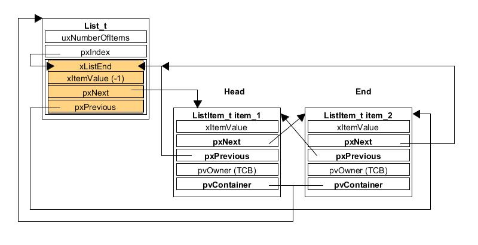

FreeRTOS Guide
---

# 命名規則

## 變數

+ `c` char
+ `s` short
+ `l` long
+ `u` unsign
+ `p` pointer
+ `x` portBASE_TYPE 型別變數, 結構體, 使用者定義的變數名, ...等

## function

函數名包含了函數`返回值的類型`, 函數所在的`文件名`和`函數的功能`, 如果是私有的函數 (static) 則會加一個 prv (private) 的前綴

+ example
    - `vTaskPrioritySet()`
        > + 函數的返回值為 void 型
        > + 在 task.c 這個文件中定義

    - `xQueueReceive()`
        > + 函數的返回值為 portBASE_TYPE 型
        > + 在 queue.c 這個文件中定義

    - `vSemaphoreCreateBinary()`
        > + 函數的返回值為 void 型
        > + 在 semphr.h 這個文件中定義

    + `pxPortInitialiseStack()`
        > + 函數的返回值為 structure pointer
        > + 在 port.c 這個文件中定義

# [Compile Options](note_freertos_compile_options.md)


# List/ListItem

list 被 FreeRTOS 調度器使用, 用於紀錄 task; 處於 ready (就緒), suspend (掛起), delay (延時)的 task, 都會被接到各自的 list 中



+ list item

    ```c
    struct xLIST_ITEM
    {
        listFIRST_LIST_ITEM_INTEGRITY_CHECK_VALUE              /* 用於檢測 list item 數據是否完整 */
        configLIST_VOLATILE TickType_t xItemValue;             /* list item 的值; 通常是一個 task 優先級或是一個調度 event 的計數器值 */
        struct xLIST_ITEM * configLIST_VOLATILE pxNext;        /* 指向 list 中下一個 list item  */
        struct xLIST_ITEM * configLIST_VOLATILE pxPrevious;    /* 指向 list 中上一個 list item  */
        void * pvOwner;                                        /* 指向一個任務TCB */
        void * configLIST_VOLATILE pvContainer;                /* 指向包含該 list item 的 list */
        listSECOND_LIST_ITEM_INTEGRITY_CHECK_VALUE             /* 用於檢測 list item 數據是否完整 */
    };
    typedef struct xLIST_ITEM ListItem_t;

    /* 精簡的 list item */
    struct xMINI_LIST_ITEM
    {
        listFIRST_LIST_ITEM_INTEGRITY_CHECK_VALUE           /* 用於檢測 list item 數據是否完整 */
        configLIST_VOLATILE TickType_t xItemValue;
        struct xLIST_ITEM * configLIST_VOLATILE pxNext;
        struct xLIST_ITEM * configLIST_VOLATILE pxPrevious;
    };
    typedef struct xMINI_LIST_ITEM MiniListItem_t;
    ```

    - `xItemValue`
        > + 在 `tskTCB->xEventListItem` 中, 紀錄 `priority` 有關信息
        > + 在 `tskTCB->xStateListItem` 中, 紀錄 `阻塞 (blocking) 時間` 有關信息

    - `pvOwner`
        > 通常指向一個 task TCB

    - `pvContainer`
        > 紀錄目前的 list item 是接在哪一個 list 上
        >> task 會依 status, 接到不同的 lists, e.g. pxReadyTasksLists, pxDelayedTaskList, pxOverflowDelayedTaskList, xPendingReadyList, ...等

    - `listFIRST_LIST_ITEM_INTEGRITY_CHECK_VALUE` and `listSECOND_LIST_ITEM_INTEGRITY_CHECK_VALUE`
        > check pattern (0xa5a5a5a5) 用來判定是否被汙染

+ list
    > 是多個 list item 的容器 (Container)

    ```c
    typedef struct xLIST
    {
        listFIRST_LIST_INTEGRITY_CHECK_VALUE                        /*用於檢測 list item 數據是否完整*/
        configLIST_VOLATILE UBaseType_t uxNumberOfItems;            /* 此 list 中掛接的 list item 的數量 */
        ListItem_t * configLIST_VOLATILE pxIndex;                   /* 目前的 list item pointer */
        MiniListItem_t xListEnd;                                    /* End mark (root) of list items */
        listSECOND_LIST_INTEGRITY_CHECK_VALUE                       /*用於檢測 list item 數據是否完整*/
    } List_t;
    ```

## list API

+ vListInsert(List_t, ListItem_t)
    > 將 **ListItem_t** 依`xItemValue 排序(小到大)` 插入到 **List_t**

+ vListInsertEnd(List_t, ListItem_t)
    > 將 **ListItem_t** 插入到 **List_t** 的最後一個

+ uxListRemove(ListItem_t)
    > 將 **ListItem_t** 從所屬的 `List_t` 中移除
    >> 從 `ListItem_t->pvContainer` 可以得知所屬的 **List_t**

+ `listGET_OWNER_OF_NEXT_ENTRY(pxTCB, pxList)`
    > 取得 **List_t** 中, 下一個 **ListItem_t** 的 pvOwner (即 TCB)
    >> 用 `pxIndex` 紀錄目前的 **ListItem_t**, 多次呼叫可遍歷 (walk through) 整個 pxList.
    會跳過 xListEnd (root item)

    ```c
    #define listGET_OWNER_OF_NEXT_ENTRY( pxTCB, pxList )                                           \
        {                                                                                          \
            List_t * const pxConstList = ( pxList );                                               \
            /* pxIndex 指向 List_t 第一個 itme, 調整 pxIndex 指向下一個節點.                            \
               如果當前 List 有 N 個 items, 當第 N 次調用該函數時, pxIndex 則指向第 N 個 itme */          \
            ( pxConstList )->pxIndex = ( pxConstList )->pxIndex->pxNext;                           \
            /* 當遍歷完 List 後, pxIndex 指回到 root item */                                          \
            if( ( void * ) ( pxConstList )->pxIndex == ( void * ) &( ( pxConstList )->xListEnd ) ) \
            {                                                                                      \
                ( pxConstList )->pxIndex = ( pxConstList )->pxIndex->pxNext;                       \
            }                                                                                      \
            /* 獲取節點的 OWNER, 即 TCB */                                                           \
            ( pxTCB ) = ( pxConstList )->pxIndex->pvOwner;                                         \
        }
    ```


+ `listSET_LIST_ITEM_OWNER` and `listGET_LIST_ITEM_OWNER`
    > 設定或取出 `ListItem_t->pvOwner` (基本上就是 TCB structure)

+ `listSET_LIST_ITEM_VALUE` and `listGET_LIST_ITEM_VALUE`
    > 設定或取出 `ListItem_t->xItemValue` (通常是 blocking time, priority, 或是 user private definition)

+ Head entry
    > 意指 `(ListItem_t->xListEnd).pxNext`, 即`第一個` item (除去 Root Item 後的下一個)

    - `listGET_HEAD_ENTRY(pxList)`
        > 取得 List_t 中 `第一個` **pxList**

    - `listGET_OWNER_OF_HEAD_ENTRY(pxList)`
        > 取得 List_t 中 `第一個` **pxList** 的 pvOwner

    - `listGET_ITEM_VALUE_OF_HEAD_ENTRY(pxList)`
        > 取得 List_t 中 `第一個` **pxList** 的 xItemValue

+ `listIS_CONTAINED_WITHIN(pxList, pxListItem)`
    > 判定 **pxListItem** 是否屬於 **pxList**

+ `listLIST_ITEM_CONTAINER(pxListItem)`
    > 取得目前 item 所屬的 **List_t**

+ `listLIST_IS_EMPTY`
    > list 是否為空

+ `listGET_NEXT(pxListItem)`
    > 下一個 **ListItem_t**

+ `listGET_END_MARKER(pxList)`
    > 取得 `xListEnd` 的 pointer (root pointer)

+ `listCURRENT_LIST_LENGTH(pxList)`
    > 取得 ListItem_t 的數量

+ `listLIST_IS_INITIALISED(pxList)`
    > **pxList** 是否已經初始化過

    ```c
    pxList->xListEnd.xItemValue == portMAX_DELAY
    ```

# [Task](note_freertos_task.md)


# [Queue](note_freertos_queue.md)


# [Event](note_freertos_event.md)

# [S/w Timer](note_freertos_sw_timer.md)

# [Idle Task](note_freertos_idle.md)


# reference

+ [FreeRTOS基礎篇-朱工的專欄](https://blog.csdn.net/zhzht19861011/category_9265276.html)
+ [FreeRTOS高級篇-朱工的專欄](https://blog.csdn.net/zhzht19861011/category_9265965.html)
+ [FreeRTOS高級篇1---FreeRTOS列表和列表項](https://freertos.blog.csdn.net/article/details/51190095)
+ [FreeRTOS Study Note](https://hackmd.io/@stanley7342/freertos_note)

