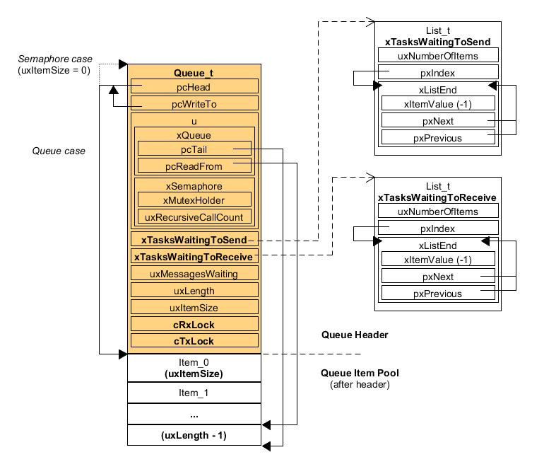
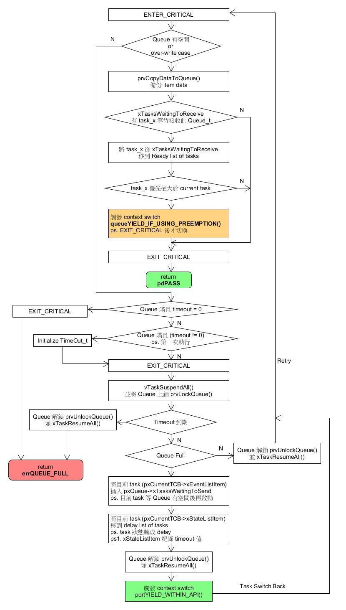

FreeRTOS Queue [[Back](note_freertos_guide.md)]
---

Queue 是 FreeRTOS 主要的 tasks 間通訊方式, 可以在 `task <-> task`, `interrupt <-> task` 間傳送信息
> 發送到 queue 的消息是通過拷貝實現的, 即 backup 在 Queue 裡

BinarySemaphores (二進制信號量), Semaphores (計數信號量), Mutex (互斥量) 和 RecursiveMutex (遞歸互斥量)都是使用 Queue 來實現的

# 變數定義

## Queue structure

```c
typedef struct QueueDefinition
{
    int8_t * pcHead;           /*< 指向隊列存儲區起始位置, 即第一個隊列項. */
    int8_t * pcWriteTo;        /*< 指向下隊列存儲區的下一個空閒位置. */

    /* 互斥,  只能擇一 */
    union {
        QueuePointers_t xQueue;     /*< 使用 queue . */
        SemaphoreData_t xSemaphore; /*< 使用 semaphore (藉由 queue 的方式來實現). */
    } u;

    List_t xTasksWaitingToSend;             /*< 等待 send/give 而阻塞的任務列表, 按照優先級順序存儲. */
    List_t xTasksWaitingToReceive;          /*< 等待 receive/take 而阻塞的任務列表, 按照優先級順序存儲. */

    volatile UBaseType_t uxMessagesWaiting; /*< 目前隊列內的 item 數目. */
    UBaseType_t uxLength;                   /*< item 的數目. */
    UBaseType_t uxItemSize;                 /*< 每個 item 的大小. */

    volatile int8_t cRxLock;                /*< 隊列上鎖後, 存儲從隊列收到的列表項數目，如果隊列沒有上鎖，設置為 queueUNLOCKED. */
    volatile int8_t cTxLock;                /*< 隊列上鎖後, 存儲發送到隊列的列表項數目，如果隊列沒有上鎖，設置為 queueUNLOCKED. */

    #if ( ( configSUPPORT_STATIC_ALLOCATION == 1 ) && ( configSUPPORT_DYNAMIC_ALLOCATION == 1 ) )
        uint8_t ucStaticallyAllocated; /*< 使用靜態 memory. */
    #endif

    #if ( configUSE_QUEUE_SETS == 1 )
        struct QueueDefinition * pxQueueSetContainer;
    #endif

    #if ( configUSE_TRACE_FACILITY == 1 )
        UBaseType_t uxQueueNumber;
        uint8_t ucQueueType;
    #endif
} xQUEUE;

typedef xQUEUE Queue_t;
```




+ prvLockQueue()/prvUnlockQueue()
    > Queue lock/unlock ?

# Queue API


+ xQueueCreate/xQueueCreateStatic
    > create a queue

    - xQueueCreate

        ```c
        #define xQueueCreate( uxQueueLength, uxItemSize )    xQueueGenericCreate( ( uxQueueLength ), ( uxItemSize ), ( queueQUEUE_TYPE_BASE ) )
        ```

    - xQueueCreateStatic

        ```c
        #define xQueueCreateStatic( uxQueueLength, uxItemSize, pucQueueStorage, pxQueueBuffer )    \
                    xQueueGenericCreateStatic( ( uxQueueLength ), ( uxItemSize ), ( pucQueueStorage ), ( pxQueueBuffer ), ( queueQUEUE_TYPE_BASE ) )
        ```

+ vQueueDelete
    > delete a queue

    ```c
    void vQueueDelete( QueueHandle_t xQueue );
    ```

+ xQueueSend
    > 將 item 接到 Queue 的後面

    ```
    #define xQueueSend( xQueue, pvItemToQueue, xTicksToWait ) \
                xQueueGenericSend( ( xQueue ), ( pvItemToQueue ), ( xTicksToWait ), queueSEND_TO_BACK )
    ```

    - xQueueSendToBack
        > 等同於 **xQueueSend()**

        ```c
        #define xQueueSendToBack( xQueue, pvItemToQueue, xTicksToWait ) \
                    xQueueGenericSend( ( xQueue ), ( pvItemToQueue ), ( xTicksToWait ), queueSEND_TO_BACK )
        ```

    - xQueueSendToFront
        > 將 item 接在 Queue 的前面

        ```c
        #define xQueueSendToFront( xQueue, pvItemToQueue, xTicksToWait ) \
                    xQueueGenericSend( ( xQueue ), ( pvItemToQueue ), ( xTicksToWait ), queueSEND_TO_FRONT )
        ```

+ xQueueReceive
    - xQueueReceiveFromISR
+ uxQueueMessagesWaiting
    - uxQueueMessagesWaitingFromISR
+ uxQueueSpacesAvailable
+ xQueueReset
+ xQueuePeek
    > 從 Queue 中讀取一個 item, 但不會把該 item 從 Queue 中移除

    ```
    BaseType_t xQueuePeek( QueueHandle_t xQueue,
                           void * const pvBuffer,
                           TickType_t xTicksToWait );

    BaseType_t xQueuePeekFromISR( QueueHandle_t xQueue,
                                  void * const pvBuffer );
    ```

    - Example usage

        ```c
        struct AMessage
        {
            char ucMessageID;
            char ucData[ 20 ];
        } xMessage;

        QueueHandle_t   xQueue;

        // Task to create a queue and post a value.
        void vATask( void *pvParameters )
        {
            struct AMessage     *pxMessage;

            /* Create a queue capable of containing 10 pointers to AMessage structures.
             * These should be passed by pointer as they contain a lot of data.
             */
            xQueue = xQueueCreate( 10, sizeof(struct AMessage*) );
            if( xQueue == 0 )
            {
                // Failed to create the queue.
            }

            ...

            /* Send a pointer to a struct AMessage object.
             * Don't block if the queue is already full.
             */
            pxMessage = &xMessage;
            xQueueSend( xQueue, (void*) &pxMessage, (TickType_t) 0 );

            // ... Rest of task code.
        }

        // Task to peek the data from the queue.
        void vADifferentTask( void *pvParameters )
        {
            struct AMessage     *pxRxedMessage;

            if( xQueue != 0 )
            {
                /* Peek a message on the created queue.
                 * Block for 10 ticks if a message is not immediately available.
                 */
                if( xQueuePeek( xQueue, &(pxRxedMessage), (TickType_t) 10 ) )
                {
                    /* pcRxedMessage now points to the struct AMessage variable posted by vATask,
                     * but the item still remains on the queue.
                     */
                }
            }

            // ... Rest of task code.
        }
        ```

+ vQueueAddToRegistry/vQueueUnregisterQueue/pcQueueGetName
    > 可以將 Queue handle 紀錄在 kernel space 中, 方便 debug (透過 Queue Name)
    >> 因為 semaphore 和 mutex 是繼承 Queue, 此 functions 也可以用來追蹤 semaphore/mutex

    ```
    #define configQUEUE_REGISTRY_SIZE       6   /* configQUEUE_REGISTRY_SIZE 需大於 0 */

    void vQueueAddToRegistry( QueueHandle_t xQueue,
                              onst char * pcQueueName );

    void vQueueUnregisterQueue( QueueHandle_t xQueue );

    const char * pcQueueGetName( QueueHandle_t xQueue );
    ```


+ xQueueIsQueueEmptyFromISR
+ xQueueIsQueueFullFromISR
+ xQueueOverwrite
    - xQueueOverwriteFromISR

## Example usage

```

struct AMessage
{
    char ucMessageID;
    char ucData[ 20 ];
} xMessage;

QueueHandle_t   xStructQueue = NULL;
QueueHandle_t   xPointerQueue = NULL;


void vCreateQueues( void )
{
    xMessage.ucMessageID = 0xab;
    memset( &( xMessage.ucData ), 0x12, 20 );

    xStructQueue = xQueueCreate(
                       /* The number of items the queue can hold. */
                       10,
                       /* Size of each item is big enough to hold the whole structure. */
                       sizeof( xMessage ) );

    xPointerQueue = xQueueCreate(
                        /* The number of items the queue can hold. */
                        10,
                        /* Size of each item is big enough to hold only a pointer. */
                        sizeof( &xMessage ) );

    if( ( xStructQueue == NULL ) || ( xPointerQueue == NULL ) )
    {
        /* One or more queues were not created successfully as there was not enough heap memory available.
         * Handle the error here.  Queues can also be created statically.
         */
    }
}

/* Task that writes to the queues. */
void vTask_1( void *pvParameters )
{
    struct AMessage *pxPointerToxMessage;

    /* Send the entire structure to the queue created to hold 10 structures. */
    xQueueSend(
        xStructQueue, /* The handle of the queue. */
        /* The address of the xMessage variable.
         * sizeof(struct AMessage) bytes are copied from here into the queue.
         */
        ( void * ) &xMessage,
        /* Block time of 0 says don't block if the queue is already full.
         * Check the value returned by xQueueSend() to know if the message
         * was sent to the queue successfully.
         */
        ( TickType_t ) 0 );

    /* Store the address of the xMessage variable in a pointer variable. */
    pxPointerToxMessage = &xMessage;

    /* Send the address of xMessage to the queue created to hold 10 pointers. */
    xQueueSend(
        xPointerQueue,  /* The handle of the queue. */
        /* The address of the variable that holds the address of xMessage.
         * sizeof( &xMessage ) bytes are copied from here into the queue.
         * As the variable holds the address of xMessage it is the address of xMessage
         * that is copied into the queue.
         */
        ( void * ) &pxPointerToxMessage,
        ( TickType_t ) 0 );

    /* ... Rest of task code goes here. */
}

/* Task that reads from the queues. */
void vTask_2( void *pvParameters )
{
    struct AMessage xRxedStructure, *pxRxedPointer;

    if( xStructQueue != NULL )
    {
        /* Receive a message from the created queue to hold complex struct AMessage structure.
         * Block for 10 ticks if a message is not immediately available.
         * The value is read into a struct AMessage variable, so after calling
         * xQueueReceive() xRxedStructure will hold a copy of xMessage.
         */
        if( xQueueReceive( xStructQueue,
                           &( xRxedStructure ),
                           ( TickType_t ) 10 ) == pdPASS )
        {
            /* xRxedStructure now contains a copy of xMessage. */
        }
    }

    if( xPointerQueue != NULL )
    {
        /* Receive a message from the created queue to hold pointers.
         * Block for 10 ticks if a message is not immediately available.
         * The value is read into a pointer variable, and as the value received is the address of the xMessage variable,
         * after this call pxRxedPointer will point to xMessage.
         */
        if( xQueueReceive( xPointerQueue,
                           &( pxRxedPointer ),
                           ( TickType_t ) 10 ) == pdPASS )
        {
            /* *pxRxedPointer now points to xMessage. */
        }
    }

    /* ... Rest of task code goes here. */
}
```

# xQueueGenericSend

```c
/* 精簡 source code */
BaseType_t
xQueueGenericSend(
    QueueHandle_t xQueue,
    const void * const pvItemToQueue,
    TickType_t xTicksToWait,
    const BaseType_t xCopyPosition )
{
    BaseType_t xEntryTimeSet = pdFALSE,  xYieldRequired;
    TimeOut_t xTimeOut;
    Queue_t * const pxQueue = ( Queue_t * ) xQueue;

    for( ;; )
    {
        taskENTER_CRITICAL();
        {
            /* 隊列還有空間?
             * 正在運行的任務一定要比等待訪問隊列的任務優先級高.
             * 如果使用 over-write 入隊, 則不需要關注隊列是否滿
             */
            if( ( pxQueue->uxMessagesWaiting < pxQueue->uxLength ) || ( xCopyPosition == queueOVERWRITE ) )
            {
                /* 完成數據拷貝工作, 分為 從隊列尾入隊/從隊列首入隊/覆蓋式入隊 */
                xYieldRequired = prvCopyDataToQueue( pxQueue,  pvItemToQueue,  xCopyPosition );

                /* 如果有 task 在此等待隊列數據到來, 則將該任務解除阻塞 */
                if( listLIST_IS_EMPTY( &( pxQueue->xTasksWaitingToReceive ) ) == pdFALSE )
                {
                    /* 有 task 因等待出隊而阻塞, 則將 task 從 xTasksWaitingToReceive 接收列表中刪除, 然後加入到 ready 列表 */
                    if( xTaskRemoveFromEventList( &( pxQueue->xTasksWaitingToReceive ) ) != pdFALSE )
                    {
                        /* 解除阻塞的 task 有更高的優先級, 則當前任務要讓出 CPU, 因此觸發一個上下文切換.
                         * 又因為現在還在臨界區, 要等退出臨界區 taskEXIT_CRITICAL() 後, 才會執行上下文切換. */
                        queueYIELD_IF_USING_PREEMPTION();
                    }
                }
                else if( xYieldRequired != pdFALSE )
                {
                    /* 這個分支處理特殊情況 */
                    queueYIELD_IF_USING_PREEMPTION();
                }

                taskEXIT_CRITICAL();
                return pdPASS;
            }
            else
            {
                if( xTicksToWait == ( TickType_t ) 0 )
                {
                    /* 如果隊列滿並且沒有設置 timeout, 則直接退出 */
                    taskEXIT_CRITICAL();

                    /* 返回隊列滿錯誤碼 */
                    return errQUEUE_FULL;
                }
                else if( xEntryTimeSet == pdFALSE )
                {
                    /* 隊列滿並且設定了等待時間, 因此需要配置 timeout 結構體對象 */
                    vTaskSetTimeOutState( &xTimeOut );
                    xEntryTimeSet = pdTRUE;
                }
            }
        }
        taskEXIT_CRITICAL();

        /* 退出臨界區, 至此, 中斷和其它任務可以向這個隊列執行入隊(投遞)或出隊(讀取)操作.
         * 因為隊列滿, 任務無法入隊, 下面的代碼將當前任務將阻塞在這個隊列上,
         * 在這段代碼執行過程中我們需要掛起調度器, 防止其它任務操作隊列事件列表;
         * 掛起調度器雖然可以禁止其它任務操作這個隊列, 但並不能阻止中斷服務程序操作這個隊列,
         * 因此還需要將隊列上鎖, 防止中斷程序讀取隊列後, 使阻塞在出隊操作其它任務解除阻塞,
         * 執行上下文切換(因為調度器掛起後, 不允許執行上下文切換)
         */
        vTaskSuspendAll();
        prvLockQueue( pxQueue );

        /* 查看 timeout 的超時時間是否到期 */
        if( xTaskCheckForTimeOut( &xTimeOut,  &xTicksToWait ) == pdFALSE )
        {
            if( prvIsQueueFull( pxQueue ) != pdFALSE )
            {
                /* timeout 時間未到期, 並且隊列仍然滿 */
                vTaskPlaceOnEventList( &( pxQueue->xTasksWaitingToSend ),  xTicksToWait );

                /* 解除隊列鎖, 如果有任務要解除阻塞,
                 * 則將任務移到掛起就緒列表中(因為當前調度器掛起, 所以不能移到就緒列表)
                 */
                prvUnlockQueue( pxQueue );

                /* 恢復調度器, 將任務從掛起就緒列表移到就緒列表中*/
                if( xTaskResumeAll() == pdFALSE )
                {
                    portYIELD_WITHIN_API();
                }
            }
            else
            {
                /* 隊列有空間, 重試 */
                prvUnlockQueue( pxQueue );
                ( void ) xTaskResumeAll();
            }
        }
        else
        {
            /* 超時時間到期, 返回隊列滿錯誤碼 */
            prvUnlockQueue( pxQueue );
            ( void ) xTaskResumeAll();

            traceQUEUE_SEND_FAILED( pxQueue );
            return errQUEUE_FULL;
        }
    }
}
```



# [Semaphore](note_freertos_semaphore.md)
# [BinarySemaphore](note_freertos_binary_semaphore.md)
# [Mutex/RecursiveMutex](note_freertos_mutex.md)

# reference

+ [FreeRTOS高級篇5---FreeRTOS隊列分析](https://blog.csdn.net/zhzht19861011/article/details/51510384)
+ [freertos- 隊列及其操作API](https://blog.csdn.net/Life_Maze/article/details/84710099)
