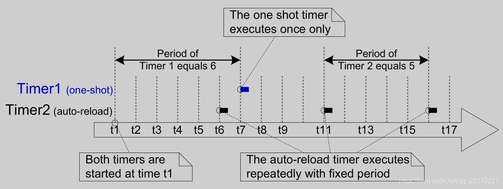

FreeRTOS S/w Timer [[Back](note_freertos_guide.md)]
---

S/w Timer 由 RTOS 內核實現並受其控制, 其頻率為 system tick, 不需要 H/w 支持 (與硬件定時器或計數器無關), 可以創建很多個.
用於在將來某個時間點或者以固定頻率執行指定的函數(執行的函數稱為回調函數)


S/w Timer 實際是在 timer task 中執行, 但是阻塞的話會導致其他 S/w Timer 調用被延時， 所以實際使用也應該避免過於複雜的行為 (一個 system tick 周期以內)

+ Enable S/w timer

    - include `timer.c`
    - compile options
        > + **configUSE_TIMERS**
        >> 是否編譯定時器相關代碼. 如需要使用定時器, 設置為 1
        > +  **configTIMER_TASK_PRIORITY**
        >> 設置定時器 Daemon 任務 (timer task)優先級; 如果優先級太低, 可能導致定時器無法及時執行
        > + **configTIMER_QUEUE_LENGTH**
        >> 設置定時器 Daemon 任務 (timer task) 的 Queue 深度, 設置定時器都是通過發送消息到該 timer Queue 實現的.
        > + **configTIMER_TASK_STACK_DEPTH**
        >> 設置定時器 Daemon 任務的 stack 大小

# Concept

+ 模式

    
    Timer1 使一次性定時器, 它的定時週期是 6 個 tick 週期, 從 t1 啟動, 知道 t7 才執行回調函數, 執行完回調函數後不會再次執行.
    Timer2 是一個自動重載定時器, 定時週期為 5 個 tick 週期; 它在 t1 啟動, 回調函數 t5/t11/t16 等時刻執行.

    - One-shot timers
        > 定時器一旦啟動, 將只會執行一次回調函數, 它不會自動重啟, 但是可以手動重啟

    - Auto-reload timers
        > 固定頻率定時器在每次到期後自動重啟, 從而使回調函數以固定頻率執行


+ prvProcessReceivedCommands
    > Timer task routine

    - Source code

        ```c
        ```

# 變數定義

## Timer Structure

```c
typedef struct tmrTimerControl
{
    const char * pcTimerName;                       // 定時器名, 方便調試
    ListItem_t xTimerListItem;                      // 鏈表項, 用於插入定時鏈表
    TickType_t xTimerPeriodInTicks;                 // 定時器啟動週期
    void * pvTimerID;                               // 溢出計數 需自己設置
    TimerCallbackFunction_t pxCallbackFunction;     // 定時器溢出回調函數
    #if ( configUSE_TRACE_FACILITY == 1 )
        UBaseType_t uxTimerNumber;
    #endif
    uint8_t ucStatus;                               // 標記定時器使用的內存, 刪除時判斷是否需要釋放內存
} xTIMER;
```

# API

## Create timer

創建 S/w timer, 可以在 vTaskStartScheduler() 前創建, 也可以在啟動後創建

+ prototype

    ```c
    TimerHandle_t xTimerCreate( const char * const pcTimerName,
                                const TickType_t xTimerPeriodInTicks,
                                const UBaseType_t uxAutoReload,
                                void * const pvTimerID,
                                TimerCallbackFunction_t pxCallbackFunction );


    TimerHandle_t xTimerCreateStatic( const char * const pcTimerName,
                                      const TickType_t xTimerPeriodInTicks,
                                      const UBaseType_t uxAutoReload,
                                      void * const pvTimerID,
                                      TimerCallbackFunction_t pxCallbackFunction,
                                      StaticTimer_t * pxTimerBuffer );

    ```

    - **pcTimerName**
        > 軟件定時器的名稱, 內核中不使用它, 僅用於調試

    - **xTimerPeriodInTicks**
        > 定時週期, 可以使用 `pdMS_TO_TICKS()` 轉換

    - **uxAutoReload**
        > + `pdTRUE` 表示該定時器為**自動重載定時器**
        > + `pdFALSE` 該定時器為**一次性定時器**

    - **pvTimerID**
        > 每個軟件定時器都有一個 ID 值, 它是一個 `*void` 指針, 可以由應用程序決定它的用途.
        `pvTimerID` 表示該定時器 ID 的初始值.
        >> 也可以將**pvTimerID**當成 `pUserData`

    - **pxCallbackFunction**
        > 定時器的 callback function

+ Example usage

    - xTimerCreate

        ```c
        #define NUM_TIMERS  5

        /* An array to hold handles to the created timers. */
        TimerHandle_t   xTimers[ NUM_TIMERS ];

        /* Define a callback function that will be used by multiple timer
         * instances.  The callback function does nothing but count the number
         * of times the associated timer expires, and stop the timer once the
         * timer has expired 10 times.  The count is saved as the ID of the
         * timer.
         */
        void vTimerCallback( TimerHandle_t xTimer )
        {
            const uint32_t ulMaxExpiryCountBeforeStopping = 10;
            uint32_t ulCount;

            /* Optionally do something if the pxTimer parameter is NULL. */
            configASSERT( xTimer );

            /* The number of times this timer has expired is saved as the
             * timer's ID.  Obtain the count.
             */
            ulCount = ( uint32_t ) pvTimerGetTimerID( xTimer );

            /* Increment the count, then test to see if the timer has expired
             * ulMaxExpiryCountBeforeStopping yet.
             */
            ulCount++;

            /* If the timer has expired 10 times then stop it from running. */
            if( ulCount >= ulMaxExpiryCountBeforeStopping )
            {
                /* Do not use a block time if calling a timer API function
                 * from a timer callback function, as doing so could cause a
                 * deadlock!
                 */
                xTimerStop( pxTimer, 0 );
            }
            else
            {
                /* Store the incremented count back into the timer's ID field
                 * so it can be read back again the next time this software timer expires.
                 */
                vTimerSetTimerID( xTimer, ( void * ) ulCount );
            }
        }

        void main( void )
        {
            long x;

            /* Create then start some timers.  Starting the timers before
             * the RTOS scheduler has been started means the timers will start
             * running immediately that the RTOS scheduler starts.
             */
            for( x = 0; x < NUM_TIMERS; x++ )
            {
                xTimers[ x ] = xTimerCreate
                               (
                                   "Timer",             /* Just a text name, not used by the RTOS kernel. */
                                   ( 100 * x ) + 100,   /* The timer period in ticks, must be greater than 0. */
                                   pdTRUE,              /* The timers will auto-reload themselves when they expire. */
                                   ( void * ) 0,        /* The ID is used to store a count of the number of times the timer has expired, which is initialised to 0. */
                                   vTimerCallback       /* Each timer calls the same callback when it expires. */
                               );

                if( xTimers[ x ] == NULL )
                {
                    /* The timer was not created. */
                }
                else
                {
                    /* Start the timer.  No block time is specified, and
                     * even if one was it would be ignored because the RTOS
                     * scheduler has not yet been started.
                     */
                    if( xTimerStart( xTimers[ x ], 0 ) != pdPASS )
                    {
                        /* The timer could not be set into the Active state. */
                    }
                }
            }

            ...

            /* Starting the RTOS scheduler will start the timers running
             * as they have already been set into the active state.
             */
            vTaskStartScheduler();

            /* Should not reach here. */
            for( ;; );
        }
        ```

    - xTimerCreateStatic

        ```c
        pxTimerBuffer
        #define NUM_TIMERS  5

        /* An array to hold handles to the created timers. */
        TimerHandle_t   xTimers[ NUM_TIMERS ];
        StaticTimer_t   xTimerBuffers[ NUM_TIMERS ];

        void vTimerCallback( TimerHandle_t xTimer )
        {
            const uint32_t ulMaxExpiryCountBeforeStopping = 10;
            uint32_t ulCount;

            /* Optionally do something if the pxTimer parameter is NULL. */
            configASSERT( pxTimer );

            /* The number of times this timer has expired is saved as the
             * timer's ID.  Obtain the count.
             */
            ulCount = ( uint32_t ) pvTimerGetTimerID( xTimer );

            /* Increment the count, then test to see if the timer has expired
             * ulMaxExpiryCountBeforeStopping yet.
             */
            ulCount++;

            /* If the timer has expired 10 times then stop it from running. */
            if( ulCount >= ulMaxExpiryCountBeforeStopping )
            {
                /* Do not use a block time if calling a timer API function
                 * from a timer callback function, as doing so could cause a
                 * deadlock!
                 */
                xTimerStop( pxTimer, 0 );
            }
            else
            {
                /* Store the incremented count back into the timer's ID field
                 * so it can be read back again the next time this software timer
                 * expires.
                 */
                vTimerSetTimerID( xTimer, ( void * ) ulCount );
            }
        }

        void main( void )
        {
            long x;

            /* Create then start some timers.  Starting the timers before
             * the RTOS scheduler has been started means the timers will start
             * running immediately that the RTOS scheduler starts.
             */
            for( x = 0; x < NUM_TIMERS; x++ )
            {
                xTimers[ x ] = xTimerCreateStatic
                               (
                                   "Timer",
                                   ( 100 * x ) + 100,
                                   pdTRUE,
                                   ( void * ) 0,
                                   vTimerCallback,
                                   & ( xTimerBuffers[ x ] );
                               );

                if( xTimers[ x ] == NULL )
                {
                    /* The timer was not created. */
                }
                else
                {
                    /* Start the timer.  No block time is specified, and
                     * even if one was it would be ignored because the RTOS
                     * scheduler has not yet been started.
                     */
                    if( xTimerStart( xTimers[ x ], 0 ) != pdPASS )
                    {
                        /* The timer could not be set into the Active state. */
                    }
                }
            }

            ...

            vTaskStartScheduler();
            for( ;; );
        }
        ```

## Delete timer

刪除 S/w timer

+ xTimerDelete

    ```c
    BaseType_t xTimerDelete( TimerHandle_t xTimer,
                             TickType_t xBlockTime );
    ```

## Basic Operation

+ xTimerStart
    > 啟動處於休眠態的軟件定時器, 或重置(重新啟動)處於運行態的軟件定時器.
    可以在 vTaskStartScheduler() 之前調用 xTimerStart(), 但該操作會在調度程序啟動之前啟動定時器

    ```c
    BaseType_t xTimerStart( TimerHandle_t xTimer,
                            TickType_t xTicksToWait );

    BaseType_t xTimerStartFromISR( TimerHandle_t xTimer,
                                   BaseType_t *pxHigherPriorityTaskWoken );
    ```

+ xTimerStop
    > 停止處於運行態的軟件計時器

    ```c
    BaseType_t xTimerStop( TimerHandle_t xTimer,
                           TickType_t xTicksToWait );

    BaseType_t xTimerStopFromISR( TimerHandle_t xTimer,
                                  BaseType_t *pxHigherPriorityTaskWoken );
    ```

    - Example usage

        ```c
        /* This scenario assumes xTimer has already been created and started.  When
         * an interrupt occurs, the timer should be simply stopped.
         */

        /* The interrupt service routine that stops the timer. */
        void vAnExampleInterruptServiceRoutine( void )
        {
            BaseType_t xHigherPriorityTaskWoken = pdFALSE;

            /* The interrupt has occurred - simply stop the timer.
             * xHigherPriorityTaskWoken was set to pdFALSE where it was defined
             * (within this function).  As this is an interrupt service routine, only
             * FreeRTOS API functions that end in "FromISR" can be used.
             */
            if( xTimerStopFromISR( xTimer, &xHigherPriorityTaskWoken ) != pdPASS )
            {
                /* The stop command was not executed successfully.
                 * Take appropriate action here.
                 */
            }

            /* If xHigherPriorityTaskWoken equals pdTRUE, then a context switch
             * should be performed.  The syntax required to perform a context switch
             * from inside an ISR varies from port to port, and from compiler to
             * compiler.  Inspect the demos for the port you are using to find the
             * actual syntax required.
             */
            if( xHigherPriorityTaskWoken != pdFALSE )
            {
                /* Call the interrupt safe yield function here (actual function
                 * depends on the FreeRTOS port being used).
                 */
            }
        }
        ```


+ xTimerChangePeriod
    > 可以更改軟件計時器的週期.
    如果更改的定時器已經處於運行態, 將會重新計算定時器的到期時間.
    >> 重新計算的起始時間與調用該函數的時間有關, 而不是定時器最開始的啟動時間.

    > 如果更改的定時器處於休眠狀態. 則定時器將啟動

    ```c
    BaseType_t xTimerChangePeriod(  TimerHandle_t xTimer,
								TickType_t xNewTimerPeriodInTicks,
								TickType_t xTicksToWait );

    BaseType_t xTimerChangePeriodFromISR( TimerHandle_t xTimer,
                                          TickType_t xNewPeriod,
                                          BaseType_t *pxHigherPriorityTaskWoken);
    ```

    - Example usage

        1. xTimerChangePeriod

            ```c
            void vAFunction( TimerHandle_t  xTimer )
            {
                if( xTimerIsTimerActive( xTimer ) != pdFALSE )
                {
                    /* xTimer is already active - delete it. */
                    xTimerDelete( xTimer );
                }
                else
                {
                    /* xTimer is not active, change its period to 500ms.
                     * This will also cause the timer to start.
                     * Block for a maximum of 100 ticks if the
                     * change period command cannot immediately be sent to the timer
                     * command queue.
                     */
                    if( xTimerChangePeriod( xTimer, 500 / portTICK_PERIOD_MS, 100 ) == pdPASS )
                    {
                        /* The command was successfully sent. */
                    }
                    else
                    {
                        /* The command could not be sent, even after waiting for 100 ticks
                        to pass.  Take appropriate action here. */
                    }
                }
            }
            ```

        1. xTimerChangePeriodFromISR

            ```c
            /* The interrupt service routine that changes the period of xTimer. */
            void vAnExample_ISR( void )
            {
                BaseType_t  xHigherPriorityTaskWoken = pdFALSE;

                /* The interrupt has occurred - change the period of xTimer to 500ms.
                 * xHigherPriorityTaskWoken was set to pdFALSE where it was defined
                 * (within this function).  As this is an interrupt service routine, only
                 * FreeRTOS API functions that end in "FromISR" can be used.
                 */
                if( xTimerChangePeriodFromISR( xTimer,
                                               pdMS_TO_TICKS( 500 ),
                                               &xHigherPriorityTaskWoken ) != pdPASS )
                {
                    /* The command to change the timers period was not executed
                    successfully.  Take appropriate action here. */
                }

                if( xHigherPriorityTaskWoken != pdFALSE )
                {
                    /* Call the interrupt safe yield function here (actual function
                     * epends on the FreeRTOS port being used).
                     */
                }
            }
            ```

+ xTimerReset
    > 重新啟動定時器, 定時器的到期時間將重新計算; 起始時間從調用 xTimerReset() 開始計算

    ```c
    BaseType_t xTimerReset( TimerHandle_t xTimer,
                            TickType_t xTicksToWait );


    BaseType_t xTimerResetFromISR( TimerHandle_t xTimer,
                                   BaseType_t *pxHigherPriorityTaskWoken );
    ```

    - Example usage

        ```c
        /* This scenario assumes xBacklightTimer has already been created.  When a
         * key is pressed, an LCD back-light is switched on.  If 5 seconds pass
         * without a key being pressed, then the LCD back-light is switched off.  In
         * this case, the timer is a one-shot timer, and unlike the example given for
         * the xTimerReset() function, the key press event handler is an interrupt
         * service routine.
         */

        /* The callback function assigned to the one-shot timer.  In this case the
         * parameter is not used.
         */
        void vBacklightTimerCallback( TimerHandle_t pxTimer )
        {
            /* The timer expired, therefore 5 seconds must have passed since a key
             * was pressed.  Switch off the LCD back-light.
             */
            vSetBacklightState( BACKLIGHT_OFF );
        }

        /* The key press interrupt service routine. */
        void vKeyPressEvent_ISR( void )
        {
            BaseType_t xHigherPriorityTaskWoken = pdFALSE;

            /* Ensure the LCD back-light is on, then reset the timer that is
             * responsible for turning the back-light off after 5 seconds of
             * key inactivity.  This is an interrupt service routine so can only
             * call FreeRTOS API functions that end in "FromISR".
             */
            vSetBacklightState( BACKLIGHT_ON );

            /* xTimerStartFromISR() or xTimerResetFromISR() could be called here
             * as both cause the timer to re-calculate its expiry time.
             * xHigherPriorityTaskWoken was initialised to pdFALSE when it was
             * declared (in this function).
             */
            if( xTimerResetFromISR( xBacklightTimer,
                                    &xHigherPriorityTaskWoken ) != pdPASS )
            {
                /* The reset command was not executed successfully.
                 * Take appropriate action here. */
            }

            /* Perform the rest of the key processing here. */

            /* If xHigherPriorityTaskWoken equals pdTRUE, then a context switch
             * should be performed.  The syntax required to perform a context switch
             * from inside an ISR varies from port to port, and from compiler to
             * compiler.  Inspect the demos for the port you are using to find the
             * actual syntax required.
             */
            if( xHigherPriorityTaskWoken != pdFALSE )
            {
                /* Call the interrupt safe yield function here (actual function
                 * depends on the FreeRTOS port being used).
                 */
            }
        }
        ```

## MISC

+ Timer ID
    > 每個軟件定時器都有一個 ID, 它可以被應用程序用於任意用途.
    ID 存儲在 `void*`中, 因此可以用於存放整數值, 或指向任何對象.
    在創建軟件定時器時為 ID 分配初始值, 之後可以使用 `vTimerSetTimerID()` 更行 ID 值, 或使用 `pvTimerGetTimerID()`查詢 ID 值

    - pvTimerGetTimerID

        ```c
        void *pvTimerGetTimerID( TimerHandle_t xTimer );
        ```

    - vTimerSetTimerID

        ```c
        void vTimerSetTimerID( TimerHandle_t xTimer, void *pvNewID );
        ```

    - Example usage

        ```c
        static void prvTimerCallback( TimerHandle_t xTimer )
        {
            TickType_t  xTimeNow;
            uint32_t    ulExecutionCount;

            /* 獲取執行回調函數的定時器的 ID, 並將其轉換為 uint32_t 整數*/
            ulExecutionCount = ( uint32_t ) pvTimerGetTimerID( xTimer );
            ulExecutionCount++;

            /* 設置新的 ID 值 */
            vTimerSetTimerID( xTimer, ( void * ) ulExecutionCount );

            xTimeNow = xTaskGetTickCount();
            /* 判斷是哪個定時器, 因為兩個定時器使用的相同的回調函數 */
            if( xTimer == xOneShotTimer )
            {
                vPrintStringAndNumber( "One-shot timer callback executing", xTimeNow );
            }
            else
            {
                vPrintStringAndNumber( "Auto-reload timer callback executing", xTimeNow );

                /* 利用 ID 值來計數次數 */
                if( ulExecutionCount == 5 )
                {
                    /* 停止定時器 */
                    xTimerStop( xTimer, 0 );
                }
            }
        }

        /* 定時的週期 */
        #define mainONE_SHOT_TIMER_PERIOD       pdMS_TO_TICKS( 3333 )
        #define mainAUTO_RELOAD_TIMER_PERIOD    pdMS_TO_TICKS( 500 )

        int main( void )
        {
            TimerHandle_t xAutoReloadTimer, xOneShotTimer;
            BaseType_t xTimer1Started, xTimer2Started;
            /* 創建一次性定時器 */
            xOneShotTimer = xTimerCreate(
                                "OneShot",                  /* 定時器的名稱 */
                                mainONE_SHOT_TIMER_PERIOD,  /* 定時週期 */
                                pdFALSE,                    /* 設置為 pdFALSE 表示一次性定時器 */
                                0,                          /* ID 初始為 0 */
                                prvTimerCallback );         /* 回調函數 */
            /* 創建自動重載定時器 */
            xAutoReloadTimer = xTimerCreate("AutoReload",
                                            mainAUTO_RELOAD_TIMER_PERIOD,
                                            pdTRUE,         /* 設置為pdTRUE表示自動重載定時器 */
                                            0,
                                            prvTimerCallback );
            /* Check the software timers were created. */
            if( ( xOneShotTimer != NULL ) && ( xAutoReloadTimer != NULL ) )
            {
                /* 啟動兩個定時器 */
                xTimer1Started = xTimerStart( xOneShotTimer, 0 );
                xTimer2Started = xTimerStart( xAutoReloadTimer, 0 );
                /* 如果兩個定時器都啟動成功, 則啟動調度程序 */
                if( ( xTimer1Started == pdPASS ) && ( xTimer2Started == pdPASS ) )
                {
                    vTaskStartScheduler();
                }
            }
            for( ;; );
        }
        ```

+ vTimerSetReloadMode
    > 切換 **One-shot** 和 **Auto-reload**

    ```c
    void vTimerSetReloadMode( TimerHandle_t xTimer,
                              const UBaseType_t uxAutoReload )
    ```

    - **uxAutoReload**
        > + pdTRUE: auto-reload timer
        > + pdFALSE: one-shot timer

+ pcTimerGetName
    > 獲得 timer name

    ```c
    const char * pcTimerGetName( TimerHandle_t xTimer );
    ```

+ xTimerGetPeriod
    > 查詢週期

    ```c
    TickType_t xTimerGetPeriod( TimerHandle_t xTimer );
    ```

+ xTimerIsTimerActive
    > 確認 S/w Timer 是否運行中
    >> **pdFALSE** 沒有運行

+ xTimerGetTimerDaemonTaskHandle
    > 獲得 timer task 的 handle

    ```c
    TaskHandle_t xTimerGetTimerDaemonTaskHandle( void );
    ```

+ xTimerGetExpiryTime
    > S/w Timer 到期的時間
    >> 如果返回的時間值**小於**目前的 tick 計數值, 那麼這個定時器不會停止, 直到定時器的 tick 計數 overflow 或者回到了 0

    ```c
    TickType_t xTimerGetExpiryTime( TimerHandle_t xTimer );
    ```

+ xTimerPendFunctionCall
    > 在不 create a task 下, 偷用 timer task 來執行 `PendedFunction_t`
    >> 暫時將 timer task, 當作是 task pool 來使用

    ```c
    BaseType_t xTimerPendFunctionCall( PendedFunction_t xFunctionToPend,
                                       void *pvParameter1,
                                       uint32_t ulParameter2,
                                       TickType_t xTicksToWait );


    BaseType_t xTimerPendFunctionCallFromISR( PendedFunction_t xFunctionToPend,
                                              void *pvParameter1,
                                              uint32_t ulParameter2,
                                              BaseType_t *pxHigherPriorityTaskWoken );
    ```

    - Example usage

        ```c
        static void vDeferredHandlingFunction( void *pvParameter1, uint32_t ulParameter2 )
        {
            /* 借用 Timer task 來做 Bottom Half */
            vPrintStringAndNumber( "Handler function - Processing event ", ulParameter2 );
        }

        static uint32_t ulExample_ISR( void )
        {
            static uint32_t ulParameterValue = 0;
            BaseType_t      xHigherPriorityTaskWoken;

            xHigherPriorityTaskWoken = pdFALSE;

            /* Top Half, 準備 Bottom Half 的資料 */
            xTimerPendFunctionCallFromISR( vDeferredHandlingFunction, /* Function to execute. */
                                           NULL,             /* Not used. */
                                           ulParameterValue, /* Incrementing value. */
                                           &xHigherPriorityTaskWoken );
            ulParameterValue++;

            portYIELD_FROM_ISR( xHigherPriorityTaskWoken );
        }

        #define mainINTERRUPT_NUMBER    3

        static void vPeriodicTask( void *pvParameters )
        {
            const TickType_t xDelay500ms = pdMS_TO_TICKS( 500UL );

            for( ;; )
            {
                vTaskDelay( xDelay500ms );

                vPrintString( "Periodic task - About to generate an interrupt.\r\n" );
                vPortGenerateSimulatedInterrupt( mainINTERRUPT_NUMBER );  /*  trigger IRQ of mainINTERRUPT_NUMBER */

                vPrintString( "Periodic task - Interrupt generated.\r\n\r\n\r\n");
            }
        }

        int main( void )
        {
            const UBaseType_t   ulPeriodicTaskPriority = configTIMER_TASK_PRIORITY - 1;

            /* Create the task that will periodically generate a software interrupt. */
            xTaskCreate( vPeriodicTask, "Periodic", 1000, NULL, ulPeriodicTaskPriority, NULL );

            vPortSetInterruptHandler( mainINTERRUPT_NUMBER, ulExample_ISR );

            vTaskStartScheduler();
            for( ;; );
        }
        ```


## Example usage

```c
#include "FreeRTOS.h"
#include "task.h"
#include "timers.h"

// 定義定時器相關時間
#define mainONE_SHOT_TIMER_PERIOD		( pdMS_TO_TICKS( 3333UL ) )
#define mainAUTO_RELOAD_TIMER_PERIOD	( pdMS_TO_TICKS( 500UL ) )

// 定時器回調函數
static void prvOneShotTimerCallback( TimerHandle_t xTimer )
{
    static TickType_t xTimeNow;

    xTimeNow = xTaskGetTickCount();

    vPrintStringAndNumber( "One-shot timer callback executing", xTimeNow );
}

static void prvAutoReloadTimerCallback( TimerHandle_t xTimer )
{
    static TickType_t xTimeNow;

    xTimeNow = xTaskGetTickCount();

    vPrintStringAndNumber( "Auto-reload timer callback executing", xTimeNow );
}

int main( void )
{
    TimerHandle_t xAutoReloadTimer, xOneShotTimer;
    BaseType_t xTimer1Started, xTimer2Started;

    // 創建軟件定時器: 單次執行
    software timer in xOneShotTimer. * /
    xOneShotTimer = xTimerCreate( "OneShot",					// 名字
                                  mainONE_SHOT_TIMER_PERIOD,	// 多久開始執行
                                  pdFALSE,						// 設置為單次執行
                                  0,
                                  prvOneShotTimerCallback );	// 回調函數

    // 創建軟件定時器: 自動重載
    xAutoReloadTimer = xTimerCreate( "AutoReload",					// 名字
                                     mainAUTO_RELOAD_TIMER_PERIOD,	// 重載需要時間
                                     pdTRUE,						// 重載模式
                                     0,
                                     prvAutoReloadTimerCallback );	// 回調函數

    if( ( xOneShotTimer != NULL ) && ( xAutoReloadTimer != NULL ) )
    {
        // 啟動定時器
        xTimer1Started = xTimerStart( xOneShotTimer, 0 );
        xTimer2Started = xTimerStart( xAutoReloadTimer, 0 );

        if( ( xTimer1Started == pdPASS ) && ( xTimer2Started == pdPASS ) )
        {
            // 開始調度
            vTaskStartScheduler();
        }
    }

    for( ;; );
    return 0;
}


```

# reference

+ [FreeRTOS 軟定時器實現](https://blog.csdn.net/qq_18150497/article/details/52874310?utm_medium=distribute.pc_relevant.none-task-blog-2%7Edefault%7EBlogCommendFromBaidu%7Edefault-6.control&dist_request_id=1332049.10052.16194299123678123&depth_1-utm_source=distribute.pc_relevant.none-task-blog-2%7Edefault%7EBlogCommendFromBaidu%7Edefault-6.control)
+ [FreeRTOS學習筆記九【軟件定時器】](https://blog.csdn.net/qq_25370227/article/details/86550914?utm_medium=distribute.pc_relevant_t0.none-task-blog-2%7Edefault%7EBlogCommendFromMachineLearnPai2%7Edefault-1.control&dist_request_id=&depth_1-utm_source=distribute.pc_relevant_t0.none-task-blog-2%7Edefault%7EBlogCommendFromMachineLearnPai2%7Edefault-1.control)
+ [FreeRTOS源碼探析之——軟件定時器](https://zhuanlan.zhihu.com/p/305853273)

