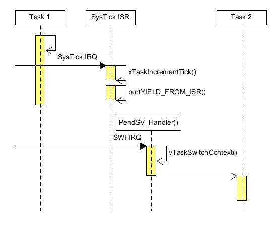

FreeRTOS Task [[Back](note_freertos_guide.md)]
---

# 變數定義

## TCB (Task Control Block) member

```c
typedef struct tskTaskControlBlock
{
    volatile StackType_t    *pxTopOfStack;  /* 目前 stack pointer 的位置, 必須位於結構體的第一項 */

    #if ( portUSING_MPU_WRAPPERS == 1 )
        xMPU_SETTINGS   xMPUSettings;       /* MPU設置, 必須位於結構體的第二項 */
    #endif

    ListItem_t          xStateListItem;     /* task的狀態列表項, 以引用的方式表示 task 的狀態, 紀錄 blocking time */
    ListItem_t          xEventListItem;     /* 事件列表項, 用於將 task 以引用的方式掛接到事件列表,
                                               紀錄 priority 的補數, 這意味著 xItemValue 的值越大, 對應的 task優先級越小
                                               (xItemValue = configMAX_PRIORITIES - tskPriority)*/
    UBaseType_t         uxPriority;         /* 保存 task優先級, 0 表示最低優先級 */
    StackType_t         *pxStack;           /* stack pool 的 base address */
    char                pcTaskName[configMAX_TASK_NAME_LEN]; /*  task名字 */

    #if ( portSTACK_GROWTH > 0 )
        StackType_t     *pxEndOfStack;      /* 指向堆棧的尾部 */
    #endif

    #if ( portCRITICAL_NESTING_IN_TCB == 1 )
        UBaseType_t     uxCriticalNesting;  /* 紀錄 nesting 的深度 */
    #endif

    #if ( configUSE_TRACE_FACILITY == 1 )
        UBaseType_t     uxTCBNumber;       /* 保存一個數值, 每個 task都有唯一的值 */
        UBaseType_t     uxTaskNumber;      /* 存儲一個特定數值 */
    #endif

    #if ( configUSE_MUTEXES == 1 )
        UBaseType_t     uxBasePriority;    /* 保存 task的基礎優先級 */
        UBaseType_t     uxMutexesHeld;
    #endif

    #if ( configUSE_APPLICATION_TASK_TAG == 1 )
        TaskHookFunction_t pxTaskTag;
    #endif

    #if( configNUM_THREAD_LOCAL_STORAGE_POINTERS > 0 )
        void *pvThreadLocalStoragePointers[configNUM_THREAD_LOCAL_STORAGE_POINTERS ];
    #endif

    #if( configGENERATE_RUN_TIME_STATS == 1 )
        uint32_t        ulRunTimeCounter;  /*記錄 task在運行狀態下執行的總時間*/
    #endif

    #if ( configUSE_NEWLIB_REENTRANT == 1 )
        /* 為 task分配一個Newlibreent結構體變量。Newlib是一個C庫函數, 並非FreeRTOS維護, FreeRTOS也不對使用結果負責。如果用戶使用Newlib, 必須熟知Newlib的細節*/
        struct _reent xNewLib_reent;
    #endif

    #if( configUSE_TASK_NOTIFICATIONS == 1 )
        volatile uint32_t ulNotifiedValue; /*與 task通知相關*/
        volatile uint8_t ucNotifyState;
    #endif

    #if( configSUPPORT_STATIC_ALLOCATION == 1 )
        uint8_t ucStaticAllocationFlags; /* 如果堆棧由靜態數組分配, 則設置為pdTRUE, 如果堆棧是動態分配的, 則設置為pdFALSE*/
    #endif

    #if( INCLUDE_xTaskAbortDelay == 1 )
        uint8_t ucDelayAborted;
    #endif

} tskTCB;

typedef tskTCB TCB_t;
```

+ xStateListItem
    > 紀錄 task 的狀態 (e.g. ready, suspend, delay, ...etc), 並將 TCB 接到對應的 TaskList

    

+ xEventListItem

    

## 重要的 Global variables

+ Task List
    > + `pxReadyTasksLists[configMAX_PRIORITIES]`
    > + `pxDelayedTaskList`
    > + `pxOverflowDelayedTaskList`
    > + `xPendingReadyList`
    > + `xSuspendedTaskList`

    - 當 create 一個 task 時 (ready state), 將其 TCB 依照優先權串接在 `pxReadyTasksLists`, scheduler 就會根據優先權依序切換 task.
        > 當高優先權有 TCB, scheduler 就會一直執行高優先權的 ready tasks
        >> 當 task 沒有 sleep 或 delay function 時, 此 task 會將 OS 整個佔住

    - task 執行的過程中, 會依 **task state** 或是 OS functions (system API),
    將 TCB 從 ready list 搬移到 state list (e.g. pxDelayedTaskList, xSuspendedTaskList) 或是 qeueu 的 **xTasksWaitingToReceive**/**xTasksWaitingToSend**
        > ready list 裡的 TCBs 會逐漸減少, 低優先權的 task 就有機會可以執行. 同樣也會有 TCB 搬回 ready list


+ **pxCurrentTCB**
    > 目前的 TCB

+ **xTickCount**
    > RTOS Heartbeat

+ **uxTopReadyPriority**
    > 紀錄目前哪些 priority 有 ready task
    >> 以 bit-field 來標記 (0 ~ 31 個 priorities), e.g. (bit_10 == 1) 則表示 priority_10 有 ready task

+ **xNextTaskUnblockTime**
    > 從現在到下一個 running task 的時間間隔, 也就是**再經過 xNextTaskUnblockTime 才會有 task 啟動**

+ **uxCurrentNumberOfTasks**

# Macro API


+ `taskSELECT_HIGHEST_PRIORITY_TASK()`
    > 選最高優先權的 task
    >> 用 `uxTopReadyPriority` 的 bit field 來記錄, 目前不同 priority 的 **pxReadyTasksLists** 是否有存在 tasks

    ```c
    #define taskSELECT_HIGHEST_PRIORITY_TASK()                                                  \
    {                                                                                           \
        UBaseType_t uxTopPriority;                                                              \
        /* 找目前在 read task lists 中最高優先權的 list, 並更新到 uxTopPriority */                   \
        portGET_HIGHEST_PRIORITY( uxTopPriority, uxTopReadyPriority );                          \
        configASSERT( listCURRENT_LIST_LENGTH( &( pxReadyTasksLists[ uxTopPriority ] ) ) > 0 ); \
        /* 獲取 ready list 中優先級最高的 TCB, 然後更新到 pxCurrentTCB */                            \
        listGET_OWNER_OF_NEXT_ENTRY( pxCurrentTCB, &( pxReadyTasksLists[ uxTopPriority ] ) );   \
    }
    ```

+ `taskRECORD_READY_PRIORITY( uxPriority )`
+ `taskRESET_READY_PRIORITY( uxPriority ) `
+ `taskSWITCH_DELAYED_LISTS()`

+ `prvAddTaskToReadyList(pxTCB)`


# Task status


# Task Create/Delete

## create

+ xTaskCreate

    ```
    BaseType_t
    xTaskCreate(
        TaskFunction_t  pvTaskCode,     // 指向 task函數的入口
        const char      *const pcName,  //  task名稱
        unsigned short  usStackDepth,   // stack 深度, stack 大小為  usStackDepth * sizeof(StackType_t)
        void            *pvParameters,  // 參數傳遞給 task
        UBaseType_t     uxPriority,     //  task的優先級
        TaskHandle_t    *pvCreatedTask);
    ```

+ Example usage

    ```c
    /* Task to be created. */
    void vTaskCode( void * pvParameters )
    {
        /* The parameter value is expected to be 1 as 1 is passed in the
        pvParameters value in the call to xTaskCreate() below.
        configASSERT( ( ( uint32_t ) pvParameters ) == 1 );

        for( ;; )
        {
            /* Task code goes here. */
        }

        vTaskDelete(NULL); /* 要退出且刪除 task, 一定要調用vTaskDelete() */
    }

    /* Function that creates a task. */
    void vOtherFunction( void )
    {
    BaseType_t xReturned;
    TaskHandle_t xHandle = NULL;

        /* Create the task, storing the handle. */
        xReturned = xTaskCreate(
                        vTaskCode,       /* Function that implements the task. */
                        "NAME",          /* Text name for the task. */
                        STACK_SIZE,      /* Stack size in words, not bytes. */
                        ( void * ) 1,    /* Parameter passed into the task. */
                        tskIDLE_PRIORITY,/* Priority at which the task is created. */
                        &xHandle );      /* Used to pass out the created task's handle. */

        if( xReturned == pdPASS )
        {
            /* The task was created.  Use the task's handle to delete the task. */
            vTaskDelete( xHandle );
        }
    }
    ```

+ pxPortInitialiseStack()
    > 初始化 stack layout.

    - Task Context-Switch 時, 會先將 CPU 資訊 (GPRs + CPU system registers) store (push) 到 stack 裡, 同時 Stack Pointer 往 Top 推.
    - 選擇下一個 task (TCB) 並將 CPU 資訊, 從 stack restore (pop) 到 CPU 對應的 system registers, 同時 Stack Pointer 往 End 降.
    - 系統第一次 Context-Switch 時, 會跳過 store 的步驟, 直接從 stack restore CPU 資訊
        > pxPortInitialiseStack() 需要配合預期 stack layout, 預先將 CPU 資訊填入 stack (模擬 store 步驟);
        其中包含 GPRs 的存入順序, 中斷的開啟 (Set CPU system register)等.

## delete

+ vTaskDelete

    ```c
    /**
     *  xTask == NULL, 則 delete current task
     */
    void vTaskDelete( TaskHandle_t xTask );
    ```

+ Example usage

    ```c
    void vOtherFunction( void )
    {
        TaskHandle_t xHandle = NULL;

        // Create the task, storing the handle.
        xTaskCreate( vTaskCode, "NAME", STACK_SIZE, NULL, tskIDLE_PRIORITY, &xHandle );

        // Use the handle to delete the task.
        if( xHandle != NULL )
        {
            vTaskDelete( xHandle );
        }
    }
    ```


# Task Schedule

## vTaskStartScheduler

用於啟動 RTOS Scheduler, 它會創建 Idle task and S/w timer task (optional), 同時初始化一些靜態變量.
最主要的, 它會初始化系統 Heartbeat (SysTick) 並設置好相應的中斷, 然後啟動第一個 task

+ vTaskStartScheduler()

    ```c
    /**** 精簡 source code *****/
    void vTaskStartScheduler( void )
    {
        BaseType_t xReturn;

        /* 創建 Idle task,使用最低優先級 (priority 0) */
        xReturn = xTaskCreate( prvIdleTask,
                               configIDLE_TASK_NAME,
                               configMINIMAL_STACK_SIZE,
                               ( void * ) NULL,
                               portPRIVILEGE_BIT,  /* In effect (tskIDLE_PRIORITY | portPRIVILEGE_BIT) */
                               &xIdleTaskHandle );


        #if ( configUSE_TIMERS == 1 )
        /* 創建 S/w timer task */
        if( xReturn == pdPASS )
        {
            xReturn = xTimerCreateTimerTask();
        }
        #endif

        if( xReturn == pdPASS )
        {
            /**
             * 先關閉中斷,確保 Heartbeat (SysTick) 中斷不會在調用 xPortStartScheduler() 時或之前發生.
             * 當第一個 task啟動時, 會重新啟動中斷
             */
            portDISABLE_INTERRUPTS();

            /******** 初始化靜態變量 *******/
            xNextTaskUnblockTime = portMAX_DELAY;
            xSchedulerRunning    = pdTRUE;

            /* Heartbeat tick count */
            xTickCount = ( TickType_t ) configINITIAL_TICK_COUNT;

            /**
             * 如果 configGENERATE_RUN_TIME_STATS 被定義, 表示使用運行時間統計功能,
             * 則下面這個宏必須被定義, 用於初始化一個基礎 timer.
             */
            portCONFIGURE_TIMER_FOR_RUN_TIME_STATS();

            traceTASK_SWITCHED_IN();

            /* 設置 Heartbeat (SysTick), 這與硬件特性相關, 因此被放在了移植層.*/
            if( xPortStartScheduler() != pdFALSE )
            {
                /* 如果調度器正確運行, 則不會執行到這裡, 函數也不會返回 */
            }
            else
            {
                /* 僅當 task調用API函數 xTaskEndScheduler() 後,會執行到這裡.*/
            }
        }
        else
        {
           /* 執行到這裡表示內核沒有啟動, 可能因為堆棧空間不夠 */
            configASSERT( xReturn != errCOULD_NOT_ALLOCATE_REQUIRED_MEMORY );
        }

        /* 預防編譯器警告*/
        ( void ) xIdleTaskHandle;
    }
    ```

    - xPortStartScheduler()
        > Cortex-M3 為例

        ```c
        BaseType_t xPortStartScheduler( void )
        {
            #if(configASSERT_DEFINED == 1 )
            {
                volatile uint32_t   ulOriginalPriority;
                /* 中斷優先級寄存器0:IPR0 */
                volatile uint8_t    *constpucFirstUserPriorityRegister = ( uint8_t * ) (portNVIC_IP_REGISTERS_OFFSET_16 + portFIRST_USER_INTERRUPT_NUMBER );
                volatile uint8_t    ucMaxPriorityValue;

                /* 這一大段代碼用來確定一個最高 ISR 優先級, 在這個 ISR 或者更低優先級的 ISR 中可以安全的調用以 FromISR 結尾的API函數.*/

                /* 保存中斷優先級值,  因為下面要覆寫這個寄存器(IPR0) */
                ulOriginalPriority = *pucFirstUserPriorityRegister;

                /**
                 * 確定有效的優先級位個數.
                 * 首先向所有 field 寫 1, 然後再讀出來, 由於無效的優先級位讀出為 0,
                 * 然後數一數有多少個1, 就能知道有多少位優先級.
                 */
                *pucFirstUserPriorityRegister = portMAX_8_BIT_VALUE;
                ucMaxPriorityValue = *pucFirstUserPriorityRegister;

                /* 冗餘代碼, 用來防止用戶不正確的設置 RTOS 可屏蔽中斷優先級值 */
                ucMaxSysCallPriority = configMAX_SYSCALL_INTERRUPT_PRIORITY & ucMaxPriorityValue;

                /* 計算最大優先級組值 */
                ulMaxPRIGROUPValue = portMAX_PRIGROUP_BITS;
                while( (ucMaxPriorityValue & portTOP_BIT_OF_BYTE ) == portTOP_BIT_OF_BYTE )
                {
                    ulMaxPRIGROUPValue--;
                    ucMaxPriorityValue <<= ( uint8_t ) 0x01;
                }

                ulMaxPRIGROUPValue <<= portPRIGROUP_SHIFT;
                ulMaxPRIGROUPValue &= portPRIORITY_GROUP_MASK;

                /* 將IPR0 寄存器的值復原 */
                *pucFirstUserPriorityRegister = ulOriginalPriority;
            }
            #endif /*conifgASSERT_DEFINED */

            /* 將PendSV和SysTick中斷設置為最低優先級*/
            portNVIC_SYSPRI2_REG |= portNVIC_PENDSV_PRI;
            portNVIC_SYSPRI2_REG |= portNVIC_SYSTICK_PRI;

            /* 啟動系統節拍定時器, 即 SysTick 定時器, 初始化中斷週期並使能定時器*/
            vPortSetupTimerInterrupt();

            /* 初始化臨界區 Nesting counter */
            uxCriticalNesting = 0;

            /* 啟動第一個 task */
            prvStartFirstTask();

            /* 永遠不會到這裡! */
            return 0;
        }
        ```


## vTaskEndScheduler

停止 RTOS 內核系統節拍時鐘, 所有創建的 task自動刪除並停止多 tasks 調度.

**僅用於x86硬件架構中**

## xTaskIncrementTick

每次 SysTick 週期發生時, 呼叫 xTaskIncrementTick() 以產生 RTOS Heartbeat

```
BaseType_t xTaskIncrementTick( void )
{
    TCB_t * pxTCB;
    TickType_t xItemValue;
    BaseType_t xSwitchRequired = pdFALSE;

    /* 每當系統節拍定時器中斷髮生, 移植層都會調用該函數.
       函數將系統節拍中斷計數器加1,
       然後檢查新的系統節拍中斷計數器值是否解除某個 task.*/
    if(uxSchedulerSuspended == ( UBaseType_t ) pdFALSE )
    {
        /* 調度器正常情況 */
        const TickType_txConstTickCount = xTickCount + 1;

        /* 系統節拍中斷計數器加1, 如果計數器溢出(為0),
           交換 pxDelayedTaskList 和 pxOverflowDelayedTaskList */
        xTickCount = xConstTickCount;
        if( xConstTickCount == ( TickType_t ) 0U )
        {
            taskSWITCH_DELAYED_LISTS();
        }

        /* 查看是否有延時 task 到期. task按照喚醒時間的先後順序存儲在隊列中,
           這意味著只要隊列中的最先喚醒 task 沒有到期, 其它 task一定沒有到期.*/
        if( xConstTickCount >= xNextTaskUnblockTime )
        {
            for( ;; )
            {
                if( listLIST_IS_EMPTY( pxDelayedTaskList) != pdFALSE )
                {
                    /* 如果延時列表為空, 設置 xNextTaskUnblockTime 為最大值 */
                    xNextTaskUnblockTime = portMAX_DELAY;
                    break;
                }
                else
                {
                    /* 如果延時列表不為空, 獲取延時列表第一個列表項值, 這個列表項值存儲 task 喚醒時間.
                       喚醒時間到期, 延時列表中的第一個列表項所屬的 task 要被移除 blocking 狀態 */
                    pxTCB = ( TCB_t * )listGET_OWNER_OF_HEAD_ENTRY( pxDelayedTaskList );
                    xItemValue = listGET_LIST_ITEM_VALUE( &( pxTCB->xStateListItem ) );

                    if( xConstTickCount < xItemValue )
                    {
                        /* task 還未到解除阻塞時間;
                           將當前 task 喚醒時間設置為下次解除阻塞時間. */
                        xNextTaskUnblockTime = xItemValue;
                        break;
                    }

                    /* 從阻塞列表中刪除到期 task */
                    ( void ) uxListRemove( &( pxTCB->xStateListItem ) );

                    /* 是因為等待事件而阻塞? 是的話將到期 task 從事件列表中刪除 */
                    if(listLIST_ITEM_CONTAINER( &( pxTCB->xEventListItem ) ) != NULL )
                    {
                        ( void ) uxListRemove( &( pxTCB->xEventListItem ) );
                    }

                    /* 將解除阻塞的 task 放入就緒列表 */
                    prvAddTaskToReadyList( pxTCB );

                    #if (  configUSE_PREEMPTION == 1 )
                    {
                        /* 使能了搶佔式內核.
                           如果解除阻塞的 task 優先級大於當前 task, 觸發一次上下文切換標誌 */
                        if( pxTCB->uxPriority >= pxCurrentTCB->uxPriority )
                        {
                            xSwitchRequired = pdTRUE;
                        }
                    }
                    #endif /*configUSE_PREEMPTION */
                }
            }
        }

        /* 如果有其它 task與當前 task 共享一個優先級,
           則這些 task共享處理器(時間片) */
        #if ( (configUSE_PREEMPTION == 1 ) && ( configUSE_TIME_SLICING == 1 ) )
        {
            if(listCURRENT_LIST_LENGTH( &( pxReadyTasksLists[ pxCurrentTCB->uxPriority ] ) ) > ( UBaseType_t ) 1 )
            {
                xSwitchRequired = pdTRUE;
            }
            else
            {
                mtCOVERAGE_TEST_MARKER();
            }
        }
        #endif /* ( (configUSE_PREEMPTION == 1 ) && ( configUSE_TIME_SLICING == 1 ) ) */

        #if (configUSE_TICK_HOOK == 1 )
        {
            /* 調用時間片鉤子函數*/
            if( uxPendedTicks == ( UBaseType_t ) 0U )
            {
                vApplicationTickHook();
            }
        }
        #endif /*configUSE_TICK_HOOK */
    }
    else
    {
        /* 調度器掛起狀態, 變量 uxPendedTicks 用於統計調度器掛起期間, 系統節拍中斷次數.
           當調用恢復調度器函數時, 會執行 uxPendedTicks 次 xTaskIncrementTick():
           恢復系統節拍中斷計數器, 如果有 task 阻塞到期, 則刪除阻塞狀態 */
        ++uxPendedTicks;

        /* 調用時間片鉤子函數*/
        #if (configUSE_TICK_HOOK == 1 )
        {
            vApplicationTickHook();
        }
        #endif
    }

    #if (configUSE_PREEMPTION == 1 )
    {
        /* 如果在中斷中調用的 API 函數喚醒了更高優先級的 task,
           並且 API 函數的參數 pxHigherPriorityTaskWoken 為 NULL 時,
           變量 xYieldPending 用於上下文切換標誌 */
        if( xYieldPending != pdFALSE )
        {
            xSwitchRequired = pdTRUE;
        }
    }
    #endif /*configUSE_PREEMPTION */

    /* 當 xSwitchRequired == ture,
       則呼叫 portYIELD_FROM_ISR() 來 trigger SWI */
    return xSwitchRequired;
}
```

## Context Switch



+ xPortPendSVHandler
    > Contex-M3

    ```c
    __asm void xPortPendSVHandler( void )
    {
        extern uxCriticalNesting;
        extern pxCurrentTCB;      /* 指向當前激活的 task */
        extern vTaskSwitchContext;

        PRESERVE8                 /* 8-bytes align*/

        mrs r0, psp               /* PSP 內容存入 R0 */
        isb                       /* 指令同步隔離, 清流水線 */

        /* 當前激活的 TCB 指針存入 R2*/
        ldr	r3, =pxCurrentTCB     /* r3 = &pxCurrentTCB */
        ldr	r2, [r3]              /* r2 = *(r3) */

        /* 保存 R4 ~ R11, 並同步更新 R0 的值 ($PSP 往上推).
           ps. 異常處理程序執行前, H/w 已自動將 xPSR/PC/LR/R12 及 R0-R3 入棧 */
        stmdb r0!, {r4-r11}
        str r0, [r2]		      /* 將新的 psp 保存到 TCB 的 pxTopOfStack (第一個成員) */

        /* 將 R3 和 R14 臨時壓入堆棧，因為即將調用 vTaskSwitchContext(),
           調用函數時, 返回地址自動保存到 R14 中, 所以一旦調用發生, R14 的值會被覆蓋, 因此需要入棧保護;
           R3 保存的當前激活的 pxCurrentTCB 地址, 函數調用後會用到, 因此也要入棧保護*/
        stmdb sp!, {r3, r14}

        /* 關中斷 (設定 $basepri).
           (IRQ_priority >= configMAX_SYSCALL_INTERRUPT_PRIORITY) 的中斷都會被屏蔽。 */
        mov r0, #configMAX_SYSCALL_INTERRUPT_PRIORITY
        msr basepri, r0
        dsb                       /* 數據和指令同步隔離 */
        isb

        /* 調用 vTaskSwitchContext(), 選擇下一個要執行的任務，即最高優先級且在 ready list 的 task,
           通過修改 pxCurrentTCB, 來實現 task 切換 */
        bl vTaskSwitchContext
        mov r0, #0                /* 開中斷 (設定 $basepri) */
        msr basepri, r0
        ldmia sp!, {r3, r14}      /* 恢復 R3 和 R14 */

        ldr r1, [r3]             /* r1 = *(r3) = pxCurrentTCB */
        ldr r0, [r1]		     /* r0 = *(r1) = pxCurrentTCB->pxTopOfStack */
        ldmia r0!, {r4-r11}	     /* 從新的 TCB stack 出棧, 並同步更新 R0 的值 */

    #if (USE_FPU)
        /* 前兩句判斷是否使能了FPU */
        tst r14, #0x10
        it eq
        vldmiaeq r0!, {s16-s31} /* 手動恢復 s16-s31 浮點寄存器, 其中 s0~s15 和 FPSCR 由 H/w 自動完成 */
    #endif

        msr psp, r0              /* 將最後的 sp 存到 PSP */
        isb

        /* 異常發生時, R14 中保存異常返回標誌, 包括返回後進入線程模式還是處理器模式、使用 $PSP 堆棧指針還是 $MSP 堆棧指針，
           當調用 bx r14 指令後, 硬件會知道要從異常返回，
           然後出棧，這個時候堆棧指針 PSP 已經指向了新 task 堆棧的正確位置，
           當新 task 的運行地址被出棧到 $PC 後，新的 task 也會被執行。*/
        bx r14
        nop
    }
    ```

    - Flow Chart

        

+ vTaskSwitchContext

    ```c
    void vTaskSwitchContext( void )
    {
        /* 如果任務調度器已經掛起 */
        if( uxSchedulerSuspended != ( UBaseType_t ) pdFALSE )
        {
            xYieldPending = pdTRUE;		/* 標記任務調度器掛起, 不允許任務切換 */
        }
        else
        {
            xYieldPending = pdFALSE;	/* 標記任務調度器沒有掛起 */

            traceTASK_SWITCHED_OUT();

            /*
             * 如果啟用運行時間統計功能, 設置 configGENERATE_RUN_TIME_STATS 為 1
             * 如果使用了該功能, 要提供以下兩個宏：
             * portCONFIGURE_TIMER_FOR_RUN_TIME_STATS()
             * portGET_RUN_TIME_COUNTER_VALUE()
             */
            #if ( configGENERATE_RUN_TIME_STATS == 1 )
            {
                #ifdef portALT_GET_RUN_TIME_COUNTER_VALUE
                portALT_GET_RUN_TIME_COUNTER_VALUE( ulTotalRunTime );
                #else
                ulTotalRunTime = portGET_RUN_TIME_COUNTER_VALUE();
                #endif

                /*
                 * ulTotalRunTime 記錄系統的總運行時間, ulTaskSwitchedInTime 記錄任務切換的時間
                 * 如果系統節拍週期為1ms, 則 ulTotalRunTime 要 497 天後才會溢出
                 * ulTotalRunTime < ulTaskSwitchedInTime 表示可能溢出
                 */
                if( ulTotalRunTime > ulTaskSwitchedInTime )
                {
                    /* 記錄當前任務的運行時間 */
                    pxCurrentTCB->ulRunTimeCounter += ( ulTotalRunTime - ulTaskSwitchedInTime );
                }
                else
                {
                    mtCOVERAGE_TEST_MARKER();
                }

                /* 更新 ulTaskSwitchedInTime, 下個任務時間從這個值開始 */
                ulTaskSwitchedInTime = ulTotalRunTime;
            }
            #endif /* configGENERATE_RUN_TIME_STATS */

            /* 核查堆棧是否溢出 */
            taskCHECK_FOR_STACK_OVERFLOW();

            /* 尋找更高優先級的任務 */
            taskSELECT_HIGHEST_PRIORITY_TASK();

            traceTASK_SWITCHED_IN();

            /* 如果使用 Newlib 運行庫, 你的操作系統資源不夠, 而不得不選擇newlib, 就必須打開該宏 */
            #if ( configUSE_NEWLIB_REENTRANT == 1 )
            {
                _impure_ptr = &( pxCurrentTCB->xNewLib_reent );
            }
            #endif /* configUSE_NEWLIB_REENTRANT */
        }
    }
    ```

    - taskSELECT_HIGHEST_PRIORITY_TASK
        > **uxTopReadyPriority** 用 bit-field 來表示, 哪個 priority 有 task
        >> uxTopReadyPriority 的 bit0 為 1, 則表示存在 priority_0 的 ready task, bit10 為 1 則表示存在 priority_10 的 ready task

        ```c
        /* __clz() 計算 MSB 有幾個 0 (H/w 加速 calculate leading zero) */

        #define portGET_HIGHEST_PRIORITY( uxTopPriority, uxReadyPriorities )    uxTopPriority = (31UL - (uint32_t) __clz((uxReadyPriorities)))

        #define taskSELECT_HIGHEST_PRIORITY_TASK()                                                  \
        {                                                                                           \
            UBaseType_t uxTopPriority;                                                              \
                                                                                                    \
            /* 獲取優先級最高的任務 */                                                                 \
            portGET_HIGHEST_PRIORITY( uxTopPriority, uxTopReadyPriority );                          \
            configASSERT( listCURRENT_LIST_LENGTH( &( pxReadyTasksLists[ uxTopPriority ] ) ) > 0 ); \
                                                                                                    \
            /* 獲取優先級最高任務的 TCB */                                                             \
            listGET_OWNER_OF_NEXT_ENTRY( pxCurrentTCB, &( pxReadyTasksLists[ uxTopPriority ] ) );   \
        }
        ```

    - `traceTASK_SWITCHED_OUT` and `traceTASK_SWITCHED_IN`
        > 可用來紀錄 context switch 的出入點


## Suspend

將 task 進入 suspend state, 直到有 task resume 才會重新進入 scheduler

+ vTaskSuspend
    > ISR 中不能 suspend task

    ```c
    /**
     *  xTaskToSuspend: 要 Suspend (掛起)的 task handle, NULL 表示掛起當前 task
     */
    void vTaskSuspend(TaskHandle_t  xTaskToSuspend);
    ```

+ Example usage

    ```c
    void vAFunction( void )
    {
        xTaskHandle     xHandle;
        // 創建 task, 保存 task句柄.
        xTaskCreate( vTaskCode, "NAME", STACK_SIZE, NULL, tskIDLE_PRIORITY, &xHandle );
        ...

        /**
         *  suspend vTaskCode with xHandle
         *  vTaskCode 不再運行, 除非其它 task調用了 vTaskResume(xHandle)
         */
        vTaskSuspend( xHandle ); //  suspend xHandle

        ...

        vTaskSuspend( NULL ); // suspend current task.
        // 除非另一個 task 使用 handle 調用了 vTaskResume, 否則永遠不會執行到這裡
    }
    ```

## Resume

將 task 離開 suspend state

+ vTaskResume
    > 調用一次或多次 vTaskSuspend() 掛起的 task, 可以調用一次 vTaskResume() 來再次恢復運行

    ```c
    void vTaskResume( TaskHandle_t  xTaskToResume );
    ```

    - Example usage

        ```c
        TaskHandle_t    g_HTask_KEY0;
        TaskHandle_t    g_HTask_KEY1;

        // KEY0  task函數
        void _task_key0(void *pvParameters)
        {
            u8  key;

            while(1)
            {
                key = KEY_Scan(0); //掃瞄按鍵

                switch(key)
                {
                    case KEY1_PRES:
                        vTaskSuspend(g_HTask_KEY1);
                        printf("suspend the key1 task\n");
                        break;
                    case KEY2_PRES:
                        vTaskResume(g_HTask_KEY1);
                        printf("resume the key1 task\n");
                        break;
                }

                vTaskDelay(10);
            }
        }

        void _task_key1(void *pvParameters)
        {
            while(1)
            {
                printf("TASK2\n");
                vTaskDelay(1000);
            }
        }

        void main()
        {
            // KEY0 task
            xTaskCreate((TaskFunction_t )_task_key0,
                        (const char* )"key0_task",
                        (uint16_t )KEY0_STK_SIZE,
                        (void* )NULL,
                        (UBaseType_t )KEY0_TASK_PRIO,
                        (TaskHandle_t* )&g_HTask_KEY0);

            // KEY1 task
            xTaskCreate((TaskFunction_t )_task_key1,
                        (const char* )"key1_task",
                        (uint16_t )KEY1_STK_SIZE,
                        (void* )NULL, (UBaseType_t )KEY1_TASK_PRIO,
                        (TaskHandle_t* )&g_HTask_KEY1);

            vTaskStartScheduler();
        }

        ```
+ xTaskResumeFromISR
    > 用在ISR中. 調用一次或多次 vTaskSuspend() 而掛起的 task, 只需調用一次 xTaskResumeFromISR() 即可恢復運行

    ```
    BaseType_t xTaskResumeFromISR(TaskHandle_t xTaskToResume);
    ```

    - Example usage

        ```c
        xTaskHandle  g_xHandle;

        void xxx_ISR( void )
        {
            portBASE_TYPE  xYieldRequired;

            // 恢復被掛起的 task
            xYieldRequired = xTaskResumeFromISR(g_xHandle);

            if( xYieldRequired == pdTRUE )
            {
                // 我們應該進行一次上下文切換
                portYIELD_FROM_ISR();
            }
        }

        void vTaskCode( void *pvParameters )
        {
            for( ;; )
            {
                ...

                // 掛起自己
                vTaskSuspend( NULL );

                // 直到 ISR 恢復它之前,  task會一直掛起
            }
        }

        void vAFunction( void )
        {
            // 創建 task
            xTaskCreate(vTaskCode, "NAME", STACK_SIZE, NULL, tskIDLE_PRIORITY, &g_xHandle);

            ...
        }
        ```

# Delay

+ TaskDelay
    > task 進入 blocking (阻塞)狀態, 指定的延時時間是一個**相對時間**
    >> 延時時間也不總是固定的, 中斷或高優先級 task搶佔也可能會改變每一次執行時間

    ```
    /**
     *  xTicksToDelay: 單位是系統 Heartbeat (SysTick) 週期
     *  其指定的延時時間, 是從調用 vTaskDelay() 後開始計算的 '相對時間'
     */
    void vTaskDelay( portTickType xTicksToDelay )
    ```

    - Example usage

        ```
        void vTaskFunction( void * pvParameters )
        {
            /* 阻塞 500ms. */
            const portTickType xDelay = 500 / portTICK_RATE_MS;

            for( ;; )
            {
                /* 每隔 500ms 觸發一次 LED, 觸發後進入阻塞狀態 */
                vToggleLED();
                vTaskDelay( xDelay );
            }
        }
        ```


+ vTaskDelayUntil
    >  task 進入 blocking (阻塞)狀態, 指定的延時時間是一個**絕對時間**
    >> 依照 (*pxPreviousWakeTime + xTimeIncrement)的時間, 週期循環

    ```c
    /**
     *  pxPreviousWakeTime： 指向一個變量, 該變量保存 task最後一次解除阻塞的時間.
     *                      第一次使用前, 該變量必須初始化為當前時間.
     *                      之後這個變量會在 vTaskDelayUntil() 內自動更新.
     *  xTimeIncrement： 週期循環時間.
     *                  當時間等於 (*pxPreviousWakeTime + xTimeIncrement)時,  task解除阻塞.
     *                  如果不改變參數 xTimeIncrement 的值, 調用該函數的 task會按照固定頻率執行.
     */
    void vTaskDelayUntil(TickType_t        *pxPreviousWakeTime,
                         const TickType_t  xTimeIncrement);
    ```

    - Example usage

        ```c
        // 每 10 次系統節拍執行一次
        void vTaskFunction( void * pvParameters )
        {
            static portTickType xLastWakeTime;
            const portTickType  xFrequency = 10;

            // 使用當前時間初始化變量 xLastWakeTime
            xLastWakeTime = xTaskGetTickCount();

            for( ;; )
            {
                //等待下一個週期
                vTaskDelayUntil( &xLastWakeTime, xFrequency );

                ...
            }
        }
        ```

# [Task Notify](note_freertos_task_notify.md)


# MISC

## vTaskPlaceOnUnorderedEventList

```c
/* 將 current task 加入 EventList */
void vTaskPlaceOnUnorderedEventList( List_t * pxEventList, const TickType_t xItemValue, const TickType_t xTicksToWait )
{
    configASSERT( pxEventList );

    /* 此函數必須在掛起調度程序的情況下調用 */
    configASSERT( uxSchedulerSuspended != 0 );

    /* 存儲 Item 值在 EventList Item 中.
     * 在這裡訪問 task 的 xEventListItem 是安全的, 因為中斷不會訪問未處於 blocking 狀態的 task 的 xEventListItem
     * ps. taskEVENT_LIST_ITEM_VALUE_IN_USE = 0x80000000UL
     */
    listSET_LIST_ITEM_VALUE( &( pxCurrentTCB->xEventListItem ), xItemValue | taskEVENT_LIST_ITEM_VALUE_IN_USE );

    /* 將 pxCurrentTCB->xEventListItem 放到 pxEventList 的末尾.
     * 在這裡訪問事件列表是安全的, 因為它是事件組的一部分.
     * - 中斷不直接訪問事件組(相反，它們通過掛起任務級別的函數調用, 來間接訪問事件組)
     */
    vListInsertEnd( pxEventList, &( pxCurrentTCB->xEventListItem ) );

    /* 將 current task 移動到 delay 列表 */
    prvAddCurrentTaskToDelayedList( xTicksToWait, pdTRUE );
}
```

## prvAddCurrentTaskToDelayedList

```c
static void prvAddCurrentTaskToDelayedList( TickType_t xTicksToWait, const BaseType_t xCanBlockIndefinitely )
{
    TickType_t xTimeToWake;
    const TickType_t xConstTickCount = xTickCount;

    #if( INCLUDE_xTaskAbortDelay == 1 )
    {
        /* 即將進入一個 Delay 列表, 因此確保 ucDelayAborted 標志被重置為pdFALSE,
         * 這樣當 task 離開阻塞狀態時, 就可以檢測到它被設置為 pdTRUE
         */
        pxCurrentTCB->ucDelayAborted = pdFALSE;
    }
    #endif

    /* 在將該 task 添加到 blocking 列表之前, 請從 ready 列表中刪除該 task */
    if( uxListRemove( &( pxCurrentTCB->xStateListItem ) ) == ( UBaseType_t ) 0 )
    {
        /* 當前 task 必須在 ready 列表中, 因此不需要檢查, 可以直接調用端口重置宏 */
        portRESET_READY_PRIORITY( pxCurrentTCB->uxPriority, uxTopReadyPriority );
    }

    #if ( INCLUDE_vTaskSuspend == 1 )
    {
        if( ( xTicksToWait == portMAX_DELAY ) && ( xCanBlockIndefinitely != pdFALSE ) )
        {
            /* 將 task 添加到掛起的 task 列表而不是延遲的 task 列表中, 以確保它不會被計時事件喚醒。它會無限期地阻塞 */
            vListInsertEnd( &xSuspendedTaskList, &( pxCurrentTCB->xStateListItem ) );
        }
        else
        {
            /* 如果事件沒有發生, 計算 task 應該被喚醒的時間
             * 這可能會 overflow, 但這無關緊要, 內核會正確地管理它
             */
            xTimeToWake = xConstTickCount + xTicksToWait;

            /* 列表項將按照喚醒時間來'排序'插入 */
            listSET_LIST_ITEM_VALUE( &( pxCurrentTCB->xStateListItem ), xTimeToWake );

            if( xTimeToWake < xConstTickCount )
            {
                /* 喚醒的時間已經過了. 將此項放在 overflow 列表中 */
                vListInsert( pxOverflowDelayedTaskList, &( pxCurrentTCB->xStateListItem ) );
            }
            else
            {
                /* 喚醒時間沒有 overflow, 因此使用當前的 blocking 列表 */
                vListInsert( pxDelayedTaskList, &( pxCurrentTCB->xStateListItem ) );

                /* 如果進入 blocking 狀態的 task, 位於 blocking 列表的最前面, 那麼 xNextTaskUnblockTime 也需要更新 */
                if( xTimeToWake < xNextTaskUnblockTime )
                {
                    /* Wake up 的時間提前, 因此更新 xNextTaskUnblockTime */
                    xNextTaskUnblockTime = xTimeToWake;
                }
            }
        }
    }
    #else /* INCLUDE_vTaskSuspend */
    ...
    #endif /* INCLUDE_vTaskSuspend */
}
```


## Task Run-Time Statistics

+ vTaskList()
    > log stack usage and priority of tasks

    ```
    /* enable options At FreeRTOSconfig.h */
    #define configUSE_TRACE_FACILITY                1
    #define configUSE_STATS_FORMATTING_FUNCTIONS    1

    /* instance */
    void task_sys_monitor(void *arg)
    {
        char pWriteBuffer[2048];
        for(;;)
        {
            sys_msleep(10000);

            /* show task info */
            vTaskList((char *)&pWriteBuffer);
            printf("task_name   task_state  priority   stack  tasK_num\n");
            printf("%s\n", pWriteBuffer);
        }
        vTaskDelete(NULL);
        return;
    }

    /**
     *  output:
     *  task_name      task_state  priority   stack  tasK_num
     *  TASK_LIST             R       4       341     20
     *  LOGUART_T             B       5       457     1
     *
     *  'R'     : 代表準備態 ready
     *  'B'     : 代表阻塞態 blocked
     *  stack   : 代表最小未使用的 stack 空間
     *  tasK_num: task 創建順序
     */
    ```

+ vTaskGetRunTimeStats()
    > log CPU usage of tasks
    >> + 需要一個精準度高於 SysTick (10 ~ 20倍) 的 timer 來測量各 task 的 CPU 使用率.
    >> + 不支援 timer overflow reset, 即只能統計到 timer overflow 前的時間區間

    - configGENERATE_RUN_TIME_STATS
        > 開啟 task 統計功能

    - portCONFIGURE_TIMER_FOR_RUN_TIME_STATS()
        > 實作高精準度 timer 配置

    - portGET_RUN_TIME_COUNTER_VALUE()
        > 實作 獲取高精準度 timer 目前時間

    - example

        ```
        void task_cpu_monitor(void *arg)
        {
            char pWriteBuffer[2048];

            for(;;)
            {
                sys_msleep(10000);
                vTaskGetRunTimeStats(pWriteBuffer);
                printf("task_name   task_use_ticks   percentage\n");
                printf("%s", pWriteBuffer);
            }
        }

        /**
         *  output:
         *  task_name   task_use_ticks   percentage
         *  rtT                109791       < 1%
         *  IDLE              8569082       99%
         *
         *  task_use_ticks: task 目前累計佔用 CPU 的 ticks
         *  percentage    : task 目前累計使用 CPU 的 百分比
         */
        ```

+ uxTaskGetSystemState()
    > 獲得 Tasks 的狀態, 可包含 vTaskList() 和 vTaskGetRunTimeStats() 資訊

    ```c
    /* enable options At FreeRTOSconfig.h */
    #define configUSE_TRACE_FACILITY                1

    /* status info of a task */
    typedef struct xTASK_STATUS
    {
        /*  task句柄 */
        TaskHandle_t        xHandle;

        /* 指針, 指向 task名 */
        const signed char   *pcTaskName;

        /*  taskID, 是一個獨一無二的數字 */
        UBaseType_t         xTaskNumber;

        /* 填充結構體時,  task當前的狀態(運行、就緒、掛起等等) */
        eTaskState          eCurrentState;

        /*填充結構體時,  task運行(或繼承)的優先級。*/
        UBaseType_t         uxCurrentPriority;

        /* 當 task因繼承而改變優先級時, 該變量保存 task最初的優先級. 僅當 configUSE_MUTEXES = 1 有效 */
        UBaseType_t         uxBasePriority;

        /* 分配給 task的總運行時間. 僅當宏 configGENERATE_RUN_TIME_STATS = 1 時有效 */
        unsigned long       ulRunTimeCounter;

        /* 從 task創建起, 堆棧剩餘的最小數量, 這個值越接近0, 堆棧溢出的可能越大. */
        unsigned short      usStackHighWaterMark;
    } TaskStatus_t;
    ```

# Reference

+ [FreeRTOS基礎篇-朱工的專欄](https://blog.csdn.net/zhzht19861011/category_9265276.html)
+ [FreeRTOS高級篇-朱工的專欄](https://blog.csdn.net/zhzht19861011/category_9265965.html)
+ [FreeRTOS高級篇2---FreeRTOS task創建分析](https://freertos.blog.csdn.net/article/details/51303639)
+ [FreeRTOS支持時間片](https://www.codenong.com/cs106307673/)
+ [FreeRTOS系列第16篇---可視化追蹤調試](https://blog.csdn.net/zhzht19861011/article/details/50717549)
+ [FreeRTOS Study Note](https://hackmd.io/@stanley7342/freertos_note)
+ [FreeRTOS直接到任務通知](https://www.codenong.com/cs106622113/)
