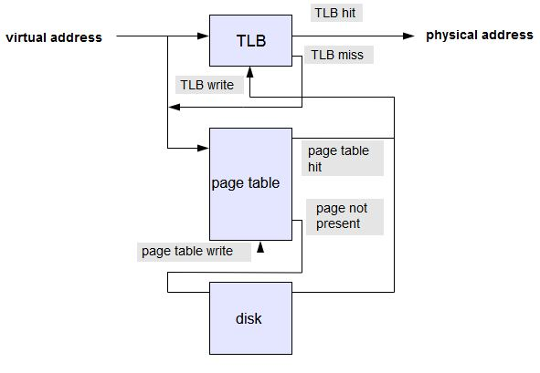
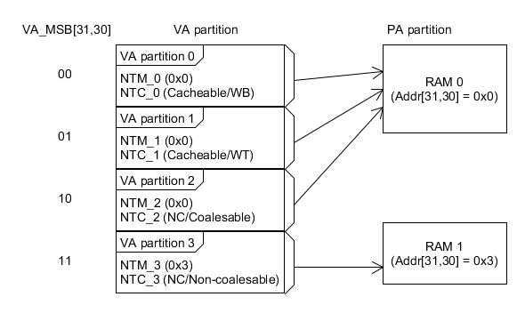

Memory Management Unit (MMU)
---




# Definitions

+ Virtual Address (VA) and Physical Address (PA)

    - 通常 VA 會定義為連續的空間, 並對應到多個 Physical memory 區段

+ TLB
    > Translation Look-aside Buffer (High-speed Cache), 用來加速 MMU.
    >> 紀錄最近使用過的 PTE, 減少到 Page Table 查表

    - TLB的工作機制
        > 對於一次 VA 訪問, CPU 搜尋 TLB 中要訪問的記憶體的 page number, 稱為 TLB 查詢(TLB lookup).
        如果可以找到與**虛擬頁號**匹配的 TLB 條目, 稱為 `TLB hit`, CPU 就會使用 TLB 條目中儲存的 `PTE` 來計算目標實體地址.
        >> 現在 TLB 讓虛擬記憶體成為現實的原因是它很小(一般幾十個 PTE), 可以直接在 CPU 中構建並且使 CPU 全速執行.
        這意味著只要 TLB 中能找到轉換條目, 訪問虛擬記憶體就跟訪問實體記憶體一樣快.
        實際上, 現代 CPU 在虛擬記憶體中執行的更快, 因為 TLB 記錄還包含了訪問特定記憶體是否安全的資訊(例如, 預取指令).

        1. 如果沒有找到與虛擬頁號匹配的 TLB 記錄, 會觸發一個 `TLB miss` 事件, 處理方式有兩種.
            > + H/w handle TLB miss
            >> CPU 會遍歷 page table, 如果能夠找到 PTE 並且標記是存在的(present), CPU 就會把新的轉換資訊放到 TLB 中; 否則 CPU 會發起一個 `Page Fault Exception` 並將控制權限交給作業系統.

            > + S/w handle TLB miss
            >> CPU 就簡單的發起一個 `soft page fault`, 由作業系統來呼叫 TLB miss handler.
            TLB miss handler 通過軟體的方式遍歷 page table, 如果能夠找到標記為 present 的 PTE, 就會在 TLB 中插入新的轉換資訊;
            如果 PTE 找不到, 則由 `Page Fault Exception handler` 來接管。

        1. 不論 TLB miss 是由 S/W or H/W處理, 底層都會導致遍歷 page table, 如果能找到標記為 present 的 PTE, 就會在 TLB 中更新新的轉換資訊.
        大部分 CISC 架構(比如IA-32)平臺, TLB miss 使用 H/w 方式處理, 大部分 RISC 架構(e.g Alpha)使用 S/W 方式處理
            > H/w 的解決方案通常比較快, 但是缺乏靈活性; 實際上, 如果 H/w 不太能滿足作業系統需求的時候, 效能優勢會少很多.


+ Page Table
    > 儲存了 VA 到 PA 間的對映, 可以是一般的 RAM 或是 disk.
    依演算法不同而有其特殊的資料結構, 甚至有多層 tables (L2/L3 cache)

+ PPN (Physical Page Number)
    > 實體頁號

+ VPN (Virtual Page Number)
    > 虛擬頁號

+ PTE (Page Table Entry)
    > Page Table 記錄了 VP to PA 的對應關係, PTE 則是 page table 中的一個對應記錄.
    當 PTE 標示為 `present` 則代表

    - PTE 也記錄一些輔助資訊

        1. `Present bit`
            > 硬碟可以用於增加實體記憶體, 或者用 `mmp()` 將 file 對應到 virtual memory,  因此 Page 可以調入和調出到實體記憶體或磁碟.
            `Present bit` 指出那些 page 存在實體記憶體中 (present == 1)

        1. `Dirty bit`
            > 當一個 Page 從硬碟調入到實體記憶體後被修改, 會標記其為 `dirty`, 意味著該 page 必需被寫回備用儲存

        1. `Address space` and `Process ID`
            > 兩個不同的 Processes 可以使用兩個相同的 virtual address, 因此 Page tabale 必需為兩個 Processes 提供不同的 Virtual memory
            >> 單位址空間作業系統可以不需要`Address space` 和 `Process ID`

## Non-translated VA to PA (for MCU without MMC)

不使用 Page Table 查表, 來達到 VA to PA 的功能. 直接偷 VA 的 MSB 2-bits (VA[31,30]) 來對應 NTC 的屬性設定
> 當 NDS32 設定 `MSC_CFG.ADR24 == 1` (定址空間只用 24-bits, 由 H/w 直接寫死), 則偷 VA[23,22]

+ NTC (Non-translated Cacheability)

    - NDS32 使用 4 種 NTC types 來囊括 PTE 中的 Cacheability attributes

        | 2-bits    | Non-translated Cacheability (NTC) Attribute   | Mapped Translated Attribute (TLB_DATA.C)|
        |-----------|-----------------------------------------------|-----------------------------------------|
        | 0 (2'b00) | Non-cacheable/non-coalesable                  | Device                                  |
        | 1 (2'b01) | Non-cacheable/coalesable                      | Bufferable Device                       |
        | 2 (2'b10) | Cacheable/write-back                          | WB Cacheable Memory                     |
        | 3 (2'b11) | Cacheable/write-through                       | WT Cacheable Memory                     |

    - Cacheable
        1. write-back
        1. write-through

    - Non-Cacheable
        1. non-coalesable (不可合併)
        1. coalesable (可合併)

+ NTM (Non-Translated Mapping)
    > 為了提高 memory access 的效能. 藉由 VA 的 2-bits MSB 來對應 NTC 屬性, 因此 H/w 的 Memory Mapping Base (定址空間) 需要將 NTC 屬性考慮進去

    - 是 Partition-level 的 VA to PA 對應, 將不同 cacheability attributes 設定的 VA partitions 對應到相同的 PA partition

        

# NDS32 MMU

## TLB_DATA (TLB Access Data Register, mr3)

設定 PTE 的 Page Attributes

```
31           12   11  10    8  7  6   5   4 3    1 0
 +-----------+---------+----+---+---+---+---+----+---+
 | PPN       | Reserved| C  | G | A | X | D | M  | V |
 +-----------+---------+----+---+---+---+---+----+---+
```

+ V, bit[0], **RW**
    > Valid bit.
    表示此 Page Table Entry 是有效且存在 (present)

+ M, bit[3,1], **RW**
    > 設定這個 page 的 r/w 權限.
    > + 假如沒有 read/write 權限, 則會發出 `Reserved PTE Attribute exception`.

    - MMU version 1

        | M[3:1] | User mode            | Superuser mode |
        |--------|----------------------|----------------|
        | 0      | -                    | -              |
        | 1      | Read only            | Read only      |
        | 2      | Read only            | Read/Write     |
        | 3      | Read/Write           | Read/Write     |
        | 4      | -                    | -              |
        | 5      | No Read/Write access | Read only      |
        | 6      | -                    | -              |
        | 7      | No Read/Write access | Read/Write     |

    - MMU version 2

        | M[3:1]  | User mode                  | Superuser mode |
        |-------- |----------------------------|----------------|
        | 0, X==0 | -                          | -              |
        | 0, X==1 | No Read/Write              | Read/Write     |
        | 1       | Read only                  | Read only      |
        | 2       | Read only                  | Read/Write     |
        | 3       | Read/Write                 | Read/Write     |
        | 4       | -                          | -              |
        | 5       | No Read/Write/Fetch access | Read only      |
        | 6       | -                          | -              |
        | 7       | No Read/Write/Fetch access | Read/Write     |

+ D, bit[4], **RW**
    > Dirty bit

    - `0`
        > 當儲存這個 page時, 發出 `Page Modified Exception`.


+ X, bit[5], **RW**
    > Executable bit. 這個 page 是否 executable.

    - MMU version 1
        1. `0`
            > 此 page 不是 executable, 否則會發 `Non-Executable Page exception`
        1. `1`
            > This page is executable.

    - MMU version 2
        1. `0`
            > + 在 superuser mode, fetch 這個 page 時, 發出 `Non-executable page exception`
            > + 在 user mode, M != 5 且 M != 7, fetch 這個 page 時, 發出 `Non-executable page exception`

        1. 在 user mode, M == 5 或 M == 7, fetch 這個 page 時, 都會發出 `Non-executable page exception`


+ A, bit[6], **RW**
    > Accessed bit, 是否要發出 `Access Bit exception`

    - `0`
        > 停止發出 `Access Bit exception`

    - `1`
        > 任何存取此 page 時, 都會發出 `Access Bit exception`

+ G, bit[7], **RW**
    > Global bit, 此 page 是否共享內容 (this page is shared across contexts or not)

    - `0`
        > This page is not shared with other context
    - `1`
        > This page is shared across contexts

+ C, bit[10,8], **RW**
    > Cacheability attributes (可緩存性屬性)

    | C[10:8] | Cacheability                                                            |
    |-------- |-------------------------------------------------------------------------|
    | 0       | device space                                                            |
    | 1       | device space, write bufferable/coalescable                              |
    | 2       | non-cacheable memory                                                    |
    | 3       | - Reserved, 發出 Reserved PTE Attribute exception (Instruction or Data)  |
    | 4       | cacheable, write-back, write-allocate memory (shared)                   |
    | 5       | cacheable, write-through, no-write-allocate memory (shared)             |
    | 6       | cacheable, non-shared, write-back, write allocate memory                |
    | 7       | cacheable, non-shared, write-through, no-write-allocate memory          |

+ LP, bit[11]
    > Large Page hint for Hardware Page Table Walker (HPTWK)

+ PPN, bit[31,12], **RW**
    > 此 page 的 Physical Page Number


## TLB_VPN (TLB Access VPN Register, mr2)

+ VPN, bit[31,12], **RW**


# [MPU](MPU/note_mpu.md)

# reference

