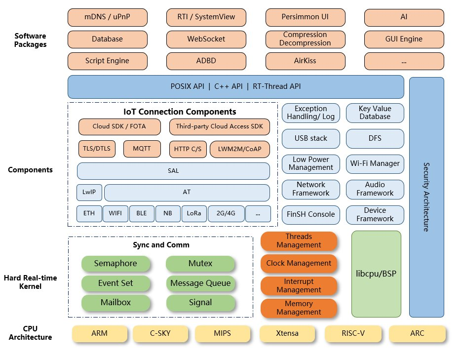
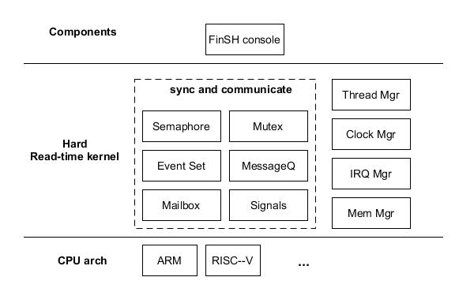

RT-Thread
---

使用 `Scons` (python version) build system


# RT-Thread Architecture

RT-Thread Full version



+ SDK directory

    | Directory     | description                            |
    |---------------|----------------------------------------|
    | BSP           | Board Support Package(板級支持包)基於各種開發板的移植 |
    | components    | RT-Thread 的各個組件代碼, 例如 finsh, gui 等        |
    | documentation | 相關文檔, 如編碼規範等                              |
    | examples      | 相關示例代碼                                        |
    | include       | RT-Thread 內核的頭文件                              |
    | libcpu        | 各類芯片的移植代碼                                 |
    | src           | RT-Thread 內核的源文件                             |
    | tools         | RT-Thread 命令構建工具的腳本文件                     |

+ Version

    - `RT-Thread Nano`
        > T-Thread Nano 是一個極簡版的硬實時內核, 採用 Preemption 模式

        

        1. 資源佔用小
            > 在支持 semaphore 和 mailbox 特性, 並運行兩個線程(main + idle 線程) 情況下, RAM 佔用約 `1K` 左右, ROM 佔用 `4K` 左右

    - `RT-Thread Full`
        > RT-Thread 是一個嵌入式實時多線程操作系統, 系統完全開源, 它不僅僅是一個實時內核,
        還具備豐富的中間層組件, 包括如文件系統, 圖形庫等較為完整的中間件組件, 具備低功耗, 安全,通信協議支持和雲端連接能力的軟件平台


# build

+ dependency

    ```
    $ sudo apt-get install scons libncurses5-dev
    ```
    - scons
        > + `scons v3.1.1` => python3
        > + `scons v3.0.5` => python2


        1. 使用 update-alternatives 設定 python default

            ```
            $ sudo update-alternatives --install /usr/bin/python python /usr/bin/python2.7 1
            $ sudo update-alternatives --install /usr/bin/python python /usr/bin/python3.7 2
            ```
        1. 列出目前所有的 python version

            ```
            $ update-alternatives --list python
            ```

        1. 切換 python default vesion
            > 替換 python (提供 /usr/bin/python)

            ```
            $ update-alternatives --config python
            There are 2 choices for the alternative python (providing /usr/bin/python).

              Selection    Path                Priority   Status
            ------------------------------------------------------------
            * 0            /usr/bin/python3.7   2         auto mode
              1            /usr/bin/python2.7   1         manual mode
              2            /usr/bin/python3.7   2         manual mode

            Press <enter> to keep the current choice[*], or type selection number:
            ```


    - toolchain

        ```
        $ wget https://armkeil.blob.core.windows.net/developer/Files/downloads/gnu-rm/6-2016q4/gcc-arm-none-eabi-6_2-2016q4-20161216-linux.tar.bz2
        ```

        1. set toolchain

            ```
            $ cd rt-thread//bsp/qemu-vexpress-a9
            $ vi ./rtconfig.py
                ...
                EXEC_PATH   = '/<toolchain-path>/gcc-arm-none-eabi-6_2-2016q4/bin'
                ...
            ```

    - compile code

        ```
        $ scons -c              # make clean
        $ scons --menuconfig    # make menuconfig
        $ scons                 # make
        ```


+ [rt-thread source](https://github.com/RT-Thread/rt-thread)

# reference

+ [RT-Thread 文檔中心](https://www.rt-thread.org/document/site/)
+ [Getting Started of QEMU (Ubuntu)](https://github.com/RT-Thread/rtthread-manual-doc/blob/master/documentation/quick_start_qemu/quick_start_qemu_linux.md)

