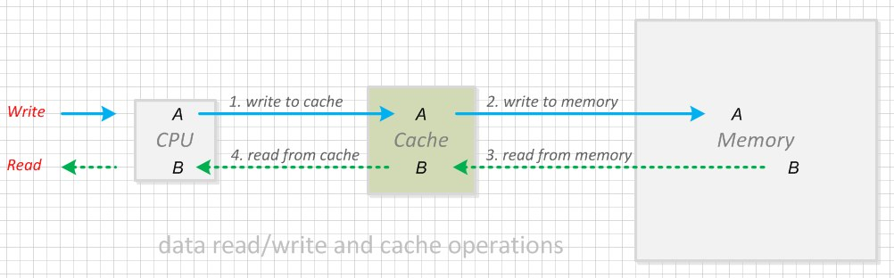
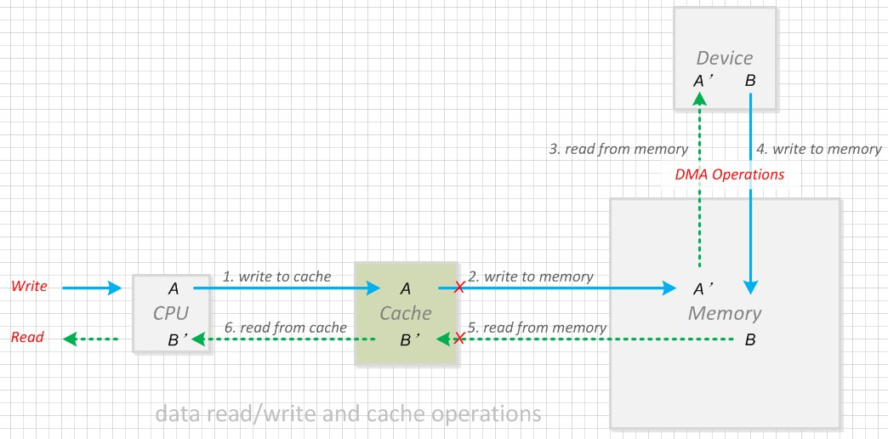
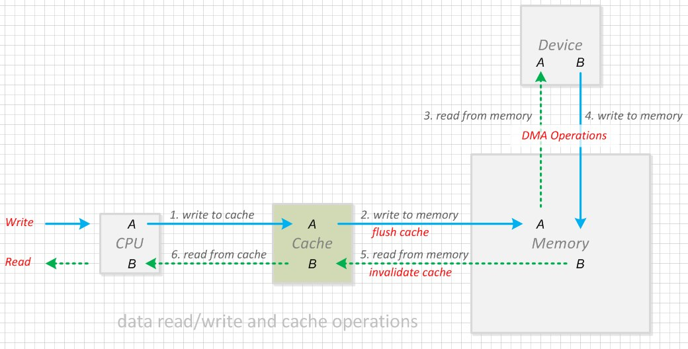
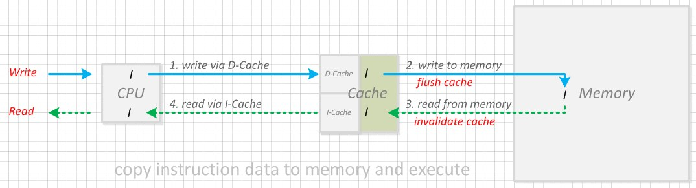

#  圖解資料讀寫與 Cache 操作

> 題圖: https://pixabay.com/vectors/phone-security-mobile-smartphone-1537387
>
> 本文原創發佈於微信公眾號"洛奇看世界".

昨天讀了 Baron 大佬寫的介紹 Cache 細節的文件, 天哪, 太詳細了, 簡直面面俱到~ 大佬就是大佬.

看完不禁想起我在 CSDN 部落格上公開發表的第一篇文章, 關於 Cache  何時需要對作廢、何時需要刷新的分析說明,
原文寫於 2016 年, 忍不住在這裡分享一下, 比較簡單, 希望對 Cache 操作不瞭解的朋友有些幫助.

> Baron 寫了很多安全方面的文章, 自謙是非著名的Trustzone/TEE/安全渣渣, 研究方向包括 ARM Trustzone、TEE, 各種 Linux 和 Android 安全,
CSDN 部落格地址: https://blog.csdn.net/weixin_42135087


## 1. 什麼是 Cache?

快取記憶體(Cache)主要是, 為瞭解決CPU運算速度與記憶體(Memory), 讀寫速度不匹配的矛盾而存在,
是CPU與記憶體之間的臨時存貯器, 容量小, 但是交換速度比記憶體快.

> 百度百科是這樣介紹快取的:
>
> CPU要讀取一個資料時, 首先從Cache中尋找, 如果找到就立即讀取並送給CPU處理;
> 如果沒有找到, 就用相對慢的速度從記憶體中讀取並送給CPU處理, 同時把這個資料所在的資料區塊調入Cache中,
> 可以使得以後對整塊資料的讀取都從Cache中進行, 不必再呼叫記憶體.
>
> 正是這樣的讀取機制, 使CPU讀取Cache的命中率非常高(大多數CPU可達90%左右),
> 也就是說CPU下一次要讀取的資料 **90%** 都在Cache中, 只有大約10%需要從記憶體讀取.
這大大節省了CPU直接讀取記憶體的時間, 也使CPU讀取資料時基本無需等待.
總的來說, CPU讀取資料的順序是先Cache後記憶體.


## 2. Cache 的分類

Cache 的硬體實現中通常包含一級 Cache(L1 Cache), 二級 Cache(L2 Cache)甚至多級 Cache;

對於一級Cache, 又有 Instruction Cache(指令快取, 通常稱為 I-Cache)和 Data Cache(資料快取, 通常稱為 D-Cache)之分,
本文準備不討論各級 Cache 的區別以及 I-Cache 和 D-Cache 的細節, 僅將這些所有實現籠統稱為Cache.


本文僅針對 Cache 的讀寫, 進行簡單說明, 並通過示意圖演示, 什麼時候需要寫回(flush)快取, 什麼時候需要作廢(Invalidate)快取.

> 目前我所知的非常強的一款 CPU: AMD RYZEN 3970x (執行緒撕裂者) 32 核心 64 執行緒,
其一級快取 3MB, 二級快取 16MB, 三級快取 128MB, 有朋友用這顆晶片組態了一台個人電腦,
編譯最新的 Android S (12) 只要 20 多分鐘, 絕大部分公司的伺服器還做不到這個性能.


對於 I-Cache 和 D-Cache, 平時 D-Cache 訪問比較多, 以下主要以 D-Cache 的訪問為例說明, I-Cache 原理一樣.

## 3. Cache 資料訪問原理

<br>
圖一、Cache讀寫原理

寫入資料時:
> 第一步, CPU 將資料寫入 Cache. <br>
> 第二步, 將 Cache 資料傳送到 Memory 中相應的位置.

讀取資料時:
> 第一步, 將 Memory 中的資料傳送到 Cache 中. <br>
> 第二步, CPU 從 Cache 中讀取資料.

在具體的硬體實現上, Cache 有寫操作有 `Write-Through` 和 `Write-Back` 兩種方式:

### Write-Through (透寫)

在 Write-Through 中, CPU 的資料**總是寫入到記憶體中**, 如果對應記憶體位置的資料在 Cache 中有一個備份, 那麼這個備份也要更新,
保證記憶體和 Cache 中的資料永遠同步. 所以每次操作總會執行圖一中的步驟 1 和 2.

### Write-Back (回寫)

在 Write-Back 中, 把要寫的資料唯寫到 Cache 中, 並對 Cache 對應的位置做一個標記, 只在必要的時候才會將資料更新到記憶體中.
所以每次寫操作都會執行步驟中的圖 1, 但並不是每次執行步驟 1 後都執行步驟 2 操作.


Write-Through 存在性能瓶頸, 性能低於 Write-Back, 現在的 CPU 設計基本上都是採用 Cache Write-Back 方式.


通常情況下, 資料**只通過 CPU 進行訪問**, 每次訪問都會經過 Cache, 此時資料同步不會有問題.

在有 Device 進行 DMA 操作的情況下, **Device 讀寫資料不再通過 Cache, 而是直接訪問記憶體**.
在裝置和 CPU 讀寫同一塊記憶體時, 所取得的資料可能會不一致, 如圖二.

<br>
圖二、裝置和CPU讀寫同一塊記憶體時資料不一致

CPU 執行步驟1將資料 `A` 寫入 Cache, 但並不是每次都會執行步驟 2 (將資料 A 同步到記憶體), 導致 Cache 中的資料 `A` 和記憶體中的資料 `A'`不一致.
步驟 3 中, 外部裝置通過 DMA 操作時直接從記憶體訪問資料, 從而取得的是`A'`而不是`A`.

Device DMA 操作完成後, 通過步驟 4 將資料 `B` 寫入記憶體.

但是由於記憶體中的資料, 不會和 Cache 自動進行同步, 步驟 5不會被執行,
所以 CPU 執行步驟 3 讀取時資料時, 獲取的可能是 Cache 中的資料 `B'`, 而不是記憶體中的資料`B`.

在 CPU 和外設訪問同一片記憶體區域的情況下, 如何操作 Cache, 以確保 Device 和 CPU 訪問資料的一致性, 就顯得尤為重要, 見圖三.

<br>
圖三、Cache操作同步資料

CPU 執行步驟 1 將資料 `A` 寫入 Cache, 由於 Device 也需要訪問資料 `A`, 因此執行步驟 2 , 將資料 `A` 通過 flush 操作同步到記憶體.
步驟 3 中, 外部裝置通過 DMA 操作時, 直接從記憶體訪問資料 `A`, 最終 CPU 和 Device 訪問的都是相同的資料.

Device DMA 操作完成後, 通過步驟 4 將資料 B 寫入記憶體.
由於 CPU 也需要訪問資料 B, 訪問前通過 invalidate 操作, 作廢 Cache 中的資料,
從而通過 Cache 讀取資料時, Cache 會從記憶體取資料, 所以 CPU 執行步驟 6 讀取資料時, 獲取到的是從記憶體更新後的資料.

## 4. Cache操作舉例

### 4.1 外設資料 DMA 傳輸

例如, 在某頂盒平台中, 記憶體加解密在單獨的安全晶片中進行, 安全晶片訪問的資料, 通過 DMA 進行傳輸操作.

因此, 在進行記憶體加解密前, 需要 flush D-Cache 操作, 將資料同步到到記憶體中供安全晶片訪問；

加解密完成後, 需要執行 invalidate D-Cache 操作, 以確保 CPU 訪問的資料, 是安全晶片加解密的結果, 而不是Cache之前保存的資料.

DMA進行資料加解密的示例程式碼:

```c
void
mem_dma_desc(
    unsigned long Mode,
    unsigned long SrcAddr, /* input data addr */
    unsigned long DestAddr, /* output data addr */
    unsigned long Slot,
    unsigned long Size) /* dma data size */
{
    ...prepare for dma encryption/decryption operation...

    /* flush data in SrcAddr from D-Cache to memory
       to ensure dma device get the correct data */
    flush_d_cache(SrcAddr, Size);

    ...do dma operation, output will be redirect to DestAddr...

    /* invalidate D-Cache to ensure fetch data from memory
       instead of cached data in D-Cache */
    invalidate_d_cache(DestAddr, Size);
    return;
}

```


### 4.2 外設 flash 的 I/O

某平台的 nand flash 的 Controller, 也支援 DMA 讀取的方式.
在資料向 nand flash 寫入資料時, 需要先 flash dcache 確保 DMA 操作的資料, 是真實要寫如的資料, 而不是記憶體中已經過期的資料.

從 nand flash 讀取資料後, 需要 invalidate dcache, 使 cache 中的資料失效, 從而確保 cpu 讀取的是記憶體資料, 而不是上一次訪問時快取的結果.

nand flash 通過 DMA 方式, 讀取資料的示例程式碼:

```c
static int
nand_dma_read(
    struct nand_dev *nand,
    uint64_t addr, /* read addr */
    void *buf,     /* output buffer */
    size_t len)
{
    int ret;

    ...prepare for nand flash read and device dma transfer...

    /* flush dma descriptor for nand flash read operation */
    flush_d_cache(descs, ndescs * sizeof(*descs));

    /* nand flash dma read operation */
    ret = nand_dma_run(nand, (uintptr_t)descs);

    /* invalidate read output buffer to ensure fetch data from memory
       instead of cached data in D-Cache */
    invalidate_d_cache(buf, len);

    ...other operations...

    return ret;
}

```

除了 nand flash 之外, 很多硬碟也支援 DMA 方式讀取.


### **4.3 I-Cache 和 D-Cache 的轉換**

通常 Cache 分為 I-Cache 和 D-Cache
> + 取指令時, 訪問 I-Cache
> + 讀寫資料時, 訪問 D-Cache

但在**程式碼搬運**時, 外設上存放的指令, 會**被當做資料進行處理**.
> 例如一段程式碼保存在外設(e.g. nand flash 或硬碟)上,
當 CPU 想執行這段程式碼, 需要先將這段程式碼, 作為資料複製到記憶體, 再將這段程式碼作為指令執行.

由於寫入資料和讀取指令, 分別通過 D-Cache 和 I-Cache, 所以**需要同步 D-Cache 和 I-Cache**
> 即 Copy 後, 需要先將 D-Cache 寫回到記憶體, 而且還需要作廢當前的 I-Cache,
以確保執行的是 Memory 內更新的程式碼, 而不是 I-Cache 中快取的資料, 如圖四所示:

<br>
圖四、CPU複製程式碼後執行


CPU複製程式碼後, 執行的示例程式碼:

```c
void
copy_code_and_execution(
    unsigned char *src,
    unsigned char *dest,
    size_t len)
{
    ...copy code from src addr to dest addr...

    /* flush instructions data in D-Cache to memory */
    flush_all_d_cache();

    /* invalidate I-Cache to ensure fetch instructions from memory
       instead of cached data in I-Cache */
    invalidate_all_i_cache();

    ...jump to dest address for execution and never return...

    /* actually it never reach here if it jumps to dest successfully */
    printf("failed to jumping...\r\n");

    return;
}

```

# Reference

+ [圖解資料讀寫與Cache操作](https://github.com/guyongqiangx/blog/blob/dev/20160727-%E5%9B%BE%E8%A7%A3%E6%95%B0%E6%8D%AE%E8%AF%BB%E5%86%99%E4%B8%8ECache%E6%93%8D%E4%BD%9C.md)

