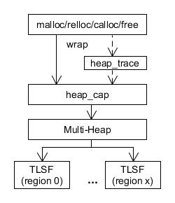
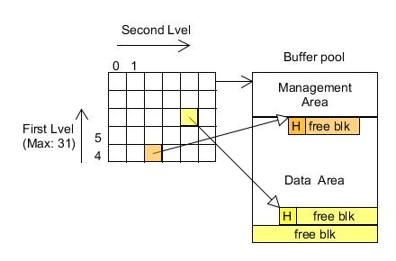
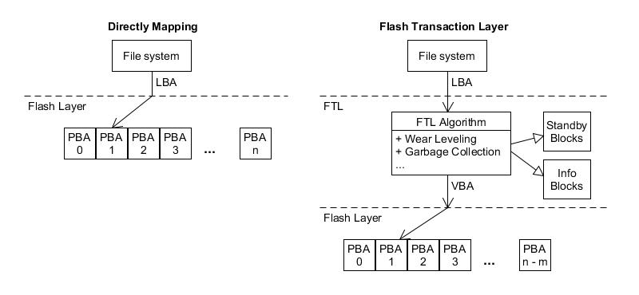
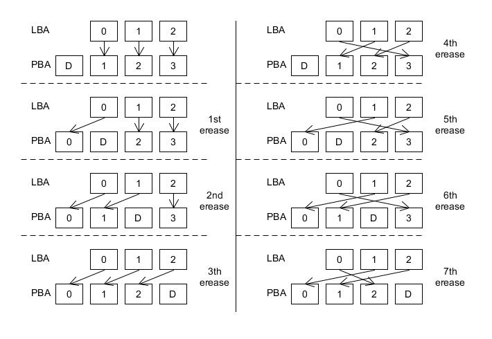
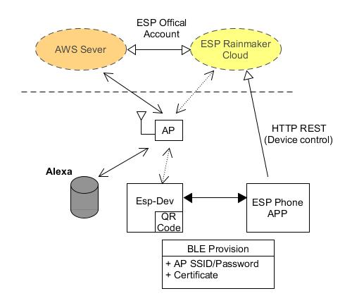

ESP
---

+ open source of SDK
    > 380 contrubuters on github


# Development Environment (ESP-IDF)

support Ubuntu/Windows/macOS

## ubuntu

+ dependency

    ```
    $ sudo apt install git wget flex bison gperf python3 python3-pip python3-setuptools cmake ninja-build ccache libffi-dev libssl-dev dfu-util
    $ cd esp-idf
    $ ./install.sh  # download toolchain
    ```

    - Python 3.7

        ```
        # add the deadsnakes PPA to sources list
        $ sudo add-apt-repository ppa:deadsnakes/ppa
        $ sudo apt install python3.7

        ```

        1. swithc python3 version

            ```
            $ sudo update-alternatives --install /usr/bin/python3 python3 /usr/bin/python3.6 1
            $ sudo update-alternatives --install /usr/bin/python3 python3 /usr/bin/python3.7 2
            $ sudo update-alternatives --config python3
                There are 2 choices for the alternative python3 (providing /usr/bin/python3).

                  Selection    Path                Priority   Status
                ------------------------------------------------------------
                * 0            /usr/bin/python3.6   2         auto mode
                  1            /usr/bin/python3.6   1         manual mode
                  2            /usr/bin/python3.7   2         manual mode

                Press <enter> to keep the current choice[*], or type selection number:

            $ sudo rm /usr/bin/python3
            $ sudo ln -s python3.7 /usr/bin/python3
            ```

    - 設置 Python 3 為默認 Python 版本

        ```
        $ sudo update-alternatives --install /usr/bin/python python /usr/bin/python3 10 && alias pip=pip3
        ```

## IDE plug-in

    - Eclipse
    - VS Code


## Build system

+ CMake
    - 連接不同的 build tool

        1. eclipse
        1. microsoft visual studio
        1. unix makefile
        1. ninja

    - 便於跨平台 (linux/windows)
    - 避免 user 直接接觸 makefile (magic symbols)

    - log

        ```
        $ cd esp-idf
        $ source ./export.sh
        $ cd esp-idf/examples/get-started/hello_world
        $ idf.py set-target esp32s2     # set target SoC
        $ idf.py build

        ...
        esptool.py v3.1-dev
        Generated /home/[user-name]/working/test/ESP/esp-idf/examples/get-started/hello_world/build/bootloader/bootloader.bin
        [675/983] Generating x509_crt_bundle
        /home/[user-name]/working/test/ESP/esp-idf/components/mbedtls/esp_crt_bundle/gen_crt_bundle.py:36: CryptographyDeprecationWarning: Python 2 is no longer supported by the Python core team. Support for it is now deprecated in cryptography, and will be removed in the next release.
          from cryptography import x509
        [983/983] Generating binary image from built executable
        esptool.py v3.1-dev
        Generated /home/[user-name]/working/test/ESP/esp-idf/examples/get-started/hello_world/build/hello-world.bin

        Project build complete. To flash, run this command:
        /home/[user-name]/.espressif/python_env/idf4.3_py3.7_env/bin/python ../../../components/esptool_py/esptool/esptool.py -p (PORT) -b 460800 --before default_reset --after hard_reset --chip esp32  write_flash --flash_mode dio --flash_size detect --flash_freq 40m 0x1000 build/bootloader/bootloader.bin 0x8000 build/partition_table/partition-table.bin 0x10000 build/hello-world.bin
        or run 'idf.py -p (PORT) flash'
        ```

        1. Selecting the Targe Chip

            > + `esp32 `
            >> SP32-D0WD, ESP32-D2WD, ESP32-S0WD (ESP-SOLO), ESP32-U4WDH, ESP32-PICO-D4

            > + `esp32s2`
            >> ESP32-S2

+ kconfig

    ```
    $ idf.py menuconfig
    ```

    - 藉由 defconfig 檔案, 可快速完成參數配置
    - 產生 `config.h`, 直接連結 compile options 和 source codes;
    不需額外撰寫 makefile (e.g. -Dxxx), 也便於 trace code

    - 使用 python 版本, 便於跨平台使用

+ `idf.py`
    > ESP 自行研發的工具, 用來控制編譯流程, 並在不當使用時, 提供協助訊息

+ Adding user to dialout
    > 讓 user 也能存取 `/dev/ttyUSB0`

    ```
    $ sudo usermod -a -G dialout $USER
    $ sudo reboot
    ```

## Operating System

+ Non-OS (ESP8266)
    > 自 2019.12 起, 將停止為 ESP8266 NonOS 新增任何功能.
    僅修復 ESP8266 NonOS 的關鍵 bug.
    所有更新僅在 master 分支進行, 即基於 v3.0.0 的持續 bug 修復版本.

+ FreeRTOS
    > directly use FreeRTOSv10 API

    - Dual Core

## Debug

+ app_trace
    > 使得用戶可以在程序運行開銷很小的前提下, 通過 JTAG 接口在主機和 ESP32 之間傳輸任意數據.
    `app_trace`可以將應用程序的運行狀態發送給主機, 在運行時接收來自主機的命令或者其他類型的信息.

    

    - 收集應用程序特定的數據
        > 基於 OpenOCD interface

    - 輕量級的日誌 (log)記錄
        > debug port 需要做字串解析, 不僅耗時還有可能改變了應用程序的行為, 使得問題無法復現.
        `app_trace`不完全解析字串, 而僅僅計算傳遞的參數的數, 並將相關 data 發送給主機.
        主機端會通過一個特殊的 Python 腳本來處理並打印接收到的日誌數據


    - 系統行為分析
        > 生成與 SEGGER SystemView 工具相兼容的跟蹤信息 (基於 OpenOCD interface)
        >> 目前僅能生成與 SystemView 格式兼容的文件, 無法使用該工具控制跟蹤的過程

        1. [SEGGER SystemView](https://www.segger.com/products/development-tools/systemview/) 是一種實時記錄和可視化工具, 用來分析應用程序運行時的行為
            > + [Time Line](https://www.segger.com/fileadmin/_processed_/5/8/csm_systemview-v3-timeline_9facf5fbd8.png)
            > + [CPU load](https://www.segger.com/fileadmin/images/products/SystemView/systemview-v3-cpuload.png)
            > + [Demo](https://www.segger.com/fileadmin/videos/SystemView.mp4)

+ [GDB Stub](https://github.com/mborgerson/gdbstub)
    > This is a simple GDB stub that can be easily dropped in to your project to allow you to debug a target platform using GDB.
    Communication between the stub and the debugger takes place via the
    [GDB Remote Serial Protocol](https://sourceware.org/gdb/onlinedocs/gdb/Remote-Protocol.html).

+ [Core Dump](https://docs.espressif.com/projects/esp-idf/zh_CN/latest/esp32/api-guides/core_dump.html)

    - Save core dump to flash
        > Core dumps are saved to special partition on flash

    - Print core dump to UART
        > Base64-encoded core dumps are printed on UART upon system panic.
        User should save core dump text body to some file manually (use tool espcoredump.py)

## Components

### heap

Heap algorithm bases on [TLSF memory allocator  v3.1](https://github.com/jserv/tlsf-bsd)



+ Two Level Segregated Fit memory allocator (TLSF)

    

    - 一種動態內存分配算法
        > Allocated Length should be 4-bytes alignment

        1. 依 Free Blk 空間大小分類, 建立兩層速查 table
            > + First level (4 ~ 31)
            >> 將 Free Blk 的大小根據 2 的冪進行分類
            > + Second level (1 ~ 32)
            > 在 First level 的基礎上, 按照一定的間隔, 線性分段
        1. Allocate 時, 挑選最接近大小的 Free Blk, 將其切割後, 剩餘的空間產生新的 Free Blk, 並回存到對應的 table slot
        1. Free 時, 先合併前後的 Free Blk 並依空間大小, 回存到對應的 table slot

    - 不支援 MMU
    - 限定最小可分配大小為16 bytes
    - Fragmentation 程度低
        > 當 memory 被釋放後, 立即與相鄰未使用的 memory block 合併

+ TLSF source code

    - block_set_size
        > 設定 block size 到 block header
    - block_set_free
        > 設定 block 為 free 到 block header
    - block_set_used
        > 設定 block 為 used 到 block header
    - block_set_prev_used
        > 設定前一個 block 為 used 到 block header
    - block_set_prev_free
        > 設定前一個 block 為 free 到 block header

    - block_link_next
        > 回傳下一個 block 的 address
        >> 依照目前 block header 的參數來計算
    - block_insert
    - block_remove
    - block_split
    - block_absorb
    - block_merge_prev
    - block_merge_next


### Virtual file-system (VFS)

```
// file description
typedef struct esp_vfs {
    int     flags;
    int     (*open)(const char * path, int flags, int mode);
    int     (*close)(int fd);
    ssize_t (*read)(int fd, void * dst, size_t size);
    ssize_t (*write)(int fd, const void * data, size_t size);

    off_t   (*lseek)(int fd, off_t size, int mode);

    int     (*fstat)(int fd, struct stat * st);
    int     (*fsync)(int fd);

    int     (*mkdir)(const char* name, mode_t mode);
    int     (*rmdir)(const char* name);

    int     (*fcntl)(int fd, int cmd, int arg);
    int     (*ioctl)(int fd, int cmd, va_list args);
    ...
} esp_vfs_t;
```

### Partition Tables

+ 可創建自定義分區表
    > 以 CSV file 編寫分區表, 再藉由 `gen_esp32part.py` 實現 CSV 和二進制文件之間的轉換

    ```
    $ python gen_esp32part.py input_partitions.csv binary_partitions.bin
    $ python gen_esp32part.py binary_partitions.bin input_partitions.csv
    ```

+ 參數
    - Name
        > partition name (< 16 char)
    - Type
        > partition type (0x00 ~ 0xFE), `0x00 ~ 0x3F` 保留給 esp-idf 的核心功能

    - SubType
        > 當 `Type == app`, SubType 可以指定為 factory (0), ota_0 (0x10) … ota_15 (0x1F) 或者 test (0x20)

        > 當 `Type == data`, SubType 可以指定為 ota (0), phy (1), nvs (2) 或者 nvs_keys (4)

    - Offset
        > partition offset (64KB alignment), 偏移地址為空, 則會緊跟著前一個分區之後開始
        若為首個分區, 則將緊跟著分區表開始

    - Size
        > partition size

    - Flags
        > encrypted or not

### ptherad

+ pthread_create/pthread_exit/pthread_cancel
+ pthread_join/pthread_detach
+ pthread_mutex_init/pthread_mutex_destroy
+ pthread_mutex_lock/pthread_mutex_unlock
+ pthread_mutex_timedlock/pthread_mutex_trylock
+ pthread_cond_init/pthread_cond_destroy
+ pthread_cond_signal/pthread_cond_broadcast
+ pthread_cond_wait/pthread_cond_timedwait

### Wear Leveling

LBA: Logical Block Address
PBA: Physical Block Address




+ algorithm
    > + No bad blocks mark mechanism
    > + 最差情況下, 單一 block 會在 P/E ratio 達到 PBA_Max, 才會交換 block

    

    - 將 flash 切割成多個同等大小的 Blocks, 並將其編號 (PBA)
    - 預留一個 dummy block, 令其編號為 D (PBA_D)
    - LBA 對應到 PBA 時, 跳過 PBA_D
    - 每一次 erease block 時, 將 dummy block 後一個 block 的 data 複製到 dummy block, 並將此 block 設為 dummy block
        > dummy block 以 Round Robin 的方式循環移動

        ```
        PBA(D + 1) copy to PBA(D)
        PBA_D = PBA_D + 1
        ```

## Sub-project

+ set environment of esp-idf

    ```
    $ source <esp-idf-root>/export.sh
    ```

    - 環境變數設定完成後, sub-projects 不需要放進 esp-idf 目錄結構中.
        > `idf.py` 會自動偵測整體的目錄結構並串接在一起

+ [esp-aws-iot](https://github.com/espressif/esp-aws-iot)
    > AWS Iot demo project
    >> **必須先註冊一個 AWS 帳號**


+ [esp-rainmaker](https://github.com/espressif/esp-rainmaker)
    > ESP cloud (An end-to-end solution)
    >> 基於此平台, 用戶可以省略配置 cloud 的步驟, 允許用戶對 ESP32/ESP32-S2 做 remote control 及 monitor

    > ESP RainMaker 的雲中間件基於 AWS 無服務器計算 (Amazon Serverless Computing) 構建, 旨在實現最佳的可擴展性和安全性.
    使用ESP RainMaker, 用戶無需在雲中編寫代碼, 就能透明地把設備屬性提供給手機 APP 或其他第三方服務.
    然後, ESP RainMaker 的手機 APP 會根據獲取的信息進行配置, 進而向用戶顯示設備屬性; 用戶可以直接在手機上讀取或更改這些屬性.

    > ESP RainMaker 還能夠在不使用雲接口或手機 APP 時, 通過 Python 命令行 (Host cli)或 Python 程序訪問設備屬性和其他服務.
    物聯網開發者只需要持續關注設備固件即可.

    > ESP RainMaker 還涉及物聯網設備中常見的功能, 如`用戶與設備的關聯`, `安全的 Wi-Fi 網絡配置`和`OTA升級`等,
    用戶無需在實現這些功能上花費太多時間.

    - [ESP RainMaker 實現了第三方集成](https://xueqiu.com/2704885039/153307959)
        > 已經能支持 `Amazon Alexa`和`Google Voice Assistant(GVA)`等語音服務
        >> 用 ESP-RainMaker 當代理來轉發給 Amazon 或 Google

    - [Build project](https://rainmaker.espressif.com/docs/get-started.html#build-and-flash-firmware)
    - [ESP-RainMaker-Docs](https://rainmaker.espressif.com/docs/get-started.html)

## 線上文件

+ [快速入門](https://docs.espressif.com/projects/esp-idf/zh_CN/latest/esp32/get-started/index.html#)
+ [與 ESP32 創建串口連接](https://docs.espressif.com/projects/esp-idf/zh_CN/latest/esp32/get-started/establish-serial-connection.html)

# ESP-RainMaker Cloud



## definition

+ `Provision`
    > 配網

    - Smart Config (TI 推出)
        > 通過數據幀中未加密的組播字段和長度字段, 來傳輸編碼後的網絡配置信息.
        End-device 先 sniffers 封包, 再執行配網程序

        > 由於配網信息是 broadcast, 有可能被側錄並推算出對應的編碼表, 進而還原出 Wi-Fi密碼

    - Wi-Fi Easy Connect
        > 通過一個擁功能強大設備(手機) 作為配置設備(Configurator), 由它負責配置其他所有設備, 而其他的設備都是待註冊設備(Enrollee devices).
        一旦 Configurator 連接到無線接入點, 通過掃瞄 Enrollee devices 的二維碼就可以讓它們連上網絡 (也支持輸入字符串的形式).

        1. 好處
            > + 為 Enrollee devices 提供標準化的方式
            > + 通過使用二維碼和用戶的設備來簡化管理網絡
            > + 適用於沒有用戶界面的設備
            > + 通過公鑰加密進行安全認證
            > + 支持 WPA2 和 WPA3 網絡
            > + 替換AP時, 無需將所有設備重新入網到新 AP

        1. 常見的場景
            > + 用戶使用手機(Configurator) 掃瞄目標設備(Enrollee)的二維碼後, 會自動嘗試與其建立安全連接.
            > + 連接建立後, 向目標設備(Enrollee)傳遞 Wi-Fi 網絡的配置信息.
            > + 目標設備(Enrollee)使用這些信息去嘗試掃瞄, 選擇連接到目標網絡.


+ `Claiming Service`
    > ESP RainMaker 中, 獲得 Certificate 的程序
    >> `Claiming` is the process by which the ESP32-S2/ESP32 gets this certificate from the ESP RainMaker Claiming Service.

## Behavior

RainMaker CLI 用來模擬外部 control, 建議使用 [ESP RainMaker App](https://play.google.com/store/apps/details?id=com.espressif.rainmaker&hl=zh_TW&gl=US)


+ 使用 Phone App 當作 Configurator, Esp board 為 Enrollee
+ Phone App 可登入並連接到 Cloud Server. Esp board 則會產生出 QR-code, 等待被配網
+ Phone App 藉 QR-code (output from terminal) 將 Esp board 加入網路 (WiFi provisioning)
+ 接著 Phone App 經由 Cloud Server 來 Control and Monitor Esp board

## Setting

+ enable `ESP RainMaker Local Control`

    ```
    ESP RainMaker Config
        -> ESP RainMaker Local Control
    ```

## [Amazon-Freertos](IoT/note_aws_freertos.md)


# ESP32-DevKitC_v4

+ source code

    ```
    $ mkdir -p $HOME/ESP && cd $HOME/ESP
    $ git clone --recursive https://github.com/espressif/esp-adf.git
    $ cd esp-adf
    $ echo 'source $HOME/ESP/esp-adf/esp-idf/export.sh' > setup.env
    $ echo 'export ADF_PATH=$HOME/ESP/esp-adf' >> setup.env
    $ echo 'export TERM=xterm-new' >> setup.env
    $ echo 'export TERMINFO=/etc/terminfo' >> setup.env
    $ source setup.env
    $ cd ./examples/get-started//hello_world
    ```

+ build project

    ```
    $ cd ~/esp/hello_world
    $ idf.py set-target esp32
    $ idf.py menuconfig
    ```
+ burn to flash

    ```
    $ idf.py -p /dev/ttyUSB0 flash
        Executing action: flash
        Running ninja in directory /home/ics/working/data/test/ESP/esp-idf/examples/get-started/hello_world/build
        Executing "ninja flash"...
        [1/4] Performing build step for 'bootloader'
        ninja: no work to do.
        [1/2] cd /home/ics/working/data/test/ESP/esp-idf/components/esptool_py && /...e/ics/working/data/test/ESP/esp-idf/components/esptool_py/run_esptool.cmak
        esptool.py --chip esp32 -p /dev/ttyUSB0 -b 460800 --before=default_reset --after=hard_reset write_flash --flash_mode dio --flash_freq 40m --flash_size 2MB 0x8000 partition_table/partition-table.bin 0x1000 bootloader/bootloader.bin 0x10000 hello-world.bin
        esptool.py v3.1-dev
        Serial port /dev/ttyUSB0
        Connecting........_____.....
    ```

    - ESP32-DevKitC V4 board
        > 按下 Boot 鍵並保持, 同時按一下 EN 鍵(此時不要鬆開 Boot 鍵)進入 **固件下載**模式, 通過串口下載固件

        1. ubuntu side burning log

            ```
            Compressed 3072 bytes to 103...
            Writing at 0x00008000... (100 %)
            Wrote 3072 bytes (103 compressed) at 0x00008000 in 0.0 seconds (effective 1961.4 kbit/s)...
            Hash of data verified.
            Compressed 25136 bytes to 15439...
            Writing at 0x00001000... (100 %)
            Wrote 25136 bytes (15439 compressed) at 0x00001000 in 0.4 seconds (effective 560.1 kbit/s)...
            Hash of data verified.
            Compressed 159040 bytes to 83786...
            Writing at 0x00010000... (16 %)
            Writing at 0x00014000... (33 %)
            Writing at 0x00018000... (50 %)
            Writing at 0x0001c000... (66 %)
            Writing at 0x00020000... (83 %)
            Writing at 0x00024000... (100 %)
            Wrote 159040 bytes (83786 compressed) at 0x00010000 in 2.0 seconds (effective 621.1 kbit/s)...
            Hash of data verified.

            Leaving...
            Hard resetting via RTS pin...
            Done
            ```

## [esp-aws-iot](https://github.com/espressif/esp-aws-iot)

+ Verify certificate of AWS server

    - Crete `Policies` on AWS IoT core

        1. AWS IoT -> Secure tab -> Policies -> Create

            ```
            Name        : <you want policy name>
            Action      : iot:*
            Resource ARN: *
            Effect      : enable 'Allow'
            ```

    - Crete `Thing` on AWS IoT core

        1. AWS IoT -> Manage tab -> Things -> Create
        1. Creating AWS IoT things -> Create a single thing
            > 註冊 `The Thing`

            ```
            Name: <your device name>
            ```

        1. Add a certificate for your thing -> Create certificate
            > 建立並下載 certificates
            > + A certificate for this thing
            > + A public key
            > + A private key
            > + A root CA for AWS IoT -> `Amazon Root CA 1`
            >> enable Activate

        1. Add a policy for your thing
            > 為 `The Thing` 添加 Policies
            >> 選擇先前建立的 Policies

        1. Register Thing

    - Get URL of endpoint on AWS IoT core
        > AWS IoT -> Settings tab -> Custom endpoint
        >> Endpoint Url 用來讓 end_device 去連接提供 service 的伺服器

    - Receive message on AWS IoT core
        > AWS IoT -> Test tab -> Subscribe to a topic

            ```
            Subscription topic: test_topic/esp32
            ```

        1. press `Subscribe to topic` and wait message (from end_device)
            > 如果沒有訂閱主題, message 會被 server 丟掉

    - download test tool on ubuntu

        ```
        $ pip3 install AWSIoTPythonSDK
        $ vi Publish.py
            #!/usr/bin/python3
            # Copyright Amazon.com, Inc. or its affiliates. All Rights Reserved.
            # SPDX-License-Identifier: MIT-0

            import time as t
            import json
            import AWSIoTPythonSDK.MQTTLib as AWSIoTPyMQTT

            # Define ENDPOINT, CLIENT_ID, PATH_TO_CERT, PATH_TO_KEY, PATH_TO_ROOT, MESSAGE, TOPIC, and RANGE
            ENDPOINT = "xxxxxxxxxxx-ats.iot.us-west-2.amazonaws.com"  # customEndpointUrl
            CLIENT_ID = "testDevice"
            PATH_TO_CERT = "aws_crt/certificate.pem.crt"
            PATH_TO_KEY = "aws_crt/private.pem.key"
            PATH_TO_ROOT = "aws_crt/aws-root-ca.pem"
            MESSAGE = "@Hello World"
            # TOPIC = "test/testing"
            TOPIC = "test_topic/esp32"
            RANGE = 20

            myAWSIoTMQTTClient = AWSIoTPyMQTT.AWSIoTMQTTClient(CLIENT_ID)
            myAWSIoTMQTTClient.configureEndpoint(ENDPOINT, 8883)
            myAWSIoTMQTTClient.configureCredentials(PATH_TO_ROOT, PATH_TO_KEY, PATH_TO_CERT)

            myAWSIoTMQTTClient.connect()
            print('Begin Publish')
            for i in range (RANGE):
                data = "{} [{}]".format(MESSAGE, i+1)
                message = {"message" : data}
                myAWSIoTMQTTClient.publish(TOPIC, json.dumps(message), 1)
                print("Published: '" + json.dumps(message) + "' to the topic: " + "'%s'" % TOPIC)
                t.sleep(0.1)
            print('Publish End')
            myAWSIoTMQTTClient.disconnect()
        $ chmod +x Publish.py

        # 將 20 個測試消息發佈到 AWS IoT Core 控制台中創建的主題 'test_topic/esp32'
        $ Publish.py
        ```

    - reference
        1. [如何使用 Python 將 MQTT 消息從我的設備發佈到 AWS IoT Core?](https://aws.amazon.com/cn/premiumsupport/knowledge-center/iot-core-publish-mqtt-messages-python/)

+ esp-aws-iot demo
    > use sha-1: `f0788fc`

    - add certificates
        ```
        $ cd ~/esp-aws-iot/examples/subscribe_publish/main/certs
        $ cp -f <aws_certificate>/xxxxxxxxxxxxx-certificate.pem.crt certificate.pem.crt
        $ cp -f <aws_certificate>/xxxxxxxxxxxxx-private.pem.key private.pem.key
        $ cp -f <aws_certificate>/AmazonRootCA1.pem aws-root-ca.pem
        ```

    - configure
        > + 設定 local AP 的 SSID/Password
        > + 設定 Endpoint URL

        ```
        $ idf.py menuconfig
            Example Configuration
                -> (Target SSID) <WIFI_SSID> WiFi SSID
                -> (<Password>) <WIFI_PASSWORD> WiFi Password

            Component config -> Amazon Web Services IoT Platform
                -> (Endpoint URL)<AWS_IOT_MQTT_HOST> AWS IoT Endpoint Hostname
        ```

    - run damo

        ```
        $ idf.py -p /dev/ttyUSB0 flash monitor
            ...
        I (886) subpub: AWS IoT SDK Version 3.0.1-
        I (1596) wifi:new:<6,0>, old:<1,0>, ap:<255,255>, sta:<6,0>, prof:1
        I (2516) wifi:state: init -> auth (b0)
        I (2556) wifi:state: auth -> assoc (0)
        I (3556) wifi:state: assoc -> init (400)
        I (3556) wifi:new:<6,0>, old:<6,0>, ap:<255,255>, sta:<6,0>, prof:1
        I (5616) wifi:new:<6,0>, old:<6,0>, ap:<255,255>, sta:<6,0>, prof:1
        I (5616) wifi:state: init -> auth (b0)
        I (5626) wifi:state: auth -> assoc (0)
        I (5636) wifi:state: assoc -> run (10)
        I (6676) wifi:connected with HTC-U12-life, aid = 2, channel 6, BW20, bssid = 76:f6:1c:90:16:c6
        I (6676) wifi:security: WPA2-PSK, phy: bgn, rssi: -60
        I (6676) wifi:pm start, type: 1

        I (6706) wifi:AP's beacon interval = 102400 us, DTIM period = 2
        W (9586) wifi:<ba-add>idx:0 (ifx:0, 76:f6:1c:90:16:c6), tid:0, ssn:0, winSize:64
        I (10656) esp_netif_handlers: sta ip: 192.168.43.5, mask: 255.255.255.0, gw: 192.168.43.1
        I (10656) subpub: Connecting to AWS...
        I (13906) subpub: Subscribing...
        I (14406) subpub: Stack remaining for task 'aws_iot_task' is 3608 bytes
        I (15746) subpub: Subscribe callback
        I (15746) subpub: test_topic/esp32      hello from ESP32 (QOS0) : 0
        I (16156) subpub: Subscribe callback
        I (16156) subpub: test_topic/esp32      hello from ESP32 (QOS1) : 1
        I (16246) subpub: Stack remaining for task 'aws_iot_task' is 3608 bytes
        I (17586) subpub: Subscribe callback
        I (17586) subpub: test_topic/esp32      hello from ESP32 (QOS0) : 2
        I (18016) subpub: Subscribe callback
        I (18016) subpub: test_topic/esp32      hello from ESP32 (QOS1) : 3
        I (18106) subpub: Stack remaining for task 'aws_iot_task' is 3608 bytes
        I (19436) subpub: Subscribe callback
        I (19436) subpub: test_topic/esp32      hello from ESP32 (QOS0) : 4
        I (19846) subpub: Subscribe callback
        I (19846) subpub: test_topic/esp32      hello from ESP32 (QOS1) : 5
        I (19936) subpub: Stack remaining for task 'aws_iot_task' is 3608 bytes
        I (21276) subpub: Subscribe callback
        I (21276) subpub: test_topic/esp32      hello from ESP32 (QOS0) : 6
        I (21696) subpub: Subscribe callback
        I (21696) subpub: test_topic/esp32      hello from ESP32 (QOS1) : 7
        I (21786) subpub: Stack remaining for task 'aws_iot_task' is 3608 bytes
        I (23116) subpub: Subscribe callback
        I (23116) subpub: test_topic/esp32      hello from ESP32 (QOS0) : 8
        I (23326) subpub: Subscribe callback
        I (23326) subpub: test_topic/esp32      hello from ESP32 (QOS1) : 9
        I (23416) subpub: Stack remaining for task 'aws_iot_task' is 3608 bytes
        I (24756) subpub: Subscribe callback
            ...
        ```


# ESP32-LyraT-Mini

+ source code

    ```
    $ mkdir -p $HOME/ESP && cd $HOME/ESP
    $ git clone --recursive https://github.com/espressif/esp-adf.git
    $ cd esp-adf
    $ echo 'source $HOME/ESP/esp-adf/esp-idf/export.sh' > setup.env
    $ echo 'export ADF_PATH=$HOME/ESP/esp-adf' >> setup.env
    $ source setup.env
    $ cd ./examples/get-started/play_mp3
    ```

+ Set config

    ```
    $ idf.py menuconfig
        Audio HAL
            -> Audio board
                -> ESP32-Lyrat-Mini V1.1
    ```

+ build project

    ```
    $ cd esp-adf/examples/get-started/play_mp3
    $ idf.py build
    ...
        [985/985] Generating play_mp3.bin
        esptool.py v2.8

        Project build complete. To flash, run this command:
        ../../../esp-idf/components/esptool_py/esptool/esptool.py -p (PORT) -b 460800 --after hard_reset write_flash --flash_mode dio --flash_size detect --flash_freq 40m 0x1000 build/bootloader/bootloader.bin 0x8000 build/partition_table/partition-table.bin 0x10000 build/play_mp3.bin
        or run 'idf.py -p (PORT) flash'
    ```

+ burn to flash

    ```
    $ idf.py -p /dev/ttyUSB0 flash    # default baud rate 460800, ubuntu don't enable minicom
        ...
        esptool.py v2.8
        Serial port /dev/ttyUSB0
        Connecting........_____....._____....._____....._____....._____....._____.
        Detecting chip type... ESP32
        Chip is ESP32D0WDQ5 (revision 1)
        Features: WiFi, BT, Dual Core, 240MHz, VRef calibration in efuse, Coding Scheme None
        Crystal is 40MHz
        MAC: bc:dd:c2:d1:f9:c0
        Uploading stub...
        Running stub...
        Stub running...
        Changing baud rate to 460800
        Changed.
        Configuring flash size...
        Compressed 25728 bytes to 15284...
        Wrote 25728 bytes (15284 compressed) at 0x00001000 in 0.3 seconds (effective 592.0 kbit/s)...
        Hash of data verified.
        Compressed 3072 bytes to 82...
        Wrote 3072 bytes (82 compressed) at 0x00008000 in 0.0 seconds (effective 2759.4 kbit/s)...
        Hash of data verified.
        Compressed 346176 bytes to 216638...
        Wrote 346176 bytes (216638 compressed) at 0x00010000 in 5.0 seconds (effective 556.2 kbit/s)...
        Hash of data verified.

        Leaving...
        Hard resetting via RTS pin...
        Done
    ```

## 線上文件

+ [ESP32-LyraT-Mini V1.2 入門指南](https://docs.espressif.com/projects/esp-adf/zh_CN/latest/get-started/get-started-esp32-lyrat-mini.html)


# reference

+ [快速入門](https://docs.espressif.com/projects/esp-idf/zh_CN/latest/esp32/get-started/index.html#)

