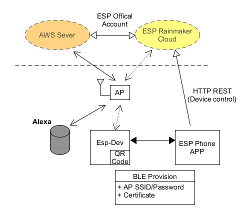
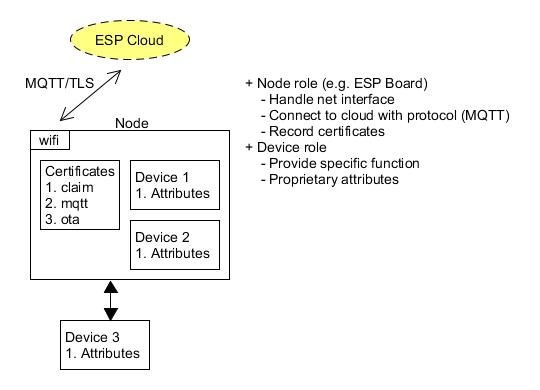
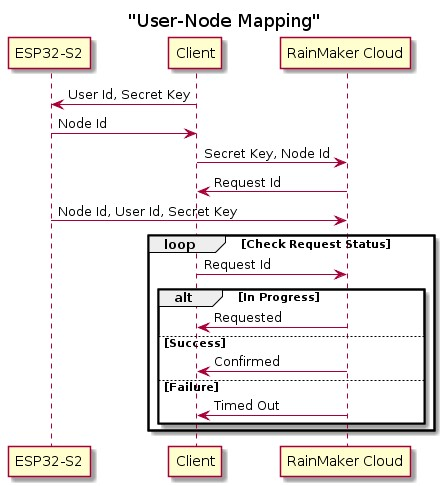
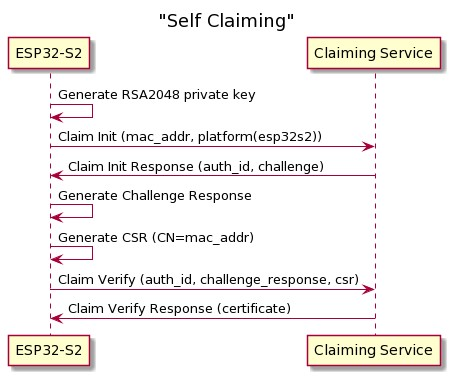
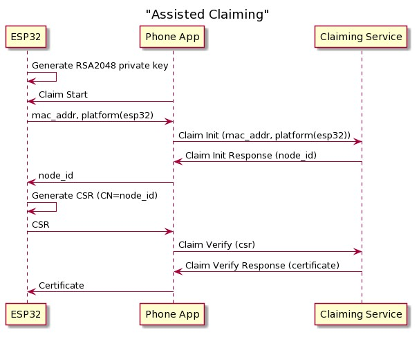
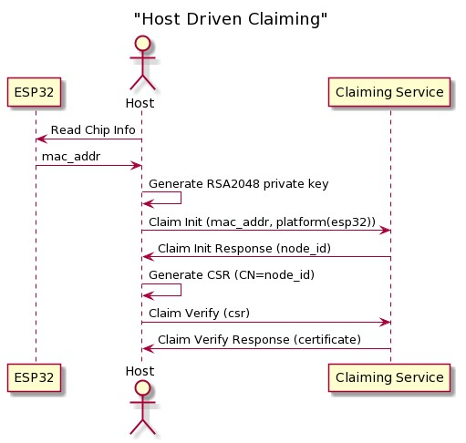
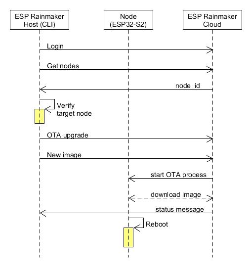

ESP Rainmaker Cloud [[Back](note_esp.md)]
----



# Definition

+ `Provision`
    > 配網

    - Smart Config (TI 推出)
        > 通過數據幀中未加密的組播字段和長度字段, 來傳輸編碼後的網絡配置信息.
        End-device 先 sniffers 封包, 再執行配網程序

        > 由於配網信息是 broadcast, 有可能被側錄並推算出對應的編碼表, 進而還原出 Wi-Fi密碼

    - Wi-Fi Easy Connect
        > 通過一個擁功能強大設備(手機) 作為配置設備(Configurator), 由它負責配置其他所有設備, 而其他的設備都是待註冊設備(Enrollee devices).
        一旦 Configurator 連接到無線接入點, 通過掃瞄 Enrollee devices 的二維碼就可以讓它們連上網絡 (也支持輸入字符串的形式).

        1. 好處
            > + 為 Enrollee devices 提供標準化的方式
            > + 通過使用二維碼和用戶的設備來簡化管理網絡
            > + 適用於沒有用戶界面的設備
            > + 通過公鑰加密進行安全認證
            > + 支持 WPA2 和 WPA3 網絡
            > + 替換AP時, 無需將所有設備重新入網到新 AP

        1. 常見的場景
            > + 用戶使用手機(Configurator) 掃瞄目標設備(Enrollee)的二維碼後, 會自動嘗試與其建立安全連接.
            > + 連接建立後, 向目標設備(Enrollee)傳遞 Wi-Fi 網絡的配置信息.
            > + 目標設備(Enrollee)使用這些信息去嘗試掃瞄, 選擇連接到目標網絡.


+ `Claiming Service`
    > ESP RainMaker 中, 獲得 Certificate 的程序
    >> `Claiming` is the process by which the ESP32-S2/ESP32 gets this certificate from the ESP RainMaker Claiming Service.

+ `Certificate Signing Request` (CSR)
    > 憑證請求

+ Certificate
    > 憑證


# Behavior

RainMaker CLI 用來模擬外部 control, 建議使用 [ESP RainMaker App](https://play.google.com/store/apps/details?id=com.espressif.rainmaker&hl=zh_TW&gl=US)


+ 使用 Phone App 當作 Configurator, Esp board 為 Enrollee
+ Phone App 可登入並連接到 Cloud Server. Esp board 則會產生出 QR-code, 等待被配網
+ Phone App 藉 QR-code (output from terminal) 將 Esp board 加入網路 (WiFi provisioning)
+ 接著 Phone App 經由 Cloud Server 來 Control and Monitor Esp board

# Setting

+ enable `ESP RainMaker Local Control`

    ```
    ESP RainMaker Config
        -> ESP RainMaker Local Control
    ```

# Role



+ Coding flow

    - app_wifi_init()
        > 初始化 Wi-Fi, MAC address 將被當作 node_id 並用來做 ESP32-S2 self claiming
    - esp_rmaker_node_init()
        > 初始化ESP RainMaker node

    - esp_rmaker_device_create()
        > 創建一個 device
        >> device 提供 callback (esp_rmaker_device_write_cb_t), 當收到針對任何參數的 write request 時, 將使用此 callback

        1. device 會包含自己的 attributes
            > 像是
            > + 開關類的 device, 就會有 on/off parameter
            > + 燈控類的 device, 應該會有亮度 parameter

    - esp_rmaker_node_add_device()
        > 將 device 附加到 node

    - esp_rmaker_start()
        > 啟動 RainMaker 代理
        >> 將啟動 RainMaker 核心任務, 該任務將等待Wi-Fi, 進行聲明(如果需要),
        通過 MQTT 連接到 RainMaker 雲, 報告節點配置, 報告參數值, 然後等待命令

    - app_wifi_start()
        > 啟動 WLAN. 在此之前 Rainmaker 應已 initialized 並 start

+ ESP 定義了 `standard types` 的 APIs, 來含括操作設定參數, 及 UI Render 參數 (便於 APP 開發).
同時也用來轉譯參數來整合第三方服務(e.g. AWS, Google Service)

# Cloud communication

+ Client (ESP Rainmaker CLI or Phone App) 與 ESP RainMaker Cloud 之間的所有通信,
均通過 [HTTP REST API](https://swaggerapis.rainmaker.espressif.com/) 進行

+ ESP RainMaker Cloud 配對 Client 和 Node



# Claiming

+ Self Claiming (ESP32-S2)
    > device 自行向 ESP RainMaker Cloud 發起

    

+ Assisted Claiming (ESP32)
    > 由 Host 當 Device 和 ESP RainMaker Cloud 的中繼
    >>

    

    - enable config

        ```
        $ idf.py menuconfig
            ESP RainMaker Config
                -> Use Assisted Claiming.
            ESP RainMaker App Wi-Fi Provisioning
                -> Provisioning Transport method (BLE)
        ```

+ Host Driven Claiming (ESP32)
    > 由 Host 向 ESP RainMaker Cloud 發起 (Host 需先跟 device 要 MAC address).
    建議改用 `Assisted Claiming`

    

# Service of ESP RainMaker Cloud

+ OTA upgrade



+ Time Sevice
    > sync
    > + Network time (which is the current UTC time)
    > + Time zone (which gives offset from UTC, and information about Day Light Saving)

+ Scheduling
    > 設定排程


# 3rd Party Integrations

+ AWS Alexa
+ Google Voice Assistant (GVA)

# Other Features

+ Node share
    > 分享 node 的控制權, 用 Primary/Secondary user 來區分權限

    - Primary User
        > + create/remove Secondary User
        > + fully permision to control the node
    - Secondary User
        > + control the node which shared from Primary user

+ Local Control (The client and the device are connected to the same Wi-Fi network.)
    > Control the device directly on the local Wi-Fi network.
    It whil be much faster and reliable

    ```
    $ idf.py menuconfig
        ESP RainMaker Config
            -> ESP RainMaker Local Control
    ```

# reference

+ [ESP-RainMaker](https://rainmaker.espressif.com/docs/get-started.html)

