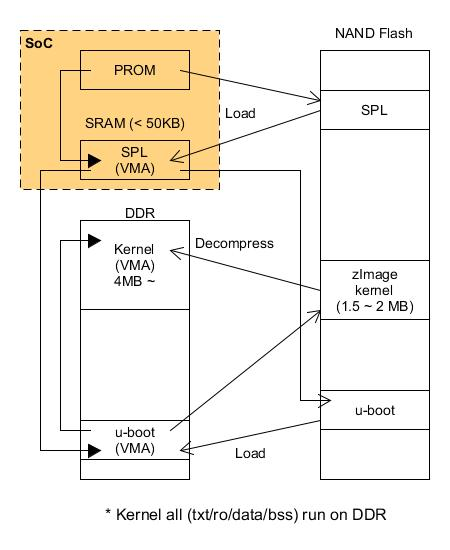
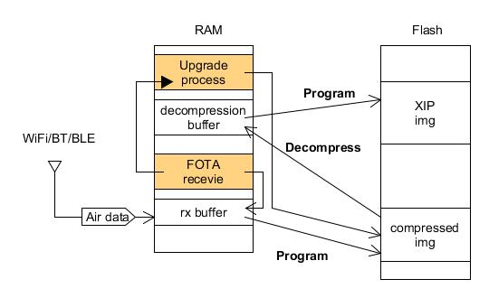

Executable compression
---

# Concept

CPU 只能跑未壓縮的 binary data, 無法 run-time 解壓縮資料來運行

可執行 program 的 memory 可分為 RAM (SRAM/PSRAM/DDR) 和 Flash memory, 因此依照程序執行的位置可分為

## Execute on Fully RAM

+ Pros

    - 高效能
    - run-time 執行區域與儲存區域各自獨立, 可用壓縮方式減少儲存空間的需求

+ Cons

    - 需要較大容量的 RAM
    - 假如使用壓縮檔儲存, 在 Booting 時, 需要先解壓縮到 RAM, 造成 Booting 時間增加

## Execute between RAM and Flash (XIP mode)

因 Flash 特性, 只能在 Flash 執行 Read-Only 的程式碼

+ Pros

    - 將程序分攤在 RAM 及 Flash 之間, 可以使用較小的 RAM
    - 搬移到 RAM 的資料量較少

+ Cons

    - 執行效率差距大, Flash 執行效率比 RAM 慢 10 ~ 100 倍
    - 在 Flash 執行程序時, 不能寫 Flash
    - Flash 寫的速率不高, 而且有壽命限制
        1. 開機解壓縮並寫回 Flash 沒有意義
            > + 預留未壓縮資料的區域是必需的
            > + 加速 Flash 壽命的衰竭

        1. 壓縮執行檔在執行期間, 無任何好處

# Scenario of Executable compression

## Execute on Fully RAM

Linux kernel Boot

## Execute between RAM and Flash (XIP mode)

+ FOTA (Firmware Over-the-Air) with Executable compression

    - 減少傳輸 Firmware 的時間
    - 減少 Firmware 暫存的儲存空間

# LZMA

+ 壓縮速度
    > 在雙核處理器上可以達到 2 MB/秒.

+ 解壓縮速度
    - 在英特爾酷睿2 或 AMD 速龍 64 上可以達到 20-30 MB/秒.
    - 在 100 MHz ARM/MIPS/PowerPC 或其它精簡指令集處理器上能達到 1-2 MB/秒.

+ 較小的解壓縮內存需求
    > 8-32 KB (依賴於字典大小)

+ 較小的解壓縮代碼
    > 2-8 KB

