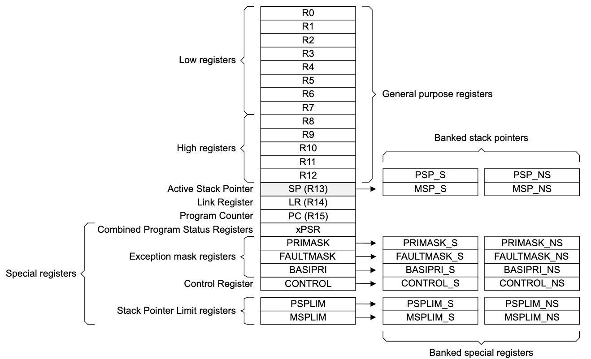
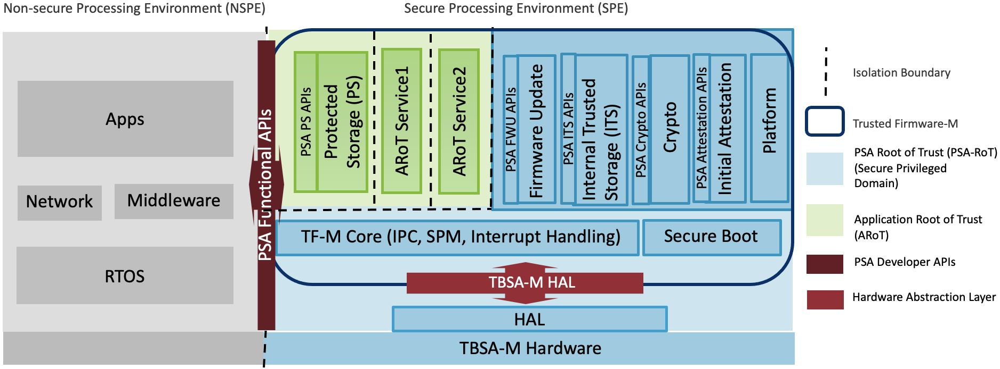
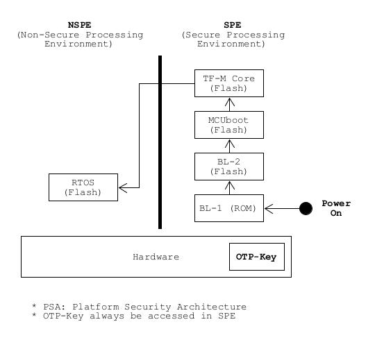
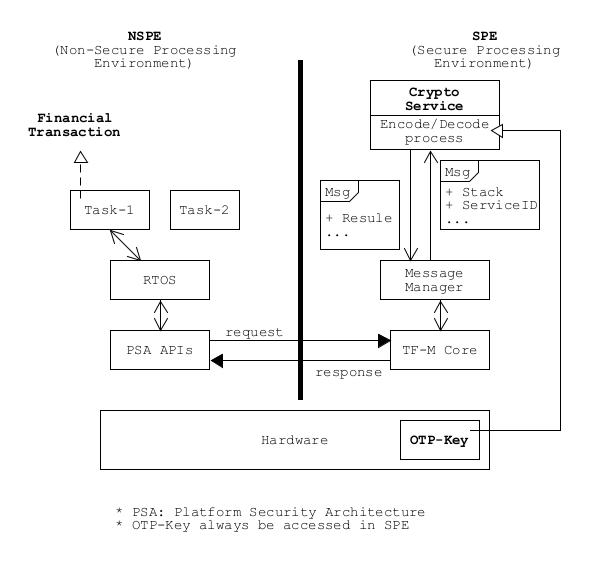
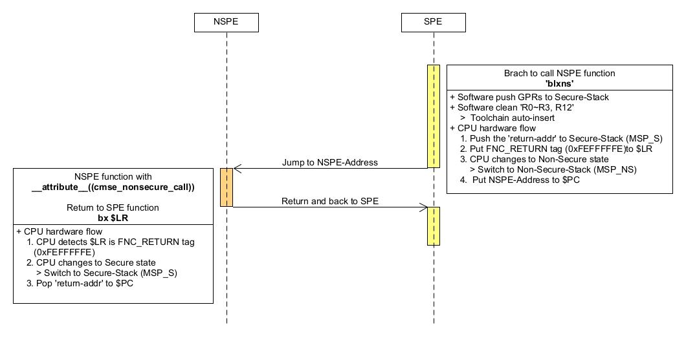
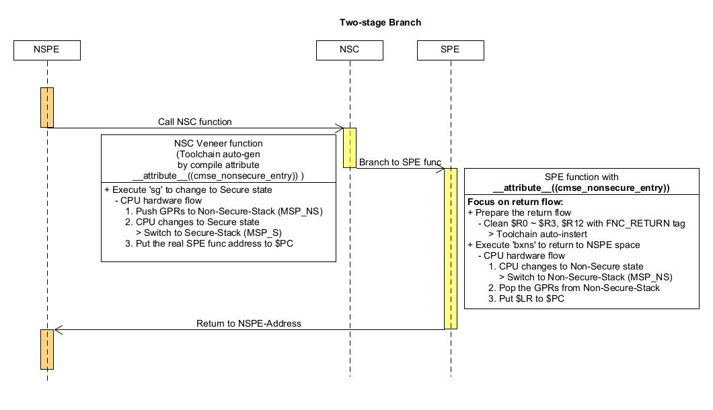

Trusted_Firmware-M
---

# Definitions
> [Glossary of terms and abbreviations](https://trustedfirmware-m.readthedocs.io/en/latest/glossary.html#term-SPE)

+ PSA (Platform Security Architecture)

+ MPU (Memory Protection Unit)
    > Hardware component providing privilege control.

+ NSPE (Non Secure Processing Environment)
    > In TF-M this means non secure domain typically running an OS using services provided by TF-M.

    - 在 NSPE 下, 非法呼叫 SPE 資源時, 會觸發 Exception (SecureFault)

+ SPE (Secure Processing Environment)
    > In TF-M this means the secure domain protected by TF-M.

+ NSC (Non-Secure-Callable)
    > 在 ARM TrustZone 的概念中, NSPE 是完全不知道 SPE 的存在, 也無法呼叫 SPE 內的 functions;
    但使用 SPE 內的資源(e.g. APIs, hardware)是必然存在的, 因此在 SPE memory 中開闢一個小區域 `NSC region`,
    利用 `NSC region` 來專門只做 wrap 的動作(兩階段跳轉, NSPE 先跳到 NSC region 再跳到 SPE),
    同時也可藉 `NSC region` 來做 Secure mode 切換, 進一步保護 SPE 中的 binary data

    > 這些在 `NSC region` 的 re-direct APIs 被稱為 `veneer functions` or `SG stups`

    >> hacker 可藉由搜尋 SPE binary data 中, 與 `sg instruction` op-code 相同數值的 data 位址,
    再將 $PC 指到這個 data address 執行 (把 data 當指令執行, 來打開 SPE mode), 藉此來繞過預設的 APIs 入口

+ REE (Rich Execution Environment)
    > REE 必須透過特定接口, 向 TEE 發出請求, 以確保敏感資料不外洩

    - 定義: 通用的作業系統環境(如 Android, iOS, Windows)
    - 特點: 功能豐富, 高度開放, 但容易受到惡意軟體攻擊, 安全性較低
    - 用途: 處理日常應用程式, UI 界面, 瀏覽器等

+ TEE (Trusted Execution Environment)
    - 定義: 隔離於 REE 之外, 受硬體保護的安全區域(通常基於 ARM TrustZone 技術)
    - 特點: 權限最高, 確保內部的程式與資料具備極高的機密性與完整性
    - 用途: 處理敏感操作, 如生物識別(指紋/臉部比對), 行動支付驗證, 數位版權管理 (DRM) 及密鑰加密


# Conception

Cortex-M33 core GPRs <br>


Architecture of Trusted Firmware-M <br>



## Secure Boot

Secure boot 最主要的目的, 就是防止系統使用到惡意的程式
> 在開機流程中, boot-code 會先透過密碼學(cryptography)演算法, 驗證是否為可信任的的程式,
如果驗證成功即會開始執行, 否則中止流程



+ BL-1 (Bootloader 1)
    > 此階段主要是必要的硬體初始化或設定, 因此 BL1 必須是可信任且不可被竄改.
    執行完初始化後, 就會跳到 BL2 的 entry point 繼續執行 BL2

+ BL-2 (Bootloader 2)
    > BL2 負責其他所需的初始化操作, 例如啟動 MCUboot 前所需的設定或檢查, 接著就會把執行交給 MCUboot

+ MCUboot
    > MCUboot 是針對 32-bits MCU 所設計的 Secure-Bootloader, 其中包含**完整的程式驗證流程**,
    因此也是 Trusted Firmware-M Secure-Boot 流程的核心.
    >> 而 MCUboot 本身就是獨立的 open source project, 因此也能移植到其他 project

+ TF-M Core
    > + TF-M Core 會依據 memory layout, 放在指定的 Flash Address，而 MCUboot 會先去該 Address 取得 TF-M Core 的 Binary data, 並進行相關驗證確認.
    >> 如果 Binary data 已被加密, 也會在這階段進行解密
    >
    > + 在確認完 TF-M 是正確且可信任後, 才會載入 TF-M Core

    > 要注意的是, Trusted Firmware-M 手冊中有提到, 驗證和解密所需 key, 建議放在 OTP 中,以確保不可修改

    > 此外, 由於需要在載入 TF-M Core 前, 就需要對 TF-M Binary data 進行驗證,
    因此需要 **只獨立存在 SPE 中的 crypto API, 來處理驗證與加解密**
    >> 在 BL-2 階段需設定好必要的 hardware/software

+ RTOS
    > 最後階段載入 App (with/without RTOS)
    >> 此時同樣需要驗證解密, 確認正確無誤後, 才能載入執行


## 業界常見的啟動流程

### 單核心

```
Power_On -> BL1 (ROM if exsit)
         -> BL2 (MCUboot 驗證 tfm_s/tfm_ns)
         -> tfm_s (初始化安全環境)
         -> tfm_ns (運行應用程序)
```

+ BL1 (ROM) 階段
    > Vendor 對 SoC 設計

+ BL2 (MCUboot) 階段
    > 檢查 Secure (tfm_s) 與 Non-Secure (tfm_ns) ImgBin 的簽章,
    如果驗證通過, BL2 會準備好跳轉環境, 並將控制權移交給 tfm_s->entry

+ tfm_s (SPE) 階段
    - System-Core 預設進入 `Secure state`
    - 配置 TrustZone 的安全邊界(e.g. SAU, MPC, PPC, ...etc.)
    - 啟動 Secure Partition Manager (SPM)
        > 負責管理安全分區(e.g. Crypto, Storage, Attestation, ...etc)

    - 一切安全服務就緒後, TF-M 會執行狀態切換指令(e.g. `BXNS`), 跳轉至 tfm_ns->entry

+ tfm_ns (NSPE Application) 階段
    > 一般 User Application

    - 當需要安全功能(e.g. 存取金鑰或加密)時, 透過 `PSA API` 發起請求, 經由 IPC 機制切換到 SPE 處理

### 多核心

區分 `Secure Core + Non-Secure Core`
> Secure Core 需要負責 wake-up Non-secure Core

```
Power_On -> BL1 (ROM if exsit)
         -> BL2 (MCUboot of Secure Core)
         -> tfm_s (Secure Core, 初始化安全環境)
            -> initialize Mailbox/IPC of SPE side
            -> Release Reset of Non-secure Core (啟動 Non-secure Core)
         > tfm_ns (Non-secure Core)
            -> initialize Mailbox/IPC of NSPE side
```
+ BL1 (ROM) 階段
    > Vendor 對 SoC 設計

+ Secure Core: BL2 (MCUboot)
    > 通常一上電只有 Secure Core 會先從 `Reset_Handler` 執行

    - BL2 運行於 Secure Core, 負責驗證位於 Flash 中的 tfm_s (Secure) 與 tfm_ns (Non-secure) 的 ImgBin
        > 基於成本考量, 會利用 MPU (Memory Protection Unit) 來限制 Non-secure Core 的 Memory (Flash/SRAM) 存取區域
        >> 有些設計會分開 tfm_s/tfm_ns 的實體 Flash

    - 如果驗證通過, BL2 會準備好跳轉環境, 並將控制權移交給 tfm_s->entry

+ Secure Core: TF-M SPE (tfm_s)
    - 配置 TrustZone 的安全邊界(e.g. SAU, MPC, PPC, ...etc.)
    - 啟動 Secure Partition Manager (SPM)
        > 負責管理安全分區(e.g. Crypto, Storage, Attestation, ...etc)
    - 初始化 Mailbox/IPC 溝通機制 (on Secure Core Side)
    - 一切就緒後, Secure Core 的tfm_s 會發出硬體指令(e.g. 設定系統控制暫存器, 發送中斷, ...),
    解除 Non-secure Core 的 Reset 狀態 (喚醒 Non-secure Core)

+ Non-secure Core: Application (tfm_ns)

    - Non-secure Core 被喚醒後, 直接從 tfm_ns 的起始位址執行
    - 初始化 Mailbox/IPC 溝通機制 (on Non-Secure Core Side)
    - 當需要安全功能時, 會透過 Mailbox/IPC, 將請求傳送給 Secure Core 的 tfm_s 處理

## Handshake between SPE and NSPE



# Hardware Implementation with ARM

## Attribution units

```
                   +-------+
                   | CM-33 |
                   +-------+
                       |
                       V
      +-------------------------------+
      |     SAU        /     IDAU     |
      | (S/w Setting)  / (H/w Config) |
      +-------------------------------+
                       |
                       | transation
            +----------+----------+
            |                     |
            V                     V
        +--------+          +------------+
        | Secure |          | Non-Secure |
        |  MPU   |          |     MPU    |
        +--------+          +------------+
            |                     |
            |                     |
            +----------+----------+
                       |
                       V
    +-----------------------------------------+
    |                  AHB Bus                |
    +-----------------------------------------+

```

依照 destination address 的 Secure space, 決定 transation 的屬性 (Secure/Non-Secure),
再依照 transation 屬性, 決定轉發給 MPU_S 或是 MPU_NS, 通過 MPU 審查的 transation 才能發往 BUS

+ Instruction access (I-Bus)
    > SAU/IDAU 對此不會限制

+ Data access (D-Bus)
    > 當 NSPE 要求訪問 SPE 數據時, SAU/IDAU 會阻擋這個訪問


### IDAU (Implementation Defined Attribution Unit)
IDAU 用來指示 CPU, Memory Address Area 是 Secure/Non-Secure/Non-Secure-Callable
> 使用 Address_bit[28] 來標示 Secure type (Vendor 可自行定義, ARM 原生定義 0: Non-Secure, 1: Secure)

+ IDAU 是位於 CPU 與 AMBA-BUS 間的的 Hardware module, 使用 Hard-Code Configuration
    > 電路就決定 Memory Area 的 Secure type

### SAU (Security Attribution Unit)

SAU 提供在 run-time 的情況下, 可重新更改 Secure type
> **最終的 Secure type, 是取 IDAU 和 SAU 兩者中, 最高的安全等級**

> 安全等級 `Secure(S) > Non-Secure-Callable(NSC) > Non-Secure(NS)`
>> `NSC`代表次一級的 Secure mode (在 SPE 中, 但允許被 NSPE 呼叫): 允許 NS code 透過 `SG` instruction, 跳轉到 NSC Region 並轉為 Secure state

+ SAU 也是位於 CPU 與 AMBA-BUS 間的的 Hardware module, 但可使用 Registers 來動態配置

+ SAU region 偵測會拖慢 CPU 效能, 因此經綜合考量後, 搭配 IDAU 的硬體 hard code 設定, 一般將 SAU Region 數量會訂為 8, 以達到比較平衡的效能
    > 用 IDAU 設定幾個較大的 memory region, 配合 memory alias address, 讓 CPU 對不同的 mapping addresses 做不同的處理方式

+ SAU Registers
    > SAU **ONLY** be accessed in SPE

    >> `gdb) p/x *((SAU_Type*)0xE000EDD0)`

    | Address     | SAU Register | Type |  Description
    | :-:         | :-:          | :-:  | :-
    | 0xE000EDD0  | SAU_CTRL     |  RW  | SAU Control Register.
    | 0xE000EDD4  | SAU_TYPE     |  RO  | Indicates the number of available region.
    | 0xE000EDD8  | SAU_RNR      |  RW  | SAU Region Number Register. Selects a region.
    | 0xE000EDDC  | SAU_RBAR     |  RW  | SAU Region Base Address Register
    | 0xE000EDE0  | SAU_RLAR     |  RW  | SAU Region Limit (End) Address Register


    - SAU_CTRL
        > + `SAU_CTRL.ENABLE` 是 Global SAU 開關
        > + `SAU_CTRL.ALLNS` 是所有 Regions 預設的 Secure type

        | Bits   | Field    |  Description
        | :-:    | :-:      | :-
        | [31:2] | Reserved | Reserved – read as 0 (RES0)
        | 1      | ALLNS    | All Non-secure <br> 當 SAU_CTRL.ENABLE 為 0 時, 這個 ALLNS 控制整個 Secure type 為 SPE (vlaue: 0) 或 NSPE(value: 1)
        | 0      | ENABLE   | Enable SAU, (0: disable, 1: enable)

    - SAU_TYPE

        | Bits   | Field    |  Description
        | :-:    | :-:      | :-
        | [31:8] | Reserved	| Reserved
        | [7:0]	 | SREGION	| SAU regions. 說明 SAU region 的數量

    - SAU_RNR (Region Number)
        > 將 SAU_RBAR/SAU_RLAR 切換到對應的 Region registers

        | Bits   | Field    |  Description
        | :-:    | :-:      | :-
        | [31:8] | Reserved | Reserved
        | [7:0]  | REGION   | Region number. Indicates the SAU region that SAU_RBAR and SAU_RLAR accesses

    - SAU_RBAR (Region Base Address)

        | Bits   | Field    |  Description
        | :-:    | :-:      | :-
        | [31:5] | BADDR    | Base address. Holds bits [31:5] of the base address for the selected SAU region
        | [4:0]  | Reserved | Reserved

    - SAU_RLAR (Region Limit Address)
        > `SAU_RLAR.ENABLE` 使否啟用此 Region 的 SAU,
        當 `SAU_RLAR.ENABLE = 0` 時, 則 Secure type 由 `SAU_CTRL.ALLNS` 決定

        | Bits   | Field    |  Description
        | :-:    | :-:      | :-
        | [31:5] | LADDR    | Limit address [31:5]. Bits [4:0] of the limit address are defined as 0x1F
        | [4:2]  | Reserved | Reserved
        | 1      | NSC      | 0: Disable Non-secure-callable, 1: Enable Non-secure-callable
        | 0      | ENABLE   | 0: Disabled SAU region, 1: Enable SAU region

+ Relation of SAU Security Attribution Configuration

    ```
                 SAU_CTRL.ENABLE (Global SAU Enable)
               0 |             | 1
                 V             V
        SAU_CTRL.ALLNS        SAU-Region Matched ?
         0 |        | 1       (SAU_RLAR.ENABLE = 1)
           |        |           N |            | Y
           |        |             |            |
           |        |             |            V
           |        |             |         SAU_RLAR.NSC
           |        |             |        0 |        | 1
           V        V             V          V        V
        Secure   Non-Secure     Secure   Non-Secure   Non-Secure-Callable
                                   ^
                                   |
                           (base on SAU_CTRL.ALLNS)
    ```


## Instruction to switch between SPE and NSPE

| Instruction   | Description   |
| :-:           | :-            |
| `SG`          | **Secure Gateway**<br> Used for switching from Non-secure to Secure state at the first instruction of Secure entry point |
| `BXNS`        | **Branch with eXchange to Non-Secure state** <br> Used by Secure software to branch or return to Non-secure program |
| `BLXNS`       | **Branch with Link and eXchange to Non-Secure state** <br> Used by Secure software to call Non-secure functions |


### `sg` instruction

`sg` 為 NSPE 進入 SPE 時, 第一個執行的 instruction, 用來切換到 SPE mode.
> 為了避免非法程式, 藉由搜尋 `sg op-code` 來分析破解 SPE binary data,
將 呼叫`sg`的程式, 集中放到特定的 `NSC region`, 並進行**兩階段跳轉到 SPE**


```asm
/* the SG-stups in NSC region */
100019c0 <sec_sum>:
100019c0:  e97f e97f  sg                                 <--- 切換 Secure space
100019c4:  f7ff ba7a  b.w  10000ebc <__acle_se_sec_sum>  <--- 跳轉到對應 SPE space 的 address

/* The real instance in SPE region */
10000ebc <__acle_se_sec_sum>:
10000ebc:   b508        push    {r3, lr}
10000ebe:   4806        ldr r0, [pc, #24]   ; (10000ed8 <__acle_se_sec_sum+0x1c>)
10000ec0:   f000 f866   bl  10000f90 <printf>
10000ec4:   e8bd 4008   ldmia.w sp!, {r3, lr}
10000ec8:   4670        mov r0, lr              <--+
10000eca:   4671        mov r1, lr                 |
10000ecc:   4672        mov r2, lr                 |--- CPU clear r0~r3 and ip(r12),
10000ece:   4673        mov r3, lr                 |    此時 $lr 為 FNC_RETURN
10000ed0:   46f4        mov ip, lr              <--+
10000ed2:   f38e 8c00   msr CPSR_fs, lr         <--- 真正的指令: msr APSR_nzcvq, lr (toolchain version issue),
                                                     為了清除 CPU 狀態暫存器
10000ed6:   4774        bxns    lr              <--- 從 SPE 跳轉到 NSPE 時, 使用 'bxns'
10000ed8:   10000a60    .word   0x10000a60
```

NSPE 呼叫 `sec_sum` function 時, 先進入 NSC region, 切換到 SPE mode (`sg instruction`),
再跳轉到 SPE space 中的 `sec_sum() instance`
> Toolchain 會自動將 SPE space 的 symbol name 加上 prefix `__acle_se` (e.g. `sec_sum` -> `__acle_se_sec_sum`)

## Switch procedure between SPE and NSPE

SPE 和 NSPE 可以互相呼叫對方的 functions
> 只要 IRQ priority 夠高, 都有可能在任何執行狀況下, 被對方的 IRQ 來中斷目前執行的程序.
但為了維持 Secure status, 在進入對方 space 時, 都需特別處理

> 在 SPE 和 NSPE 切換時, 是透過以下配合來完成
> + new-instructions (e.g. sg, bxns, blxns)
> + new-register-flag (Cortex-M33 core GPRs, xxx_S and xxx_NS)
> + software 橋接


+ SPE 呼叫 NSPE function

    

+ NSPE 呼叫 SPE function

    


`FNC_RETURN (0xFEFFFFFE)` 是一個 hardware 檢查的特殊 tag, 用來隱藏 SPE 中, 真正的 address
> + 如果 NSPE 在沒有被 SPE 呼叫的情況下, 自主執行 `bx 0xFEFFFFFE`,
CPU 會偵測到 `Secure Stack` 中, 並沒有對應的有效返回記錄(Stack Frame 錯誤),
此時會立刻觸發 `SecureFault exception`, 直接鎖死或重啟系統

> + 在 Nested interrupt 中, CPU 會確保 `FNC_RETURN` push/pop 的順序是符合 LIFO (Last Input First Output)


+ Interrupt 可以發生在 SPE 或 NSPE 的程序中, 因此 CPU 會將 GPRs push 到目前 Secure state 的 stack (MSP_S/PSP_S/MSP_NS/PSP_NS) 中
    > 如果 Interrupt 是 SPE 往 NSPE ISR 時 (SPE 資訊不能外流), CPU 自己會將重要的內部 common registers (e.g. GPRs, xPSR) 清除


### CMSE (Cortex-M Secure Extension) of ARMv8-M of ARM GCC

在編譯時, 加上 `-mcmse` option flag 讓 ARM-GCC 啟用 CMSE 功能,
此時 ARM-GCC 會將 SPE APIs 的 instances 放在對應的 `.txt section`,
而 `veneer functions (or SG stups)` 則被放到 `.gnu.sgstubs section`

```linkscript
// Linkerscript Section for TrustZone Secure Gateway veneers
.gnu.sgstubs : ALIGN (32)
{
    . = ALIGN(32);
    _start_sg = .;
    *(.gnu.sgstubs*)
    . = ALIGN(32);
    _end_sg = .;
} > SECURE_FLASH
```

| 特性      |    `__attribute__((cmse_nonsecure_entry))`  | `__attribute__((cmse_nonsecure_call))`
| :-:      | :-                                         | :-
| 定義位置  |  寫在安全端(Secure)的函數宣告上              | 寫在安全端(Secure)的函數指標上
| 通俗定義  |  **我是SPE func,允許 NSPE 端來呼叫我**      | **我是 SPE，我要透過這個 func-pointer 去呼叫 NSPE func**
| 安全模式  |  NSPE -> SPE                               |    SPE -> NSPE
| 放置區域  |  該函數的 entry pointer 必須被放置於 NSC 區域 |   存在於一般的 Secure 區域 (呼叫外部 NS 區域)
| 關鍵指令  |  編譯器會自動在此函數開頭,插入 `SG` 指令     |   編譯器會使用 `BLXNS` 指令進行切換


+ `__attribute__((cmse_nonsecure_entry))`
    > 編譯器自動產生, 讓 NSPE 呼叫的 NSC veneer func (放在 `.gnu.sgstubs section`), 但實體放在 SPE memory 中

    ```c

    /**
     *  位於 Secure space 中
     *  Non-Secure side 可以直接呼叫這個函數來對資料進行解密
     */
    __attribute__((cmse_nonsecure_entry))
    uint32_t Secure_Decrypt_Data(uint32_t *cipher, uint32_t len)
    {
        // 執行安全加密運算...
        return status;
    }
    ```

+ `__attribute__((cmse_nonsecure_call))`
    > 宣告讓 SPE 呼叫的 NSPE func

    ```
    /**
     *  位於 Secure space 中
     *  + 定義一個特殊的 func-pointer of Non-Secure
     */
    typedef void __attribute__((cmse_nonsecure_call)) ns_callback_t(uint32_t);

    void Secure_Process(uint32_t ns_func_addr)
    {
        // 將 Non-Secure 的地址轉型為 func-pointer (強制清除 Bit 0 標記為非安全地址)
        ns_callback_t   NS_Callback = (ns_callback_t)(ns_func_addr & ~1UL);

        // 在 Secure space 中, 呼叫 Non-Secure func, 此處會觸發暫存器清洗與 BLXNS 指令
        NS_Callback(42);
    }
    ```


**SPE 和 NSPE 是個別編譯並燒錄**, 通常 SPE 會提供 header/object file 給 NSPE.
> + header file: 宣告 `veneer functions (or SG stups)`
> + object file (e.g. CMSE_importLib.o): `veneer functions (or SG stups)` 的 machine code

使用 ARM-GCC linker 來產生 `CMSE_importLib.o`

```
# 產生新的 CMSE_importLib.o
$ arm-none-eabi-gcc -Xlinker --cmse-implib \
    -Xlinker --sort-section=alignment \
    -Xlinker --out-implib=CMSE_importLib.o


# 使用 '--in-implib', 在原本的 CMSE_importLib.o 中, 新增 veneer functions
$ arm-none-eabi-gcc -Xlinker --cmse-implib \
    -Xlinker --sort-section=alignment \
    -Xlinker --in-implib=CMSE_importLib.o

```

ARMv8-M CMSE lib 提供了 `cmse_check_address_range()` 來檢查 address 是否完全在 NSPE space
> 需使用 `arm_cmse.h`

+ 底下是一個 example, 它 run-time 從 NSPE 呼叫 SPE API 再 callback 到 NSPE
    > 其中 `__attribute__((cmse_nonsecure_entry))` 讓編譯器自行產生 NSC 的 veneer functions,
    而 `__attribute__((cmse_nonsecure_call))` 則讓編譯器在返回到 NSPE 時, 使用 `bxns/blxns`並加入清除 GPRs 的 assembly code,
    使用 `cmse_check_address_range()` 讓 SPE 的核心程式,
    在收到 NSPE 傳來的 address 時, 檢查該 address 是否安全且是否符合 NSPE 的存取權限,以防止**惡意指標欺騙**

    > `CMSE_AU_NONSECURE/ CMSE_MPU_NONSECURE/ CMSE_NONSECURE` 差異:
    >
    > | type                                | 檢查的核心目標                                           |  典型使用場景
    > | :-:                                 | :-                                                      |:-
    > | CMSE_AU_NONSECURE(Attribute-Unit)   | 確保此 Address 在硬體 SAU 上,是 NSPE 區域                 | 僅需驗證硬體隔離邊界
    > | CMSE_MPU_NONSECURE                  | MPU 對該 address 的存取權限                              |  網域存取且需考量 NSPE OS 的 MPU 限制
    > | CMSE_NONSECURE                      | 雙重確認上述兩項: 既是硬體 NSPE區域, NSPE 的 MPU 也允許存取 | 最推薦; 在SPE 入口函式, 驗證 NSPE 傳入的資料指標


    ```c
    /*
     * some c file of secure firmware project defining veneer gateway functions
     * must compiled with -mcmse gcc flag (!)
     */

    #include "arm_cmse.h"   <--- cmse lib header

    typedef void (*funcptr_ns) (void) __attribute__((cmse_nonsecure_call));

    void ControlCriticalIO(funcptr_ns  callback_fn) __attribute__((cmse_nonsecure_entry))
    {
        funcptr_ns  cb_ns_method = callback_fn;    // save volatile pointer from non-secure code

        // check if given pointer to non-secure memory is actually non-secure as expected
        cb_ns_method = cmse_check_address_range(cb_ns_method, sizeof(cb_ns_method), CMSE_NONSECURE);

        if( cb_ns_method != 0 )
        {
            /* do some critical things e.g. use other secure functions */
            cb_ns_method(); // invoke non-secure call back function
        }
        else
        {
            // do nothing if pointer is incorrect
        }
    }
    ```


當封裝成 lib (*.a) 時, 需使用 `whole-archive` linker 選項, 這樣 CMSE import lib 才會加入 veneer functions
　
## Exception and Interrupt

SPE 和 NSPE 都有自己獨立的 Interrupt vector table(Register: VTOR_S/VTOR_NS)
> CPU 會依照 interrupt 設定 (NVIC_ITNS Register), 將 IRQ 對應到所屬的 `Vector Table of Secure state (SPE or NSPE)`
>> 從 SPE 中斷到 NSPE ISR 時, CPU 為了清除 GPRs, 會造成一定程度的中斷響應延遲(12T 延遲到 21T)


```c
__Vector[] =
{
    _estack,
    Reset_Handler,
    NMI_Handler,        <--- SCB_AIRCR->BFHFNMINS 決定
    HardFault_Handler,  <--- SCB_AIRCR->BFHFNMINS 決定
    MemManage_Handler,  <--- SCB_SHCSR/SCB_NS_SHCSR 各自 enable/disable
    BusFault_Handler,   <--- SCB_AIRCR->BFHFNMINS 決定
    UsageFault_Handler, <--- SCB_SHCSR/SCB_NS_SHCSR 各自 enable/disable
    SecureFault_Handler, <--- Only on SPE (hard code)
    0,
    0,
    0,
    SVC_Handler,        <--- NSEP/SPE 各自獨立
    DebugMon_Handler,
    0,
    PendSV_Handler,     <--- NSEP/SPE 各自獨立
    SysTick_Handler,    <--- NSEP/SPE 各自獨立
    //==== external interrupt ====
    ...

}
```

### SCB_AIRCR (Application Interrupt and Reset Control Register)

> Configurate **Exceptions**

+ Bit-field `PRIS (Priority Secure)`
    > `PRIS = 1` 時, 強制將所有 Non-Secure Interrupt 的 priority 降級,
    確保所有 Secure Interrupt 都會優先於 Non-Secure Interrupt

+ Bit-field `BFHFNMINS (BusFault/HardFault/NMI Non-Secure enable)`
    > 決定 BusFault/HardFault/NMI handler 由 SPE 還是 NSPE 來處理

    - `BFHFNMINS = 0 (default)`
        > 一律強制進入 SPE 處理

    - `BFHFNMINS = 1 (實務上推薦)`
        > SPE/NSPE 各自處理自己的 BusFault/HardFault/NMI exceptions

        1. 避免 NSPE 的錯誤, 導致整個系統癱瘓
            > 如果都給 SPE 處理時, 會造成 SPE 必須同時考慮 NSPE 可能發生的各種錯誤,
            甚至可能造成整個 system crash

### SCB_x->SHCSR, x= S or NS (System Handler Control and State Register)

> Configurate **Exceptions**

SPE/NSPE 各自開啟, 是否進入 MemManageFault, UsageFault handler, 否則自動導向到 HardFault

+ `SecureFault` 只能在 SPE 中開啟

    - Scenario: NSPE 程序企圖越界讀取 SPE 記憶體
        1. 當 NSPE 程序試圖存取 Secure region

            ```
            // '0x30000000' is defined Secure region by IDAU/SAU
            uint32_t secret = *(uint32_t*)(0x30000000);
            ```
        1. SAU 阻斷這項存取, 並觸發最高級別的 `SecureFault`
        1. 雖然 `BFHFNMINS = 1`, 但因為是安全違規, hardware 強制無視該設定, CPU 立刻跳進 SPE 的 SecureFault_Handler
        SPE 端可以判定為, NSPE 端正在遭受駭客攻擊, 直接執行晶片鎖死(Lockup)或抹除關鍵金鑰


### NVIC_ITNS [16] (Interrupt Non-Secure State Register)

> Configurate external **Interrupts**

IRQ index 對應到 NVIC_ITNS[16] 的 bit order, NVIC_ITNS 只能在 Secure 狀態下進行讀寫, Non-Secure 狀態完全無法存取此暫存器,
這確保了 NSPE 的惡意軟體無法篡改中斷的安全級別

+ `0` (default): 該中斷屬於 Secure 屬性
    > 中斷觸發時, CPU 會跳轉到 Secure 空間的`VTOR_S`, 且只有在 Secure 狀態(或透過 NS 委託)下才能處理

+ `1`: 該中斷屬於 Non-Secure 屬性
    > 中斷觸發時, CPU 會直接跳轉到 Non-Secure 空間的 `VTOR_NS`, 由普通域的作業系統(e.g. FreeRTOS)或應用程式自行處理


# Practice

## Setup development environment

+ dependencies
    > + **CMake version 3.21 or later**
    > + **Python version 3.12 or later**

    ```
    $ sudo apt-get install -y git curl wget build-essential libssl-dev cmake make
    $ sudo apt install ninja-build
    $ sudo apt install python3.12 python3.12-pip python3.12-venv python3.12-dev
    $ sudo apt install gdb-multiarch

    $ cd <user-local-tf-m_dir>
    $ python3 -m venv .venv
    $ source .venv/bin/activate
    $ cd <user-local>/trusted-firmware-m/tools
    $ pip install -r requirements.txt

    # if necessary
    $ pip uninstall requirements.txt
    ```

+ download source code
    > Use `ver: TF-Mv1.8.1`
    >> involve SPE(Secure Processing Environment) and NSPE (Non Secure Processing Environment)

    ```
    $ git clone https://git.trustedfirmware.org/TF-M/trusted-firmware-m.git
    $ git checkout TF-Mv1.8.1  # use GNU Arm Embedded Toolchain 11.2-2022.02
        or
    $ git checkout TF-Mv1.4.0  # STM base on TF-Mv1.4.0 to develop
    ```

+ build
    > `xxx_signed.bin` 表示含有 img header info (for verification)

    - create `z_build_tfm.sh`

        1. without BL2

            ```
            #!/bin/bash

            cmake -S . -B out \
                -DTFM_PLATFORM=arm/mps2/an521 \
                -DTFM_TOOLCHAIN_FILE=toolchain_GNUARM.cmake \
                -DCMAKE_BUILD_TYPE=Debug \
                -DTEST_NS=ON \
                -DTEST_S=ON \
                -DTFM_PSA_API=ON \
                -DBL2=OFF

            cd out
            make
            ```

            ```
            $ cd <user-local>/trusted-firmware-m/out/bin
            $ ls
                tfm_ns.axf  tfm_ns.bin  tfm_ns.elf  tfm_ns.hex  tfm_ns.map
                tfm_s.axf  tfm_s.bin  tfm_s.elf  tfm_s.hex  tfm_s.map

            ```

        1. with BL2

            ```
            #!/bin/bash

            cmake -S . -B out \
                -DTFM_PLATFORM=arm/mps2/an521 \
                -DTFM_TOOLCHAIN_FILE=toolchain_GNUARM.cmake \
                -DCMAKE_BUILD_TYPE=Debug \
                -DTEST_NS=ON \
                -DTEST_S=ON \
                -DTFM_PSA_API=ON \
                -DBL2_HEADER_SIZE=0x020 \
                -DBL2=ON

            cd out
            make
            ```

            ```
            $ cd <user-local>/trusted-firmware-m/out/bin
            $ ls
                bl2.axf  bl2.elf  bl2.map     tfm_ns.bin  tfm_ns.hex  tfm_ns_signed.bin  tfm_s.bin  tfm_s.hex  tfm_s_ns_signed.bin
                bl2.bin  bl2.hex  tfm_ns.axf  tfm_ns.elf  tfm_ns.map  tfm_s.axf          tfm_s.elf  tfm_s.map  tfm_s_signed.bin

            # 'xxx_signed' 表示含有 img healder info
            # tfm_s_ns_signed.bin = bl2.bin + tfm_s_signed.bin + tfm_ns_signed.bin
            ```


## Qemu

+ `MPS2-AN521` board

    - `MPS2-AN521` Flash 的 Secure Mapping Start Address 通常是 0x1000_0000
        > ref: `trusted-firmware-m/platform/ext/target/arm/mps2/an521/partition/flash_layout.h`


+ Create `z_qemu_server.sh`

    - without BL2

        ```
        #!/bin/bash

        TARGET_SECU="<user-local>/trusted-firmware-m/out/bin/tfm_s.elf"
        TARGET_NON_SECU_BIN="<user-local>/trusted-firmware-m/out/bin/tfm_ns.bin"
        TARGET_BL2_BIN="<user-local>/trusted-firmware-m/out/bin/bl2.bin"
        TARGET_FULL_BIN="<user-local>/trusted-firmware-m/out/bin/tfm_s_ns_signed.bin"

        # only tfm_s and tfm_ns
        qemu-system-arm \
            -M mps2-an521 \
            -kernel ${TARGET_SECU} \
            -device loader,file=${TARGET_NON_SECU_BIN},addr=0x00100000 \
            -nographic -s -S

        ```

    - with BL2 (?)

        ```
        #!/bin/bash

        TARGET_SECU="<user-local>/trusted-firmware-m/out/bin/tfm_s.elf"
        TARGET_BL2="<user-local>/trusted-firmware-m/out/bin/bl2.elf"

        TARGET_SECU_BIN="<user-local>/trusted-firmware-m/out/bin/tfm_s_signed.bin"       # bin_base: 0x10080020
        TARGET_NON_SECU_BIN="<user-local>/trusted-firmware-m/out/bin/tfm_ns_signed.bin"  # bin_base: 0x00100020
        TARGET_BL2_BIN="<user-local>/trusted-firmware-m/out/bin/bl2.bin"                 # bin_base: 0x10000000
        TARGET_FULL_BIN="<user-local>/trusted-firmware-m/out/bin/tfm_s_ns_signed.bin"

        # only BL2 ok
        qemu-system-arm \
            -M mps2-an521 \
            -kernel ${TARGET_BL2} \
            -nographic -s -S

        # BL2 + tfm_s ok
        qemu-system-arm \
            -M mps2-an521 \
            -kernel ${TARGET_BL2} \
            -device loader,file=${TARGET_FULL_BIN},addr=0x10080000 \
            -nographic -s -S

        # full load (? why does tfm_ns NOT work ? )
        qemu-system-arm \
            -M mps2-an521 \
            -device loader,file=${TARGET_BL2_BIN},addr=0x10000000 \
            -device loader,file=${TARGET_SECU_BIN},addr=0x10080000 \
            -device loader,file=${TARGET_NON_SECU_BIN},addr=0x00100000 \
            -nographic -s -S
        ```


+ Create `z_qemu_gdb.sh`

    - without BL2

        ```bash
        #!/bin/bash

        TARGET_SECU=<user-local>/trusted-firmware-m/out/bin/tfm_s.elf
        TARGET_NON_SECU=<user-local>/trusted-firmware-m/out/bin/tfm_ns.elf
        TARGET_BL2=<user-local>/trusted-firmware-m/out/bin/bl2.elf

        cgdb -d gdb-multiarch ${TARGET_SECU} \
            -ex "target remote:1234" \
            -ex "add-symbol-file ${TARGET_NON_SECU}" \
            -ex "layou asm" \
            -ex "winheight cmd +15" \
            -ex "b tfm_ns_platform_init"

        # arm-none-eabi-gdb -tui ${TARGET_SECU} \
        #     -ex "target remote:1234" \
        #     -ex "add-symbol-file ${TARGET_NON_SECU}" \
        #     -ex "b tfm_ns_platform_init"

        ```


    - with BL2 (?)

        ```bash
        #!/bin/bash

        TARGET_SECU=<user-local>/trusted-firmware-m/out/bin/tfm_s.elf
        TARGET_NON_SECU=<user-local>/trusted-firmware-m/out/bin/tfm_ns.elf
        TARGET_BL2=<user-local>/trusted-firmware-m/out/bin/bl2.elf

        #
        # + only bl2 case: ok
        # + full symbols : ?
        #
        cgdb -d gdb-multiarch ${TARGET_BL2} \
            -ex "target remote:1234" \
            -ex "add-symbol-file ${TARGET_NON_SECU}" \
            -ex "add-symbol-file ${TARGET_SECU}" \
            -ex "b main"
            -ex "b tfm_ns_platform_init"

        # arm-none-eabi-gdb -tui ${TARGET_SECU} \
        #     -ex "target remote:1234" \
        #     -ex "add-symbol-file ${TARGET_NON_SECU}" \
        #     -ex "b main"
        #     -ex "b tfm_ns_platform_init"
        ```


## Source code

+ common codes (system-core layer)

    - boot from `Reset_Handler`

        ```c
        // at trusted-firmware-m/platform/ext/target/arm/mps2/an521/cmsis_core/startup_an521.c: Reset_Handler
        void Reset_Handler(void)
        {
        #if defined (__ARM_FEATURE_CMSE) && (__ARM_FEATURE_CMSE == 3U)
            __disable_irq();
        #endif
            __set_PSP((uint32_t)(&__INITIAL_SP));

            __set_MSPLIM((uint32_t)(&__STACK_LIMIT));
            __set_PSPLIM((uint32_t)(&__STACK_LIMIT));

        #if defined (__ARM_FEATURE_CMSE) && (__ARM_FEATURE_CMSE == 3U)
            __TZ_set_STACKSEAL_S((uint32_t *)(&__STACK_SEAL));
        #endif

            SystemInit();                             /* CMSIS System Initialization */
            __PROGRAM_START();                        /* Enter PreMain (C library entry point) */
        }
        ```

### BL2 (MCUboot)

```
trusted-firmware-m/bl2/ext/mcuboot/bl2_main.c: main()
```

### TF-M SPE

```
trusted-firmware-m/secure_fw/spm/cmsis_psa/main.c: main()
```

### TF-M NSPE

> Clone repository (tfm_test) when build-time

```
./out/lib/ext/tfm_test_repo-src/app/main_ns.c: main()
./out/lib/ext/tfm_test_repo-src/app/test_app.c: test_app()
```

## Generator Expressions of CMake

+ `$<...>` 相當於 `C-language: (...)`

+ `BOOL` 運算子
    > 變數轉成 BOOL Type

    ```cmake
    $<BOOL:${CONFIG_ENABLE_MSG}>

    # BOOL 運算子會將變數 ${CONFIG_ENABLE_MSG} 轉換為 0 或 1
    # > 如果該變數被定義為 ON, TRUE, 1 或非空字串時, 則統一轉為 1
    ```

+ 三元運算子 (類似 C-language 中的 `? :`)

    ```cmake
    $< $<Condition> : Content>

    # 當 'Condition' == true, 傳回 Content
    # 當 'Condition' == false, 傳回 empty
    # 相當於 C-language: 'Condition ? Content : void;'
    ```

+ `STREQUAL` 運算子
    > 比較 string1 與 string2, 相同返回 true, 不同返回 false

    ```cmake
    $<STREQUAL: string1, string2>
    ```

+ `AND` 運算子
    > 所有條件都成立才返回 true, 否則為 false

    ```cmake
    $<AND: cond1, cond2, ...>
    ```

+ `NOT` 運算子
    > 反轉 boolean 結果


    ```cmake
    $<NOT: $<BOOL:${CONFIG_AAA}>>
    ```

# Reference

+ Armv8-M
    - [TrustZone technology for Armv8-M Architecture Version 2.1](https://developer.arm.com/documentation/100690/0201/)
    - [TrustZone technology for Armv8-M Architecture Version 2.1](https://developer.arm.com/documentation/100690/0201/)
+ STM32
    - [STM32L5 入門課程系列(一) 從 Cortex-M33 核心認識 TrustZone | STMCU 中文官網 --- STM32L5 入门课程系列(一) 从Cortex-M33内核认识TrustZone | STMCU中文官网](https://www.stmcu.com.cn/ecosystem/chip/chipfamily-STM32L5)


+ [Using the ARMv8-M TrustZone with GCC – Lobaro.com](https://www.lobaro.com/using-the-armv8-m-trustzone-with-gcc/#)
    - [ARMV8-M TRUSTZONE的基本概念 - 代码复刻版](https://linmingjie.cn/index.php/archives/285/)

+ IoT 安全基礎知識
    - [IoT 安全基礎知識第 1 篇 | DigiKey](https://www.digikey.tw/zh/articles/iot-security-fundamentals-part-1-using-cryptography)
    - [IoT 安全基礎知識：第 2 篇 | DigiKey](https://www.digikey.tw/zh/articles/iot-security-fundamentals-part-2-protecting-secrets)
    - [IoT 安全基礎知識：第 3 篇 | DigiKey](https://www.digikey.tw/zh/articles/iot-security-fundamentals-part-3-ensuring-secure-boot-and-firmware-update)
    - [IoT 安全基礎知識：第 4 篇 | DigiKey](https://www.digikey.tw/zh/articles/iot-security-fundamentals-part-4-mitigating-runtime-threats)
    - [IoT 安全基礎知識第 5 篇 | DigiKey](https://www.digikey.tw/zh/articles/iot-security-fundamentals-part-5-connecting-securely-to-iot-cloud-services)

+ [Trusted Firmware-M Documentation — Trusted Firmware-M Unknown documentation](https://trustedfirmware-m.readthedocs.io/en/latest/index.html)
    - [Building default configuration for an521](https://trustedfirmware-m.readthedocs.io/en/latest/building/tfm_build_instruction.html#building-default-configuration-for-an521)

+ [Understanding ARM Trusted Firmware using QEMU](https://lnxblog.github.io/2020/08/20/qemu-arm-tf.html)
+ [ARM Trusted Firmware-M (TF-M): build and run on QEMU - YouTube](https://www.youtube.com/watch?v=Tn9O44ur_xs)
+ [一文熟悉Trusted Firmware-M - 知乎](https://zhuanlan.zhihu.com/p/651683753)

+ MCUboot
    - [MCUboot | mcuboot](https://docs.mcuboot.com/)
    - [GitHub - STMicroelectronics/stm32-mw-mcuboot: MCUboot is an OS- and HW-independent secure bootloader for 32-bit MCUs aiming at defining a common infrastructure for the bootloader and the system flash layout on microcontroller systems, and at providing a secure bootloader that enables simple software upgrades. · GitHub](https://github.com/STMicroelectronics/stm32-mw-mcuboot/tree/main)
