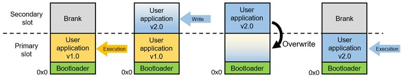
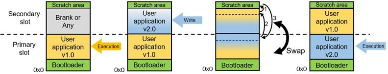
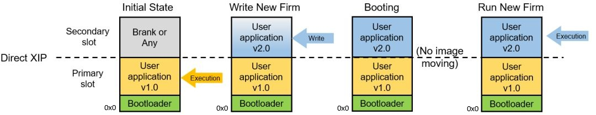
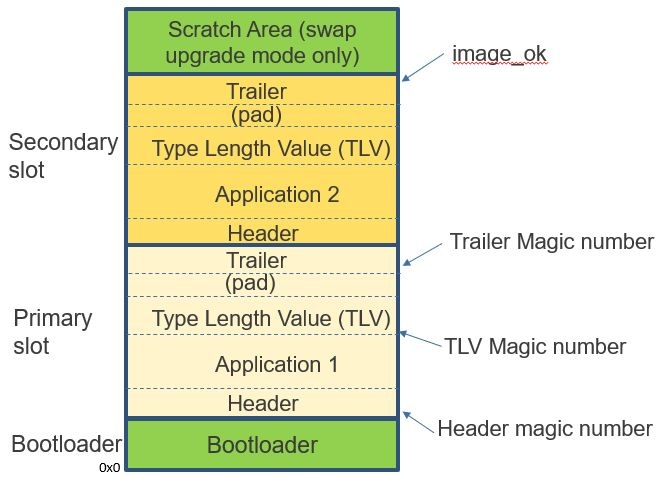

MCUBoot
---

# Upgrade of MCUboot

MCUboot支援的四種升級模式, 分別是
+ Overwrite
+ Swap
+ Direct XIP (Execute In Place)
+ Load to SRAM and Execute

## Upgrade Modes

### Overwrite



對於 Overwrite 模式來說, 晶片中初始燒錄了 Bootloader 和 User Application v1.0(初始版本),
上電後 Bootloader 分別檢查 Secondary Slot 和 Primar Slot 中的內容,
由於此時 Secondary Slot 為空, 因此 Bootloader 只檢查 Primary Slot 中 ImgBin(1313) 的完整性,
並在 Application v1.0 中執行
> 此時 $PC 運行在 Primary Slot 中, 黃色的 Execution 箭頭標識

當在程式運行的過程中, 收到了升級請求, 則會接收新 ImgBin 並燒錄到 Secondary Slot.
對於接收新 ImgBin 的途徑, 則完全依賴使用者應用程式的實現, 可以是 USB/Network/Modbus等.
燒錄完成後, 會執行一條 Software reset 指令, 使得晶片回到 Vector table (Reset_Handler)處開始​​執行 Bootloader,
此時 Bootloader 發現 Secondary Slot 中有一個新的程式碼, 假如它的版本是 v2.0, 高於 Primary Slot 中的 v1.0,
則會將 Secondary Slot 中的內容拷貝到 Primary Slot, 然後擦除 Secondary Slot 中的資料


從 Overwrite 模式的流程, 有一些特點:

+ 由於程式碼設計比較簡單, 因此 Bootloader 帶來的 Code Size 較小, 因此能夠留出更多的空間給 App layer 使用

+ Overwrite 不支援版本 Rollback, 升級完成後 Old ImgBin 就不存在

+ New ImgBin 僅在 Secondary Slot 備份而非執行, **最終需 copy 到 Primary Slot 中執行**,
因此升級使用的 Application ImgBin, 所有的 memory layout 都固定在 Primary Slot 的 memory space

+ 由於整個過程中, 需要對flash進行兩次擦除 (Primary Slot 和 Secondary Slot), 一次寫入 (Primary Slot),
因此整個 Boot 的過程, 依賴 flash的 P/E 速度


### Swap



Swap 模式和 Overwrite 模式相比, 在 flash 劃分上多了 Scratch Area (1-Sector-Size), 用來暫存兩個 slot 交換的內容.

簡化說明, 對於 Swap 模式來說, 仍然假設初始晶片燒錄了 Bootloader 和 User Application v1.0 (位於 Primary Slot),
程式運作過程中, 收到了升級指令, 接收來自外部的 New ImgBin (User Application v2.0),
並燒錄到 Secondary Slot 中, 完成後執行 Software reset.

此時 Bootloader 判斷 Secondary Slot 有更高版本(v2.0)的 ImgBin,
檢查其完整性, 確定合法後, 將 Primary Slot 中的內容, 和 Secondary Slot 中的內容, 以 Sector 為單位進行交換

交換完成後, Primary Slot 保存了高版本(v2.0)的ImgBin,
而 Secondary Slot 中保存了低版本(v1.0)的 ImgBin, 程式依然在 Primary Slot 中執行
> Swap 模式下, Primary Slot 最初運行的是低版本(v1.0) ImgBin,
而完成升級後, Primary Slot 中運行的是高版本(v2.0) ImgBin

從 Swap 模式的流程, 可以看出它的一些特點:

+ 支援版本 Rollback. 由於升級完成後, 低版本(v1.0) ImgBin 仍儲存在晶片中,
因此若在高版本(v2.0) ImgBin 上, 發現 bug 需要修復, 則可以重新執行 Swap 流程, 使得 ImgBin 回到前版本 (v1.0)

+ 由於 upgrade 功能較為複雜, 因此 Bootloader 的 Code Size 較大, 其他條件一致的情況下, Swap 模式的 Code Size 是最大的.
又由於保留了 Scratch Area 用於 Context 交換, 因此留給 App 的空間就更小了

+ 整個升級過程中對於 Primary Slot 和 Secondary Slot, 均執行 Erase 和 Program 各一次, 因此 Boot 時間較長

+ 由於 flash 特別劃分了 Scratch area, 用來對兩個 Slot 進行內容交換, 在升級過程中, 會對該區域進行多次P/E.
具體的 P/E 次數, 取決於 Scratch area 和 Slot 大小
    > 簡單的計算方式為, `Scratch_Area P/E count = Primary_Slot_Size / Scratch_Area_Size`
    >> Program 次數和 Erase 次數相等


### Direct XIP



Direct XIP(Execute In Place), 跟前兩種模式 Overwrite 和 Swap 最大的不同之處, ImgBin 是就地執行的
> 即升級後的 ImgBin 直接在 Secondary Slot 中執行

晶片初始燒錄的是 Bootloader 和 Primary Slot 中 User Application v1.0,
運行的過程中, 收到升級指令, 接收 New ImgBin 並燒錄到 Secondary Slot 中, 然後跳轉至 Secondary Slot 中執行

經過 Upgrade 後, 從原本運行在 Primary Slot 中的低版本(v1.0) ImgBin,
變為運行在 Secondary Slot 中的高版本(v2.0) ImgBin
> 之後的 Upgrade, 將 Ping-Pong 使用 Primary/Secondary Slots


從 Direct XIP 模式的流程, 可以看出它的一些特點:

+ 支援版本 Rollback. 由於低版本(v1.0) ImgBin 依然支援在晶片中,
因此若在高版本(v2.0) ImgBin 上, 發現 bug 需要修復, 則可以降回到低版本(v1.0) ImgBin

+ Upgrade 過程中, 不會對 flash 做過多的操作, 因此啟動時間是所有模式中, 時間最短的

+ 由於運作在不同的 Slot 中 (Different Memory Space), 因此編譯 New ImgBin 時, 需要確認對應的 App Start Address
    > 可以在編譯時, 使用參數 `-fPIC`, 但 Code Size 會較大


## ImgBin Validation

MCUboot 可以實現 Secure Boot, 也就是判斷 Target ImgBin 的完整性和合法性,
根據結果決定是否執行 upgrade 操作, 這個過程也可以稱為安全校驗
> 安全等級越高, Bootloader 的行為越複雜, 則 Code Size 就越大, 啟動時間越長
>> ImgBin 的傳輸可能有潛在風險, 又或使用 External Flash 儲存 New ImgBin 擔心被盜用, 則建議使用加密儲存的方式

MCUboot 安全校驗的實現, 需要使用額外的訊息 (e.g. Version ID), 才能被 Bootloader 識別
> 安全校驗通常需要完整的 ImgBin, 才能做全面的校驗

下圖展示了 App ImgBin 各部分資訊 (由 [Python imgtool](https://github.com/mcu-tools/mcuboot/blob/main/docs/imgtool.md) 產生)


MCUboot的安全校驗的實作方式包括:

+ 增加 ImgBin Header, 位於更新後的 Bootloader 和 App ImgBin 實際啟動位址中間.
其中包含了豐富的訊息, 比較關鍵的部分 e.g. ImgBin 的版本及大小

+ 增加 TLV (類型長度值, Type/Length/Value) Area, 緊跟在 App ImgBin 之後.
其中包含了 ImgBin 對應的 HASH-Value 和 ImgBin 產生的數位簽章資訊.

+ 增加 Trailer Area, 位於 Slot 後段, 和 TLV 之間會填入 padding 來區隔.
根據升級模式的不同, Trailer 的格式和意義也不同.
    > 值得一提的是, 對於 Swap 模式, 在 Trailer 中包含了 Bootloader 進行升級時的判斷標誌,
    更多細節請參考 MCUboot 官網的說明

由於 Bootloader 佔用了 Flash Address 0x0 的部分且大小幾乎不變,
因此在設計的時候, 需要評估 Flash 的空間劃分,
使 Bootloader 能夠盡量小, 以讓出更多的空間給 App 利用

決定 Bootloader 大小的關鍵因素有以下幾個:
+ 升級模式, 覆蓋最小, 交換最大
+ 安全驗證的級別, 級別增加, Code Size也會越大

對於 Flash 劃分, 需要注意的是, 每個區域(e.g. Bootloader, Primary/Secondary Slot) 都需要是 `Sector-Align`

# Practice

+ python tool `west`
    > `west` 是專門開發來建置 Zephyr-SDK 的工具

    - `west` 會先 `git clone MANIFEST_URL_DEFAULT` 到 local 端,
    再依照 `MANIFEST_URL_DEFAULT/west.yml` 的設定來下載相關 dependencies
        > at `<user-local>/.venv/lib/python3.12/site-packages/west/app/project.py`
        > ```python
        > # Default manifest repository URL.
        > MANIFEST_URL_DEFAULT = 'https://github.com/zephyrproject-rtos/zephyr'
        > ```
        >> 可藉由修改 `MANIFEST_URL_DEFAULT` 而客製化

    - help message of `west`

        ```
        $ west help [command]
        ```

## Setup Development Environment (base on Zephyr-SDK)

```
$ mkdir <user-mcuboot-local>
$ cd <user-mcuboot-local>
$ python3 -m venv <user-mcuboot-local>/.venv
$ source ./.venv/bin/activate
$ pip install west
```

+ dependencies

    ```
    $ sudo apt install ninja-build
    ```

### Setup Development Environment of Zephyr-SDK

```
$ west init <user-mcuboot-local>
$ cd <user-mcuboot-local>
$ west update
$ west zephyr-export
$ west packages pip --install
```

### Install toolchain of Zephyr-SDK

```
$ cd <user-mcuboot-local>/zephyr

#
# See 'west sdk install --help' for details
# It will install the toolchain to $HOME/zephyr-sdk-1.0.1
#
$ west sdk install
```

### Setup MCUboot

```
$ git clone https://github.com/mcu-tools/mcuboot.git
$ cd mcuboot
$ pip3 install -r ./scripts/requirements.txt
```

## Build mcuboot

+ Use the example of Zephyr

    ```
    # Build the example of Zephyr
    $ west build -p -b mps2/an521/cpu0/ns samples/tfm_integration/psa_crypto

    # Run psa_crypto with Qemu
    $ west build -p -b mps2/an521/cpu0/ns samples/tfm_integration/psa_crypto -t run
    ```

+ Use the example of mcuboot

    ```
    $ cd <user-mcuboot-local>/mcuboot/boot/zephyr
    $ west build -b mps2/an521/cpu0
    ```

## Debug with Qemu

+ qemu gdb server

    ```
    $ west build -p -b mps2/an521/cpu0/ns samples/tfm_integration/psa_crypto -t debugserver_qemu
    arm-none-eabi-gdb
    ```

+ gdb-client

    ```
    $ arm-none-eabi-gdb ./build/tfm/bin/tfm_s.elf \
        -ex "target remote:1234" \
        -ex "add-symbol-file ./build/tfm/bin/bl2.elf" \
        -ex "add-symbol-file ./build/zephyr/zephyr.elf" \
        -ex "b tfm_ns_platform_init" \
        -tui
    ```
    ```
    cgdb -d gdb-multiarch ./build/tfm/bin/tfm_s.elf \
        -ex "target remote:1234" \
        -ex "add-symbol-file ./build/tfm/bin/bl2.elf" \
        -ex "add-symbol-file ./build/zephyr/zephyr.elf" \
        -ex "b tfm_ns_platform_init"
    ```

## Re-configure with kconfig

```
$ west build -t menuconfig
```

# Reference

+ [MCUboot - official](https://www.trustedfirmware.org/projects/mcuboot/index.html)
+ [MCUboot系列(1-1)简介以及在RAFSP上的支持-电子工程专辑](https://www.eet-china.com/mp/a320152.html)
+ [MCUboot系列(1-2)简介以及在RAFSP上的支持-电子工程专辑](https://www.eet-china.com/mp/a320825.html)

+ [Building and using MCUboot with Zephyr](https://docs.nordicsemi.com/bundle/ncs-latest/page/mcuboot/readme-zephyr.html)
+ [MSPM0 启动映像管理器 (BIM) 用户指南 — Boot Image Manager User's Guide 0.8 documentation](https://software-dl.ti.com/msp430/esd/MSPM0-SDK/1_20_00_05/docs/chinese/middleware/boot_manager/doc_guide/doc_guide-srcs/bim_users_guide_CN.html)

+ [zephyr 的MCUBOOT 使用笔记---基于Nordic 52840-CSDN博客](https://blog.csdn.net/lt6210925/article/details/119519261?spm=1001.2101.3001.6650.8&utm_medium=distribute.pc_relevant.none-task-blog-2%7Edefault%7EBlogCommendFromBaidu%7ERate-8-119519261-blog-142590677.235%5Ev43%5Epc_blog_bottom_relevance_base4&depth_1-utm_source=distribute.pc_relevant.none-task-blog-2%7Edefault%7EBlogCommendFromBaidu%7ERate-8-119519261-blog-142590677.235%5Ev43%5Epc_blog_bottom_relevance_base4&utm_relevant_index=14)


