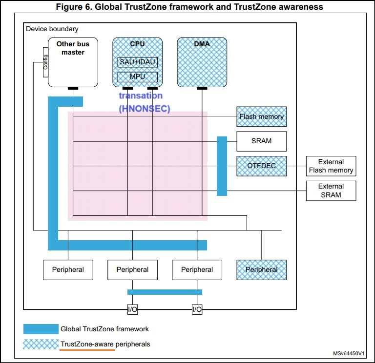
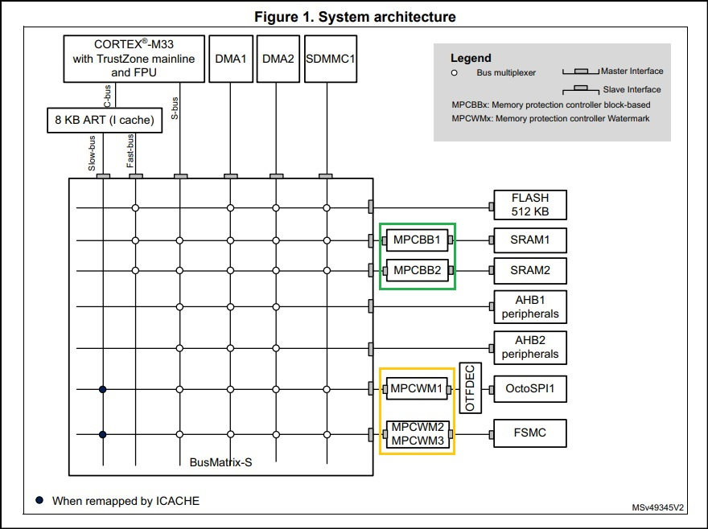
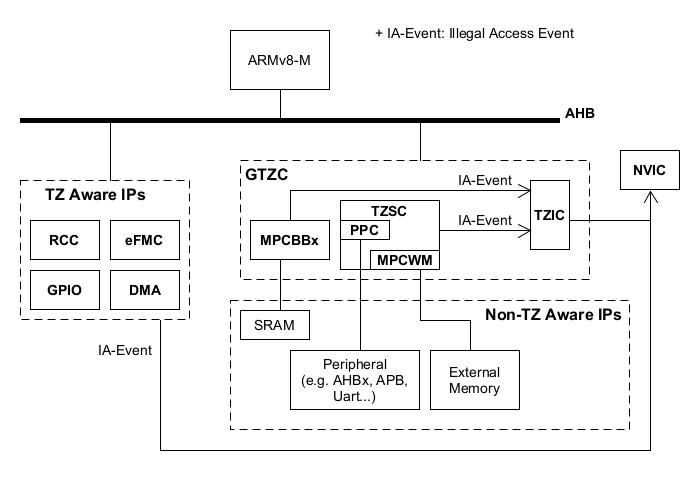
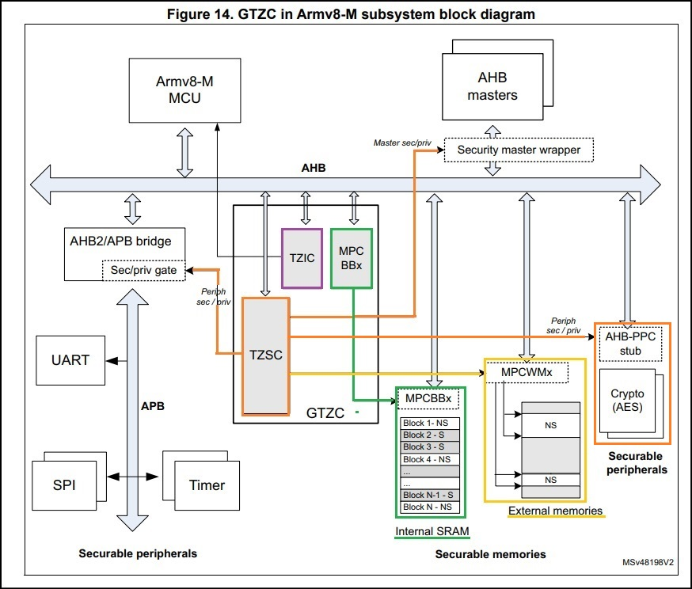

Note STM32L5
---

+ `OTFDEC (On-The-Fly Decryption)` hardware module
    > 對 external NOR flash 上的加密數據或加密代碼, 進行即時解密與執行

    - 透過外部工具, 先產生 secret key, 用此 key 加密 Bin file, 再將 Key 和 Encrypted-Bin 寫入 DUT

## GTZC (Global TrustZone Controller)

當 ARM Cortex-M33 TrustZone 處理 Secure/Non-Secure 時, 會先經過 `SAU/IDAU/MPU`審查,
經過審查後的 transation, 會發出 `HNONSEC` signal 給 `AHBv5`

STM32L5 的 Peripheral 有兩種
> + `TrustZone aware` Peripheral
>> 能夠自行處理 TrustZone signal (HNONSEC on AHBv5)
> + 傳統 Peripheral
>> 需要藉助外力(GTZC) 來協助處理 TrustZone signal

STM32L5 使用 GTZC 來實現 Secure system
> + ARM TF-M 是 Core Layer 的實作
> + GTZC 則是 System Layer 的實作, 負責處理**接在 BUS (AHBv5) 裝置**的安全審查

### GTZC 包含了三個 sub-blocks

STM32L5 GTZC subsystem block diagram from spec 

+ `MPCBB`: Block-Based Memory Protection Controller (綠色區域)
    > `MPCBBx` 保護的對象是 `Internal-SRAM`

+ `TZSC`: TrustZone Security Controller (橘色和黃色區域)
    - 管理直接接在 AHB 上的 master/slave 裝置 (橘色區域 PPC, Peripheral Protection Controller)
        > APB 也間接接在 AHB 上

        1. Peripheral 也可以個別歸屬到 SPE 或 NSPE
            > 單一個 Peripheral IP 是**全功能歸屬到 SPE 或 NSPE**

    - `MPCWMx, Memory Protection Controller WaterMark` (黃色區域)
        > 用來管理 `External Memory`, 只能告知外部記憶體控制器 (e.g. SPI), Non-Secure 區域在哪裡

+ `TZIC`: TrustZone Illegal access Controller
    > 監控並收集系統上, 非法訪問的 requests, 並對 NVIC 產生 secure interrupt

## GPIO with TZ-Aware

GPIO Pins 預設都是 SPE, 可藉由 SECCFGR(Secure Configure Register) 來單獨配置每個 I/O Pin, 屬於 SPE 還是 NSPE.

當 GPIO 使用 PinMux 時, 除了設定 I/O Pin 所對應的 AF mode 外, 還須設定 I/O Pin 的 SECCFGR, 來匹配 Peripheral 的安全屬性
> 當 GPIO Pins 的安全屬性, 與 Peripheral 不匹配時, 其 Peripheral 的功能會失效

## Access rule

在 STM32L5 中的存取審查分為兩級, 第一級為 Core-Layer (ARMv8-M), 第二級則為 System-Layer (GTZC), 兩級都合規才能正常存取.

在第一級 Core-Layer 審查中, 若合規則會發出 Transaction (帶安全屬性) 給 AHBv5, 此時就會進行第二級 System-Layer 審查
> Transaction 的安全屬性, 是取決於目標位址 (Destination Address), 在 SAU/IDAU 中的屬性, 與 CPU 當前的 Secure state 無關

+ Access Instruction (I-Bus)

    - Core-Layer 對 `I-Bus` 沒有限制, 直接依目標地址發出 transation,
    而 System-Layer 在收到 transation 後, 依照 Transaction 安全屬性與 GTZC 配置是否匹配, 來決定是否有效
        > 當 GTZC 配置 eFlash/SRAM/ExtFlash 區域的安全屬性不匹配時, 不會回傳值, 進而執行失敗

+ Access Data (D-Bus)

    - Core-Layer 對 `D-Bus`, 會先檢查 CPU Secure state 與目標地址 (SAU/IDAU) 的安全屬性是否匹配
        > 當 CPU 是 Secure 時, 可訪問 SPE 和 NSPE (會發 transation);
        但當 CPU 是 Non-Secure 時, 就只能訪問 NSPE, 否則會被 block

    - System-Layer 收到 transation 後, 會檢查是否與 GTZC 配置匹配 (transation_S 只能 SPE, transation_NS 只能 NSPE), 不匹配則會被 block
        > 在 SRAM 條件下, 有開一個後門, 藉由 `MPCBB->SRWILADIS flag`, 可以允許 transation_S 訪問 SPE 和 NSPE

+ Access Peripheral registers

    - Core-Layer 對 Peripheral registers, 和 `D-Bus` 的條件相同, 當 CPU 是 Secure 時, 可訪問 SPE 和 NSPE
    - System-Layer 收到 transation 後, `transation_S` 可以訪問 SPE 和 NSPE, `transation_NS` 只能訪問 NSPE
        > 只有 `transation_NS` 訪問 SPE 時, 才會被 block

# Practice

## [Example-GPIO_TZ](note_stm32L5_gpio_example.md)

# Reference

+ [STM32L5 入門課程（二）STM32L5 的系統新架構 | STMCU 中文官網 --- STM32L5 入门课程（二）STM32L5的系统新架构 | STMCU中文官网](https://www.stmcu.com.cn/ecosystem/chip/chipfamily-STM32L5-2)
+ [AN5281- How to use OTFDEC to encrypt/decrypt in trusted environment on STM32H7](https://www.st.com/resource/en/application_note/an5281-how-to-use-otfdec-to-encryptdecrypt-in-trusted-environment-on-stm32h7bxxx-and-stm32h73xxx-mcus-stmicroelectronics.pdf)

