BLDC v.s. PMSM
---

# Definetion

+ 轉子 (Rotor)
    > 轉動的部件

+ 定子 (Stator)
    > 固定不動的部件

+ 逆變器 (Inverter)
    > 過組合AC-DC轉換器和DC-AC逆變器來轉換指定頻率和電壓的電路稱為逆變電路

    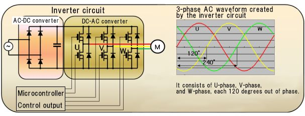

    - 驅動IC
        > 是一種驅動電機的逆變電路, 由於實際驅動電機的是大電壓/大電流, 所以需要一個驅動電路, 將控制電路的PWM輸出轉換為高電壓/大電流

        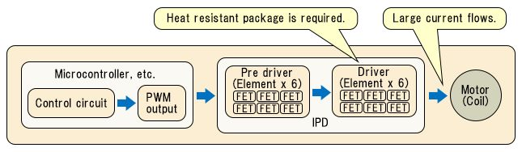

        1. 由於驅動電機的功率元件, 需要12V左右的大驅動電流來驅動, 因此需要一個 Pre-Driver
            > 低電壓的小功率電機, 可以在沒有 Pre-Driver 的情況下驅動

        1. 功率元件種類 (轉換到大電壓/大電流)
            > + FET: 場效應電晶體
            > + IGBT: 絕緣柵雙極電晶體
            > + IPD: 智能電源裝置(功率元件模組化為逆變器)

+ 霍爾感測器(Hall sensor)
    > 藉檢測磁場並輸出與其大小成比例的類比訊號, 其輸出的類比訊號, 通過比較器轉換為開關數位訊號, 然後作為無刷電機的轉子位置訊號
    >> Hall sensor 對高溫敏感, 所以並不適用於所有環境

    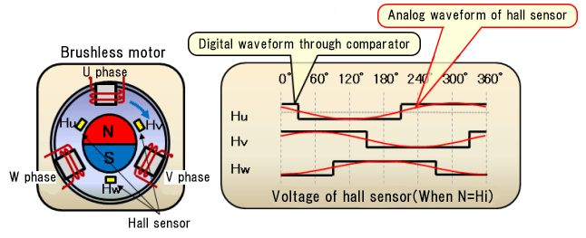

+ PWM (Pulse-width modulation, 脈波寬度調變)
    > 利用 PWM 來開關電流, 進而控制輸出功率
    >> 電壓充放電為類比特性, 藉由開關電流來維持**週期時間內的平均電壓**(實際電壓為 floating 而非定值)

    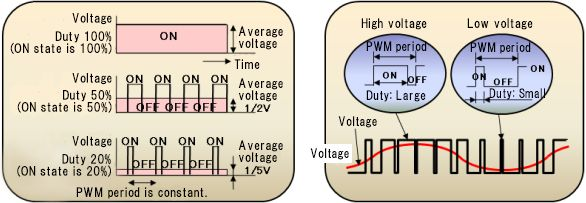

+ Phase(相位)/Pole(極性)/Slot(槽)
    > Phase 數影響到**演算法計算複雜度**, 而 Pole 數和 Slot 數則影響到 motor 效率
    >> 當 Pole 數和 Slot 數增加時, 可獲得較大的轉矩

    > + Phase 表示使用多少相位 ()
    >> e.g. 3-phase 表示相位差`360/3 = 120`, 分別在 0/120/240 相位上

    > + Pole 表示轉子使用多少個 S/N 磁極
    >> Pole 是偶數倍 (S/N 為一對)

    > + Slot 表示有幾個定子 (PWM 輸出個數)
    >> Slot 數量是 Phase 數的倍數 (e.g. 3-Phase => slot = 3 * X)

    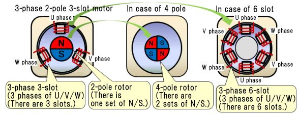

# Brushless Motor type

+ 無刷馬達基本部件 

    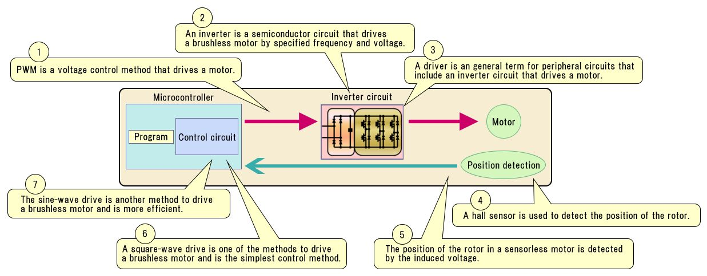

+ 基本 3-phase 無刷馬達示意 

    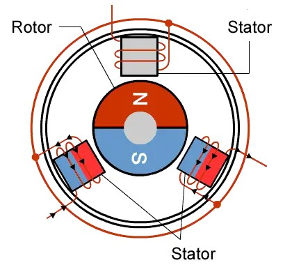

+ 永磁體作為轉子, 線圈組作為定子. 外部 Inverter 則依據轉子的旋轉位置, 由 MCU 去控制電流到 Inverter 的切換.
    > 電流方向會改變磁力的方向; 通過改變定子的磁力方向產生推進力, 進而使轉子旋轉

    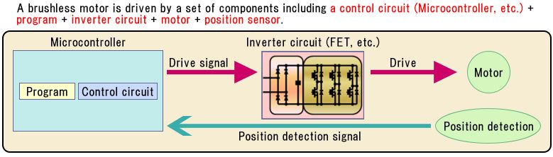

+ 無刷馬達運行順序
    > 方波驅動
    > + 在基點上, V-phase 變成 S 極, W-phase變成 N 極, 在磁場引力和斥力的作用下順時針旋轉
    > + 流向線圈的電流每 60 度切換一次 (Inverter drive), 各 phase 的 S/N 極每 120 度切換一次 (切換 U/V/W)

    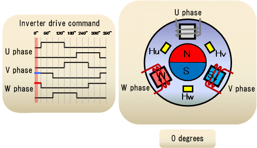

## 轉子位置檢測方法

+ 電流檢測
    > 電流檢測是磁場定向控制的必要條件

+ Hall sensor 檢測
    > 利用三個 Hall sensos, 通過轉子的磁場, 檢測轉子位置

+ 感應電壓檢測
    > 通過轉子旋轉產生的**感應電壓(Induced Voltage)**的變化, 來檢測轉子位置
    >> 超小型電機沒有空間用於安裝感測器, 或者感測器對於價格低的電機來說成本太高, 因此轉子位置通過感應電壓來檢測

    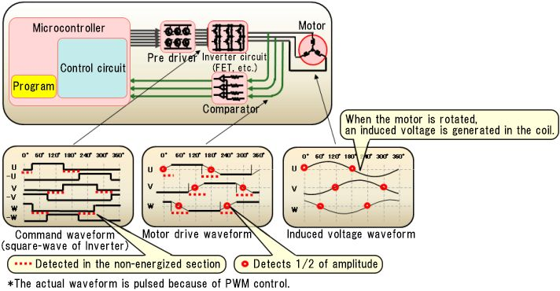

    - 通過轉子旋轉產生的電動勢(感應電壓)的波形來確定位置
        > 只有方波驅動可以通過感應電壓檢測轉子位置
        >> U/V/W相中的一組線圈, 始終處於關閉狀態. 通過檢測無激勵相線的電機驅動波形的幅度在變為1/2的點,
        轉子位置可以每60度指定一次

    - 在停止狀態下, 由於沒有產生電動勢, 所以無法檢測到位置

## 無刷電機兩種基本控制方法

BLDC 和 PMSM 的結構基本相同, 只因應用需求而有差異, 其基本驅動方式可分兩種

### 方波驅動 (BLDC)

最簡單的驅動方法, 根據轉子的旋轉角度, 切換 Inverter 功率元件的開關狀態, 然後改變定子線圈的電流方向, 使轉子旋轉,
是無感測器電機使用最廣泛的驅動方法
> 轉子轉動一圈, 電流方向就會切換 6 次 (6-steps square-wave driving)

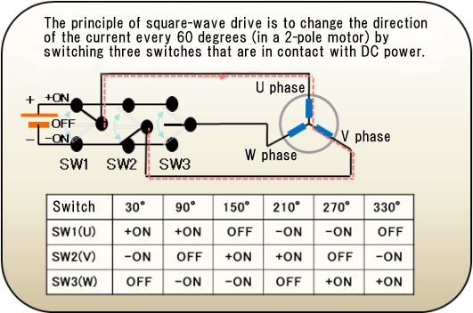

### 正弦波驅動 (PMSM)

通過檢測轉子的旋轉角度, **藉 PWM 連續改變定子線圈的電壓**, 使電壓產生 sin-wave 的形式, 從而使轉子旋轉
> 在 Inverter 中產生相移為 120 度的 3-phase 交流電, 然後改變定子線圈的電流方向和大小
>> 與方波驅動相比, 它的效率更高, 產生的振動和噪音更小

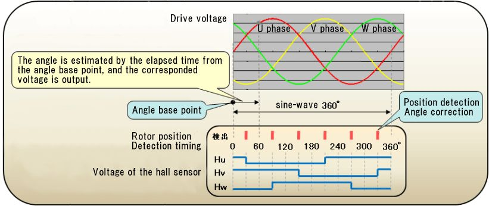

+ 通常使用三個位置感測器, 每隔 60 度檢測一次位置(上圖), 即時估算轉子位置, 並輸出與轉子位置相符的正弦波電壓
    > 據 3-phase (U/V/W) 的時間順序, 電機將順時針或逆時針旋轉

+ 如果 sin 為 1Hz, 以時軸來看, 那麼**播放**這個正弦波需要一秒鐘.
  如果第二波**相位偏移120度**, 那麼該第二波將在第一波之後的`0.33秒`開始, 也就是週期時間的三分之一.
  第三波將再次開始**相位偏移120度**, 即第一波開始後的`0.66秒`

## BLDC (Brushless DC Motor, 無刷直流馬達)

以永久磁鐵當轉子, 使用 `方波(梯形波)` 去驅動 Inverter, 讓定子產生磁場, 藉此轉動 motor
> 一般裝 Hall sensor 來檢測位置和速度, 驅動方式是 `3-phase/6-steps 方波`驅動, 用於轉速位置要求不是很高的場合

採用 `3-phase PWM` 控制(6-steps 方波). 因控制簡單, 一般低成本的 MCU 就可實現

## PMSM (Permanent-Magnet Synchronous Motor, 永磁同步馬達)

使用永久磁鐵當轉子, 使用 `正弦波` 去驅動
> 採用 FOC (向量控制)技術, 一個電週期一般最少會有 18 個向量 (當然越多越好), 需要高性能的 MCU 或 DSP 才能實現

# Reference

+ [直流無刷馬達 - 維基百科，自由的百科全書](https://zh.wikipedia.org/wiki/%E7%9B%B4%E6%B5%81%E7%84%A1%E5%88%B7%E9%9B%BB%E5%8B%95%E6%A9%9F)
+ [無刷電機 | 東芝半導體&儲存產品中國官網](https://toshiba-semicon-storage.com/cn/semiconductor/knowledge/e-learning/brushless-motor.html)
+ [BLDC與PMSM兩馬達的比較和分析｜方格子 vocus](https://vocus.cc/article/6330f2b2fd8978000186e67a)
