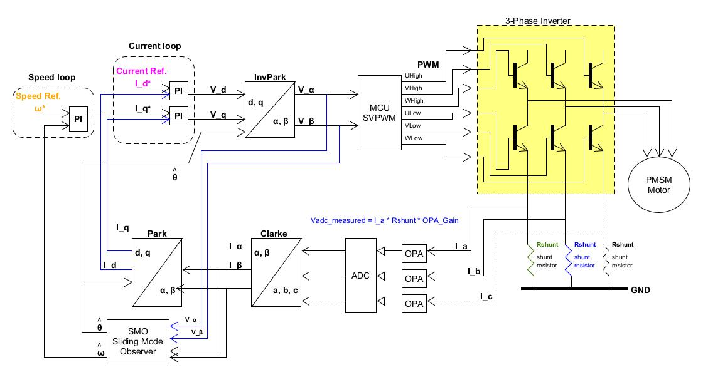
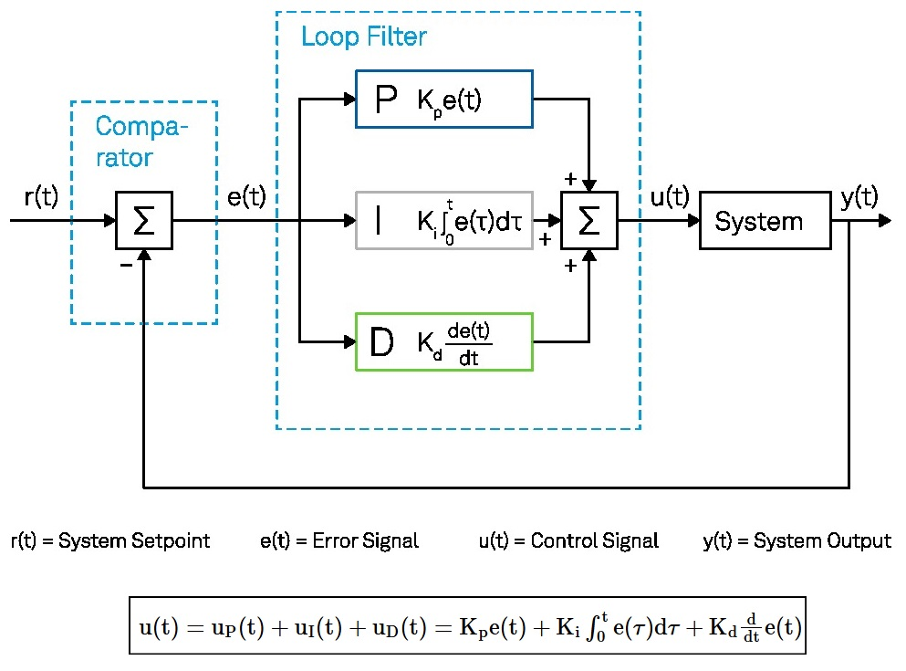
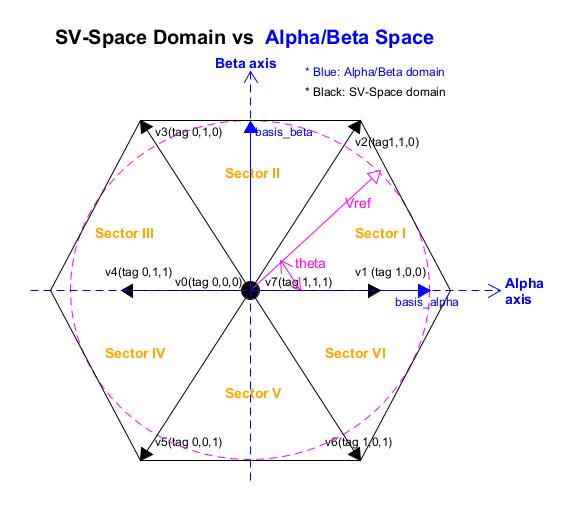
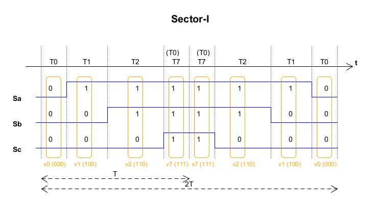
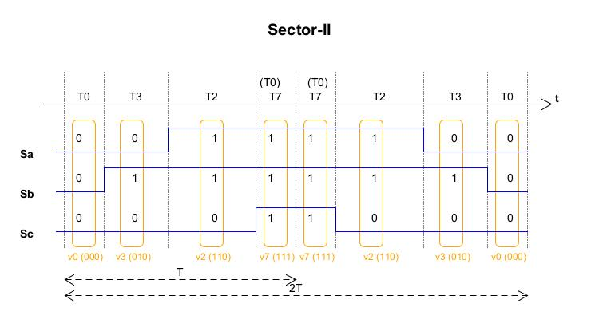
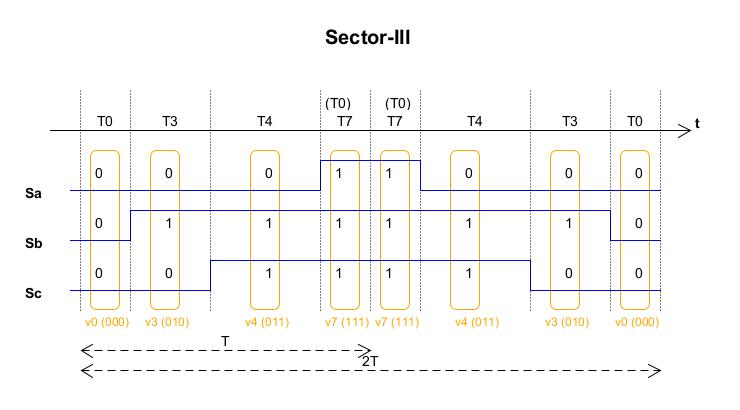
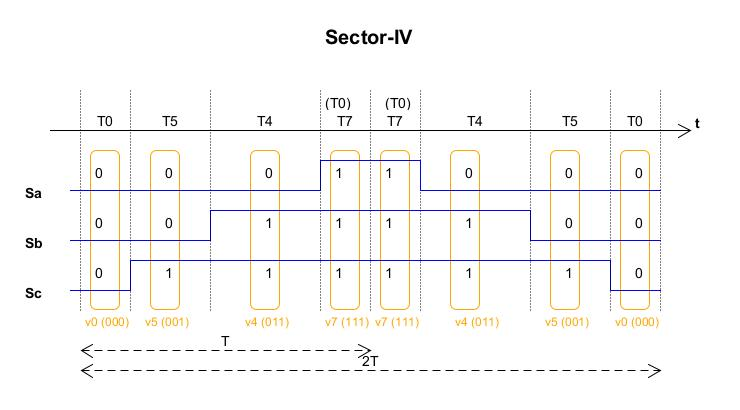
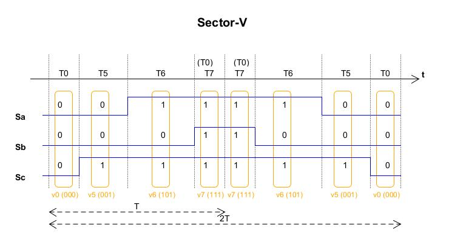
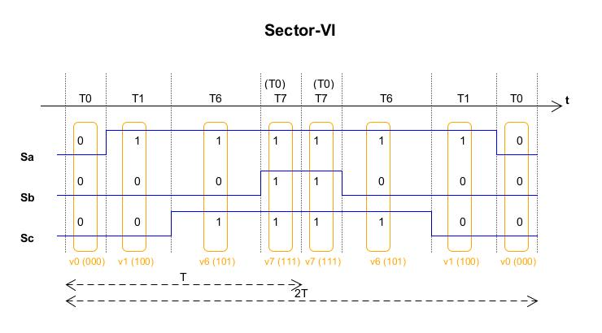

Motor FOC
---

# 常用參數

[國際單位制導出單位 SI derived units](https://zh.wikipedia.org/zh-tw/%E5%9B%BD%E9%99%85%E5%8D%95%E4%BD%8D%E5%88%B6%E5%AF%BC%E5%87%BA%E5%8D%95%E4%BD%8D)

+ Js (轉動慣量)
    > moment of Inertia of the rotor, `unit: Kg*m^2`

    - 在力學上, 實際的轉動摩擦力 (需實際量測估算)
        > 會因掛載不同機構裝置而改變
        >> 不同機構裝置(e.g. 扇葉), 其重量, 力矩, 摩擦係數等, 都會有不同的影響

+ Kt (轉矩常數)
    > Torque Constant, `unit: N·m/A, 牛頓米/安培`

    - 轉矩常數(Kt)方程式中可知, 其包括了磁場(B), 馬達積厚(L), 馬達轉子外徑(D), 馬達繞線匝數(N), 以及電場與磁場間的角度(δ)
        > 這些參數, 都是馬達生產後就確認固定的數值, 不會有變化

        ```
        Kt = B * L * (D^2) * N * sin(δ)
        ```

+ 機械角度
    > 實際物理轉子轉動角度, 一圈為 360°

+ 電角度
    > 轉子從**磁級 N 到下一個磁級 N 為 360°**
    >> 磁級 N 和 S 必為一對

    - 當轉子轉一圈 (機械角度 ω_m 0° -> 360°), 則可量測到 Output 訊號, 有**極對數 (Pole_pair)個週期訊號**

        ```
        ω_e = Pole_pair * ω_m
        ```

+ 六步方波 (梯形波) 換相(相位)控制
    > 適用於低速產品, 且因換相時瞬間劇烈變化 (方波 edge), 而造成振動噪音的產生

    ```
    T_phase: 單步換相時間 (T/step)

    (Sec/rad) = (T/step) * 6step * Pole_pair
    (60/RPM) = T_phase * 6 * Pole_pair

    T_phase = 10 / (RPM * Pole_pair)
    ```


# [Trigonometric-functions](./note_tangent.md)

三角函數


# Components of Algorithm



## PID Controller

由比例單元(Proportional), 積分單元(Integral)和微分單元(Derivative)組成, 且將輸出的結果 feedback 回輸入端

> 將誤差 (error) 經由 **比例-積分-微分** 的操作, 來達到 `快速穩定` 的目的
>> 大多數情況下, PI 控制就已夠用, D 則適用在高頻震盪的情況下




+ 比例單元(Proportional), 使用 `Kp` 權重來調節
    > 單純線性增減數值 (粗調), 會發生太慢穩定, 或是抖動(增減一個量化級數, 永遠都存在誤差)

+ 積分單元(Integral), 使用 `Ki` 權重來調節
    > 導入時間資訊的**增幅器**, 藉由過去時間 (0~t) 的`誤差總和(積分)`, 來判定是否幫助 P 增減數值量級

    - 如果在目標附近震盪(有增有減), 則誤差總和趨近 0, I 則無作用(平均過去的誤差, 達到微調誤差的效果)
    - 須做 clamping 來避免數值爆表(過大或過小), 而造成系統崩潰
        > 剛啟動未穩定狀態下, 最容易發生


+ 微分單元(Derivative), 使用 `Kd` 權重來調節
    > 導入時間資訊的**抑制器**, 預測未來誤差趨勢, 進而提前抑制數值增減的量級

    - 將目前時間軸 `t 時刻`的誤差, 減去`(t - 1)時刻`的誤差後, 做一階微分得到斜率, 由**斜率可未來趨勢**
        > 由過去及現在的資訊來預估

+ code

    ```
    typedef struct pid_t
    {
    #define CONIFG_PID_UPPER_BOUND      5.0f
    #define CONIFG_PID_LOW_BOUND        0.0f

    #define CONIFG_PID_KP       1.0f
    #define CONIFG_PID_KI       1.0f
    #define CONIFG_PID_KD       1.0f

        float   time_delta;
        float   err_integral;   // Sum of integral error over time
        float   err_prev;

        float   val_out;

    } pid_param_t;

    int pid_ctrl(pid_param_t *pParam, float val_target, float val_act)
    {
        float   error = 0.0f;
        float   derivative = 0.0f;
        float   val_out = 0;

        error = val_target - val_act;

        /* integral part */
        pParam->err_integral += (error * pParam->time_delta);

        /* derivative  part */
        derivative =  (error - pParam->err_prev) / pParam->time_delta;

        pParam->err_prev = error;

        val_out = CONIFG_PID_KP * error +
                  CONIFG_PID_KI * pParam->err_integral +
                  CONIFG_PID_KD * derivative;

        /* clamping output */
        pParam->val_out = (val_out > CONIFG_PID_UPPER_BOUND) ? CONIFG_PID_UPPER_BOUND :
                          (val_out < CONIFG_PID_LOW_BOUND)   ? CONIFG_PID_LOW_BOUND :
                          val_out;
        return 0;
    }

    ```

## [Position Estimator](note_position_estimator.md)

FOC 的位置 (θ) 估算主要可分為 Sensor/Sensorless
+ Sensor
    > 外加位置感測器
    > + 高精度的速度和位置控制
    > + 在高負載和低速工作條件下, 也能保持高效工作
    > + 能夠自動識別電機轉子的初始位置

    > 有位置感測器的電機控制演算法, 具備精確位置控制的能力,
    適用於需要高精度位置控制的場景, 如機器人運動控制, 工業自動化控制等

+ Sensorless
    > 通過各種演算法, 計算或估計電機轉子的位置
    > + 價格低, 便於生產
    > + 電路簡單, 不需要額外的位置感測器和複雜的控制演算法

    > 無位置感測器的電機控制演算法, 適用於一些價格敏感的場景, 如家電, 電動工具, 無人機等

    > Sensorless FOC 是通過估算 Motor 的位置, 來計算 FOC 所需的換相角度, 實現FOC演算法.
    >> 通常 Motor 的速度和位置, 是根據測量 Motor 的電流和電壓估算出的

## SVPWM

將實際 `Motor 3-Phase invertor output Voltages (output Va/Vb/Vc)` 轉換到 SV-Space domain (電壓開關向量 SV-basis: v0 ~ v7)
> **Vref** 為 SV-Space domain (基底 V0 ~ V7) 上理想的輸出電壓, **Vref** 可由 SV-basis (v0 ~ v7)合成,
  每個 SV-Space 的基底亦可用 `basis_alpha/basis_beta` 來表示 (三角幾何轉換, 7-Dimension to 2-Dimension)
>> v0/v7 為 0 向量 (因伏秒平衡數學式產生), 當上下臂開關切換頻率高時, 0 向量的作用時間趨近 0 可以忽略不計

**Figure. SV-Space vs. Alpha/Beta Space** <br>


在不同的 Sector 區域時, **Vref** 會由該 sector 的 SV-basis 來合成
> 當 theta 從 `0° => 60°` 時, 會依**時間變數 t 調整 v0/v1/v2/v7 分量比例**, 來合成時間 t 的 **Vref**
> + 若 **Vref** 的軌跡越接近圓形, 則 Va/Vb/Vc 的輸出就越接近 sine wave

### Volt-Second_balance (伏秒平衡)

**伏秒平衡**指處於穩定狀態的電感, 電感兩端的正伏秒積等於負伏秒積, 也就是電感兩端的伏秒積在一個開關週期內必須相等
> + 也因為伏秒平衡是做積分, 重要的是持續時間(面積)而不是順序, 一個週期內可以任意切換順序.
> + 為了儘量減少 MOS 管的開關次數, 會以最大限度減少開關損耗為目的, 來安排狀態切換順序

當角速度 ω 固定, 只有時間 t 是變量, 因此只要維持當前三相繞組的磁場, 隨時間的改變, 就能產生推力.
而 **Vref** 的合成 (SV-basis: v0 ~ v7 的切換使用), 是藉由改變 3 個繞組的電壓, 來維持磁場的穩定,
因此只要能保持磁場狀態, 改變 3 個繞組電壓的順序, 就可以有許多變化
> 電壓向量對應著不同的逆變器開關狀態, 則在電壓向量間的切換, 就對應著不同的逆變器開關狀態間的切換.
理想上, 在切換電壓向量的時候, 只更動逆變器一個相上的開關狀態, 其損耗會是最小,
通過引入 0 向量 (v0/v7), 使產生的 PWM 對稱(有效地降低 PWM 的諧波份量), 就可以輕鬆實現這一目標

將兩個 0 向量, 平均分配到中間和兩端 `v0 -> v_x -> v_y -> v7 -> v7 -> v_y -> v_x -> v0` 來產生對稱的 PWM
> 取樣週期 (PWM update freq) `v0 => v0` 為 2T (因對稱則 `v0 => v7` 為 T)
>> 當轉到了下一個 sector 時, 電壓向量合成過程, 都是從一個 0 向量開始, 這可保障**Vref**的連續性

```
2T 為 PWM update freq (產生 sine wave 的取樣週期)
T0 為 Sector-s (s: 1 ~ 6) 中, SV-basis v_0 的持續作用時間 (PWM duty)
Tx 為 Sector-s (s: 1 ~ 6) 中, SV-basis v_x 的持續作用時間 (PWM duty)
Ty 為 Sector-s (s: 1 ~ 6) 中, SV-basis v_y 的持續作用時間 (PWM duty)
T7 為 Sector-s (s: 1 ~ 6) 中, SV-basis v_7 的持續作用時間 (PWM duty)

零向量的作用時間會相同因次 T0 == T7

2T = T0 + Tx + Ty + T7 + T7 + Ty + Tx + T0
 T = T0 + Tx + Ty + T7
   = 2*T0 + Tx + Ty

integral{ sector_s(Vref(t), t=0~T }
    = integral{ sector_s(v_x(t), t=0~Tx) } + integral{ sector_s(v_y(t), t=0~Ty) } +
        integral{ sector_s(v_0(t), t=0~T0) } + integral{ sector_s(v_7(t), t=0~T7) }
    = sector_s( v_x(0) + v_x(1) + ... + v_x(Tx) ) + sector_s( v_y(0) + v_y(1) + ... + v_y(Ty) ) +
        sector_s( v_0(0) + v_0(1) + ... + v_0(T0) ) + sector_s( v_7(0) + v_7(1) + ... + v_7(Ty) )

```

+ Example of Sector
    > 當上下臂開關切換頻率高時, 0 向量的作用時間趨近 0 可以忽略不計

    - Sector-I

        ```
        T1 為 v1 持續作用時間, T2 為 v2 持續作用時間,

        integral{ Vref(t), t=0~T } = integral{ v1(t), t=0~T1 } + integral{ v2(t), t=0~T2 }
        ```

    - Sector-VI

        ```
        T6 為 v6 作用時間, T1 為 v1 作用時間,

        integral{ Vref(t), t=0~T } = integral{ v6(t), t=0~T6 } + integral{ v1(t), t=0~T1 }
        ```

### SV-Space domain 其 SV-basis 轉換係數

+ `Sx (x = a,b,c)` 為 `3-Phase inverter 上下臂開關` 狀態
    > + `Sx == 1`: 上臂 on, 下臂 off
    > + `Sx == 0`: 上臂 off, 下臂 on

+ `Vdc`: the voltage of inverter

+ 從 **Figure. SV-Space vs. Alpha/Beta Space**, 可獲得 SV-Space Domain 轉換到 Alpha/Beta Space 的關係

**Table. SV-basis v.s. Va/Vb/Vc 關係** <br>

| SV-basis name | Sa,Sb,Sc  | `Vdc * Va` |  `Vdc * Vb`| `Vdc * Vc` | `Vdc * basis_alpha` | `Vdc * basis_beta`
|    :-:        |    :-:    |    :-:     |    :-:     |    :-:     |      :-:            |     :-:
|     v1 (  0°) | (1, 0, 0) |    2/3     |     -1/3   |    -1/3    |        2/3          |      0
|     v2 ( 60°) | (1, 1, 0) |    1/3     |      1/3   |    -2/3    |        1/3          |    1/sqrt(3)
|     v3 (120°) | (0, 1, 0) |   -1/3     |      2/3   |    -1/3    |       -1/3          |    1/sqrt(3)
|     v4 (180°) | (0, 1, 1) |   -2/3     |      1/3   |     1/3    |       -2/3          |      0
|     v5 (240°) | (0, 0, 1) |   -1/3     |     -1/3   |     2/3    |       -1/3          |   -1/sqrt(3)
|     v6 (300°) | (1, 0, 1) |    1/3     |     -2/3   |     1/3    |        1/3          |   -1/sqrt(3)
|     v7 (360°) | (1, 1, 1) |     0      |       0    |      0     |         0           |      0
|     v0 (  0°) | (0, 0, 0) |     0      |       0    |      0     |         0           |      0


### 各 SV-Sector 中, PWM 持續時間推導

> ```
> Vref * T = v_x * T_x + v_y * T_y + v_0 * T_0 + v_7 * T_7, x = 1~6, y = 1~6
> ```

**Table. 電壓向量在各 sector 作用順序** <br>

| SV-Space sectors         | Vector  order                                 |
| :-:                      | :-:                                           |
| Sector I   (0° ~ 60°)    | v0 -> v1 -> v2 -> v7 -> v7 -> v2 -> v1 -> v0  |
| Sector II  (60° ~ 120°)  | v0 -> v3 -> v2 -> v7 -> v7 -> v2 -> v3 -> v0  |
| Sector III (120° ~ 180°) | v0 -> v3 -> v4 -> v7 -> v7 -> v4 -> v3 -> v0  |
| Sector IV  (180° ~ 240°) | v0 -> v5 -> v4 -> v7 -> v7 -> v4 -> v5 -> v0  |
| Sector V   (240° ~ 300°) | v0 -> v5 -> v6 -> v7 -> v7 -> v6 -> v5 -> v0  |
| Sector VI  (300° ~ 360°) | v0 -> v1 -> v6 -> v7 -> v7 -> v6 -> v1 -> v0  |


+ SV-Sector-I
    > 依照 `Table. SV-basis v.s. Va/Vb/Vc 關係`

    - alpha/beta

        ```
        Vref * T = v1 * T1 + v2 * T2

        SV-basis v1/v2 用 basis_alpha/basis_beta 分量來表示
        =>  v1 = Vdc * 2/3 * basis_alpha
            v2 = (Vdc * 1/3 * basis_alpha) + (Vdc * 1/sqrt(3) * basis_beta)

        Vref = (T1/T) * v1 + (T2/T) * v2
             = (T1/T) * (Vdc * V_alpha * 2/3) +
               (T2/T) * (Vdc * V_alpha * 1/3 + Vdc * V_beta * 1/sqrt(3))

             = ( ((T1/T) * Vdc * 2/3) + ((T2/T) * Vdc * 1/3) ) * basis_alpha +
               ( (T2/T) * Vdc * 1/sqrt(3) ) * basis_beta

             = V_alpha * basis_alpha + V_beta * basis_beta

        V_alpha = ((T1/T) * Vdc * 2/3) + ((T2/T) * Vdc * 1/3)
        V_beta  = (T2/T) * Vdc * 1/sqrt(3)

        T2 = T * (V_beta * sqrt(3)) / Vdc
        T1 = T * (3*V_alpha - sqrt(3)*V_beta) / (2*Vdc)
        ```

    - Va/Vb/Vc
        > 依照 **Table. 電壓向量在各 sector 作用順序** 繪製

        

        ```
        T0 = T7 = (T - T1 - T2)/2

        Duty(Tc) = (T - T1 - T2) / 2
        Duty(Tb) = Duty(Tc) + T2
        Duty(Ta) = Duty(Tb) + T1

        if d1 = T1/T, d2 = T2/T

        dc = Tc/T = (1 - d1 - d2)/2
        db = Tb/T = (Tc + T2) / T = dc + d2
        da = Ta/T = (Tb + T1) / T = db + d1
        ```


+ SV-Sector-II

    - Va/Vb/Vc
        > 依照 **Table. 電壓向量在各 sector 作用順序** 繪製

        

        ```
        T0 = T7 = (T - T3 - T2)/2

        Duty(Tc) = (T - T3 - T2) / 2
        Duty(Ta) = Duty(Tc) + T2
        Duty(Tb) = Duty(Ta) + T1

        if d1 = T3/T, d2 = T2/T

        dc = Tc/T = (1 - d1 - d2)/2
        da = Ta/T = dc + d2
        db = Tb/T = da + d1
        ```

+ SV-Sector-III

    - Va/Vb/Vc
        > 依照 **Table. 電壓向量在各 sector 作用順序** 繪製

        

        ```
        T0 = T7 = (T - T3 - T4)/2
        Duty(Ta) = (T - T3 - T4) / 2
        Duty(Tc) = Duty(Tc) + T4
        Duty(Tb) = Duty(Tc) + T3

        if d1 = T3/T, d2 = T4/T

        da = Ta/T = (1 - d1 - d2)/2
        dc = Tc/T = da + d2
        db = Tb/T = dc + d1
        ```

+ SV-Sector-IV

    - Va/Vb/Vc
        > 依照 **Table. 電壓向量在各 sector 作用順序** 繪製

        

        ```
        T0 = T7 = (T - T5 - T4)/2
        Duty(Ta) = (T - T5 - T4) / 2
        Duty(Tb) = Duty(Ta) + T4
        Duty(Tc) = Duty(Tb) + T5


        if d1 = T5/T, d2 = T4/T

        da = Ta/T = (1 - d1 - d2)/2
        db = Tb/T = da + d2
        dc = Tc/T = db + d1
        ```


+ SV-Sector-V

    - Va/Vb/Vc
        > 依照 **Table. 電壓向量在各 sector 作用順序** 繪製

        

        ```
        T0 = T7 = (T - T5 - T6)/2
        Duty(Tb) = (T - T5 - T6) / 2
        Duty(Ta) = Duty(Tb) + T6
        Duty(Tc) = Duty(Ta) + T5

        if d1 = T5/T, d2 = T6/T

        db = Tb/T = (1 - d1 - d2)/2
        da = Ta/T = db + d2
        dc = Tc/T = da + d1
        ```


+ SV-Sector-VI

    - Va/Vb/Vc
        > 依照 **Table. 電壓向量在各 sector 作用順序** 繪製

        

        ```
        T0 = T7 = (T - T1 - T6)/2
        Duty(Tb) = (T - T1 - T6) / 2
        Duty(Tc) = Duty(Tb) + T6
        Duty(Ta) = Duty(Tc) + T1

        if d1 = T6/T, d2 = T1/T

        db = Tb/T = (1 - d1 - d2)/2
        dc = Tc/T = db + d2
        da = Ta/T = dc + d1
        ```


# Reference

+ [淺析SVPWM調製技術 - 知乎](https://zhuanlan.zhihu.com/p/449581786)
+ [SVPWM原理分析-基於STM32 MC SDK 5.0 - Aliank - 部落格園](https://www.cnblogs.com/temo/p/13993993.html)
+ [【永磁同步電機（PMSM）】 8. 位置觀測器的原理與模擬模型-CSDN部落格](https://blog.csdn.net/youcans/article/details/142528528)
