SMO (Sliding Mode Observer) [[Back](./note_FOC.md#SMO)]
----

滑模觀測器(Sliding Mode Observer, SMO)的作用, 是用來估算 motor 的感應電動勢 (Es, Back EMF), 角度位置(θ), 速度(ω)
> 經典 ref. Microchip AN1078 2010

# Definitions

+ 相電阻 (winding resistance, Rs)
    > motor 有電流通過就會有阻值, **相電阻**是對 motor module 概括的阻值
    >> 理想上三相的相電阻都會一樣


    - 量測方式
        > 用 萬用電表 量測 motor 中任意兩根線 (Va/Vb/Vc)上, 兩兩相測共測 3 組, 求出平均值 R
        >> 正常情況下, 三個繞組的電阻應該是相等的. 如有誤差, 誤差不能大於 5%

        ```
        單相 Rs = R/2
        ```

+ 相電感 (winding inductance, Ls)
    > 相電感一般使用電橋測量, 常見的測量方法是, 將電橋頻率設為 1KHZ 以上(也可以設定為系統 PWM 所使用的的頻率),
    電壓給 1V 左右, 然後測量 motor 在該頻率下的電感
    >> 理想上三相的相電感都會一樣

    - 同樣用電橋的兩端連接電機的任意兩相 (Va/Vb/Vc), 得到的電感值 L
        > 為了提高精準度, 可以旋轉一圈, 多次測量求平均值

        ```
        單相 Ls = L/2
        ```

+ 極對數 (polar)
    > 關於 motor 的極對數, 一般電機廠商都會給出, 如果不確定, 也可以通過測試得到.

    - 量測方式
        > 給 motor 其中兩根線通入適當電壓, 當線內就會流過適當電流時,
        手動轉動電機時會明顯感覺到卡頓, 轉動一圈中有多少卡頓的地方, 該電機就有多少極對數
        >> 一般 motor 流過 `0.1 安培` 電流就能清楚感覺到卡頓了

        1. 對 motor 中任意 2 根線施加電壓 (V), 然後用手轉動 motor 一圈, 記下有多少個卡頓的地方,就可得出有多少極對數
            > 測試時提供的電壓 (V), 可由 相電阻(Rs) 與 合理電流 (I)來計算

            ```
            V = Rs * I = Rs * 0.1
            ```

+ 角頻率 (Angular frequency)
    > 單位是弧度每秒(rad/sec)
    >> 有時也叫**角速度 (Angular velocity)**

    ```
    ω = dθ/dt (單位時間內轉多少弧度)
    ```

    - Frequency domain 轉換到 Angular frequency domain

        ```
        ω (單位時間內轉多少弧度) = 2PI * (1/T)
                               = 2PI * freq
        ```


+ 機械角頻率 (ω_m) vs. 電氣角頻率 (ω_e)
    > 轉子轉一圈, 機械角度等於 360°, 電角度等於 `Pole_pair * 360 = Pole_pair * 機械角度`.
    >> 電角度可以理解為所有 Pole_Pair 轉過角度的總和

    - 機械角度
        > 實際物理轉子轉動角度, 一圈為 360°

    - 電角度
        > 轉子從**磁級 N 到下一個磁級 N 為 360°**
        >> 磁級 N 和 S 必為一對

    - 當轉子轉一圈 (機械角度 ω_m 0° -> 360°), 則可量測到 Output 訊號, 有**極對數 (Pole_pair)個週期訊號**

        ```
        ω_e = Pole_pair * ω_m
        ```

+ RPM (Revolutions Per Minute)
    > 每分鐘轉幾圈 (0° ~360° or 0 ~ 2PI)

+ RPS (Revolutions Per Second)
    > 每秒轉幾圈 (0° ~ 360° or 0 ~ 2PI)

    - eRPS (Electrical RPS, motor 電氣轉速)

        ```
        eRPS = (RPM * Pole_pair)/60sec
        ```

+ `^` 估計符號
    > 變數上有 `^ (hat)` 符號, 表示為估算預測的值


+ 頻率響應
    > Input 訊號與 Output 訊號的對應關係

    - 響應的影響
        1. 增益 (Gain)
            > Output 訊號與 Input 訊號的強度比例
            >> 通常以分貝(dB)表示

        1. 相位響應 (Phase Response)：
            > Output 訊號對於 Input 訊號的相位變化

        1. 截止頻率(Cutoff Frequency)
            > 訊號開始明顯衰減的頻率點, 通常在`-3dB` 處定義

        1. 頻寬 (Bandwidth)
            > 系統能有效處理訊號的頻率範圍

        1. 共振(Resonance)
            > 某些系統在特定頻率會產生放大的現象, 如機械系統的共振點


# SMO Algorithm

FOC 控制的實現, 需要當前轉子位置信息, 為了準確的施加計算產生的電壓向量, 需要當前轉子位置完成座標變換

在 sensorless (無速度/位置感測器)的馬達控制系統中, 位置訊號沒有辦法直接檢測得到, 因此需要設計對應 位置(θ)和速度(ω)的估計模組 (SMO)


為設計估計模組 (SMO), 先建立理想的數學模型來方便推導

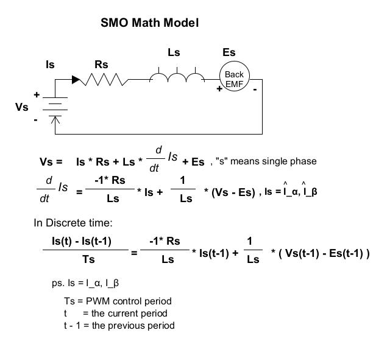


## Microchip

`ref. Microchip AN1078 2010`
> + Observer 藉由重複觀測 Z_s (Output of SMC) 來估算電流 `I_alpha_hat/I_beta_hat`
> + 利用 SMC (Sliding Mode Controller) 來讓 `Err_s` 快速收斂 (達到估算準確目的)
>> `Err_s` 只能收斂到某個範圍, 因為量測的電流 `I_alpha/I_beta` 含有 BEMF,
而估算的電流 `I_alpha_hat/I_beta_hat` 已經去除 BEMF


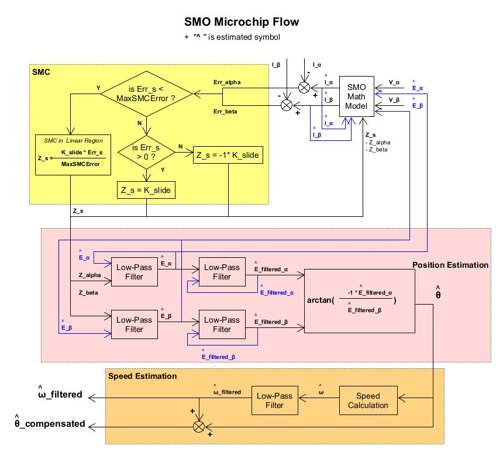

+ 估算電流公式

    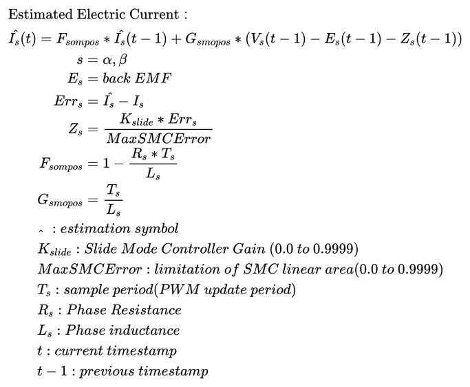

    - **Pre-Unit** (標么(ㄧㄠ)化)
        > 使用 Pre-Unit 來**等效關係式**

        1. 電氣物理量關係式

            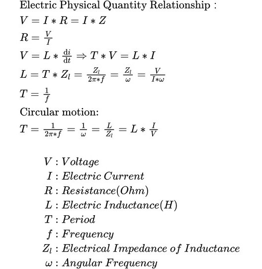

        1. 定義最基本物理量的 PU-Value
            > `頻率 f(Hz)/電流 I(A)/電壓 V(V)`

            ```
            F_base = 1 / (2 * Time_SpeedLoop) => 使用速度環週期,與 AN1078控制架構有關
            I_base = 8.8A => I-PEAK 電流 peak 值, 即 Hardware 量測到的最大電流
            V_base = 24V  => Hardware 量測到的最大 Vdc
            ```

        1. G_smopos and F_smopos
            > + 若 Rs 的範圍超過預期的 QVlaue 時, 可先將 Rs 縮小, 等到計算時, 再 run-time 放大
            >> e.g. Rs = 2.3 omh, (Q1.15 支援浮點範圍 -0.999999 ~ 0.999999), `int16_t Rs_fixpointer = (int)Q15(Rs) >> 2`,
            run-time 計算時再 `((int)Rs_fixpointer << 2) * xxxx`
            > + G_smopos-pu 應落在 [-1,1] 範圍內, 若 G_smopos-pu 超過範圍, 可放大 Ls, 到 `G*(Vs - Es)` 再補償回來

            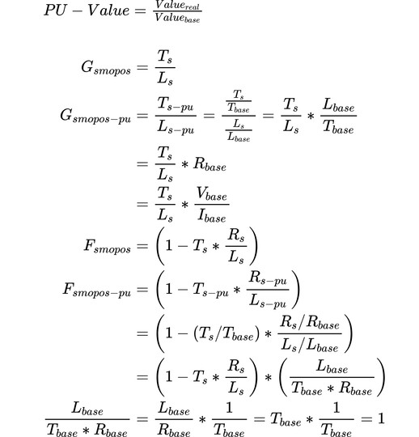

        1. Pre-Unit duty period

            > + Sector 1
            > 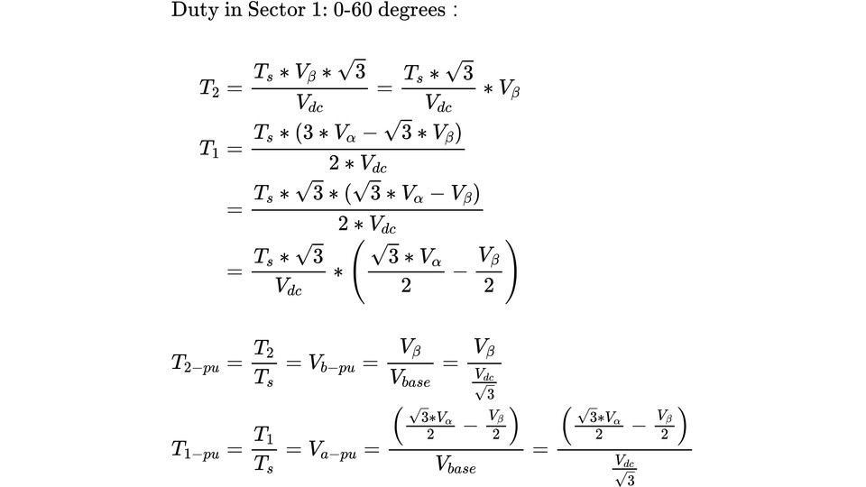
            > ```
            > /* at MC_CalculateSpaceVectorPhaseShifted() */
            > // Sector 1:  0-60 degrees
            > T1 = abc->a;  // V_1-pu
            > T2 = abc->b;  // V_2-pu
            >
            > T1 = period * T1;     // Ts * V_1-pu
            > T2 = period * T2;     // Ts * V_2-pu
            >
            > ....
            > ```

            > + Sector 2
            > 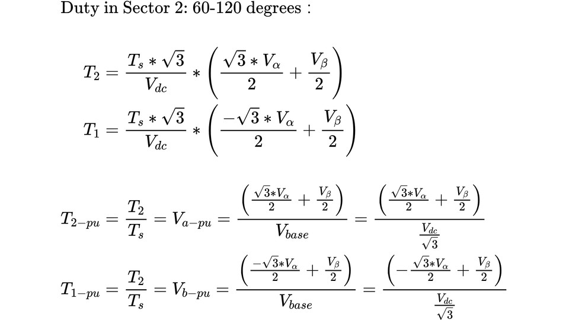
            > ```
            > /* at MC_CalculateSpaceVectorPhaseShifted() */
            > // Sector 2:  60-120 degrees
            > T1 = -abc->c;  // V_1-pu
            > T2 = -abc->b;  // V_2-pu
            >
            > T1 = period * T1;     // Ts * V_1-pu
            > T2 = period * T2;     // Ts * V_2-pu
            >
            > ....
            > ```

            > + Sector 3
            > 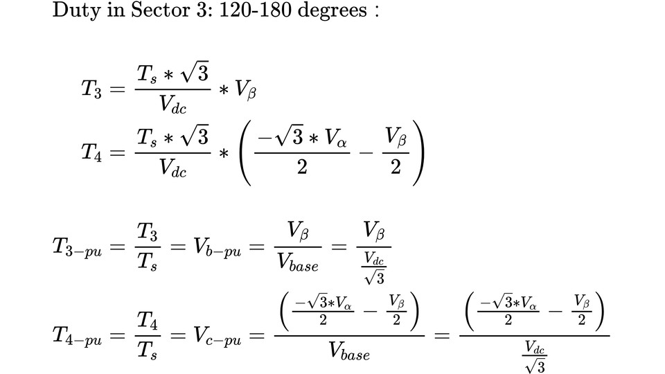
            > ```
            > /* at MC_CalculateSpaceVectorPhaseShifted() */
            > // Sector 3:  120-180 degrees
            > T1 = abc->c;  // V_1-pu
            > T2 = abc->a;  // V_2-pu
            >
            > T1 = period * T1;     // Ts * V_1-pu
            > T2 = period * T2;     // Ts * V_2-pu
            >
            > ....
            > ```

            > + Sector 4
            > 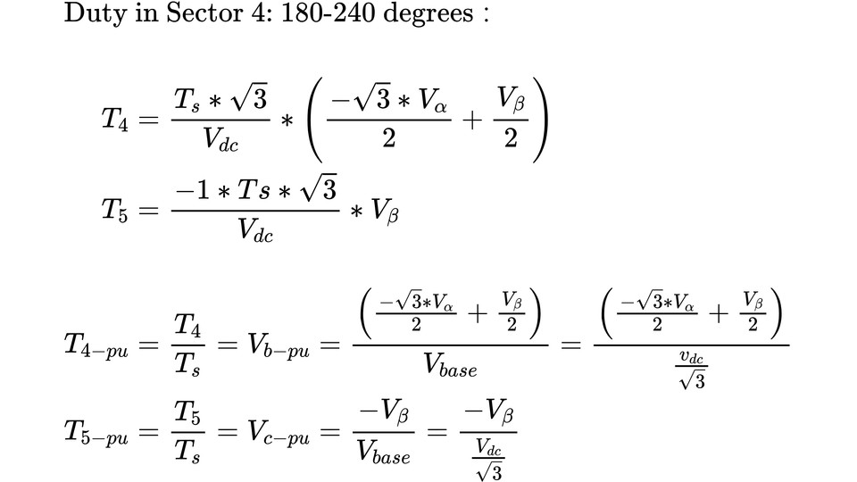
            > ```
            > /* at MC_CalculateSpaceVectorPhaseShifted() */
            > // Sector 4:  180-240 degrees
            > T1 = -abc->b;  // V_1-pu
            > T2 = -abc->a;  // V_2-pu
            >
            > T1 = period * T1;     // Ts * V_1-pu
            > T2 = period * T2;     // Ts * V_2-pu
            >
            > ....
            > ```


            > + Sector 5

            > + Sector 6

+ 估算反電動勢 BEMF
    > 理想上, 假設估算電流 `I_alpha_hat/I_beta_hat` 已達準確, 此時 `Err_s` 就會只剩下 BEMF 及 Noise 成分

    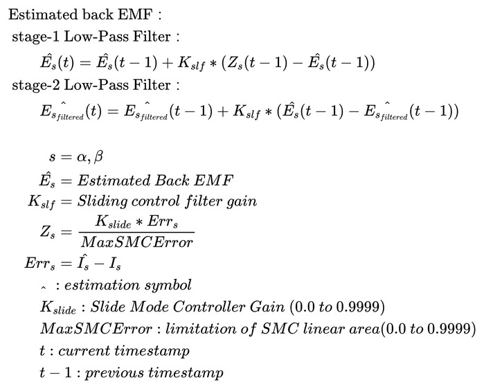

    - Basic Digital Low-Pass Filter

        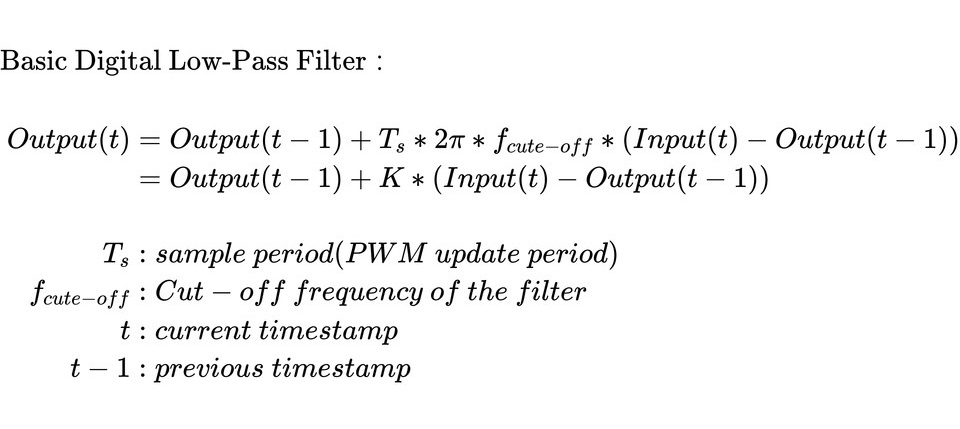

    - 經過 `2 次 low-pass filter`
        1. 第一個 LPF 是為了濾除 SMC 輸出 `Z_s` 所產生的雜訊
        1. 第二個 LPF 是為了讓後續估算電角位置 `θ_hat` 時, `θ_hat` 不會發生劇烈震盪
            > 平滑 `E_filtered_alpha_hat/E_filtered_beta_hat` 數值

        1. 做濾波後會發生相位延遲
            > e.g. `5-stage 濾波器` 取 5 個輸入 sample 點才產生出 1 點輸出, 相位因此產生 delay,

            > + 相位延遲會造成估算的相位角 `θ_hat` 並非實際的機械相位角 `θ_m`, 因此需做**相位補償**

        1. 相位補償
            > 相位補償取決**相位角的變化量**


+ 速度估算
    > 從反電動勢 BEMF 分量, 計算出位置 `θ_hat`, 再累積單位時間 `θ_hat` 的變化量, 來計算轉速 (rad/sec)

    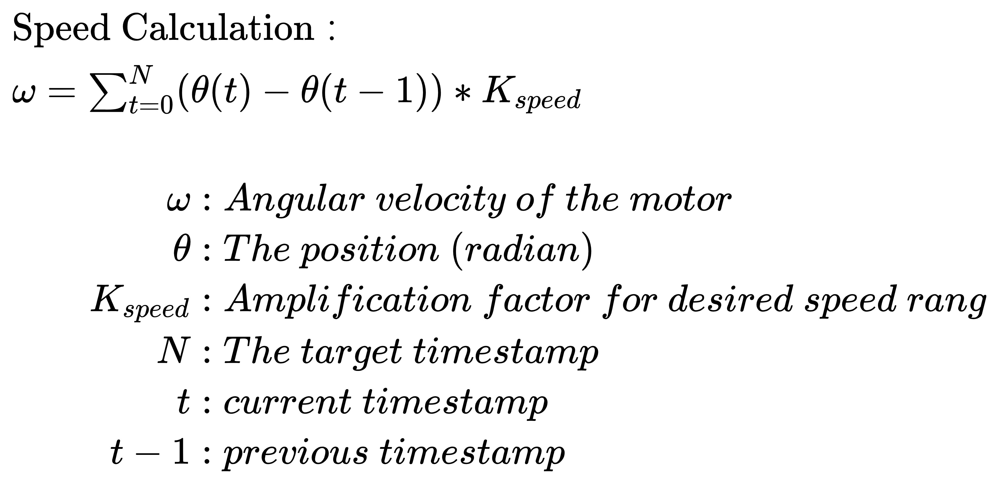

+ Adaptive Low-Pass Filter
    > 由於截止頻率, 在馬達轉速不斷上升的過程中, 始終在變化; <br>
    因此 LPF 的 K_slf (Gain of LPF) 也應 run-time 修正

    - Gain 值估算

        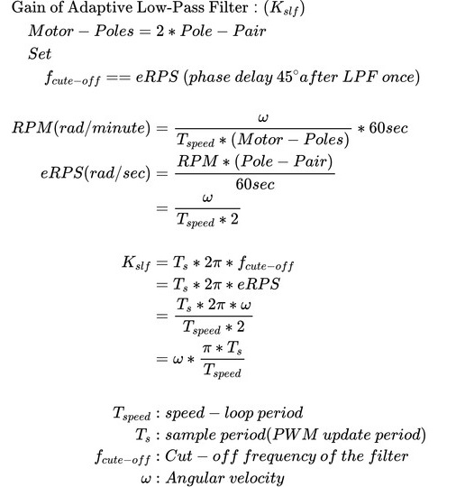


    - 設定截止頻率為 eRPS
        > 可得到固定的相位延遲, 以補償所有速度範圍內的 `θ_hat`
        >> 第一次 LPF 會 delay `45°`, 第二次 LPF 則會 delay `90°`

        1. Low-Pass Filter 的截止頻率 (f_cute_off) 轉換到角頻率 domain, `ω_m = 2Pi * f_cute_off`

            ```
            機械角頻率 ω_m = 2Pi * f_m, 即單位時間內轉幾圈, 故 ω_m 相當於 RPM or RPS
            ps. RPM => 每分鐘轉 N 圈 (即 "N * 2Pi")

            電氣角頻率 ω_e = 2Pi * f_e
                          = Pole_Pair * ω_m
                          = Pole_Pair * (2Pi * N/60sec)

                f_e = Pole_Pair * (N/60sec) = Pole_Pair * (RPM/60) = eRPS (電機的電氣轉速)

            ```

## Texas Instruments (TI)

+ SMO basic block

    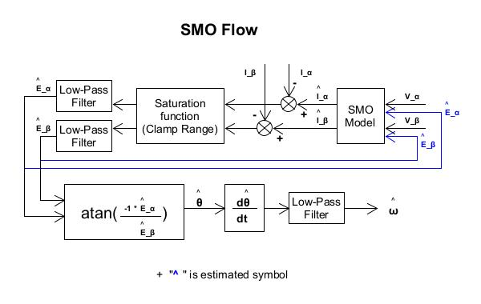


## PD

+ SMO basic block

    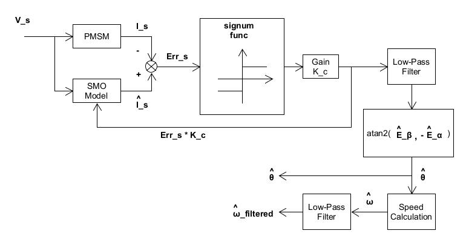


# Reference

+ [三相電機相電感，相電阻和極對數的測量\_電機電感測量方法-CSDN部落格](https://blog.csdn.net/qq_45598353/article/details/122698183)
+ [Sliding-Mode Rotor Position Observer of PMSM - TI E2E](http://e2e.ti.com/cfs-file.ashx/__key/CommunityServer-Discussions-Components-Files/171/3513.smopos.pdf)
+ [節能型循環泵控製器-Chapt 3](https://www.ti.com/cn/lit/pdf/zhca521)
+ [*AN1078電機控制中的數學模型標幺化計算 - 知乎](https://zhuanlan.zhihu.com/p/469634745)
+ [*揭秘隱藏的標幺化基準值——AN1078原始碼解讀 - 知乎](https://zhuanlan.zhihu.com/p/615229940)