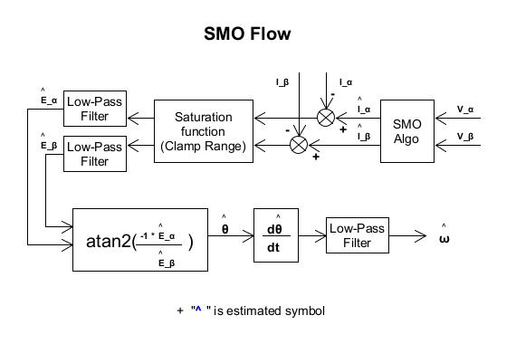

SMO (Sliding Mode Observer) [[Back](./note_FOC.md#SMO)]
----

滑模觀測器(Sliding Mode Observer, SMO)的作用, 是用來估算 motor 的感應電動勢 (Es, Back EMF), 位置(θ), 速度(ω)

經典 `ref. Microchip AN1078 2010`


# Definitions

+ 相電阻 (winding resistance, Rs)
    > motor 有電流通過就會有阻值, **相電阻**是對 motor module 概括的阻值
    >> 理想上三相的相電阻都會一樣


    - 量測方式
        > 用 萬用電表 量測 motor 中任意兩根線 (Va/Vb/Vc)上, 兩兩相測共測 3 組, 求出平均值 R
        >> 正常情況下, 三個繞組的電阻應該是相等的. 如有誤差, 誤差不能大於 5%

        ```
        單相 Rs = R/2
        ```

+ 相電感 (winding inductance, Ls)
    > 相電感一般使用電橋測量, 常見的測量方法是, 將電橋頻率設為 1KHZ 以上(也可以設定為系統 PWM 所使用的的頻率),
    電壓給 1V 左右, 然後測量 motor 在該頻率下的電感
    >> 理想上三相的相電感都會一樣

    - 同樣用電橋的兩端連接電機的任意兩相 (Va/Vb/Vc), 得到的電感值 L
        > 為了提高精準度, 可以旋轉一圈, 多次測量求平均值

        ```
        單相 Ls = L/2
        ```

+ 極對數 (polar)
    > 關於 motor 的極對數, 一般電機廠商都會給出, 如果不確定, 也可以通過測試得到.

    - 量測方式
        > 給 motor 其中兩根線通入適當電壓, 當線內就會流過適當電流時,
        手動轉動電機時會明顯感覺到卡頓, 轉動一圈中有多少卡頓的地方, 該電機就有多少極對數
        >> 一般 motor 流過 `0.1 安培` 電流就能清楚感覺到卡頓了

        1. 對 motor 中任意 2 根線施加電壓 (V), 然後用手轉動 motor 一圈, 記下有多少個卡頓的地方,就可得出有多少極對數
            > 測試時提供的電壓 (V), 可由 相電阻(Rs) 與 合理電流 (I)來計算

            ```
            V = Rs * I = Rs * 0.1
            ```

+ `^` 估計符號
    > 變數上有 `^ (hat)` 符號, 表示為估算預測的值


# SMO Algorithm

FOC 控制的實現, 需要當前轉子位置信息, 為了準確的施加計算產生的電壓向量, 需要當前轉子位置完成座標變換

在 sensorless (無速度/位置感測器)的馬達控制系統中, 位置訊號沒有辦法直接檢測得到, 因此需要設計對應 位置(θ)和速度(ω)的估計模組 (SMO)


為設計估計模組 (SMO), 先建立理想的數學模型來方便推導


## SMO basic block




# Reference

+ [三相電機相電感，相電阻和極對數的測量\_電機電感測量方法-CSDN部落格](https://blog.csdn.net/qq_45598353/article/details/122698183)


Discrete time