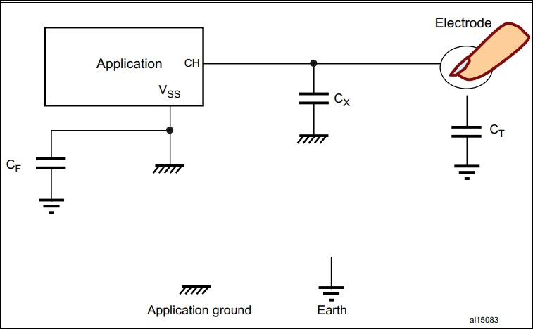
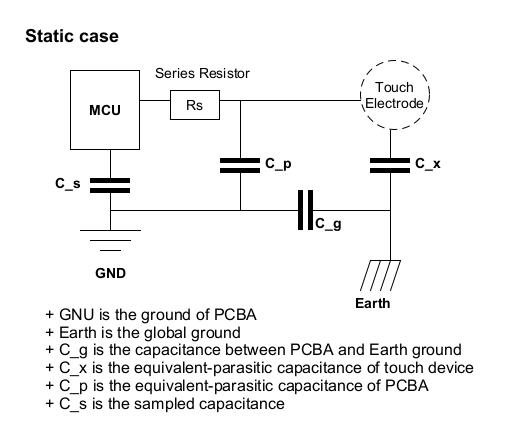
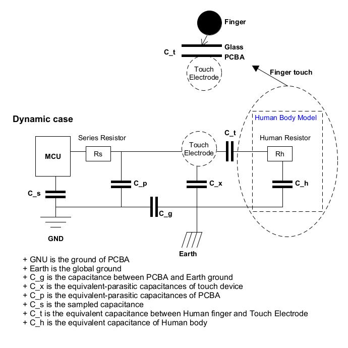

STM32 Touch Sensing  Controller (TSC)
---

Support TSC (Touch Sensing  Controller)
> STM32F02x/STM32F03x, STM32F3, STM32L4


# Definitions

+ Spread Spectrum(展頻)

+ Charge Transfer (電荷轉移)
    >

+ 市電(Utility Power or Mains Electricity)
    > 是提供給家用或企業使用的一般性交流電, 也就是一般在家裡使用電器時, 將插頭插在牆上的插座使用的電力

+ Conducted Susceptibility (CS, 傳導耐受性測試標準)
    > CS 測試是由 AC 電源打入一個 `150kHz ~ 80MHz` 的雜訊干擾, 模擬其他電器所產生的雜訊
    >> 電子產品可能會透過**市電**, 干擾到觸控面板

    - CS 10V 測試標準
        > 頻率 `150KHz ~ 230MHz`

## 電容式感應種類

+ RC 採集
    > RC 採集原理, 以測量電極電容, 通過電阻的充/放電時間為基礎

    - 觸摸 Touch Electrode 電容時, 充/放電時間時間會延長, 因此可利用此變化來偵測手指是否接近
        > STM-AN2927 中詳細介紹了 RC 採集原理

+ 電荷轉移採集
    > 電荷轉移採集原理利用了電容電荷 (Q) 的電氣特性. <br>
    在採樣電容中, 反覆對電極電容進行充放電, 直到採樣電容的電壓達到給定的 threshold

    >> 達到 threshold 所需的轉移次數, 表示電極電容的大小

    > **觸摸**電極時, 電極中儲存的電荷增加, 因此採樣電容充電所需的轉移次數減少

+ 表面式 ProxSense 採集

+ 投射式 ProxSense 採集

+ 表面電容
    > 當手指靠近感應電極(Electrode)時, 電容發生變化 <br>
    > 回路通過以下電容之一形成：
    > + 通過使用者的腳接地的電容
    > + 使用者的手與裝置間的電容
    > + 使用者的身體與應用板之間通過空氣產生的電容(類似天線)

    

    - C_x 是電極的寄生電容
        > C_x 由兩個電容組成
        > + 第一個電容是指大地, 此電容不太重要且可以忽略
        > + 第二個電容是指應用地, 其取決於 PCB 或電路板佈線
        >> 此寄生電容包括 GPIO 焊盤電容以及電極走線與應用地間的耦合電容

        > 設計 PCB 和電路板佈線時，必須盡可能減少寄生電容。

    - C_F 是大地與應用間的回饋電容
        > 它會對表面觸摸感應應用, 產生重要影響, 尤其是未與大地直接相連的應用

    - C_T 是手指觸摸產生的電容，也是有用訊號的來源
        > 其參考點是大地而不是應用地

    - 測得的總電容是 C_x, C_F 和 C_T 的組合，其中只有 C_T 對應用有意義. <br>
    因此，我們測量 C_x 與 C_T 總和並與 C_F 並聯, 結果由下列公式給出

        ```
        Equivalent capacitances = C_x + 1 / ((1 / C_T) + (1 / C_F))
        ```

### 自电容測量模型 (Self-Capacitance)





# Reference

+ STM official documents
    - AN5105
    - AN2927


