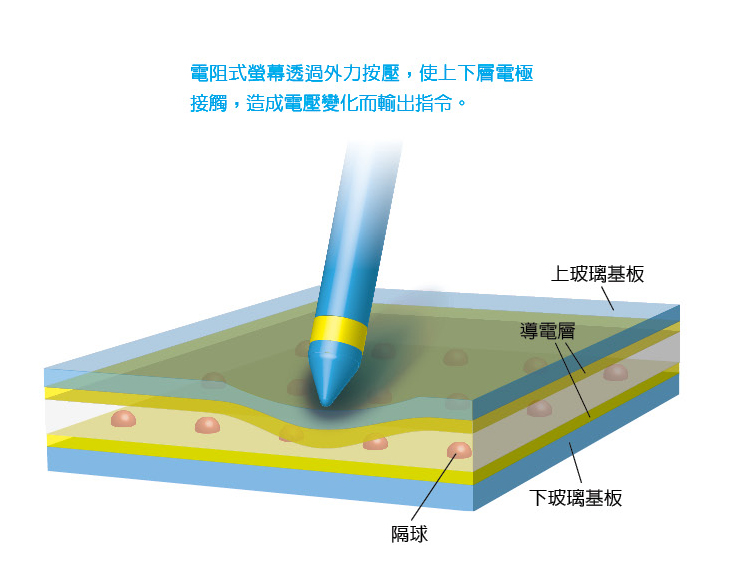
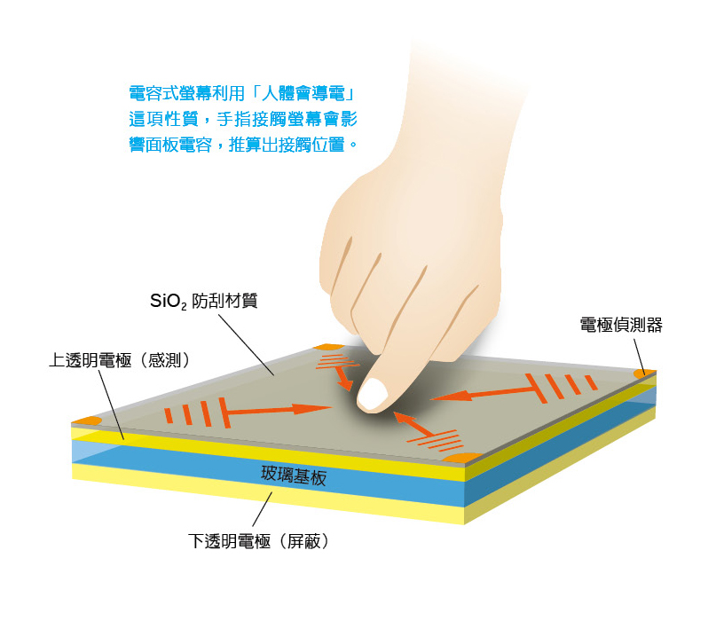
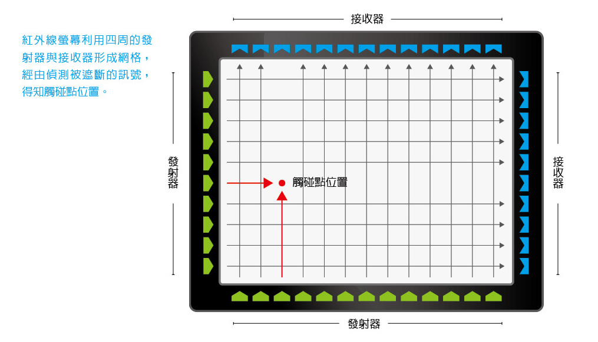
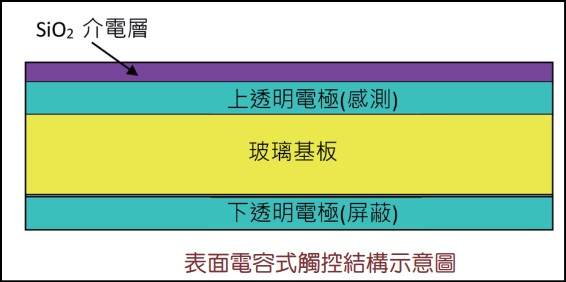
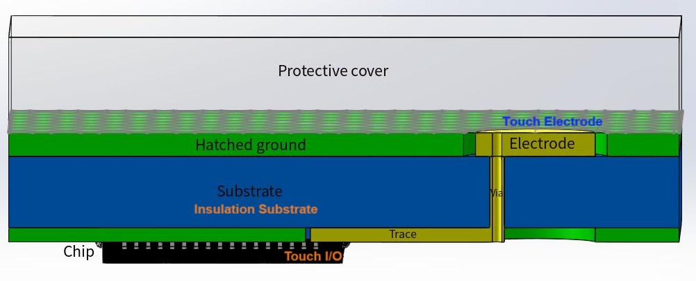

Touch module
----

# Intrudution

touch module 運作原理可分為

+ 電阻式 (resistive touch)

    

    - 電阻式 touch module, 是由內側皆鋪上鍍有導電層的二層玻璃, 中間以一些絕緣的**隔球**隔開的結構.

    - 在兩層導電層之間有電壓差異, 形成一個電場.
    按壓時會讓上下層的電極接觸, 造成短路和電阻改變, 此時控制器測得面板電壓變化, 而計算出接觸點位置, 進而輸入對應指令
        > 因為電阻式螢幕透過壓力操控, 所以不一定要用手來控制

    - 操作電阻式觸控螢幕時需要輕敲, 久而久之它容易故障、不太耐用, 而且靈敏度也不太好, 畫畫、寫字並不流暢

+ 電容式 (capacitive touch)

    

    - 電阻式 touch module, 以周圍四邊或四個角當做電極放電, 在表面上形成均勻電場; 當使用者接觸時, 由於人體會導電, 因此影響了面板的電容量;
    此時面板中的控制器就會依據四個角落所引發的電流變化差異, 推算出手指的位置和該處代表的功能
        > 電容是形容某物體**儲存電荷的能力**

    - 電容式 touch module 是藉由導電改變電容值, 因此只能用可以導電的物體操控
        > 當有較大面積的導電體(e.g. 手掌)接近, 或電磁波干擾時, 沒摸到就能引起電容式螢幕動作;
        同樣的當環境溫度/濕度改變時, 造成電場變動, 可能引起電容式螢幕控制不準確


+ 波動式 (surface acoustic wave touch or infrared touch)
    > 電阻式及電容式 touch module 都需要製造出均勻電場, 因此不易做大 (最大大約20幾吋), 因此大尺寸的 touch module 適合使用波動式

    

    - 在玻璃基板的角落安裝超音波(或紅外線)發射器和接受器, 基板的四邊則加裝反射條:
    當手指或軟性物質觸碰面板時會阻隔超音波, 造成訊號衰減, 衰減前與衰減後比對, 就能計算出觸碰的位置


+ 光學式


## Definitions

+ Ghost Touch (鬼影觸摸)
    > 在沒有任何人體觸控下, 產品卻發生動作
    >> 因為外界看不見的雜訊干擾, 導致產品誤認接收到訊號而產生動作

# Capacitive Touch Sensor (電容式觸控)

電容是一種以**電場形式儲存能量**的電子元件, 當兩個電極(導體)間夾著一介電層(絕緣體)即構成一個電容. <br>
電容值 C 的定義為, 兩電極間所儲存之電荷(儲存的能量) Q 與兩端電位差 V_c 的比值, 亦即

```
Q = C * V_c

C = Q / V_c
```


電容式觸控的原理, 就是偵測觸控面板中, 感測電極(導體)與人體(導體)間的耦合電容.

以最簡易的`表面電容式觸(surface capacitive touch)`為例



主要由一片雙面鍍有透明導電薄膜的基材所構成, 並在上透明電極上方覆蓋一層二氧化矽(SiO_2)介電層, 其中
> + **上透明電極**為感測用電極, 操作使用時需對其施加電壓, 以形成一均勻電場
> + **下透明電極**則提供遮蔽功能, 以避免外界雜訊的干擾

當手指由上方碰觸面板時, 上透明電極與手指間產生足夠大的耦合電容, 此時經由上透明電極四個角落所量測到的電容變化值,
即可推知觸碰的位置, 當觸碰位置愈近時, 其電容變化值愈大

## 自電容式觸控 (Self-capacitance touch)

只看各自 Touch Electrode (電級) 與 GND (人體接地)的電容值 <br>




**不支援多點觸控**, 適用於按鍵式應用, 且手指接觸會施加的額外電容, 造成感測器所測量到的**電容值增加**. <br>
在自電容觸控感測器中, 手指置於感測器墊上方, 會形成一條通往接地的導電路徑, 造成電容量瞬間增加, 明顯大於感測器墊和接地面之間的各種寄生電容量來源
> 在感測器四周進行填充並接地, 可改善感測器的雜訊耐受度


## 互電容式觸控 (Mutual-capacitive touch)

看 XY 軸 Touch Electrodes 之間的電容值

**支援多點觸控**, 且手指接觸會導致**電容值減小** <br>

+ 當控制器將電壓施加到發射針腳時, 接收針腳上測得的電荷量, 會與兩個電極間的互電容成正比
+ 此技術能提供比自電容更高的訊噪比 (SNR), 能提升雜訊耐受度.
    > 更高的 SNR 代表可穿透更厚的覆蓋層進行操作 (靈敏度提高)
+ 陣列配置的感測器能同時追蹤不同點的互電容變化

# Reference

+ [esp-iot-solution/touch_sensor - GitHub](https://github.com/espressif/esp-iot-solution/blob/release/v1.0/documents/touch_pad_solution/touch_sensor_design_cn.md)
+ [AN2934_Microchip: Capacitive Touch Sensor Design Guide]
+ [三大觸控螢幕主流技術圖解 | TechNews 科技新報](https://technews.tw/2014/05/05/indie-technology-touch-screen/)
+ [觸控感測器的選擇與設計解決方案 | DigiKey](https://www.digikey.tw/zh/articles/cn-selection-and-design-solutions-for-touch-sensors)

