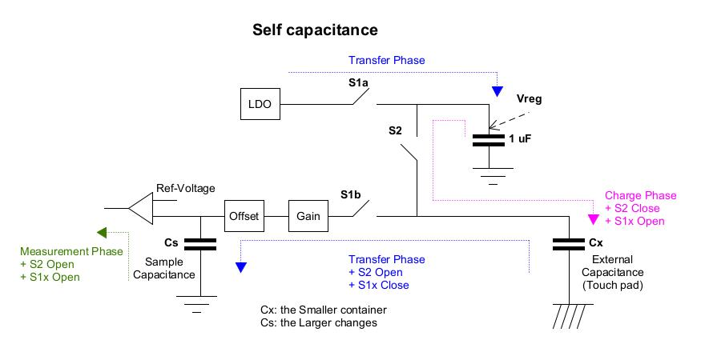

Touch Key (自容式, Self-capacitance)
---

電容式 Touch-Key 基本都是使用電荷轉移(Charge Transfer)原理來實現.
> 當用戶用手指或其他導電物體觸摸螢幕時, 手指和電極之間會形成一個電容.
手指上的電荷會與電極上的電荷相互吸引, 導致一部分電荷從電極轉移到手指上

## 電荷轉移 (Charge Transfer)

以裝水來比喻, 用水去裝滿小容器(充電), 然後以固定周期將小容器裡的水, 倒空(轉移)到大容器中. <br>
填滿大容器所需的次數, 對應了小容器每個周期下, 其平均裝水量的大小(電容值);
若填滿大容器的次數發生變化, 代表小容器在每個週期的平均裝水量發生了變化
> 當發生觸控時, 小容器的平均電容值(裝水量)發生改變



+ Self Mode (Touch-Key)
    > 人體的寄生電容會耦合到外部電容上, 使按鍵的最終`電容值變大`, 充電放電週期變長,
    進而在單位時間內, 偵測到的飽和電壓次數會比校正值少

+ Reference
    - Design-Guide_CapTIvate_trade_Technology_Guide_1.83.00.08.pdf

## Goertzel-Algo

Goertzel-Algo 同時具備 Bandpass(濾波)與共振的效果
> 轉換到 Frequency-domain 並對目標頻段做**共振**, 同時 feedback 回 input, 由 input 減去前次 feedback 的資料, 達到**Bandpass**效果
>> 因此 Goertzel-Algo 輸出波型會呈現喇叭狀震盪 (震幅從小到大)

+ Reference

    - [A Fixed-Point Implementation of the Goertzel Algorithm in C](https://remcycles.net/blog/goertzel.html)


## Touch-key PWM

電容式觸控按鍵利用了電容值的變化來偵測是否有觸摸, 而 PWM(脈衝寬度調製) 則是用於控制電容值的變化, 並以此來實現觸摸感應和按鍵的觸發
> PWM 的頻率, 則影響著觸摸檢測的**靈敏度**和**響應速度**


+ 電容觸控按鍵的原理

    - 電容感測
        > 電容式觸控按鍵的基板上有一層導電材料, 當手指接近時, 會改變電極間的電容值, 因為手指是導電的

    - 電容變化
        > 這種電容值的變化會被感測器檢測到, 並轉化為電信號, 進而判斷是否有觸摸發生

    - 自電容與互電容
        > + 自電容式觸控感測器中, 手指觸摸會直接影響單個電容的電容值(變大)
        > + 互電容式觸控感測器中, 手指觸摸會影響多個電容之間的耦合電容值(變小)


+ PWM在電容觸控按鍵中的作用
    > 使用 PWM 來改變開關通斷時間, 產生一系列不同寬度的脈衝信號, 這些脈衝信號用於 `充電/放電` 電容按鍵的感測電極.
    >> 藉由調整 PWM 的 Duty (佔空比), 可以改變電容的`充電/放電`時間, 進而影響電容值的大小 <Br>
    通過檢測電容值的變化, 可以判斷是否有手指觸摸

    - PWM 頻率的影響
        > PWM 的頻率需要根據具體應用場景和需求進行優化, 以達到最佳的**靈敏度**, **響應速度**, **功耗平衡**和**抗干擾能力**
        > + time domain: PWM => Touch-Keypad => ADC sample and convert
        > + After Goertzel-Algo: Frequency domain

        ```
        PWM => Touch-Keypad                         Time-domain
                => ADC sample and convert           Time-domain
                    => Goertzel-Algo                Convert to Frequency-domain
                        => Touch detection algo     Frequency-domain
                           (PSD, Power Spectral Density)

        ps. Goertzel-Algo 同時具備 Bandpass 與共振的效果
        ```

        1. 靈敏度
            > 較高的 PWM 頻率, 有助於提高觸摸**響應速度**, 因此按鍵的檢測和觸發可以更快地完成,
            進而提高觸摸檢測的靈敏度

        1. 功耗
            > 較高的 PWM 頻率可能導致更高的功耗, 因為開關切換次數增加

        1. 抗干擾
            > 過高的頻率, 可能受到其他電磁干擾的影響


    - 板端有很多干擾源會影響電容, 造成頻率響應而充放電, 因此電容值會震盪.
        > 將電容值轉換到 Frequency-domain, 可觀察到不同頻率的響應狀況

        1. 產生特定頻率 PWM, 與電容產生頻率響應來充放電, 對電容震盪轉換到 Frequency-domain,
        並觀察特定頻率的響應狀態, 藉此來提高 touch 的靈敏(其他頻率視為干擾)


