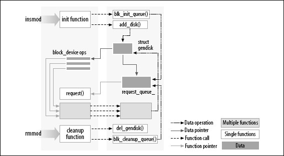

Kernel Module
---

Linux Kernel Module 是一段可以在 run-time 被載入到 Linux Kernel 中的程式碼, 它在 kernel space 中使用 Kernel API (沒有 link 外部 lib)
> Kernel Module 用途很廣, 最常見的例子就是 Device Driver,
如果沒有使用 Kernel Module, 每修改 Kernel code, 或新增 Kernel 功能特性, 都需要重新編譯 Kernel, 大大浪費了時間和效率
>> module_exit() 必須小心恢復每個由 module_init() 建立的東西, 否則會保留一些東西直到 system reboot


## Concept

```
SYSCALL_DEFINE3(init_module, void __user *, umod, unsigned long, len, const char __user *, uargs)
    or
SYSCALL_DEFINE3(finit_module, int, fd, const char __user *, uargs, int, flags)
-> load_module() @ kernel/module.c
    -> parse_args() @ kernel/params.c       <---- parse command line
        -> skip_spaces()
        -> next_arg() @ lib/cmdline.c
        -> parse_one() @ kernel/params.c    <---- 將 arguments 加進 module
    -> mod_sysfs_setup() @ kernel/module.c  <---- link into sysfs
    -> do_init_module() @ kernel/module.c   <---- call to module_init method of the module
```


+ Kernel Module loading flow



+ 由 `struct file_operations` 來處理 syscall

## Practic

使用 busybox commands

+ list modules

    ```
    # lsmod
        Module      Size    Used by
        nls_utf8   16384    1
        isofs      30960    1
    ```

    ```
    # cat /proc/modules
    ```

+ module info
    > 需使用 kernel 提供的 macro function, e.g. `MODULE_LICENSE()`, `MODULE_AUTHOR()`, `MODULE_DESCRIPTION()`

    ```
    # modinfo <module-name>.ko
    ```

+ insert/remove module

    ```
    # sudo insmod <module-name>.ko  <---- call module_init()
    # sudo rmmod <module-name>.ko   <---- call module_exit()
    ```

+ kernel-modules parameter

    ```
    # ls /sys/module/<target-module-name>/parameters
    ```

# Implemnet module

On ubuntu 20.04

+ dependency

    ```
    $ sudo apt install linux-headers-$(uname -r) kernel-package libncurses5-dev libelf-dev
    ```

    - `linux-headers`
        > 加入目前 kernel 的開發環境 `include/linux/*`

        ```
        # 查看目前系統的 kernel 版本
        $ apt-cache search linux-headers-$(uname -r)
        ```

    - environment verable

        ```
        $ export ARCH=x86_64  <---- target Ubuntu platform
        ```

+ C source
    > `printk()` 目的是用來記錄 message, 通常需使用 `# dmesg` 來看 log message

    ```c
    // hello.c
    #include <linux/kernel.h>
    #include <linux/module.h>
    #include <linux/init.h>

    static int __init init_my_module(void)
    {
        printk(KERN_INFO "Hello, my module!\n");
        return 0;
    }

    static void __exit exit_my_module(void)
    {
        printk(KERN_INFO "Bye, my module!\n");
    }

    module_init(init_my_module);
    module_exit(exit_my_module);

    MODULE_LICENSE("GPL");
    MODULE_AUTHOR("csprojectedu");
    ```

+ build
    > kernel-module 通常使用 `*.ko` file externsion

    ```makefile
    #
    ## Makefile by appleboy
    #

    obj-m       += hello.o
    KVERSION := $(shell uname -r)

    all:
        $(MAKE) -C /lib/modules/$(KVERSION)/build M=$(PWD) modules

    clean:
        $(MAKE) -C /lib/modules/$(KVERSION)/build M=$(PWD) clean

    ```


## Pass arguments to kernel module

主要 macro functions 可參見 [linux/moduleparam.h](https://github.com/torvalds/linux/blob/master/include/linux/moduleparam.h)

+ `module_param(name, type, perm)`
    > 傳單一參數
    > + `name`
    >> user 在 terminal 看到的參數名, 也是 module 內宣告的變數

    > + `type` 表示參數的類型, 只支援以下設定
    >> `byte`, `short`, `ushort`, `int`, `uint`, `long`, `ulong`, `charp`, `bool`, `invbool`

    > + `perm` (permission) 指定在 sysfs 中相應檔案的存取權限(與 linux 檔案存取權相同方式)
    >> `0` 表示完全關閉在 sysfs 中相對應的權限, 可以使用 `stat.h`中的定義, e.g. S_IRUGO

    ```c
    // Linux Kernel: include/linux/stat.h

    #define S_IFMT  00170000
    #define S_IFSOCK 0140000
    #define S_IFLNK  0120000
    #define S_IFREG  0100000
    #define S_IFBLK  0060000
    #define S_IFDIR  0040000
    #define S_IFCHR  0020000
    #define S_IFIFO  0010000
    #define S_ISUID  0004000
    #define S_ISGID  0002000
    #define S_ISVTX  0001000

    #define S_ISLNK(m)  (((m) & S_IFMT) == S_IFLNK)
    #define S_ISREG(m)  (((m) & S_IFMT) == S_IFREG)
    #define S_ISDIR(m)  (((m) & S_IFMT) == S_IFDIR)
    #define S_ISCHR(m)  (((m) & S_IFMT) == S_IFCHR)
    #define S_ISBLK(m)  (((m) & S_IFMT) == S_IFBLK)
    #define S_ISFIFO(m) (((m) & S_IFMT) == S_IFIFO)
    #define S_ISSOCK(m) (((m) & S_IFMT) == S_IFSOCK)

    #define S_IRWXU 00700
    #define S_IRUSR 00400   // 檔案所有者可讀
    #define S_IWUSR 00200   // 檔案所有者可寫
    #define S_IXUSR 00100   // 檔案所有者可執行

    #define S_IRWXG 00070
    #define S_IRGRP 00040   // 與檔案所有者同組的使用者可讀
    #define S_IWGRP 00020
    #define S_IXGRP 00010

    #define S_IRWXO 00007
    #define S_IROTH 00004   // 與檔案所有者不同組的使用者可讀
    #define S_IWOTH 00002
    #define S_IXOTH 00001


    #define S_IRWXUGO   (S_IRWXU|S_IRWXG|S_IRWXO)
    #define S_IALLUGO   (S_ISUID|S_ISGID|S_ISVTX|S_IRWXUGO)
    #define S_IRUGO     (S_IRUSR|S_IRGRP|S_IROTH)
    #define S_IWUGO     (S_IWUSR|S_IWGRP|S_IWOTH)
    #define S_IXUGO     (S_IXUSR|S_IXGRP|S_IXOTH)
    #define UTIME_NOW   ((1l << 30) - 1l)
    #define UTIME_OMIT  ((1l << 30) - 2l)
    ```

    - 這些 macro 不會自動宣告變數, 必須在使用前宣告變數
        >  device driver source code

        ```c
        // kernel module c source
    　　static unsigned int   int_var = 0;    <---- 先宣告變數
    　　module_param(int_var, uint, S_IRUGO);
        ...
        ```

    - insert module in terminal

        ```bash
        $ insmod xxxx.ko int_var=123
        ```

+ `module_param_array(para , type , &n_para , perm)`
    > 傳多個參數
    > + `para`
    >> user 在 terminal 看到的參數陣列, 也是 module 內宣告的變數陣列, 陣列的大小決定能輸入多少個參數
    > + `type` 表示參數的類型, 只支援以下設定
    >> `byte`, `short`, `ushort`, `int`, `uint`, `long`, `ulong`, `charp`, `bool`, `invbool`

    > + `perm` (permission) 指定在 sysfs 中相應檔案的存取權限(與 linux 檔案存取權相同方式)

    > + `n_para`
    >> run-time 傳入的參數個數

    - device driver source code

        ```c
        #include <linux/module.h>
        #include <linux/kernel.h>
        #include <linux/fs.h>
        #include <linux/init.h>
        #include <linux/delay.h>
        #include <asm/uaccess.h>
        #include <asm/irq.h>
        #include <asm/io.h>
        #include <asm/arch/regs-gpio.h>
        #include <asm/hardware.h>

        static char *name = "Ocean";
        static int count = 2;
        static int para[8] = {1,2,3,4};
        static int n_para = 1;
        module_param(count, int, S_IRUGO);               <--- argv[count]
        module_param(name, charp, S_IRUGO);              <--- argv[name]
        module_param_array(para, int, &n_para, S_IRUGO); <--- argv[para]

        static struct file_operations first_drv_fops={
            .owner = THIS_MODULE,
            .open  = first_drv_open,
            .write = first_drv_write,
        };

        int first_drv_init(void)
        {
            printk("init first_drv drv!\n");

            int i;
            for (i = 0; i < count; i++)
                printk(KERN_ALERT "(%d) Hello, %s ！\n", i, name);


            for (i = 0; i < 8; i++)
                printk(KERN_ALERT "para[%d] : %d \n", i, para[i]);

            for(i = 0; i < n_para; i++)
                printk(KERN_ALERT "para[%d] : %d \n", i, para[i]);

            return 0;
        }

        void first_drv_exit(void)
        {
            printk("exit first_drv drv!\n");
        }

        module_init(first_drv_init);
        module_exit(first_drv_exit);

        MODULE_AUTHOR("Ocean Byond");
        MODULE_DESCRIPTION("my first char driver");
        MODULE_LICENSE("GPL");
        ```

    - insert module in terminal

        ```
        $ insmod xxx.ko name="ocean" count=3 para=8,7,6,5
        $ insmod xxx.ko name="ocean" count=3 para=8,7,6,5,44,33,22,11
        ```

+ `module_param_string(name, string, len, perm)`
    > 傳入 string
    > `name`
    >> user 在 terminal 看到的參數名稱
    > + `string`
    >> module 內宣告的變數名稱
    > + `len`
    >> 最大字串長度 (含結束字元)
    > + `perm` (permission) 指定在 sysfs 中相應檔案的存取權限(與 linux 檔案存取權相同方式)

    - device driver source code

        ```c
        static char     mystring[255] = {'b', 'l', 'a', 'h', '\0', };

        module_param_string(My_String, mystring, 255, 0644);
        MODULE_PARM_DESC(myString, "A character string");    <--- 參數說明
        ```
    - insert module in terminal

        ```
        $ insmod xxx.ko My_String="Hello,Parameters!"
        ```

+ `module_param_named(name_out, name_in, type, perm)`
    > 重新對應內外部參數名稱
    > + `name_out`
    >> user 在 terminal 看到的參數名稱

    > + `name_in`
    >> module 內宣告的變數名稱

    > + `type` 表示參數的類型, 只支援以下設定
    >> `byte`, `short`, `ushort`, `int`, `uint`, `long`, `ulong`, `charp`, `bool`, `invbool`

    > + `perm` (permission) 指定在 sysfs 中相應檔案的存取權限(與 linux 檔案存取權相同方式)

    - device driver source code

        ```
        static int      value_in = 0;
        module_param_named(value_out, value_in, int, 0644);
        MODULE_PARM_DESC(value_in, "value_in named var_out...\n");
        ```

    - insert module in terminal

        ```
        $ insmod xxx.ko value_out=200
        ```

+ `module_param_cb(name, ops, arg, perm)`
    > 支援自訂 callback, 當有需要等待 event 的情況, e.g. otg 等待回應
    > + `name`
    >> user 在 terminal 操作的參數名稱

    > + `ops`
    >> call to methods `struct kernel_param_ops`, e.g. methods get/set/free

    ```
    struct kernel_param_ops
    {
        /* How the ops should behave */
        unsigned int flags;
        /* Returns 0, or -errno.  arg is in kp->arg. */
        int (*set)(const char *val, const struct kernel_param *kp);
        /* Returns length written or -errno.  Buffer is 4k (ie. be short!) */
        int (*get)(char *buffer, const struct kernel_param *kp);
        /* Optional function to free kp->arg when module unloaded. */
        void (*free)(void *arg);
    };
    ```

    > + `arg`
    >> 表示 callback 的資料型態

    > + `perm` (permission) 指定在 sysfs 中相應檔案的存取權限(與 linux 檔案存取權相同方式)

    - device driver source code
        > kernel 依照 `arg`的型態, 提供對應的 `param_get_xxx()/param_set_xxx()` API

        ```c
        int my_param_set_ushort(const char *val, const struct kernel_param *kp)
        {
            unsigned short* pvalue = kp->arg;    // Pointer to actual parameter variable.
            int res = param_set_ushort(val, kp); // Use helper for write variable
            if(!res)
            {
                // Here you may execute additional actions when you write parameter.
                printk(KERN_INFO "set param %d\n", *pvalue);
            }
            return res;
        }

        const struct kernel_param_ops my_param_ops_ushort =
        {
            .set = &my_param_set_ushort,  // Use our setter
            .get = &param_get_ushort,     // user standard getter in kernel
        };

        // Usage
        unsigned short      param = 0xff;  <---- ushort type, use param_get_ushort()/param_set_ushort()

        module_param_cb(param,    /* filename*/
            &my_param_ops_ushort, /* operations*/
            &param,               /* pointer to variable, contained parameter's value */
            S_IRUGO | S_IWUSR     /* permissions on file*/
        );
        ```

        ```c
        static int  cb_valueETX = 999;  <---- int type, use param_get_int()/param_set_int()

        int notify_param(const char *val, const struct kernel_param *kp)
        {
            int res = param_set_int(val, kp);   // Use helper for write variable
            if(res == 0) {
                printk(KERN_INFO "Call back function called...\n");
                printk(KERN_INFO "New value of cb_valueETX = %d\n", cb_valueETX);
                return 0;
            }
            return -1;
        }

        const struct kernel_param_ops   my_param_ops =
        {
            .set = &notify_param,  // Use our setter ...
            .get = &param_get_int, // standard getter
        };

        module_param_cb(cb_valueETX, &my_param_ops, &cb_valueETX, S_IRUGO|S_IWUSR);
        ```

    - insert module in terminal

        ```
        $ insmod xxx.ko
        $ cat /sys/module/<target-module-name>/parameters/cb_valueETX       <---- call my_param_ops.get()
        $ echo 1 > /sys/module/<target-module-name>/parameters/cb_valueETX  <---- call my_param_ops.set()
        ```

# Reference

+ [2.3. 核心模組相比於應用程式](http://www.deansys.com/doc/ldd3/ch02s03.html)
+ [Linux 核心模組運作原理](https://hackmd.io/@sysprog/linux-kernel-module)
+ [Linux kernel模組的開發](Linux kernel模組的開發 )
+ [github-Simple Linux Driver](https://github.com/apriorit/SimpleLinuxDriver)
+ [Ubuntu- 在 Ubuntu 18.04 上開發 kernel module](http://limitx5.blogspot.com/2018/11/ubuntu-ubuntu-1804-kernel-module.html)
