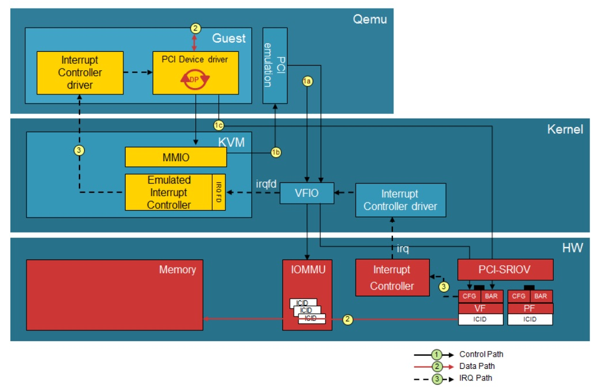

Qemu Concept
---

QEMU 作為裝置模擬器, 可以模擬多種 CPU 架構. 其中待模擬的架構稱為 Guest 或 Target (有時待模擬的 program 也會直接成為 Target),
而 QEMU 運行的系統環境稱為 Host.

QEMU 中有一個模組叫做 `Tiny Code Generator (TCG)`, 負責將 Target Code 動態的翻譯為 Host Code, 也即 TCG Target

因此我們也可以將在 Sim-CPU 上運行的程式碼 (e.g. mips instructions)稱為 Guest Code.
QEMU 的作用就是將 Guest Code 提取出來 , 並將其轉換為 Host Code(e.g. x86 instructions)

 <br>
> TCG-target 代表 TCG 最終的目標 (以 TCG 的角度來看)

QEMU 提取 Guest Instructions 後, TCG 將其轉換為 Host Instructions, 整個轉換過程由兩部分:

> + 第一步由前端完成, Target Code 的 TB (Translation Block) 被轉換成 TinyCode(獨立於 machine 的中間程式碼)
> + 第二步由後端完成, 利用 Host 架構對應的 TCG, 把由 TB 生成的 TinyCode 轉換成 Host Code

## Simulator v.s. Virtual Machine

QEMU 可以用來當作不同 CPU 的 Simulator, 也可以當作 Virtual Machine.

### Simulator

針對不同於本機上 CPU 的程序, 使用動態翻譯技術 (TCG)

### Virtual Machine
基於 Xen Hypervisor 或者 KVM 核心模組才能支援虛擬化.
> 在這種條件下的 QEMU VM, 可以通過直接在 Host CPU 上運行 Guest Porocess, 並獲得接近本機的性能

+ QEMU 與 KVM 的關係

    

    - KVM 在物理機啟動時, 建立`/dev/kvm`裝置檔案, 當建立 VM 時, KVM為該 VM Process 建立一個 VM 的檔案描述符,
        當建立 vCPU 時, KVM 為每個 vCPU 建立一個檔案描述符

    - 同時 KVM 向 user space 提供了一系列, 針對特殊裝置檔案的 ioctl syscall
        > QEMU 主要是通過 ioctl syscall 與 KVM 進行互動的

+ QEMU 和 KVM 分工協作

    

    - QEMU 所實現的功能包括:
        1. VM 的組態和建立
        1. VM 運行依賴的虛擬裝置
        1. VM 執行階段使用者操作環境和互動(VNC)
        1. 以及一些針對 VM 的特殊技術(如動態遷移)
        1. 利用KVM提供的介面, 實現 VM 硬體加速


    - KVM 的主要功能在於
        > 以下這些支援, 主要是以針對相關特殊裝置檔案的 ioctl syscall
        1. 初始化 CPU 硬體
        1. 打開虛擬化模式
        1. 將 Guest OS 運行在 VM 模式下
        1. 對 Guest OS 的運行提供支援


    - Peripheral 的模擬一般不會由 KVM 負責, 只有對性能要求較高的虛擬裝置, 如虛擬中斷控製器和虛擬時鐘, 是由 KVM 模擬的,
        這樣可以大量減少 CPU 的模式轉換的開銷

## Qemu Event


系統結構如上圖展示的, Qemu VM 的 **每個 vCPU 都是一個執行緒**, 這些 vCPU Threads 可以運行 Guest Code, 以及模擬 Virtual Interrupt, Virtual Timer, 等.
而 `Main loop` 主執行緒則是 `Event-driver`的, 通過 polling file descriptor,
呼叫對應的 method, 處理由 Monitor 發出的命令, Timers超時, 並且實現 VNC, 完成 IO 等功能.
> QEMU Event-driver 主要可以查看 `include/qemu/main-loop.h`, 以及相關的實現程式碼

當 Qemu Simulator 運行時, 就只有 `Main loop` 主執行緒

## Derictory

```
Qemu-v5.0.0
    ├── accel
    ...
    ├── hw
    ...
    ├── linux-user
        ├── arm
        ├── generic
        ├── riscv
    ...
    ├── softmmu
        ├── main.c
        └── vl.c
    ...
    ├── target
        ├── arm
        ├── riscv

    ├── tcg
        ├── i386

```

+ `softmmu` 是 Qemu 主要進入點, 也是 VM system space 的起始點
    - `main.c` 這裡是 QEMU 本身 Host 的 `main()`入口, 對應 `qemu-system-xxx`
        > `main.c` 會轉進 `vl.c`, 舊版本會直接從 `vl.c` 開始

+ `accel` 為不同 CPU 的模擬加速器, e.g. 通過 KVM 模組進行 CPU 虛擬
    > 在不同 CPU 模擬中, 只能使用 TCG 的方式,
    相關檔案位於`accel/tcg/`中, 其中`accel/tcg/cpu-exec.c`負責整個 CPU 執行循環

+ `hw` 模擬所有 VM 中的虛擬硬體的程式碼

+ `linux-user` 是模擬 Guest OS 的 user space, 對應 `qemu-xxx`

+ `target` 是 TCG 的前端, 負責把 Target 架構的 Instructions 翻譯為中間指令

+ `tcg` 是 TCG 後端, 為 TCG 模組的核心, 主要負責把中間指令翻譯為 Host 架構 Instructions
    > 中間程式碼都定義在下面三個檔案中, 這些都是各個架構通用的
    > + `tcg/tcg-op.c`
    > + `tcg/tcp-op.h`
    > + `tcg/tcg-opc.h`

## [QOM](note_qemu_qom.md)

QEMU 為了實現大量 Devices 的模擬, 實作比較完備的 QOM (QEMU Object Model).
QEMU 對於 CPU, Memroy, Bus 以及主機板的模擬, 都基於 QOM 實作
> + QOM 可以查看 `include/qom/object.h`
> + 具體的 CPU, Memroy等 Device 的模擬, 可以查看`include/qom/cpu.h`, `include/exec/memory.h`, `include/hw/qdev-core.h`

## [TCG](note_qemu_tcg.md)


# Reference

+ [yifengyou/learn-kvm: Qemu KVM(Kernel Virtual Machine)學習筆記](https://github.com/yifengyou/learn-kvm/tree/master)
+ [QEMU使用者模擬原始碼分析一 整體概覽 - 知乎](https://zhuanlan.zhihu.com/p/583190374)
+ [QEMU虛擬機器(一)、原始碼分析概論 qemu原始碼-CSDN部落格](https://blog.csdn.net/weixin_38387929/article/details/120121636)

