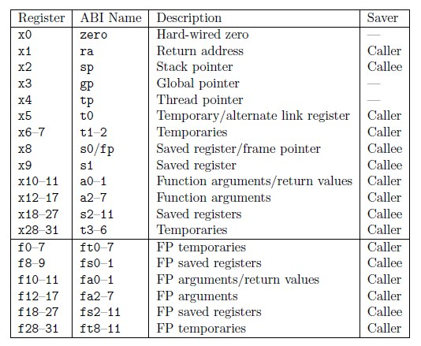

GD32VF103 interrupt analysis
---

## 概述

在處理 RISC-V 中斷的時候, 需要弄清楚兩個概念:
> + 向量中斷
> + 非向量中斷

### 向量中斷

對於向量中斷, 其中斷發生後, `$pc` 會根據中斷的類型, 跳轉到 `Vector Base + IRQ * 4` 的 address 去執行 ISR.

當然 RISC-V 也可以支援這種 Vector Interrupt, 這樣每個地址處會安排一個特定的 ISR, 當中斷發生後, 跳轉到特定的 ISR 去執行即可.

### 向量中斷

對於非向量中斷, 則表示中斷發生後, **只有一個入口**, 需要在這一個 ISR 中, 去判斷具體 IRQ
> 這種行為, 可以在常見的 mips, sparc 中看到

既然 RISC-V 可支援這兩種中斷處理方式, GD32VF103 也實現了這兩種機制, 那麼就分析一下實現的策略

## 中斷向量表初始化

任何程式碼在最初的 Assembly 等級的初始化時, 都會指定 Vector Base, 當然 RISC-V 也不例外

對於向量中斷來說

```
/*
 * Intialize ECLIC vector interrupt
 * base address mtvt to vector_base
 */
la t0, vector_base
csrw CSR_MTVT, t0
```

這裡向 CSR_MTVT 中存放 vector_base, 該處存放向量地址入口, 每個向量中斷發生, 則根據偏移執行對應的 ISR.
> CSR_MTVT 和 CSR_MTVT2 是 vendor 自行實作

```asm
    .globl vector_base
    .type vector_base, @object
vector_base:
#if defined(DOWNLOAD_MODE) && (DOWNLOAD_MODE != DOWNLOAD_MODE_FLASH)
    j _start                                        /* 0: Reserved, Jump to _start when reset for ILM/FlashXIP mode.*/
    .align LOG_REGBYTES                             /*    Need to align 4 byte for RV32, 8 Byte for RV64 */
#else
    DECLARE_INT_HANDLER     default_intexc_handler  /* 0: Reserved, default handler for Flash download mode */
#endif
    DECLARE_INT_HANDLER     default_intexc_handler  /* 1: Reserved */
    DECLARE_INT_HANDLER     default_intexc_handler  /* 2: Reserved */
    DECLARE_INT_HANDLER     eclic_msip_handler      /* 3: Machine software interrupt */

    DECLARE_INT_HANDLER     default_intexc_handler  /* 4: Reserved */
    DECLARE_INT_HANDLER     default_intexc_handler  /* 5: Reserved */
    ...
```

下面非向量中斷的入口

```asm
    /*
     * Set ECLIC non-vector entry to be controlled
     * by mtvt2 CSR register.
     * Intialize ECLIC non-vector interrupt
     * base address mtvt2 to irq_entry.
     */
    la t0, irq_entry
    csrw CSR_MTVT2, t0
    csrs CSR_MTVT2, 0x1
```

其中 `irq_entry` 表示了非向量的 ISR.
> `csrs CSR_MTVT2, 0x1` 該指令的解析如下:
> + `CSR_MTVT2[0] == 0`時, 中斷入口使用 `CSR_MTVEC`
> + `CSR_MTVT2[0] == 1`時, 中斷入口則為 `CSR_MTVT2[31:2]`

## 分析 `irq_entry.S`

分析非向量中斷的行為, 可以更好的理解 RISC-V 的中斷底層的處理機制,
從中斷處理的原理上來講, 中斷處理分三部分:
> + 保存當前現場
> + 進入 ISR
> + 恢復現場

```asm
.global irq_entry
/* This label will be set to MTVT2 register */
irq_entry:

    /************************************
     *  儲存需要的 GPRs 及 CSRx 的資訊到 stack
     */
    /* Save the caller saving registers (context) */
    SAVE_CONTEXT
    /* Save the necessary CSR registers */
    SAVE_CSR_CONTEXT

    /************************************
     *  藉由 CSR_JALMNXTI, 讓 RISC-V 去對應 IRQ 和 Vector table
     */
    /* This special CSR read/write operation, which is actually
     * claim the CLIC to find its pending highest ID, if the ID
     * is not 0, then automatically enable the mstatus.MIE, and
     * jump to its vector-entry-label, and update the link register
     */
    csrrw ra, CSR_JALMNXTI, ra

    /* Critical section with interrupts disabled */
    DISABLE_MIE     /* 關中斷, 因為 CSR_JALMNXTI 會自動 開中斷  */

    /************************************
     *  從 stack 取回需要的 GPRs 及 CSRx 的資訊
     */
    /* Restore the necessary CSR registers */
    RESTORE_CSR_CONTEXT
    /* Restore the caller saving registers (context) */
    RESTORE_CONTEXT

    /* Return to regular code */
    mret

/**
 * \brief  Macro for save necessary CSRs to stack
 * \details
 * This macro store MCAUSE, MEPC, MSUBM to stack.
 */
.macro SAVE_CSR_CONTEXT
    /* Store CSR mcause to stack using pushmcause */
    csrrwi  x0, CSR_PUSHMCAUSE, 11
    /* Store CSR mepc to stack using pushmepc */
    csrrwi  x0, CSR_PUSHMEPC, 12
    /* Store CSR msub to stack using pushmsub */
    csrrwi  x0, CSR_PUSHMSUBM, 13
.endm

/**
 * \brief  Macro for restore necessary CSRs from stack
 * \details
 * This macro restore MSUBM, MEPC, MCAUSE from stack.
 */
.macro RESTORE_CSR_CONTEXT
    LOAD x5,  13*REGBYTES(sp)
    csrw CSR_MSUBM, x5
    LOAD x5,  12*REGBYTES(sp)
    csrw CSR_MEPC, x5
    LOAD x5,  11*REGBYTES(sp)
    csrw CSR_MCAUSE, x5
.endm
```

其中 `SAVE_CONTEXT` 是保存上下文現場的方式

```asm
.macro SAVE_CONTEXT
    csrrw sp, CSR_MSCRATCHCSWL, sp
    /* Allocate stack space for context saving */
#ifndef __riscv_32e
    addi sp, sp, -20*REGBYTES
#else
    addi sp, sp, -14*REGBYTES
#endif /* __riscv_32e */

    STORE x1, 0*REGBYTES(sp)
    STORE x4, 1*REGBYTES(sp)
    STORE x5, 2*REGBYTES(sp)
    STORE x6, 3*REGBYTES(sp)
    STORE x7, 4*REGBYTES(sp)
    STORE x10, 5*REGBYTES(sp)
    STORE x11, 6*REGBYTES(sp)
    STORE x12, 7*REGBYTES(sp)
    STORE x13, 8*REGBYTES(sp)
    STORE x14, 9*REGBYTES(sp)
    STORE x15, 10*REGBYTES(sp)
#ifndef __riscv_32e
    STORE x16, 14*REGBYTES(sp)
    STORE x17, 15*REGBYTES(sp)
    STORE x28, 16*REGBYTES(sp)
    STORE x29, 17*REGBYTES(sp)
    STORE x30, 18*REGBYTES(sp)
    STORE x31, 19*REGBYTES(sp)
#endif /* __riscv_32e */
.endm
```

按照 RISC-V 的資料模型, 可分為 RV32I (integer) 和 RV32E (Embedded)
> RV32I 和 RV32E 的主要差異在於 GPRs 的數量上:
> + 在 RV32I 中, 總共有 32 個 32-bits 的 GPRs
> + 在 RV32E 只支援 16 個 32-bits 的 GPRs
>> 較少的 GPRs, 在 Push/Pop 時, 速度較快, RV32E 只會 Push/Pop 10 個 GPRs

<br>
Fig 1. RISC-V GPRs

Fig 1. 中, caller 代表中斷上層函數, 可以使用的暫存器, 所以

`x1, x5, x6, x7, x10, x11, x12, x13, x14, x15` 這 10 個 GPRs 會保存
> 上述程序多保存了`x4`


下面理解一下中斷的處理, 通過`csrrw ra, CSR_JALMNXTI, ra`該指令進行分析,
可發現這指令是來自**自訂擴展指令**
> `CSR_JALMNXTI = 0x7ed`


那麼一條指令, 是如何實現中斷的處理的呢 ?
> 實際上該指令, 首先會判斷當前 `eclic (Enhanced Core Local Interrupt Controller)` 中是否有 pending 未處理的中斷,
如果沒有, 那這條指令向下執行, 並不會處理任何事情;
一旦存在 pending 的中斷, 那麼會跳轉到 eclic 的中斷向量的入口, 這裡便是關鍵的地方了.

> 另外需要注意的是, default 在一進入中斷時, CPU 會關閉中斷,
當執行 `csrrw ra, CSR_JALMNXTI, ra`時, CPU 會開啟中斷, 然後判斷是否還有中斷未響應,
因此當 ISR 執行完成後, 又會回到該指令執行一次, 判斷是否還需要處理中斷
>> 如此可以達到 `SAVE_CONTEXT` -> ISR_n() -> ISR_m() -> `RESTORE_CONTEXT` 的效率提升,
這一切的行為, 都是由 H/w 完成, 大大提高中斷處理的效率


# Reference

+ [【Perf-V評測】蜂鳥E203的異常(中斷)處理 - FPGA/CPLD - 電子工程世界-論壇](http://bbs.eeworld.com.cn/thread-1173506-1-1.html)
+ [從riscv底層原理分析gd32vf103的中斷行為\_\_專欄\_RISC-V MCU中文社區](https://www.rvmcu.com/column-topic-id-467.html)
