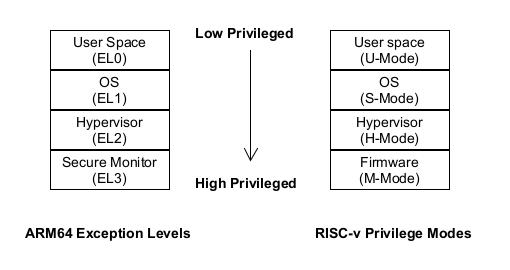
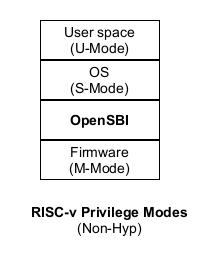
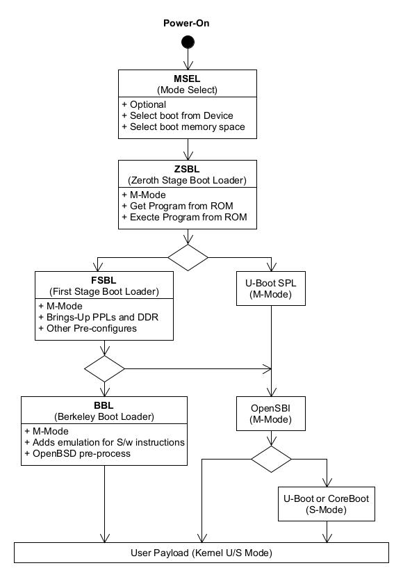
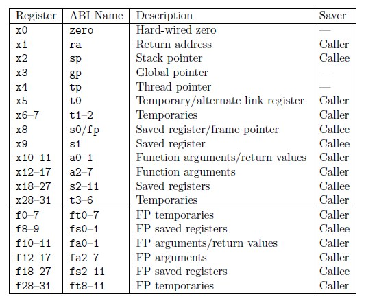

RISCV BootFlow [[Back]](note_riscv_quick_start.md#RISC-V-BootFlow)
----

在理解 RISC-V 的 boot 流程之前, 首先需要知道的是 RISC-V 設計的三種模式:
> + M-mode(Machine Mode)
> + S-mode(Supervisor Mode)
> + U-mode(User Mode)

 
Fig 1. ARM vs RISCV Boot Levels

對於 ARM64 來說, 系統上電後, 啟動會處於 `EL3 secure world`, 所以對於 ARM64 來說,
一般都會使用 `ARM Trusted firmware (TF-A)`, 在 `Nnormal Space (EL2)` 與 `Secure Space (EL3)` 進行切換.

而對於 RISC-V 來說, 系統上電啟動後, 會在`M-Mode`, 而 RISC-V 目前是沒有 Hypervisor 這一層的概念的, 所以目前採用的是 OpenSBI, 如 Fig 2.

 
Fig 2. RISC-V with OpenSBI

## RISC-V Boot Flow

RISC-V 啟動流程分為多個階段

 
Fig 3. RISC-V Boot Flow

### OpenSBI Boot Flow analysis

[fw_base.S](fw_base.S)

OpenSBI 在一開始的 Assembly 階段做了這些事: 首先主core 會去做重定位, 此時其他core會陷入循環等待主core 重定位結束, 主core 重定位結束之後會通過寫一個全域變數通知其他core此時已經完成了重定位了。完成重定位後主core 會去為每個core分配一段棧以及scratch空間, 並將一些scratch結構體參數放入scratch空間（包括： 下一階段的跳轉地址、下一階段的Mode等）。主core在完成棧空間分配後會清除bss 段。然後進行fdt的重新導向, fdt的源地址保存在a1暫存器中（這個a1暫存器的值從進入opensbi至今 都還保持著原先得值）fdt的目的地地址時通過宏定義決定。在搬運fdt的過程中, 首先會判斷a1暫存器的值是否符號要求（是否存在fdt需要搬運）如果a1 == 0 直接跳過這一部分, 搬運完fdt後, 主core又會寫一個全域變數通知其他core該做的初始化已經完成, 接下來準備啟動c呼叫了。其他core接收到這個通知後會跳出一個循環開始下一階段。opensbi 彙編的最後就是每個core 去找到自己的棧空間, 然後把棧頂設定到sp暫存器中, 再設定好異常入口地址, 緊接著就是跳轉如c 程式碼執行sbi_init.

## Misc

 
Fig.  RISC-V GPRs

# Reference

+ [RISC-V CPU加電執行流程 - mkh2000 - 部落格園](https://www.cnblogs.com/mkh2000/p/15811708.html)
+ [關於risc-v啟動部分思考-騰訊雲開發者社區-騰訊雲](https://cloud.tencent.com/developer/article/1764021)
+ [articles/20220816-introduction-to-qemu-and-riscv-upstream-boot-flow.md · yjmstr/RISCV-Linux - Gitee.com](https://gitee.com/YJMSTR/riscv-linux/blob/master/articles/20220816-introduction-to-qemu-and-riscv-upstream-boot-flow.md)
+ [RISC-V 指令集架構介紹 - Integer Calling convention | Jim's Dev Blog](https://tclin914.github.io/77838749/)
+ [opensbi firmware原始碼分析(1)\_opensbi原始碼詳解-CSDN部落格](https://blog.csdn.net/passenger12234/article/details/126182720?spm=1001.2101.3001.6650.2&utm_medium=distribute.pc_relevant.none-task-blog-2%7Edefault%7ECTRLIST%7ERate-2-126182720-blog-132554315.235%5Ev39%5Epc_relevant_anti_t3&depth_1-utm_source=distribute.pc_relevant.none-task-blog-2%7Edefault%7ECTRLIST%7ERate-2-126182720-blog-132554315.235%5Ev39%5Epc_relevant_anti_t3&utm_relevant_index=3)