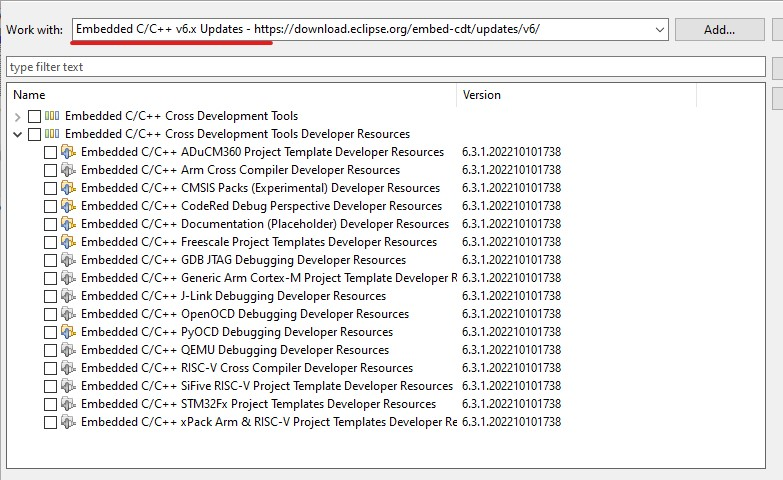
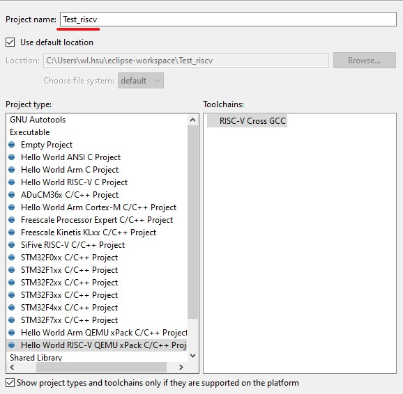

RISC-V Eclipse
---

## Install

+ Rrequisites

    - Java
        1. Ubuntu

        ```
        $ sudo apt install --yes openjdk-15-jdk
        $ java --version
        ```

        1. Windows
            > [OpenJDK](https://jdk.java.net/archive/)
            >> decompress packet to your path

            > + Add to environment varable
            >> `%APPDATA%` = `<user>\AppData\Roaming\`

            ```
            C:\> set Path=%APPDATA%\Oracle\jdk-15\bin;%Path%
            C:\> setx Path "%APPDATA%\Oracle\jdk-15\bin;%Path%"
            C:\> java --version
            ```

    - npm/xpm

        1. [npm](https://nodejs.org/en)

            > + node install

            ```
            C:\> where node.exe
            C:\Program Files\nodejs\node.exe
            C:\> node --version
            v16.14.2
            ```

            > + npm update

            ```
            C:\> npm install --global npm@latest
            ```

       1. Install xpm

            ```
            C:\> npm install --global xpm@latest
            ```

    - Windows Build Tools

        ```
        C:\> xpm install --global @xpack-dev-tools/windows-build-tools@latest
        ```

+ [Eclipse IDE for Embedded C/C++](https://www.eclipse.org/downloads/packages/)

    - Install plug-in
        > In the Eclipse menu, go to `Help` -> `Install New Software`

        1. select plut-in

            


    - Create a project

        1. In the Eclipse menu, go to `File` -> `New` -> `C/C++ Project`
            > select `C Managed Build`

        1. In the Executables group, select the `Hello Arm Cortex-M C/C++ Project`

            

## reference

+ [Eclipse Embedded CDT](https://eclipse-embed-cdt.github.io/)
    - [How to install Eclipse IDE for Embedded C/C++ Developers](https://eclipse-embed-cdt.github.io/plugins/install/)
    - [How to install the Eclipse prerequisites](https://eclipse-embed-cdt.github.io/plugins/prerequisites/)
    - [How to install the xPack prerequisites](https://xpack.github.io/install/)
+ [*Eclipse IDE for Embedded C/C++ Developers](https://www.eclipse.org/downloads/packages/release/2023-03/r/eclipse-ide-embedded-cc-developers)
+ [經驗分享】使用eclipse搭建stm32f7xx環境的工程](https://shequ.stmicroelectronics.cn/thread-632390-1-1.html)
