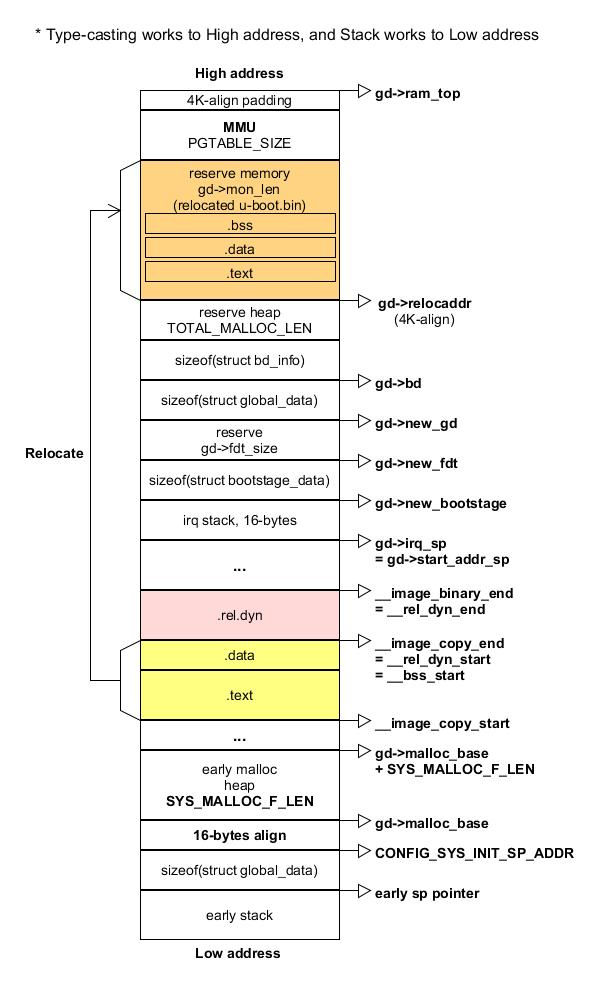

uboot boot Stage 1 [Back](note_uboot_quick_start.md)
---

# source code

## `_start`

+ Cortex-M
    > `arch/arm/lib/vectors_m.S`

    ```nasm
    .section  .vectors
    ENTRY(_start)
        .long   CONFIG_SYS_INIT_SP_ADDR     @ 0 - Reset stack pointer
        .long   reset               @ 1 - Reset
        .long   __invalid_entry         @ 2 - NMI
        .long   __hard_fault_entry      @ 3 - HardFault
        .long   __mm_fault_entry        @ 4 - MemManage
        .long   __bus_fault_entry       @ 5 - BusFault
        .long   __usage_fault_entry     @ 6 - UsageFault
        .long   __invalid_entry         @ 7 - Reserved
        .long   __invalid_entry         @ 8 - Reserved
        .long   __invalid_entry         @ 9 - Reserved
        .long   __invalid_entry         @ 10 - Reserved
        .long   __invalid_entry         @ 11 - SVCall
        .long   __invalid_entry         @ 12 - Debug Monitor
        .long   __invalid_entry         @ 13 - Reserved
        .long   __invalid_entry         @ 14 - PendSV
        .long   __invalid_entry         @ 15 - SysTick
        .rept   255 - 16
        .long   __invalid_entry         @ 16..255 - External Interrupts
        .endr
    ```

+ ARM9, Cortex-A
    > `arch/arm/lib/vectors.S`

    ```nasm
    /*
     * A macro to allow insertion of an ARM exception vector either
     * for the non-boot0 case or by a boot0-header.
     */
        .macro ARM_VECTORS      // macro define 和 .endm 相對應
    #ifdef CONFIG_ARCH_K3
        ldr     pc, _reset
    #else
        b   reset               // 'b' 是不帶返回的跳轉, 'bl' 是帶返回的跳轉
    #endif
        ldr pc, _undefined_instruction
        ldr pc, _software_interrupt
        ldr pc, _prefetch_abort
        ldr pc, _data_abort
        ldr pc, _not_used
        ldr pc, _irq
        ldr pc, _fiq            /* 把 '_irq' 存放的數值存放到 pc register,
                                   下一步執行 pc 就會跳轉過去 */
        .endm                   // macro define end

        .globl _start

        .section ".vectors", "ax"  // 定義 section name and attribute

    _start:
    #ifdef CONFIG_SYS_DV_NOR_BOOT_CFG
        .word   CONFIG_SYS_DV_NOR_BOOT_CFG
    #endif
        ARM_VECTORS

        .globl  _reset      // _reset 是一個 Label, 即一個識別的 tag
        .globl  _undefined_instruction
        .globl  _software_interrupt
        .globl  _prefetch_abort
        .globl  _data_abort
        .globl  _not_used
        .globl  _irq
        .globl  _fiq

    #ifdef CONFIG_ARCH_K3
    _reset:         .word reset
    #endif
    _undefined_instruction: .word undefined_instruction
    _software_interrupt:    .word software_interrupt
    _prefetch_abort:        .word prefetch_abort
    _data_abort:            .word data_abort
    _not_used:              .word not_used
    _irq:                   .word irq
    _fiq:                   .word fiq

        .balignl 16,0xdeadbeef  // 16-alignmen 並用 0xdeadbeef 來補 dummy
    ...
    ```

    - `ldr`
        > ldr 用於從 memory address 中, 將一個 32-bits data 傳送到目的 general-purpose registers 中, 然後對數據進行處理.
        >> 當程序計數器 PC 作為目的 registers時, ldr 從 memory 中讀取的 data 被當作 destination address,
        從而可以實現程序流程的跳轉

        ```
        ldr{<cond>} <Rd>, <addressing_mode>
        /* Load a word from the memory address calculated by <addressing_mode>
           and write it to register <Rd> */
        ```

    - `.globl`
        > 當於 C 語言中的 `extern`, 宣告變量是全域的
        >> 同時必須給這個變量實體

        ```
        extern foo;         // .globl foo
        uint32_t  foo = 0;  // foo:  .word 0x0
        ```

    - `.word`
        > 分配一個 h/w word 大小的空間, 並用 expr 初始化這個空間

        ```
        .word <expr>

        e.g.
        .word reset
        /* 分配了一個 word (32bits)的地址空間, 裡面存放 reset (即一個 address) */
        ```

    - `.balignl 16,0xdeadbeef`
        > 接下來要 16-byte alignment, 用 `0xdeadbeef`來填充
        >> `0xdeadbeef` 方便識別, `0xbadc0de`表示 **bad code**

## `reset`

+ source code
    > At `arch/arm/cpu/armv7/start.S`

    ```nasm
        .globl  reset
        .globl  save_boot_params_ret
        .type   save_boot_params_ret,%function
    #ifdef CONFIG_ARMV7_LPAE
        .global switch_to_hypervisor_ret
    #endif

    reset:
        /* Allow the board to save important registers */
        b   save_boot_params
    save_boot_params_ret:
    #ifdef CONFIG_ARMV7_LPAE
    /*
     * check for Hypervisor support
     */
        mrc p15, 0, r0, c0, c1, 1           @ read ID_PFR1
        and r0, r0, #CPUID_ARM_VIRT_MASK    @ mask virtualization bits
        cmp r0, #(1 << CPUID_ARM_VIRT_SHIFT)
        beq switch_to_hypervisor
    switch_to_hypervisor_ret:
    #endif
        /*
         * disable interrupts (FIQ and IRQ), also set the cpu to SVC32 mode,
         * except if in HYP mode already
         */
        mrs r0, cpsr                            // r0 = cpsr
        and r1, r0, #0x1f   @ mask mode bits    // r1 = r0 & 0x1f
        teq r1, #0x1a       @ test for HYP mode /* 判斷當前處理器模式是否是 HYP 模式.
                                                 * HYP 模式, 它比超級管理員要稍微低一點,
                                                 * 主要是用來做一些虛擬化的擴展.
                                                 */
        bicne r0, r0, #0x1f @ clear all mode bits // r0 = r0 & ~(0x1f); 如果 CPU 不處於 HYP 模式，則清除 bit[0~4]
        orrne r0, r0, #0x13 @ set SVC mode        // r0 = r0 | 0x13;    // 設置為 SVC 模式
        orr r0, r0, #0xc0   @ disable FIQ and IRQ // r0 |= 0xc0;        // 禁用 IRQ 和 FIQ 中斷
        msr cpsr,r0                               // cpsr = r0          // 將當前 r0 的值回寫到 cpsr

    /*
     * Setup vector:
     * (OMAP4 spl TEXT_BASE is not 32 byte aligned.
     * Continue to use ROM code vector only in OMAP4 spl)
     */
    #if !(defined(CONFIG_OMAP44XX) && defined(CONFIG_SPL_BUILD))
        /* Set V=0 in CP15 SCTLR register - for VBAR to point to vector */
        mrc p15, 0, r0, c1, c0, 0   @ Read CP15 SCTLR Register // r0 = p15(0, c1, c0)
        bic r0, #CR_V               @ V = 0                    // r0 = r0 & ~(1<<13)
        mcr p15, 0, r0, c1, c0, 0   @ Write CP15 SCTLR Register // p15(0, c1, c0) = r0

    #ifdef CONFIG_HAS_VBAR
        /* Set vector address in CP15 VBAR register */
        ldr r0, =_start                         // r0 = _start
        mcr p15, 0, r0, c12, c0, 0  @Set VBAR   // p15(0, c12, c0) = r0
    #endif
    #endif

        /* the mask ROM code should have PLL and others stable */
    #ifndef CONFIG_SKIP_LOWLEVEL_INIT
    #ifdef CONFIG_CPU_V7A
        bl  cpu_init_cp15   @/* 初始化 cp15 */
    #endif
    #ifndef CONFIG_SKIP_LOWLEVEL_INIT_ONLY
        bl  cpu_init_crit   @/* 初始化 clock */
    #endif
    #endif

        bl  _main           @/* at arch/arm/lib/crt0.S */
    ...
    ```

## `cpu_init_cp15`

+ source code
    > At `arch/arm/cpu/armv7/start.S`

    ```nasm
    ENTRY(cpu_init_cp15)
        /*
         * Invalidate L1 I/D
         */
        mov r0, #0                  @ set up for MCR        // r0 = 0
        mcr p15, 0, r0, c8, c7, 0   @ invalidate TLBs       // p15(0, c8, c7) = r0
        mcr p15, 0, r0, c7, c5, 0   @ invalidate icache     // p15(0, c7, c5) = r0
        mcr p15, 0, r0, c7, c5, 6   @ invalidate BP array   // p15(0, c7, c5) = r0
        mcr p15, 0, r0, c7, c10, 4  @ DSB                   // p15(0, c7, c10) = r0
        mcr p15, 0, r0, c7, c5, 4   @ ISB                   // p15(0, c7, c5) = r0

        /*
         * disable MMU stuff and caches
         */
        mrc p15, 0, r0, c1, c0, 0                           // r0 = p15(0, c1, c0)
        bic r0, r0, #0x00002000 @ clear bits 13 (--V-)      // r0 = r0 & ~(0x00002000)
        bic r0, r0, #0x00000007 @ clear bits 2:0 (-CAM)     // r0 = r0 & ~(0x00000007)
        orr r0, r0, #0x00000002 @ set bit 1 (--A-) Align    // r0 = r0 | (0x00000002)
        orr r0, r0, #0x00000800 @ set bit 11 (Z---) BTB     // r0 = r0 | (0x00000800)
    #if CONFIG_IS_ENABLED(SYS_ICACHE_OFF)
        bic r0, r0, #0x00001000 @ clear bit 12 (I) I-cache  // r0 = r0 & ~(0x00001000)
    #else
        orr r0, r0, #0x00001000 @ set bit 12 (I) I-cache    // r0 = r0 | 0x00001000
    #endif
        mcr p15, 0, r0, c1, c0, 0                           // p15(0, c1, c0) = r0

    ...

        mov r5, lr                  @ Store my Caller               // r5 = lr
        mrc p15, 0, r1, c0, c0, 0   @ r1 has Read Main ID Register (MIDR) //r1 = p15(0, c0, c0)
        mov r3, r1, lsr #20         @ get variant field             // r3 = (r1 >> 20)
        and r3, r3, #0xf            @ r3 has CPU variant            // r3 = r3 & 0xf
        and r4, r1, #0xf            @ r4 has CPU revision           // r4 = r1 & 0xf
        mov r2, r3, lsl #4          @ shift variant field for combined value // r2 = (r3 << 4)
        orr r2, r4, r2              @ r2 has combined CPU variant + revision // r2 = r4 | r2

    /* Early stack for ERRATA that needs into call C code */
    #if defined(CONFIG_SPL_BUILD) && defined(CONFIG_SPL_STACK)
        ldr r0, =(CONFIG_SPL_STACK)
    #else
        ldr r0, =(CONFIG_SYS_INIT_SP_ADDR)
    #endif
        bic r0, r0, #7  /* 8-byte alignment for ABI compliance */
        mov sp, r0

    #ifdef CONFIG_ARM_ERRATA_798870
        cmp r2, #0x30               @ Applies to lower than R3p0    // if(r2 >= 0x30)
        bge skip_errata_798870      @ skip if not affected rev      //  goto skip_errata_798870
        cmp r2, #0x20               @ Applies to including and above R2p0 // if(r2 < 0x20)
        blt skip_errata_798870      @ skip if not affected rev      //  goto skip_errata_798870

        mrc p15, 1, r0, c15, c0, 0  @ read l2 aux ctrl reg          // r0 = p15(1, c15, c0)
        orr r0, r0, #1 << 7         @ Enable hazard-detect timeout  // r0 = r0 | (1 << 7)
        push    {r1-r5}             @ Save the cpu info registers   // sp = {r1-r5}
        bl  v7_arch_cp15_set_l2aux_ctrl                             // v7_arch_cp15_set_l2aux_ctrl();
        isb                         @ Recommended ISB after l2actlr update /* 指令同步隔離.
                                    @                                       * 最嚴格: 它會清洗流水線,
                                    @                                       * 以保證所有它前面的指令都執行
                                    @                                       */
        pop {r1-r5}                 @ Restore the cpu info - fall through  // {r1-r5} = sp
    skip_errata_798870:
    #endif

    ...

        mov pc, r5                  @ back to my caller /* pc = r5 返回調用者處 */
    ENDPROC(cpu_init_cp15)
    ```

## `cpu_init_crit`

```
ENTRY(cpu_init_crit)
    /*
     * Jump to board specific initialization...
     * The Mask ROM will have already initialized
     * basic memory. Go here to bump up clock rate and handle
     * wake up conditions.
     */
    b   lowlevel_init       @ go setup pll,mux,memory
ENDPROC(cpu_init_crit)
```

+ `lowlevel_init`
    > 依照 board 的需求來做 low level setting, e.g. PCLK/HCLK 設定.
    如果不需要就直接 return

    ```
    ENTRY(lowlevel_init)
        mov pc, lr
    ENDPROC(lowlevel_init)
    ```

    - 原則上每塊 board 都有自己的 `lowlevel_init`, 甚至不同 ARCH 的 CPU 也可能會有自己的 instance
        > + `arch/arm/cpu/armv7/lowlevel_init.S`
        > + `arch/arm/cpu/arm926ejs/lpc32xx/lowlevel_init.S`
        > + `board/armltd/vexpress/vexpress_common.c`

## `_main`

+ source code
    > At `arch/arm/lib/crt0.S`

    ```nasm
    ENTRY(_main)

    /*
     * Set up initial C runtime environment and call board_init_f(0).
     */

    #if defined(CONFIG_SPL_BUILD) && defined(CONFIG_SPL_STACK)
        ...
    #else
        ldr    sp, =(CONFIG_SYS_INIT_SP_ADDR)   /*  sp 指針指向 CONFIG_SYS_INIT_SP_ADDR (include/configs/xxx.h)
                                                 *  注意!! 這裡只是前期臨時的 stack address, 而不是最終的堆棧地址!
                                                 */
    #endif
    #if defined(CONFIG_CPU_V7M)                 /* v7M forbids using SP as BIC destination */
        ...
    #else
        bic    sp, sp, #7                       /* 8-byte alignment for ABI compliance, 8-byte 對齊 */
    #endif
        mov    r0, sp                       /* 將 sp 存到 r0，做為 board_init_f_alloc_reserve 的 input 參數.
                                             * 此時 r0 的值為 'CONFIG_SYS_INIT_SP_ADDR'
                                             */
        bl    board_init_f_alloc_reserve    /* 計算並保留 sizeof(struct global_data) 空間 */
        mov    sp, r0                       /* board_init_f_alloc_reserve 的返回值會放在 r0.
                                             * 將計算後的結果存回 sp
                                             */
        /* set up gd here, outside any C code */
        mov    r9, r0                       /* r0 存放的是 global_data 的 start address
                                             * 同時也是 stack pointer, 因為 stack 是往 low address 增長,
                                             * 而 type-casting 則是往 high address 增長,
                                             * 所以不必擔心和 global_data 衝突的問題.
                                             *
                                             * 將 r0 的值存到 r9, 即 r9 存著 global_data 的 start address
                                             */

        bl    board_init_f_init_reserve     /* 用 board_init_f_init_reserve 計算 early heap arena,
                                             * 保留 SYS_MALLOC_F_LEN 大小的空間(接在 global_data 的後面).
                                             * 同時也將 global_data 清零
                                             */

        mov    r0, #0                       /* 將 r0 的值設置為 0 */
        bl    board_init_f                  /* 調用 board_init_f(), 做前期 board initialize,
                                             * 並計算 relocated 後, 新的 stack pointer
                                             */

    #if ! defined(CONFIG_SPL_BUILD)

    /*
     * Set up intermediate environment (new sp and gd) and call
     * relocate_code(addr_moni). Trick here is that we'll return
     * 'here' but relocated.
     */

        ldr    sp, [r9, #GD_START_ADDR_SP]    /* sp = gd->start_addr_sp, 新的 sp 會存在 gd->start_addr_sp */
    #if defined(CONFIG_CPU_V7M)    /* v7M forbids using SP as BIC destination */
        ...
    #else
        bic    sp, sp, #7    /* 8-byte alignment for ABI compliance, 8-byte 對齊 */
    #endif
        ldr    r9, [r9, #GD_BD]     /* r9 = gd->bd; 得到 gd->bd 的值 */
        sub    r9, r9, #GD_SIZE     /* new GD is below bd;
                                     * r9 = gd->bd - GD_SIZE = gd->new_gd
                                     */

        adr    lr, here             /* 將 here 位址存到 lr */
        ldr    r0, [r9, #GD_RELOC_OFF]   /* r0 = gd->reloc_off */
        add    lr, lr, r0           /* 將目前 here 的位址, 加上 relocated offset, 並存在 lr.
                                     * 重要 !!!
                                     *   當做完 relocate_code 後, 返回時就會跳到 relocated 的 here 位址,
                                     *   Low address 的空間就釋放出來
                                     */

    #if defined(CONFIG_CPU_V7M)
        ...
    #endif
        ldr    r0, [r9, #GD_RELOCADDR]  /* r0 = gd->relocaddr;
                                         * 做為 relocate_code 的 input 參數
                                         */
        b    relocate_code              /* 跳轉到 relocate_code */
    here:
    /*
     * now relocate vectors
     */

        bl    relocate_vectors          /* 重新設定 vector table address 到 relocated 的區域 */

    /* Set up final (full) environment */

        bl    c_runtime_cpu_setup       /* we still call old routine here */
    #endif /* #if ! defined(CONFIG_SPL_BUILD) */

    #if !defined(CONFIG_SPL_BUILD) || defined(CONFIG_SPL_FRAMEWORK)
    # ifdef CONFIG_SPL_BUILD
        /* Use a DRAM stack for the rest of SPL, if requested */
        bl    spl_relocate_stack_gd
        cmp    r0, #0
        movne    sp, r0
        movne    r9, r0
    # endif
        ldr    r0, =__bss_start    /* this is auto-relocated! */

    #ifdef CONFIG_USE_ARCH_MEMSET
        ldr    r3, =__bss_end   /* this is auto-relocated! */
        mov    r1, #0x00000000  /* prepare zero to clear BSS */

        subs    r2, r3, r0      /* r2 = memset len */
        bl    memset            /* 使用最佳化過的 memset, 依照 CPU 不同而不同 */
    #else
        /**
         *  用迴圈一個 word 一個 word 清 0
         */
        ldr    r1, =__bss_end   /* this is auto-relocated! */
        mov    r2, #0x00000000  /* prepare zero to clear BSS */

    clbss_l:cmp    r0, r1       /* while not at end of BSS */
    #if defined(CONFIG_CPU_V7M)
        itt    lo
    #endif
        strlo    r2, [r0]       /* clear 32-bit BSS word */
        addlo    r0, r0, #4     /* move to next */
        blo    clbss_l
    #endif  /* #ifdef CONFIG_USE_ARCH_MEMSET */

    #if ! defined(CONFIG_SPL_BUILD)
        bl coloured_LED_init
        bl red_led_on
    #endif

        /* call board_init_r(gd_t *id, ulong dest_addr) */
        mov     r0, r9                  /* gd_t; 將新的 global_data address 做為第一個 input 參數 */
        ldr    r1, [r9, #GD_RELOCADDR]  /* dest_addr; 將 gd->relocaddr 做為第二個 input 參數 */
        /* call board_init_r */
    #if defined(CONFIG_SYS_THUMB_BUILD)
        ldr    lr, =board_init_r    /* this is auto-relocated! */
        bx    lr
    #else
        ldr    pc, =board_init_r    /* this is auto-relocated!; 跳轉到 board_init_r() */
    #endif
        /* we should not return here. */
    #endif

    ENDPROC(_main)
    ```

    - `board_init_f_alloc_reserve()`
        > 分配 global_data 的空間
        >> At `common/init/board_init.c`

        ```c
        ulong board_init_f_alloc_reserve(ulong top)
        {
            /* Reserve early malloc arena */
        #if CONFIG_VAL(SYS_MALLOC_F_LEN)
            top -= CONFIG_VAL(SYS_MALLOC_F_LEN);
        #endif
            /* LAST : reserve GD (rounded up to a multiple of 16 bytes) */
            top = rounddown(top-sizeof(struct global_data), 16);

            return top;
        }
        ```

    - `board_init_f_init_reserve()`
        > 清空 global_data 區域, 並配置臨時的 heap pool
        >> At `common/init/board_init.c`

        ```c
        /**
         * 這個函數用於對 global_data 區域進行初始化, 也就是清空 global_data 區域
         * 傳入的參數就是 global_data 的基地址
         */
        void board_init_f_init_reserve(ulong base)
        {
            struct global_data *gd_ptr;

            /*
             * clear GD entirely and set it up.
             * Use gd_ptr, as gd may not be properly set yet.
             */

            gd_ptr = (struct global_data *)base;
            /* zero the area */
            memset(gd_ptr, '\0', sizeof(*gd)); // 清零

            /* next alloc will be higher by one GD plus 16-byte alignment */
            /**
             * 因為 global_data 區域是 16-Byte alignment 的,
             * 後面的地址就是 early malloc 的 memory pool,
             * 所以這裡就獲取了 early malloc 的 memory pool 的地址
             */
            base += roundup(sizeof(struct global_data), 16);

            /*
             * record early malloc arena start.
             * Use gd as it is now properly set for all architectures.
             */
        #if defined(CONFIG_SYS_MALLOC_F)
            /* go down one 'early malloc arena' */
            gd->malloc_base = base;     // 填入 early heap pool start address
            /* next alloc will be higher by one 'early malloc arena' size */
            base += CONFIG_VAL(SYS_MALLOC_F_LEN);
        #endif
        }
        ```

        1. memory layout

            ```
                High address
            +----------------------------+
            |       ...                  |
            +----------------------------+
            | size CONFIG_SYS_MALLOC_F   |
            +----------------------------+--> gd->malloc_base
            |  16-byte align             |
            +----------------------------+--> CONFIG_SYS_INIT_SP_ADDR
            | sizeof(struct global_data) |
            +----------------------------+--> early sp and 16-byte align
            | early stack area           |
            +----------------------------+
            |       ...                  |
            |                            |
            ```

        1. uboot 定義了 `DECLARE_GLOBAL_DATA_PTR`, 使我們可以更加簡單地獲取 global_data poiter
            > At `arch/arm/include/asm/global_data.h`

            ```c
            #define DECLARE_GLOBAL_DATA_PTR     register volatile gd_t *gd asm ("r9")

            // gd 指向 r9 中的值
            ```


## `board_init_f()`

board initialize first

+ sourece code
    > flow `init_sequence_f[]` list at `common/board_f.c`

    ```c
    void board_init_f(ulong boot_flags)
    {
        gd->flags = boot_flags;
        gd->have_console = 0;

        if (initcall_run_list(init_sequence_f))
            hang();

    #if !defined(CONFIG_ARM) && !defined(CONFIG_SANDBOX) && \
            !defined(CONFIG_EFI_APP) && !CONFIG_IS_ENABLED(X86_64) && \
            !defined(CONFIG_ARC)
        /* NOTREACHED - jump_to_copy() does not return */
        hang();
    #endif
    }
    ```

+ `init_sequence_f[]` list

    ```c
    static const init_fnc_t init_sequence_f[] = {
        setup_mon_len,
    #ifdef CONFIG_OF_CONTROL
        fdtdec_setup,
    #endif
    #ifdef CONFIG_TRACE_EARLY
        trace_early_init,
    #endif
        initf_malloc,
        log_init,
        initf_bootstage,	/* uses its own timer, so does not need DM */
    #ifdef CONFIG_BLOBLIST
        bloblist_init,
    #endif
        setup_spl_handoff,
        initf_console_record,
    #if defined(CONFIG_HAVE_FSP)
        arch_fsp_init,
    #endif
        arch_cpu_init,		/* basic arch cpu dependent setup */
        mach_cpu_init,		/* SoC/machine dependent CPU setup */
        initf_dm,
        arch_cpu_init_dm,
    #if defined(CONFIG_BOARD_EARLY_INIT_F)
        board_early_init_f,
    #endif
    #if defined(CONFIG_PPC) || defined(CONFIG_SYS_FSL_CLK) || defined(CONFIG_M68K)
        ...
    #endif
    #if !defined(CONFIG_M68K)
        timer_init,		/* initialize timer */
    #endif
    #if defined(CONFIG_BOARD_POSTCLK_INIT)
        board_postclk_init,
    #endif
        env_init,		/* initialize environment */
        init_baud_rate,		/* initialze baudrate settings */
        serial_init,		/* serial communications setup */
        console_init_f,		/* stage 1 init of console */
        display_options,	/* say that we are here */
        display_text_info,	/* show debugging info if required */
    #if defined(CONFIG_PPC) || defined(CONFIG_SH) || defined(CONFIG_X86)
        ...
    #endif
    #if defined(CONFIG_SYSRESET)
        print_resetinfo,
    #endif
    #if defined(CONFIG_DISPLAY_CPUINFO)
        print_cpuinfo,		/* display cpu info (and speed) */
    #endif
    #if defined(CONFIG_DTB_RESELECT)
        embedded_dtb_select,
    #endif
    #if defined(CONFIG_DISPLAY_BOARDINFO)
        show_board_info,
    #endif
        INIT_FUNC_WATCHDOG_INIT
    #if defined(CONFIG_MISC_INIT_F)
        misc_init_f,
    #endif
        INIT_FUNC_WATCHDOG_RESET
    #if defined(CONFIG_SYS_I2C)
        init_func_i2c,
    #endif
    #if defined(CONFIG_VID) && !defined(CONFIG_SPL)
        init_func_vid,
    #endif
        announce_dram_init,
        dram_init,		/* configure available RAM banks */
    #ifdef CONFIG_POST
        post_init_f,
    #endif
        INIT_FUNC_WATCHDOG_RESET
    #if defined(CONFIG_SYS_DRAM_TEST)
        testdram,
    #endif /* CONFIG_SYS_DRAM_TEST */
        INIT_FUNC_WATCHDOG_RESET

    #ifdef CONFIG_POST
        init_post,
    #endif
        INIT_FUNC_WATCHDOG_RESET
        /*
         * Now that we have DRAM mapped and working, we can
         * relocate the code and continue running from DRAM.
         *
         * Reserve memory at end of RAM for (top down in that order):
         *  - area that won't get touched by U-Boot and Linux (optional)
         *  - kernel log buffer
         *  - protected RAM
         *  - LCD framebuffer
         *  - monitor code
         *  - board info struct
         */
        setup_dest_addr,
    #ifdef CONFIG_PRAM
        reserve_pram,
    #endif
        reserve_round_4k,
    #ifdef CONFIG_ARM
        reserve_mmu,
    #endif
        reserve_video,
        reserve_trace,
        reserve_uboot,
        reserve_malloc,
        reserve_board,
        setup_machine,
        reserve_global_data,
        reserve_fdt,
        reserve_bootstage,
        reserve_bloblist,
        reserve_arch,
        reserve_stacks,
        dram_init_banksize,
        show_dram_config,
    #if defined(CONFIG_M68K) || defined(CONFIG_MIPS) || defined(CONFIG_PPC) || \
        defined(CONFIG_SH)
        ...
    #endif
    #if defined(CONFIG_PPC) || defined(CONFIG_M68K)
        ...
    #endif
        display_new_sp,
    #ifdef CONFIG_OF_BOARD_FIXUP
        fix_fdt,
    #endif
        INIT_FUNC_WATCHDOG_RESET
        reloc_fdt,
        reloc_bootstage,
        reloc_bloblist,
        setup_reloc,
    #if defined(CONFIG_X86) || defined(CONFIG_ARC)
        ...
    #endif
    #if defined(CONFIG_XTENSA)
        ...
    #endif
    #if !defined(CONFIG_ARM) && !defined(CONFIG_SANDBOX) && \
            !CONFIG_IS_ENABLED(X86_64)
        ...
    #endif
        NULL,
    };
    ```

    - `setup_mon_len()`
        > 設置 `gd->mon_len`的值, 這個值表示 u-boot executable bin 大小
        >> `_start` ~ `__bss_end`

    - `fdtdec_setup()`
        > 設置`gd->fdt_blob`指針(即 device tree binary 所在的存儲位置)的值
        >> `__dtb_dt_begin` at `dts/dt.dtb.S`

    - `initf_malloc()`
        > 設置`gd->malloc_limit` heap 空間限制為 `CONFIG_SYS_MALLOC_F_LEN`

    - `log_init()`
        >  Setup the log system ready for use if necessary

    - `initf_bootstage()`
        > 主要作用就是為`gd->bootstage`分配空間, 並初始化`gd->bootstage`;
        同時增加兩個紀錄, 一條是`reset`, 一條是`board_init_f`
        >> Record the bootstrap flow and the spent time

    - `arch_cpu_init()`
        > 針對特定 CPU 的初始化, 不同 CPU 的初始化也不盡相同,
        因此 u-boot 提供了 `arch_cpu_init`用於CPU初始化.
        這個函數由移植者根據自己的硬件(CPU)的情況來實作

    - `mach_cpu_init()`
        > 針對特定 `SoC`的初始化, 這個函數同樣由移植者根據自己的硬件(SoC)的情況來提供

    - `initf_dm()`
        > 進行 u-boo t的 Driver Model 的初始化,
        在這裡會去解析 fdt 的設備, 並註冊與之匹配的驅動

    - `board_early_init_f()`
        > 由 vendor 提供, 通常定義在 board 目錄下, 用來對開發版做前期配置.
        提供這個函數的同時還需要定義 `CONFIG_BOARD_EARLY_INIT_F`

    - `env_init()`
        > 設置`gd->env_addr`環境變量的 address.
        可由不同 priority 的 storage device 載入.

            ```c
            // at env/env.c
            enum env_location env_locations[] = {};
            ```

        > 使用 `U_BOOT_ENV_LOCATION` 宣告一個相應的 `struct env_driver` 類型的 entry,
        多個 entries 用 link script 將其集中到一個 memory pool.
        >> 利用 macro `ll_entry_start/ll_entry_end` 來定義 pool 開始及結束 address

            ```
            .u_boot_list : { KEEP(*(SORT(.u_boot_list*))); }

            /*
             *  .u_boot_list_2_env_driver_1         => ll_entry_start(struct env_driver, env_driver)
             *  .u_boot_list_2_env_driver_2_eeprom  => U_BOOT_ENV_LOCATION(eeprom)
             *  .u_boot_list_2_env_driver_2_ext4    => U_BOOT_ENV_LOCATION(ext4)
             *  .u_boot_list_2_env_driver_3         => ll_entry_end(struct env_driver, env_driver)
             */
            ```

        1. 預設值存放在 `default_environment[]` at `include/env_default.h`

        1. source code

            ```c
            int env_init(void)
            {
                struct env_driver *drv;
                int ret = -ENOENT;
                int prio;

                /**
                 *  從 env_locations array 的第  1個元素開始遍歷(即從最最優先的位置開始遍歷).
                 *  env_driver_lookup 會遍歷上述的一系列entry,
                 *  若有 entry 的 location 與 env_locations[prio] 匹配, 則返回該 entry 的地址,
                 *  否則返回NULL
                 */
                for (prio = 0; (drv = env_driver_lookup(ENVOP_INIT, prio)); prio++) {
                    /**
                     *  一旦找到匹配的 entry, 嘗試調用該 entry 的初始化成員函數.
                     *  初始化函數通常會設置 gd->env_addr (環境變量地址)和 gd->env_valid
                     */
                    if (!drv->init || !(ret = drv->init()))
                        /**
                         *  如果初始化成員函數存在且調用成功.
                         *  則將 gd->env_has_init 的相應 bit 置 1,
                         *  標誌該位置的環境變量已初始化
                         */
                        env_set_inited(drv->location);

                    debug("%s: Environment %s init done (ret=%d)\n", __func__,
                          drv->name, ret);
                }

                if (!prio)
                    return -ENODEV;

                if (ret == -ENOENT) {
                    /**
                     *  未能匹配到 entry 或匹配到但初始化失敗的話,
                     *  就使用默認的環境變量
                     */
                    gd->env_addr = (ulong)&default_environment[0];
                    gd->env_valid = ENV_VALID;

                    return 0;
                }

                return ret;
            }
            ```

    - `init_baud_rate()`
        > 從環境變量中獲取 baudrate 的值, 並設置`gd->baudrate`(default: CONFIG_BAUDRATE).

    - `serial_init()`
        > at `drivers/serial/serial-uclass.c`

    - `console_init_f()`
    - `display_options()`
        > show version info
    - `display_text_info()`
        > show `.text` and `.bss` section addresses
        >> text_base 由 `CONFIG_SYS_TEXT_BASE`來決定, 即 `_start` 開始的地方

    - `print_cpuinfo()`
        > 需定義 `CONFIG_DISPLAY_CPUINFO`

    - `show_board_info()`
        > 需定義 `CONFIG_DISPLAY_BOARDINFO` 及 `CONFIG_OF_CONTROL`.
        讀取 DTB 的 `cpu-model` 資訊

    - `dram_init()`
        > 初始化系統的 DDR, `dram_init` 應該由平台相關的代碼實現.
        如果 DDR 已經初始化過了, 則不需要重新初始化,
        只需要設置 `gd->ram_size` 的大小
        >> 按照 u-boot 的說明, 調用`dram_init()`之後,
        就要去分配 DDR 的空間以及 relocate u-boot 的代碼

    - `setup_dest_addr()`
        > 設置 u-boot 的 relocaddr address, 通過`gd->ram_size`和`CONFIG_SYS_SDRAM_BASE`(DDR的起始地址),
        確定`gd->ram_top`和`gd->relocaddr`, 也就是將 u-boot 重定位到 DDR highest address,
        執行完之後`gd->relocaddr = gd->ram_top`

    - `reserve_round_4k()`
        > 對 `gd->relocaddr` 做 4K-align

    - `reserve_mmu()`
        > 保留 mmu 所需的 memory buffer

        ```c
        __weak int reserve_mmu(void)
        {
        ...
            /* reserve TLB table  */
            gd->arch.tlb_size = PGTABLE_SIZE;   // PGTABLE_SIZE default (4096 * 4) = 16KB
            gd->relocaddr -= gd->arch.tlb_size; // 保留 16KB 的空間
            gd->relocaddr &= ~(0x10000 - 1);    // 64KB 對齊(向 Low address)

            gd->arch.tlb_addr = gd->relocaddr;
        ...
            return 0;
        }
        ```

    - `reserve_uboot()`
        > 保留 uboot `.text` 和 `.data` section 並配置 `gd->start_addr_sp`

        ```
        High address
        +------------------+--> gd->ram_top
        | 4K-align padding |
        +------------------+
        | MMU PGTABLE_SIZE |
        +------------------+
        | reserve memory   |
        | gd->mon_len      |
        +------------------+
        | 4K-align padding |
        +------------------+--> gd->relocaddr = gd->start_addr_sp
        |                  |

        ```

    - `reserve_malloc()`
        > reserve memory for `malloc()` area,
        大小為`TOTAL_MALLOC_LEN` at `include/common.h`

        ```c
        #if defined(CONFIG_ENV_IS_EMBEDDED)
        #define TOTAL_MALLOC_LEN    CONFIG_SYS_MALLOC_LEN
        #elif ( ((CONFIG_ENV_ADDR+CONFIG_ENV_SIZE) < CONFIG_SYS_MONITOR_BASE) || \
            (CONFIG_ENV_ADDR >= (CONFIG_SYS_MONITOR_BASE + CONFIG_SYS_MONITOR_LEN)) ) || \
              defined(CONFIG_ENV_IS_IN_NVRAM)
        #define TOTAL_MALLOC_LEN    (CONFIG_SYS_MALLOC_LEN + CONFIG_ENV_SIZE)
        #else
        #define TOTAL_MALLOC_LEN    CONFIG_SYS_MALLOC_LEN
        #endif
        ```

        > memory layout

        ```
        High address
        +------------------+--> gd->ram_top
        | 4K-align padding |
        +------------------+
        | MMU PGTABLE_SIZE |
        +------------------+
        | reserve memory   |
        | gd->mon_len      |
        +------------------+
        | 4K-align padding |
        +------------------+-->  gd->relocaddr
        | reserve          |
        | TOTAL_MALLOC_LEN |
        +------------------+-->  gd->start_addr_sp
        |                  |
        ```

    - `reserve_board()`
        > 為`struct bd_info`分配空間, 並配置 `gd->bd`

        ```
        High address
        +------------------------+--> gd->ram_top
        | 4K-align padding       |
        +------------------------+
        | MMU PGTABLE_SIZE       |
        +------------------------+
        | reserve memory         |
        | gd->mon_len            |
        +------------------------+
        | 4K-align padding       |
        +------------------------+--> gd->relocaddr
        | reserve                |
        | TOTAL_MALLOC_LEN       |
        +------------------------+-->
        | sizeof(struct bd_info) |
        +------------------------+--> gd->bd = gd->start_addr_sp
        |                        |

        ps. memory cast 往 High address 走, stack 往 Low address 走
        ```

    - `reserve_global_data()`
        > 為`struct global_data`分配空間, 並配置 `gd->new_gd`

        ```
        High address
        +------------------------+--> gd->ram_top
        | 4K-align padding       |
        +------------------------+
        | MMU PGTABLE_SIZE       |
        +------------------------+
        | reserve memory         |
        | gd->mon_len            |
        +------------------------+
        | 4K-align padding       |
        +------------------------+--> gd->relocaddr
        | reserve                |
        | TOTAL_MALLOC_LEN       |
        +------------------------+-->
        | sizeof(struct bd_info) |
        +------------------------+--> gd->bd
        | sizeof(global_data_t)  |
        +------------------------+--> gd->new_gd = gd->start_addr_sp
        |                        |

        ps. memory cast 往 High address 走, stack 往 Low address 走
        ```

    - `reserve_fdt()`
        > 為 fdt 分配空間, 通過`gd->fdt_blob`計算出`gd->fdt_size`的大小, 並配置 `gd->new_fdt`

        ```
        High address
        +------------------------+--> gd->ram_top
        | 4K-align padding       |
        +------------------------+
        | MMU PGTABLE_SIZE       |
        +------------------------+
        | reserve memory         |
        | gd->mon_len            |
        +------------------------+
        | 4K-align padding       |
        +------------------------+--> gd->relocaddr
        | reserve                |
        | TOTAL_MALLOC_LEN       |
        +------------------------+-->
        | sizeof(struct bd_info) |
        +------------------------+--> gd->bd
        | sizeof(global_data_t)  |
        +------------------------+--> gd->new_gd
        | reserve                |
        | gd->fdt_size           |
        +------------------------+--> gd->new_fdt = gd->start_addr_sp
        |                        |

        ps. memory cast 往 High address 走, stack 往 Low address 走
        ```

    - `reserve_bootstage()`
        > 為`struct bootstage_data`分配空間, 並配置 `gd->new_bootstage`

        ```
        High address
        +------------------------+--> gd->ram_top
        | 4K-align padding       |
        +------------------------+
        | MMU PGTABLE_SIZE       |
        +------------------------+
        | reserve memory         |
        | gd->mon_len            |
        +------------------------+
        | 4K-align padding       |
        +------------------------+--> gd->relocaddr
        | reserve                |
        | TOTAL_MALLOC_LEN       |
        +------------------------+-->
        | sizeof(struct bd_info) |
        +------------------------+--> gd->bd
        | sizeof(global_data_t)  |
        +------------------------+--> gd->new_gd
        | reserve                |
        | gd->fdt_size           |
        +------------------------+--> gd->new_fdt
        |sizeof(bootstage_data_t)|
        +------------------------+--> gd->new_bootstage = gd->start_addr_sp
        |                        |

        ps. memory cast 往 High address 走, stack 往 Low address 走
        ```

    - `reserve_stacks()`
        > 保留 16-bytes 的 irq stack, 並配置 `gd->irq_sp`

        ```
        High address
        +------------------------+--> gd->ram_top
        | 4K-align padding       |
        +------------------------+
        | MMU PGTABLE_SIZE       |
        +------------------------+
        | reserve memory         |
        | gd->mon_len            |
        +------------------------+
        | 4K-align padding       |
        +------------------------+--> gd->relocaddr
        | reserve                |
        | TOTAL_MALLOC_LEN       |
        +------------------------+-->
        | sizeof(struct bd_info) |
        +------------------------+--> gd->bd
        | sizeof(global_data_t)  |
        +------------------------+--> gd->new_gd
        | reserve                |
        | gd->fdt_size           |
        +------------------------+--> gd->new_fdt
        |sizeof(bootstage_data_t)|
        +------------------------+--> gd->new_bootstage
        | irq stack, 16-bytes    |
        +------------------------+--> gd->irq_sp = gd->start_addr_sp
        |                        |

        ps. memory cast 往 High address 走, stack 往 Low address 走
        ```

    - `reloc_xxx()`
        > 將 data 搬到上述保留的 memory address

    - `setup_reloc()`
        > + 計算 relocate 後, 與原本位置的 offset, 並配置給 `gd->reloc_off`
        > + copy global_data 到新的 address (gd->new_gd)


## `relocate_code`

+ sourece code
    > At `arch/arm/lib/relocate.S`

    ```nasm
    ENTRY(relocate_code)
        /* r1 = &__image_copy_start
         * 其中 __image_copy_start 是 u-boot.bin 起始鏈接地址,
         * 定義在 u-boot.lds 中 (編譯後在頂層目錄生成)
         * 原文件是 arch/arm/cpu/u-boot.lds, 可以自行分析
         */
        ldr r1, =__image_copy_start

        /* r4 = r0 - r1 = gd->relocaddr - &__image_copy_start
         * r0 是 crt0.S 中傳入的 gd->relocaddr,
         * 這裡是算出偏移值
         */
        subs    r4, r0, r1

        beq relocate_done           /* skip relocation 如果 r4 == 0, 則認為重定位已完成 */
        ldr r2, =__image_copy_end   /* r2 = &__image_copy_end, __image_copy_end 在 u-boot.lds 中定義 */

    copy_loop:
        /* r1 是源地址 __image_copy_start,
         * r0 是目的地址 gd->relocaddr,
         * size = __image_copy_start - __image_copy_end
         */
        ldmia   r1!, {r10-r11}  /* copy from source address [r1]
                                 * C pseudo code:
                                 *  r10 = *r1, r1 += 4;
                                 *  r11 = *r1, r1 += 4;
                                 */
        stmia   r0!, {r10-r11}  /* copy to   target address [r0]
                                 * C pseudo code:
                                 *  *r0 = r10, r0 += 4;
                                 *  *r0 = r11, r0 += 4;
                                 */
        cmp r1, r2              /* until source end address [r2]
                                 * C pseudo code:
                                 *  (r1 - r2) and mark flags (CF, ZF, OF, SF)
                                 */
        blo copy_loop           /* (unsigned)小於則跳轉 */

        /*
         * fix .rel.dyn relocations
         * 定義了"-PIE"選項就會執行下面這段代碼
         * 目的是為了讓相關資源(代碼/參數/變量)的 address 在重定位後仍然能被尋址到,
         * 所以讓他們加上偏移地址, 即等於他們重定位後的真正 address
         * 這些 "存放(資源的地址)的地址" 存放在 .rel.dyn 這個段中, 每個參數後面都會跟著一個起標誌作用的參數,
         * 如果這個標誌參數為 23 (即 0x17), 則表示這個 (資源的地址) 是位置相關的, 需要加上重定位偏移值
         * 這一段代碼首先讓 .rel.dyn 這個段中的存放的地址值加上偏移值, 使其在 sdram 中取出(資源的地址)
         * 然後再讓這些(資源的地址)加上偏移值, 存回 rel.dyn 中存放這些地址的地址中,
         */
        ldr r2, =__rel_dyn_start  /* r2 = &__rel_dyn_start */
        ldr r3, =__rel_dyn_end    /* r3 = &__rel_dyn_end */
    fixloop:
        ldmia   r2!, {r0-r1}    /* (r0,r1) = (SRC location, fixup)
                                 * r0 為 label_pointer,
                                 * r1 為 tag
                                 */
        and r1, r1, #0xff       /* r1 取低八位 */
        cmp r1, #R_ARM_RELATIVE /* relative fixup? 和 R_ARM_RELATIVE (0x17) 比較,
                                 * 如果相等(代表找到 label)則繼續往下, 否則跳到 fixnext
                                 */
        bne fixnext

        /* relative fix: increase location by offset */
        add r0, r0, r4      /* r4 存放的是重定位偏移值, r0 則是原本的 label_pointer,
                             * r4 + r0 即為重定位後的 label_pointer,
                             */
        ldr r1, [r0]        // r1 = *r0, label_pointer 取值, 得到實際的 symbol_address
        add r1, r1, r4      // r1 += r4, 將 symbol_address 加上 offset, 指向 relocate 後的 address
        str r1, [r0]        // *r0 = r1, 寫回 memory
    fixnext:                //跳到下一個繼續檢測是否需要重定位
        cmp r2, r3          /* 確認是否到 .rel.dyn section END */
        blo fixloop

    relocate_done:

        /* ARMv4- don't know bx lr but the assembler fails to see that */

    #ifdef __ARM_ARCH_4__
        mov pc, lr          /* ARM920T 用的彙編指令集是 ARMv4, 所以使用這條返回指令,
                             * 返回上一層的 here 標誌
                             */
    #else
        bx  lr              /* 返回上一層的 here 標誌, 此時的 here 已經是 relocated 到 High address */
    #endif

    ENDPROC(relocate_code)
    ```

+ `.rel.dyn` section

    - build `.rel.dyn` section
        > ARM 架構, 是在編譯時使用`-mword-relocations`, 生成與位置無關代碼.
        link 時使用`-pie`生成 `.rel.dyn` section
        >> At `arch/arm/config.mk`

        > `.rel.dyn` section 中的每個條目被稱為一個 Label, 用來存儲絕對地址的 symbol_address.

    - relocation memory layout
        > `.rel.dyn` 與 `.bss` section 起始地址是相同, u-boot 運行 stage1 時, `.bss` section 是不為零的.
        運行 stage1 時的全域變數, 會預先放到別的 memory section, 或是從 heap 使用後再做搬移

        ```
                High address
                +---------------+   gd->ram_top
                | align padding |
            +-- +---------------+   gd->relocaddr + gd->mon_len
            |   | .bss (reloc)  |
        +-> |   +---------------+
        |   |   | .data (reloc) |
        |   |   +---------------+
        |   |   | .text (reloc) |
        |   +-- +---------------+   gd->relocaddr
        |       | ...           |
        |       +---------------+   __image_binary_end = __rel_dyn_end
        |       | .rel.dyn      |
        |   +-- +---------------+   __image_copy_end = __rel_dyn_start = __bss_start
        +---|   | .data         |
            |   +---------------+
            |   | .text         |
            +-- +---------------+   __image_copy_start
                |               |
        ```

    - context of `.rel.dyn` section

        ```
        struct rel_item {
            unsigned long   label_pointer; /* record symbol_address*/
            unsigned long   tag;
        };

        ...
        Disassembly of section .rel.dyn:

        80078f04 <__efi_runtime_rel_stop>:
        80078f04:	80008020 	andhi	r8, r0, r0, lsr #32 /* 指向 label_pointer */
        80078f08:	00000017 	andeq	r0, r0, r7, lsl r0  /* tag */
        80078f0c:	80008024 	andhi	r8, r0, r4, lsr #32 /* label_pointer */
        80078f10:	00000017 	andeq	r0, r0, r7, lsl r0  /* tag */
        80078f14:	80008028 	andhi	r8, r0, r8, lsr #32 /* label_pointer */
        80078f18:	00000017 	andeq	r0, r0, r7, lsl r0  /* tag */
        ...

        80008020 <_undefined_instruction>:                  /* label_pointer */
        80008020:	80008060 	andhi	r8, r0, r0, rrx     /* label_pointer 中,
                                                             *  實際存放 symbol_address (0x 80008060)
                                                             */
        ...

        80008060 <undefined_instruction>:       /* symbol_address*/
        80008060:	e51fd028 	ldr	sp, [pc, #-40]	; 80008040 <IRQ_STACK_START_IN>
        80008064:	e58de000 	str	lr, [sp]
        80008068:	e14fe000 	mrs	lr, SPSR
        8000806c:	e58de004 	str	lr, [sp, #4]
        ...
        ```


## `relocate_vectors`

+ sourece code
    > 用於重定位中斷向量表, 將新的中斷向量表 start address 寫到 VBAR register 中.

    ```
    ENTRY(relocate_vectors)

    #ifdef CONFIG_CPU_V7M
        /*
         * On ARMv7-M we only have to write the new vector address
         * to VTOR register.
         */
        ldr    r0, [r9, #GD_RELOCADDR]    /* r0 = gd->relocaddr */
        ldr    r1, =V7M_SCB_BASE
        str    r0, [r1, V7M_SCB_VTOR]     /* 設置新的 vector table 給 SCB->VTOR register */
    #else
    #ifdef CONFIG_HAS_VBAR
        /*
         * If the ARM processor has the security extensions,
         * use VBAR to relocate the exception vectors.
         */
        ldr    r0, [r9, #GD_RELOCADDR]  /* r0 = gd->relocaddr */
        mcr    p15, 0, r0, c12, c0, 0   /* 設置 vector table 到CP15的 VBAR register */
    #else
        /*
         * Copy the relocated exception vectors to the
         * correct address
         * CP15 c1 V bit gives us the location of the vectors:
         * 0x00000000 or 0xFFFF0000.
         */
        ldr    r0, [r9, #GD_RELOCADDR]    /* r0 = gd->relocaddr */
        mrc    p15, 0, r2, c1, c0, 0    /* V bit (bit[13]) in CP15 c1 */
        ands    r2, r2, #(1 << 13)
        ldreq    r1, =0x00000000        /* If V=0 */
        ldrne    r1, =0xFFFF0000        /* If V=1 */
        ldmia    r0!, {r2-r8,r10}
        stmia    r1!, {r2-r8,r10}
        ldmia    r0!, {r2-r8,r10}
        stmia    r1!, {r2-r8,r10}
    #endif
    #endif
        bx    lr

    ENDPROC(relocate_vectors)
    ```


# Relocated memory layout



# reference

+ [u-boot啟動流程](https://wowothink.com/146db8db/)
+ [u-boot2020.04移植](https://blog.csdn.net/a1598025967/category_10123105.html)
+ [u-boot v2018.01 啓動流程分析](https://www.twblogs.net/a/5b8e6a002b7177188344fddf)
