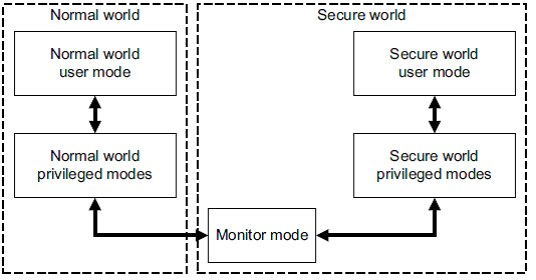
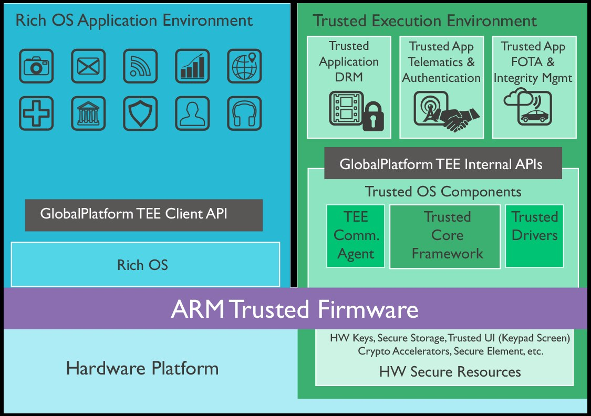
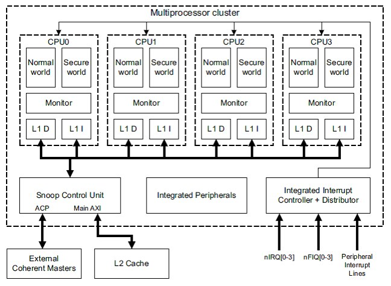
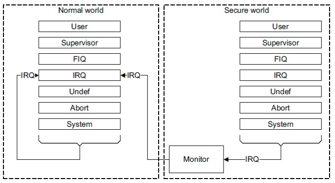
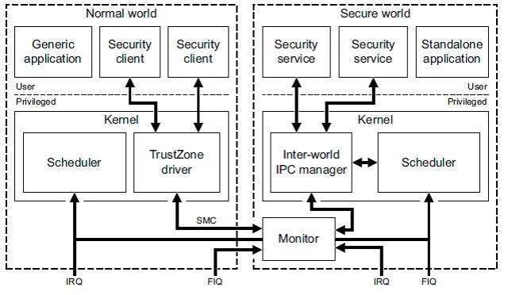
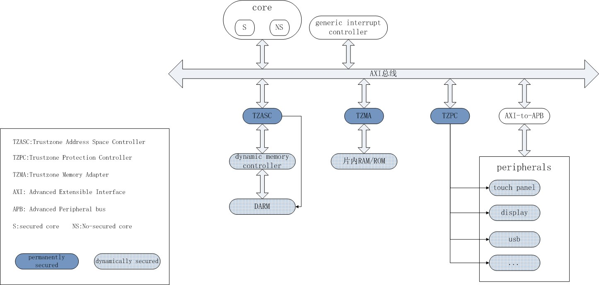
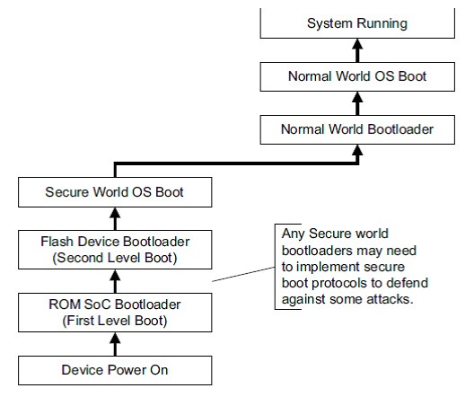
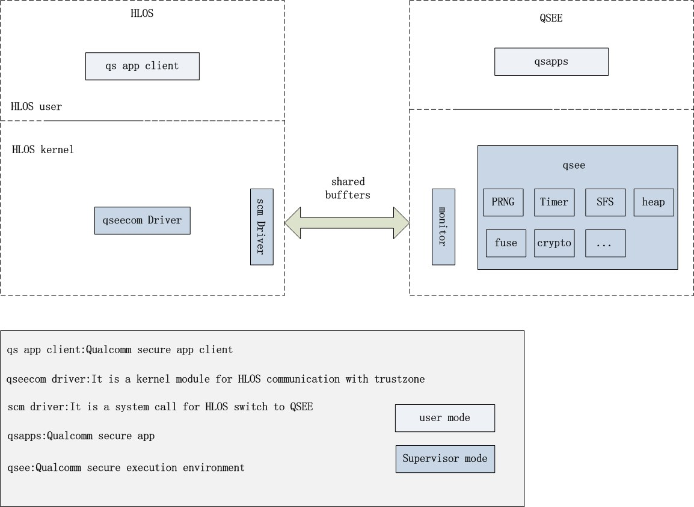
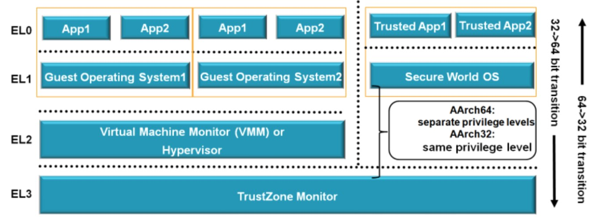

[瞭解TrustZone, 讀了這篇就夠了](https://www.twblogs.net/a/5bddf4012b717720b51b1916)
----

# 瞭解TrustZone, 讀了這篇就夠了

這篇文章源於老闆想瞭解 TrustZone, 要求我寫一篇文章簡單介紹 TrustZone 的原理.
既然是給領導看的, 只介紹原理哪裡夠, 因此也新增了公司自己現有 `TEE 環境的設計`、`實現和發展`, 也順帶加入了一些題外話.
也是因為要給領導看, 所以文章也不能涉及太多技術細節, 包括 TrustZone 模組的詳細設計以及示例程式碼等,
所以只從總體上講解了
> + 什麼是 TrustZone
> + TrustZone 是如何實現安全隔離的
> + TrustZone 相關的一些資源等

如果你之前對 TrustZone 亦無所知, 好吧, 本文或許值得你一看.
如果你已經瞭解了 TrustZone, 想知道更多的實現細節,
抱歉, 本文並不適合你, 或許閱讀 ARM 官方網站和文件, 以及各開放原始碼專案原始碼是更好的選擇.

本文先交代 TrustZone 的安全背景, 然後從較高層次介紹 TrustZone 的工作機制和原理(包括 `AXI 匯流排架構`、`CPU`、`記憶體和中斷模型`, 以及`安全隔離機制`),
列舉了幾個常見 ARM 平台上的實現, 以及當前博通 ARM 平台上的狀況,
最後附帶一些 TrustZone 相關的開放原始碼專案, 以及其他資源連結, 全文約7500字.
(由於涉及安全的原因, 本文已經刪掉介紹公司自己平台相關的部分).

> 本文內容主要來源於網路, 綜合了網上的多篇文章, 也加入了一些自己的理解, 重新組織了文章結構使其便於理解.
>
> 主要參考的文章包括：
> - [TrustZone領域先行者](http://blog.csdn.net/forestcell/article/list/2)
> - [TrustZone技術簡介](http://blog.csdn.net/braveheart95/article/details/8878319)
> - [trust zone之我見](http://blog.csdn.net/hovan/article/details/42520879)
> - [簡談高通Trustzone的實現](http://blog.csdn.net/guoqun01/article/details/51425091)
>
> 本文還參考了貼吧、知乎等部分文章, 由於涉及較多, 無法一一列舉, 再次對原作者的付出一併表示感謝 !
>
> 除上面列舉的資源外, 本文主要資料參考了 ARM 官方對 TrustZone 的介紹, 主要有:
> - 網站 https://developer.arm.com/technologies/trustzone
> - 文件 [Building a Secure System using TrustZone Technology](http://infocenter.arm.com/help/topic/com.arm.doc.prd29-genc-009492c/PRD29-GENC-009492C_trustzone_security_whitepaper.pdf)
>
> 事實上, 前面多篇文章的細節也來源於官方文件.
> 本人不保留本文的所有權, 歡迎轉載本文, 讓更多的人來瞭解TrustZone.
由於不想再次以類似 《TrustZone原理介紹》 一類作為標題, 但又不知道以什麼作為標題貼切, 所以隨手用了現在標題黨的套路, 抱歉.

## 1. TrustZone介紹

### 1.1 安全背景

在介紹 TrustZone 前有必要簡單回顧下目前的一些安全手段.

CPU 通過記憶體對應手段給每個 Process, 營造一個單獨的地址空間, 來隔離多個 Process 的程式碼和資料,
通過 kernel space 和 user space 不同的特權級, 來隔離 Kernel 和 User process 的程式碼和資料.

但由於記憶體中的程式碼和資料都是明文, 容易被同處於記憶體中的其它應用偷窺, 因此出現了擴展的安全模組,
> App Process 將加密資料, 送往 Security module, 由 Security module 處理完後, 再返回結果給相應的 App Process.

很多消費電子裝置, 都使用擴展的 Security module 來確保資料安全, 目前常見的方式有:

+ 外部掛接硬體安全模組
    > 資料的處理交由**外部**的安全模組實現, 這些模組能夠保護自己的資源和金鑰等資料的安全,
    如 SIM 卡、各種智能卡或連接到外部的硬體加解密模組等, 但其同主晶片的通訊線路暴露在外部, 容易被監聽破解. 另外, 通訊的速率比較低.

+ 內部整合硬體安全模組
    > 將外部**安全模組的功能整合到晶片內**, 因此一個晶片上至少有兩個核
    > + 一個普通核
    > + 一個安全核  

    > 優點: 核與核之間的通訊在晶片內部實現, 不再暴露在外面.  
    > 缺點: 是核之間的通訊速度仍然較低, 而且單獨的安全核性能有限, 還會會佔用SoC面積, 成本較高.

### 1.2 TrustZone是個什麼鬼 ?

TrustZone 是 ARM 針對消費電子裝置設計的一種硬體架構, 其目的是為消費電子產品, 建構一個安全框架, 來抵禦各種可能的攻擊.

TrustZone 在概念上, 將 SoC 的 H/w 和 S/w 資源劃分為安全(Secure Space)和非安全(Normal Space)兩個世界,
兩個世界通過一個名為 `Monitor Mode`的模式進行轉換, 如圖1:
> + 所有**需要保密的操作**, 在 `Secure Space` 執行(e.g. 指紋辨識、密碼處理、資料加解密、安全認證等)
> + 其餘操作在 `Normal Space` 執行(e.g. 使用者作業系統、各種應用程式等), 安全世界和非安全世界通過一個名為Monitor Mode的模式進行轉換, 如圖1：

  
圖1. ARM的安全世界和非安全世界

處理器架構上, TrustZone 將每個 Physical-Core 虛擬為兩個核,
> + 一個非安全核(Non-secure Core, NS-Core), 運行非安全世界的程式碼
> + 一個安全核(Secure Core, SE-Core), 運行安全世界的程式碼.

兩個虛擬的核, 以基於 time slot 方式運行, 根據需要在 run-time 使用物理核,
並通過 Monitor Mode, 在 Secure/Normal Space 之間切換,
> 類似同一 CPU 下的 Multi-App 環境, 不同的是 Multi-App 環境下, 作業系統實現的是 Processes 間切換,
而 Trustzone 下的 Monitor Mode, 實現了同一 CPU 上**兩個 OS 間的切換**.

AMBA3 AXI (AMBA3, Advanced eXtensble Interface) 系統匯流排, 作為 TrustZone 的基礎架構設施,
提供了 Secure/Normal Space 的隔離機制, 確保 NS-Core 只能訪問 Normal Space 的系統資源,
而 SE-Core 能訪問所有資源, 因此 Secure Space 的資源不會被 Normal Space 所訪問.

設計上, TrustZone 並不是採用一刀切的方式, 讓每個晶片廠家都使用同樣的實現.
總體上以 AMBA3 AXI 匯流排為基礎, 針對不同的應用場景設計了各種安全元件
> 晶片廠商根據具體的安全需求, 選擇不同的安全元件, 來建構他們的 TrustZone 實現.

其中主要的元件有:

+ 必選元件

    - AMBA3 AXI匯流排, 安全機制的基礎設施
    - 虛擬化的 ARM Core, 虛擬 SE-Core 和  NS-Core
    - TZPC (TrustZone Protection Controller), 根據需要控制外設的安全特性
    - TZASC (TrustZone Address Space Controller), 對記憶體進行安全和非安全區域劃分和保護

+ 可選元件

    - TZMA (TrustZone Memory Adapter), SoC ROM 或 RAM 安全區域和非安全區域的劃分和保護
    - AXI-to-APB bridge, 橋接 APB 匯流排, 配合 TZPC 使 APB 匯流排外設支援 TrustZone 安全特性

除了以上列出的元件外, 還有諸如 Level 2 Cache Controller, DMA Controller, Generic Interrupt Controller 等.

邏輯上, Secure Space 中, 安全系統的 OS 提供統一的服務, 針對不同的安全需求, 載入不同的安全應用 TA(Trusted Application).
> e.g. 針對某具體 DRM 的 TA, 針對 DTCP-IP 的 TA, 針對 HDCP 2.0 驗證的 TA 等.

圖2是一個 ARM 官網對 TrustZone 介紹的應用示意圖:

  
圖2. 基於TrustZone的應用示意圖

圖中左邊藍色部分 Rich OS Application Environment (即 REE)表示 User 操作環境, 可以運行各種應用 (e.g. 電視或手機的使用者作業系統).

圖中右邊綠色部分 Trusted Execution Envrionment (TEE) 表示系統的 Secure Space, 運行 Trusted OS,
在此基礎上執行可信任應用, 包括身份驗證、授權管理、DRM認證等, 這部分隱藏在使用者介面背後, **獨立於 Usre 操作環境**, 為使用者操作環境提供安全服務.

> 可信執行環境(TEE, Trusted Execution Environment) 是 Global Platform(GP)提出的概念.
對應於 TEE 還有一個 REE(Rich Execution Environment)概念, 分別對應於 Secure Space 和 Normal Space(Non-secure Space).

> GlobalPlatform(GP)是跨行業的國際標準組織, 致力於開發、制定並行布安全晶片的技術標準, 以促進多應用產業環境的管理及其安全、可互操作的業務部署.
目標是建立一個標準化的基礎架構, 加快安全應用程式, 及其關聯資源的部署, 如資料和金鑰, 同時保護安全應用程式及其關聯資源, 免受軟體方面的攻擊.

## 2. TrustZone 原理和設計

以下主要從 TrustZone 的匯流排設計, CPU 設計(包括處理器模型、記憶體模型和中斷模型)和安全隔離機制, 來介紹 TrustZone 的設計和工作原理.

### 2.1 匯流排設計

+ 匯流排

    設計上, TrustZone 在系統匯流排上, 針對每一個通道的讀寫, 增加了一個額外的控制訊號 flag, 這個控制 flag 叫做 `Non-Secure`或者`NS`位,
    > `NS`位是 AMBA3 AXI 匯流排, 針對 TrustZone 作出的最重要、最核心的擴展設計.

    這個控制訊號, 針對讀和寫分別叫做`ARPORT[1]`和`AWPORT[1]`:

    - `__ARPROT[1]__`: 用於讀操作(Read transaction), Low 表示 Secure, High 表示 Non-Secure
    - `__AWPROT[1]__`: 用於寫操作(Write transaction), Low 表示 Secure, High 表示 Non-Secure

    Bus 上的所有 Masters, 在發起新的操作(transaction)時, 會設定這些訊號,
    Bus 或 Slave 上解析模組, 會對 Master 發起的訊號進行辨識, 來確保 Master 發起的操作, 在安全上沒有違規.

    例如: H/w 設計上, 所有 Non-Secure Masters 在操作時, 必須將訊號的 NS 位 pull High,
    而 NS位  pull High 又使 Non-Secure Masters 無法訪問 Bus 上 Secure Space 的 Secure Slaves,
    簡單來說, 就是對 Non-Secure Masters 發出的地址訊號進行解碼時, 在 Secure Space 中, 找不到對應的 Slaves, 從而導致操作失敗.

    > NS 控制訊號在 AMBA3 AXI 匯流排規範中定義.
    可以將其看作為原有地址的擴展位, 如果原有 32-bits Addressing, 增加 NS 可以看成是 33-bits Addressing,
    其中一半的 32-bits Physical Address 定址為 Secure Space, 另一半 32-bits Physical Address 定址為 Normal Space.

    當然, Non-Secure Masters 嘗試訪問 Secure Slaves 會引發訪問錯誤, 可能是 SLVERR(slave error)或者 DECERR(decode error)
    > 具體的錯誤會依賴於其訪問外設的設計或系統匯流排的組態.

+ 外設

    在 TrustZone 出現前, ARM 的外設基於 AMBA2 APB (Advanced Peripheral Bus) 協議, 但是 APB 上不存在類似 AXI 上的 NS 控制位.
    為了相容已經存在的 APB 設計, AMBA3 規範中包含了 `AXI-to-APB bridge` 元件, 這樣就確保基於 AMBA2 APB 的外設同 AMBA3 AXI 的系統相容.
    > `AXI-to-APB bridge` 負責管理 APB 裝置的安全事宜, 會拒絕不合理的安全請求, 保證這些請求不會被轉發到相應的外設.

    例如: 新一代的晶片, 可以通過增加 AXI-to-APB bridge 元件, 來沿用上一代晶片的設計, 使其外設裝置可以支援 TrustZone.

### 2.2 處理器設計

#### 2.2.1 處理器模型

TrustZone 中, 每個 Physical-Core 被虛擬為一個 SE-Core 和一個 NS-Core, SE-Core 運行 Secure Space 的程式碼, NS-Core 運行除 Secure Space 外的其它程式碼.
由於 Secure/Normal Space 的程式碼, 採用 time slot 機制, 輪流運行在同一個 Physical-Core 上, 相應的節省了一個 Physical-Core

> Multi-Cores 上, 也有建議說, 讓將某一個或幾個 Cores 指定為專用的 SE-Cores, 只運行安全系統程式碼, 來建構 Secure Space,
其餘 Cores 運行 Normal Space 的程式碼

圖3中, 系統有4個物理核, 每個又分為兩個虛擬核（安全核和非安全核）的情況：

  
圖3. 多核處理器上的安全核和非安全核

#### 2.2.2 L1 記憶體模型

- MMU

    > MMU 是一種硬體電路, 它包含兩類部件, 並對應於記憶體管理的分段機制和分頁機制
    > + 一類是分段部件
    >> 把一個 Logic Address 轉換為線性 address
    > + 一類是分頁部件
    >> 分頁機制把一個線性 address 轉換為 Physical Address

    > 當 CPU 訪問一個 Virtual Address 時, 這個 Virtual Address 由 MMU 翻譯,
    MMU 先把它和 TLB 中的所有條目, 同時(平行地)進行比較, 如果它的 Virtual Page Index 在 TLB 中, 並且訪問沒有違反保護位,
    它的 Page 會直接從 TLB 中取出, 而不去訪問 Page list, 從而提高地址轉換的效率.

    Secure/Normal Space 都有自己的 Virtual MMU, **各自管理  Physical Address 的對應**.
    實際上只是兩個世界都有一份 `TTBR0`、`TTBR1`、`TTBCR`暫存器, 因此就會對應兩個 MMU table.

    儘管 MMU 有兩套, 但 TBL 快取, 在硬體上只有一套, 因此 TBL 對於兩個世界來說是共享的, 其通過 NS flag 來標誌其每一項具體屬於哪一個世界.
    這樣在兩個世界間進行切換時, 不再需要重新刷新 TLB, 提高執行效率.

    > 對於 TLB 共享並不是硬性規定的, 部分晶片在兩個世界間切換時, 可能通過硬體部分或全部刷新 TLB.

- Cache

    同 TLB 類似, 硬體上兩個世界共享一套 Cache, 具體的 Cache 資料屬於哪一個世界, 也由其 NS flag 指定,
    在 Secure/Normal Space 間切換也不需要刷新 Cache.

#### 2.2.3 中斷模型

基於 TrustZone 的處理器, 有三套 vector table:
> 限制在不同的 Space, 處理不同的 Exceptions
> + 一套用於 Normal Space
> + 一套用於 Secure Space
> + 還有一套用於 Monitor Mode

與之前 Non-TrustZone 的處理器不同的是, 這三套 Vector Table 的 base address,
在執行階段時, 可以通過 register CP15->VBAR(Vector Base Address Register) 進行修改.

Reset 時, Secure Space 的Vector Table 由 CPU 的輸入訊號 VINITHI 決定, default 為 0x00000000, 有設定時為 0xFFFF0000
> Normal Space 和 Monitor 模式的  Vector Table , default 沒有設定, 需要通過 Fw/ 設定後才能使用.

預設情況下, IRQ 和 FIQ Exception 發生後, 系統直接進入 Monitor Mode, 由於 IRQ 是絕大多數環境下最常見的 Interrupt,
因此 ARM 建議組態 IRQ 作為 Normal Space 的中斷源, FIQ 作為 Secure Space 的中斷源. 這樣組態有兩個優點:

- 當 CPU 運行在 Normal Space 時, IRQ 直接進入 Normal Space 的 ISR;
  如果 CPU 運行在 Secure Space 時, 當 IRQ 發生時, 會先進入到 Monitor Mode, 然後跳到 Normal Space 的 IRQ ISR 執行

- 僅將 FIQ 組態為 Secure Space  的中斷源, 而 IRQ 保持不變, 現有程式碼僅需做少量修改, 就可以滿足

將 IRQ 設定為 Normal Space 的中斷源時, 系統 IRQ 的切換見圖4:

 
圖4. IRQ 作為 Normal Space 的中斷源

#### 2.2.4 系統模式切換

基於 TrustZone 的系統有三種狀態, Normal Space, Secure Space 和用於二者切換的 Monitor Mode.

協處理器 CP15的 Register SCR(Secure Configuration Register), 有一個 NS-bit 用於指示當前 CPU 位於哪一個 Space
> Register SCR 在 Normal Space 是不能訪問的

當 CPU 處於 Monitor Mode 時, 無論 NS-Bit 是 0 還是 1, CPU 都是在 Secure Space 運行程式碼.
因此在 Monitor Mode 下 必是 Secure Space, 但若此時 NS-Bit 為 1, 訪問其它 Registers 時(除 CP15 外的 Registers), 獲取到的是其在 Normal Space 的值.

#####  Normal Space 到 Monitor Mode 的切換

CPU 從 Normal Space 進入 Monitor Mode 的操作, 由系統嚴格控制, 而且所有這些操作在 Monitor Mode 看來都屬於 Exception.

從 Normal Space 到 Monitor Mode 的操作可通過以下方式觸發:

+ S/w 執行 SMC (Secure Monitor Call) 指令
+ H/w Exception 機制的一個 sub-set(並非所有 H/w Exception 都可以觸發進入 Monitor Mode), 包括:
    - IRQ
    - FIQ
    - External Data Abort
    - External Prefetch Abort

##### Monitor Mode

Monitor Mode 內執行的程式碼, 依賴於具體的實現, 其功能類似於 Processes 切換, 不同的是, 這裡是不同模式間, CPU 狀態切換.

S/w 在 Monitor Mode 下, 先保存當前 Space 的狀態, 然後恢復下一個 Space 的狀態.
操作完成後, 以從 Exception 返回的方式, 開始運行下一個 Space 的程式碼.

##### 為什麼 Secure Space 和 Normal Space 不能直接切換 ?

Normal Space 無權訪問 CP15 的 Register SCR, 所以無法通過設定 NS-Bit 來直接切換到 Secure Space, 只能先轉換到 Monitor Mode, 再到 Secure Space.

如果程式運行在 Secure Space (非 Monitor Mode)下, 通過將 CP15 的 NS-Bit 置 1, Secure Space 可以直接跳轉到 Normal Space,
此時 CPU 的流水線和 Registers, 還遺留了 Secure Space 的資料和設定, Normal Space 下的 App, 就可獲取這些資料, 而造成極大的安全風險.
因此, 只建議在 Monitor Mode 下, 通過設定 NS-Bit 來切換到 Normal Space.

綜上, Secure Space 和 Normal Space 不存在直接的切換, 所有切換操作, 都通過 Monitor Mode 來執行.

圖5展現了 Secure Space 和 Normal Space 之間的切換方式:

 
圖5. Secure Space 和 Normal Space 之間的切換

### 2.3 隔離機制

除了 CPU 執行時, 實行 Secure/Normal Space 的隔離外, AMBA3 AXI 提供了外設隔離的基礎.

#### 2.3.1 記憶體隔離機制

這裡的記憶體, 指外部的 DDR 和 SoC 中的 ROM 以及 SRAM, 其隔離和保護, 通過 Bus 元件 TZASC 和 TZMA 的設定來實現.

+ TZASC (TrustZone Address Space Controller)
    - TZASC 可以把外部 DDR 分成多個區域, 每個區域可以單獨組態為 Secure or Normal Area, Normal Space 的程式碼和 App 只能訪問 Normal Area.
        > TZASC 只能用於記憶體裝置, 不適合用於組態 Block Devices, e.g. Nand Flash.

+ TZMA (TrustZone Memory Adapter)
    - TZMA 可以把 SoC 上的 ROM 和 SRAM 隔離出 Secure or Normal Area.
        TZMA 最大可以將 SoC 上儲存的 `0x0 ~ 0x0020_0000` 組態為 Secure Area, 其餘部分組態為 Normal Area.
        在大小劃分上, SoC 中 Secure Area 可以在 Chip 出廠前, 設定為固定大小, 或執行階段通過 TZPC 動態組態.
        > TZMA 使用上有些限制, 其不適用於外部記憶體劃分, 而且也只能組態一個安全區域.

#### 2.3.2 Peripheral 隔離機制

Peripheral 基於 APB 的 Devices, APB 並不支援 AXI Bux 的 NS 控制訊號, 所以 AXI 到 APB 需要 `AXI-to-APB bridge` 連接,
除此之外, 還需要 TZPC (TrustZone Protection Controller) 來向 APB 上的 Devices, 提供類似 AXI 上的 NS 控制訊號.

由於 TZPC 可以在執行階段動態設定, 這就決定了 Peripheral 的安全特性是動態變化的,
例如: 鍵盤平時可以作為非安全的輸入裝置, 在輸入密碼後, 可以組態為安全裝置, 只允許 Secure Space 訪問.

#### 2.3.3 隔離機制示意圖

整個系統記憶體和 Peripheral 隔離機制示意圖見圖6.

 
圖6. 系統記憶體和 Peripheral 隔離機制示意圖

> 此圖來源於網上, 實際上 TZPC 還連接到 SoC 內的 ROM/RAM 上, 用於組態 SoC 上儲存的 Secure Area.

### 2.4 安全啟動

AMBA3 AXI 機制隔離出 Secure/Normal Space, 但這是系統啟動之後的事情. 如何確保系統本身是安全的呢 ? 這就涉及到系統 Bring-Up 的過程.

系統上電復位後, 先從 Secure Space 開始執行, 同時會對 Normal Space 的 bootloader 進行驗證,
確保 Normal Space 執行的程式碼, 經過授權而沒有被篡改過. 然後 Normal Space 的 bootloader 會載入 Normal Space 的 OS, 完成整個系統的啟動.

Normal Space 的 bootloader 載入 OS 時, 仍然需要 Secure Space 對 OS 的程式碼進行驗證, 確保沒有被篡改.

圖7是典型的 TrustZone 晶片的啟動流程:

  
圖7. 典型的 TruestZone 晶片啟動流程

整個啟動流程, 跟目前博通平台的安全啟動原理基本一致, 上電後安全晶片先啟動, 然後校驗主晶片的 bootloader,
接下來 bootloader 提交系統的 OS 和檔案系統給 BSP 進行校驗, 通過後載入主系統, 確保主系統是安全的.

從上電復位開始的整個啟動過程中, **下一級的安全基於上一級的驗證**, 最終依賴於晶片內建的 OTP 和安全硬體, 逐級的驗證構成了整個系統的信任鏈.
信任鏈中的某一個環節被破壞, 都會導致整個系統不安全.

## 3. 各家 TrustZone 實現

基於安全考慮, 各家 TrustZone 都實行 Close Source, 關於其實現細節的介紹都較少.

網上能找到少許關於高通方案上 TrustZone 的介紹:

+ Secure Space
    - OP-TEE OS
    - QSEE (Qualcomm Secure Execution Environment)
+ Normal Space
    - Linux kernel
    - HLOS (High Level OS)

整個系統的架構如圖8:

 
圖8. 高通 QSEE 系統架構圖

## 4. 其它

+ ARMv8-A 架構定義了四個 Exception 等級, 分別為 EL0 ~ EL3, 其中**數字越大代表特權(privilege)越大**:
    - EL0: 無特權模式(unprivileged)
    - EL1: 作業系統核心模式(OS kernel mode)
    - EL2: 虛擬機器監視器模式(Hypervisor mode)
    - EL3: TrustZone monitor mode

    

+ TrustZone 設計的相關方
    - ARM 公司, 定義 TrustZone 並實現硬體設計, e.g. TEE, TZAPI 等
    - 晶片廠家, 在具體晶片上實現 TrustZone 設計, 包括三星、高通、MTK、TI、ST、華為等
    - 應用提供方, 如 DRM 廠家和安全應用開發商, 實現 DRM、Playready、DTCP-IP 和一些其它安全應用開發和認證

+ Trust OS

    TEE 環境下也要有一個作業系統, 各家都有自己的 Trustzone 的作業系統, 如 Trustonic、高通的 QSEE、中國的豆莢, 還有開放原始碼的 OPTEE 等.
    在 OS 之上自然要有應用程式, 在 TrustZone 裡面我們一般叫 TrustApp, 當然 TEE 裡面每個 TrustApp 都在一個沙盒裡, 互相之間是隔離的.
    比如說支付, 就可以做成一個 App(需要注意的是, 和 Normal Space 裡面的 App 是兩個概念),
    > 這個 App 簡單來說, 就負責用私鑰, 把網上發來的 Challenge 簽個名, 而這個簽名的動作, 是需要在 Secure Space 裡面做的,
    避免惡意程序竊取到私鑰來偽造簽名.

    例如支付寶, 其實支付寶也是只支援幾個 Trust OS 的, 同時支付寶還定義了一系列標準, 用來完成他的行為.

    現在的 Trust OS 大都會遵循 GlobalPlatform 的規範, 這個組織致力於制定統一的 Trust OS 的 API 的介面規範,
    這樣一個 TrustApp 只要用 GP API, 就可以方便移植到各個不同的 TEE OS 上了.

+ Intel 平台的 SGX

    針對可信計算, 類似 ARM 的 TrustZone, Intel 也針對 x86 平台提出了自己的安全架構 SGX:

    [Intel® Software Guard Extensions (Intel® SGX)](https://www.intel.com/content/www/us/en/developer/tools/software-guard-extensions/get-started.html)

    SGX 全稱 Intel Software Guard Extensions, 顧名思義, 其是對 Intel 體系(IA)的一個擴展, 用於增強軟體的安全性.
    這種方式並不是識別和隔離平台上的所有惡意軟體, 而是將合法軟體的安全操作封裝在一個 Enclave 中,
    保護其不受惡意軟體的攻擊, 特權或者非特權的軟體都無法訪問 Enclave,
    也就是說, 一旦軟體和資料位於 enclave中, 即便 OS 或者和 VMM(Hypervisor)也無法影響 Enclave 裡面的程式碼和資料.
    > Enclave 的安全邊界只包含 CPU 和它自身

    SGX 建立的 Enclave 也可以理解為一個可信執行環境 TEE(Trusted Execution Environment).
    不過其與 ARM TrustZone (TZ)還是有一點小區別的, TZ 中通過 CPU 劃分為兩個隔離環境(Secure/Normal Space), 兩者之間通過 SMC 指令通訊.
    而 SGX 中一個 CPU 可以運行多個安全 Enclave, 並行執行亦可.

    簡單來講, Intel SGX 最關鍵的優勢, 在於將程序以外的 software stack 如 OS 和 BIOS 都排除在 TCB (Trusted Computing Base)以外.
    換句話說, 就是在容器 Enclave 裡的 code 只信任自己和 intel 的 CPU.

    > 網上有人是這樣對比 TrustZone 和 SGX 的:
    >
    > Trustzone 默認相信 SecureOS of Secure Space.
    > SGX 僅相信 CPU Core, 通過SGX指令建構enclave容器.
    > 簡單比喻, TEE 是個公用大保險櫃, 什麼東西都裝進去, 有漏洞的 App 可能也進去了, 而且保險櫃鑰匙在管理員手上, 必須相信管理員.
    > SGX 每個 App 有自己的保險櫃, 鑰匙在自己手上
    >
    > SGX 要進入工業界應用尚需時間, 一個重要的問題是, 現在在 intel 發行的伺服器晶片上, 還沒有 SGX, 而 SGX 的重要應用就是在資料中心和雲端的應用.

## 5. TrustZone 開放原始碼專案

除了各家私有實現外, ARM 也有不少開放原始碼專案, 知名度較高的有:

+ [Arm Trusted Firmware](https://github.com/ARM-software/arm-trusted-firmware)
    - 基於 ARMv8-A 應用處理器, ARM 官方提供了一個開源參考實現 BL31.

+ [Openvirtualization](http://www.openvirtualization.org/)
    - 帶有一些商業屬性的開放原始碼專案, 部分 TEE 實現只有商業版支援

+ [Op-Tee](https://github.com/OP-TEE)
    - Linaro 推出的開源 TEE

## 6. 參考

+ Architecture
    - https://developer.arm.com/products/architecture
+ [ARM TrustZone](https://developer.arm.com/technologies/trustzone)
+ [Building a Secure System using TrustZone Technology](http://infocenter.arm.com/help/topic/com.arm.doc.prd29-genc-009492c/PRD29-GENC-009492C_trustzone_security_whitepaper.pdf)
+ [ARM Trusted Firmware](https://github.com/ARM-software/arm-trusted-firmwar)
+ Development of TEE and Secure Monitor Code
    - http://www.arm.com/products/security-on-arm/trustzone/tee-and-smc

