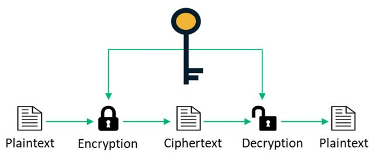
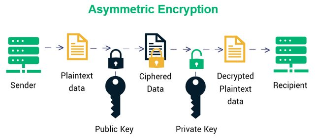

Cryptographic
---

密碼學永遠的男主角跟女主角, Alice 和 Bob. 他們代表著互相通訊的兩人.

Alice 永遠想要傳訊息給 Bob, 而 Bob 永遠想要知道 Alice 傳了什麼給他; 於是Alice 和 Bob 會用各式各樣的加密方式, 傳送他們的訊息.

Eve 是個小變態, 他會在中途偷聽他們傳了什麼, 但是他不會竄改訊息. 但是 Oscar 就沒那麼簡單了, Oscar是壞人, 他不僅會偷聽他們的訊息, 還會竄改訊息(壞吧).

除此之外, 還有Charlie, Issac, Ivan, Justin, Mallory, Matilda, Peggy, Steve, Walter 等.
每個人都有不同的能力, 代表著不同的角色.

# 名詞解釋

+ 明文(plaintext)
    > 加密前的訊息
+ 密文(ciphertext)
    > 加密後的訊息
+ 密鑰(key)
    > 用來加密的鑰匙, 通常用 `K` 表示

## 對稱式加密

所謂對稱式加密(Symmetric Encryption), 就是加密跟解密用的密鑰是同一個.

白話文來說, 假設Alice 要寄信給 Bob, 那麼Alice要將她的信投到Bob的信箱之前, 會用一把鑰匙把信箱打開, 然後把信投進去(假設他的信箱沒有投遞的孔).
接著Bob要拿信的時候, 就用一把一模一樣的鑰匙把信箱打開, 得到他的信.

> 這樣一個用**同樣密碼加密跟解密**的過程, 就叫`對稱式加密`.

對稱式加密的底下, 又分成串流密碼(stream cipher)和區塊密碼(block cipher).
差別在於, 加密是以位元為單位、區塊加密是以區塊為單位.
而串流加密的速度通常比較快、區塊密碼速度較慢.

## 非對稱式加密

非對稱式加密(Asymmetric Encryption), 又稱 Public-Key 加密.
> 相對於對稱式加密, 是一種**加密和解密使用不同密鑰**的加密方式.

非對稱式加密稍微複雜一些, 我舉個例子好幫助理解.

假設Alice要寄信給Bob.  於是Bob就拿出一個盒子和鎖, 這個鎖就是公鑰(Public-Key).
接著Alice把信放到盒子裡鎖起來, 寄給Bob.  只有Bob才打得開這個盒子, 因為只有他擁有鎖的鑰匙, 也就是Private-Key(private key)

要注意：這個 Private-Key 需要保藏的非常好.
> `Private-Key` 可以推導出 **Public-Key**, 但 **Public-Key** 不能推導出 `Private-Key`.
>>　**Public-Key**　用來加密, 而 `Private-Key` 則是用來解密

於是在真實情況底下, 做為一個收件人, 你得先產生一個 `Private-Key`, 並用這個 Private-Key 推導出 Public-Key.

接著, 公開你的 Public-Key 給所有人.
當有人想要傳訊息給你的時候, 他使用你的 **Public-Key** 加密他要傳的訊息, 這個訊息一經加密, 就只有你解的開.

你收到訊息後, 就可以使用 `Private-Key` 將密文轉換回明文.

+ 安全性 v.s. 效能

    |                       | Key 長度 | 效能 | 安全性 |
    |   :-                  | :-:     | :-:  | :-:   |
    | Symmetric Encryption  |  短      | 快   |  低   |
    | Asymmetric Encryption |  長      | 慢   |  高   |

    >　實務上, 對稱/非對稱式加密會兩者交替使用, 通過 Public-Key 加密來隨機建立臨時的 `Symmetric-Key` (亦即對話鍵), 然後才通過對稱式加密來傳輸大量主體的資料.

+ 常見的 **Public-Key** 加密演算法
    - RSA、
        > 使用最廣泛的是 RSA 演算法
    - ElGamal
    - Rabin(RSA的特例)
    - DSA、
    - ECDSA

## 數位簽章 (Digital Signature)

數位簽章就是將 Public-Key 密碼反過來使用.
> 簽名者將訊息用 `Private-Key` 加密, 驗證者使用 **Public-Key** 解密並比對消息

Alice 是簽名者, 假設她要對 msg_A 進行簽名時, 先生成了其 Public-Private Key pair, 公佈該 **Public-Key**, 然後將 msg_A 用 `Private-Key` 加密後發佈。

簽章算法具有如下特性
+ 確認消息在傳輸過程中沒有丟位, 沒被篡改 (完整性).
+ 確認消息的發送者是發佈公鑰的 Alice (認證).
+ 確認 Alice 的確發佈過該消息 (不可否認性)

# Reference
+ [學密碼學也猜不到你的手機密碼](https://ithelp.ithome.com.tw/users/20140112/ironman/3930)

