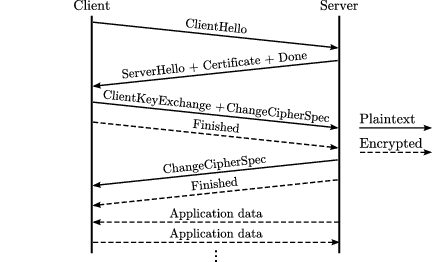

Cryptographic
---

密碼學永遠的男主角跟女主角, Alice 和 Bob. 他們代表著互相通訊的兩人.

Alice 永遠想要傳訊息給 Bob, 而 Bob 永遠想要知道 Alice 傳了什麼給他; 於是Alice 和 Bob 會用各式各樣的加密方式, 傳送他們的訊息.

Eve 是個小變態, 他會在中途偷聽他們傳了什麼, 但是他不會竄改訊息. 但是 Oscar 就沒那麼簡單了, Oscar是壞人, 他不僅會偷聽他們的訊息, 還會竄改訊息(壞吧).

除此之外, 還有Charlie, Issac, Ivan, Justin, Mallory, Matilda, Peggy, Steve, Walter 等.
每個人都有不同的能力, 代表著不同的角色.

# 名詞解釋

+ 明文(plaintext)
    > 加密前的訊息
+ 密文(ciphertext)
    > 加密後的訊息
+ 密鑰(key)
    > 用來加密的鑰匙, 通常用 `K` 表示


## 對稱式加密

所謂對稱式加密(Symmetric Encryption), 就是加密跟解密用的密鑰是同一個.

白話文來說, 假設Alice 要寄信給 Bob, 那麼Alice要將她的信投到Bob的信箱之前, 會用一把鑰匙把信箱打開, 然後把信投進去(假設他的信箱沒有投遞的孔).
接著Bob要拿信的時候, 就用一把一模一樣的鑰匙把信箱打開, 得到他的信.

> 這樣一個用**同樣密碼加密跟解密**的過程, 就叫`對稱式加密`.

對稱式加密的底下, 又分成串流密碼(stream cipher)和區塊密碼(block cipher).
差別在於, 加密是以位元為單位、區塊加密是以區塊為單位.
而串流加密的速度通常比較快、區塊密碼速度較慢.


+ Algorithm

    - RC4 (Rivest Cipher 4)
    - DES (Data Encryption Standard)
    - [AES (Advanced Encryption Standard)](note_aes.md)

## 非對稱式加密

非對稱式加密(Asymmetric Encryption), 又稱 Public-Key 加密.
> 相對於對稱式加密, 是一種**加密和解密使用不同密鑰**的加密方式.

非對稱式加密稍微複雜一些, 我舉個例子好幫助理解.

假設Alice要寄信給Bob.  於是Bob就拿出一個盒子和鎖, 這個鎖就是公鑰(Public-Key).
接著Alice把信放到盒子裡鎖起來, 寄給Bob.  只有Bob才打得開這個盒子, 因為只有他擁有鎖的鑰匙, 也就是Private-Key(private key)

要注意：這個 Private-Key 需要保藏的非常好.
> `Private-Key` 可以推導出 **Public-Key**, 但 **Public-Key** 不能推導出 `Private-Key`.
>>　**Public-Key**　用來加密, 而 `Private-Key` 則是用來解密


於是在真實情況底下, 做為一個收件人, 你得先產生一個 `Private-Key`, 並用這個 Private-Key 推導出 Public-Key.

接著, 公開你的 Public-Key 給所有人.
當有人想要傳訊息給你的時候, 他使用你的 **Public-Key** 加密他要傳的訊息, 這個訊息一經加密, 就只有你解的開.

你收到訊息後, 就可以使用 `Private-Key` 將密文轉換回明文.

+ 安全性 v.s. 效能

    |                       | Key 長度 | 效能 | 安全性 |
    |   :-                  | :-:     | :-:  | :-:   |
    | Symmetric Encryption  |  短      | 快   |  低   |
    | Asymmetric Encryption |  長      | 慢   |  高   |


    >　實務上, 對稱/非對稱式加密會兩者交替使用, 通過 Public-Key 加密來隨機建立臨時的 `Symmetric-Key` (亦即對話鍵), 然後才通過對稱式加密來傳輸大量主體的資料.

+ 常見的 **Public-Key** 加密演算法
    - RSA、
        > 使用最廣泛的是 RSA 演算法
    - ElGamal
    - Rabin(RSA的特例)
    - DSA、
    - ECDSA

## 數位簽章 (Digital Signature)

數位簽章就是將 Public-Key 密碼反過來使用.
> 簽名者將訊息用 `Private-Key` 加密, 驗證者使用 **Public-Key** 解密並比對消息

Alice 是簽名者, 假設她要對 msg_A 進行簽名時, 先產生其 Public-Private Key pair, 公佈該 **Public-Key**, 然後將 msg_A 用 `Private-Key` 加密後發佈。

簽章算法具有如下特性
+ 確認消息在傳輸過程中沒有丟位, 沒被篡改 (完整性).
+ 確認消息的發送者是發佈公鑰的 Alice (認證).
+ 確認 Alice 的確發佈過該消息 (不可否認性)


## 區塊鏈

區塊鏈可用於公開電子帳本, 利用數位簽章的特性, 保證其資料正確性, 同時發放多方競爭打包區塊, 增加其透明度及不可竄改

+ 在區塊鏈上, 交易進行的過程中需要進行數位簽章, 也就是當你要把一筆資金轉給另外一個人時, 就需要將這筆交易內容經過數位簽章, 之後進行驗證簽章的步驟, 才能正式成立

    

+ 比特幣區塊鏈上使用 Hash 函數, 來當做是一種證明.
    > 區塊鏈上許多礦工們彼此要爭打包(也就是幫你把交易內容寫到區塊鏈裡面)的工作,
    因此他們要做的事情, 就是將交易內容(e.g. 此次交易資訊, Signature, ...etc.)附加上一個值, 並算出 SHA-2 的值;
    不斷更改後面的值, 直到輸出的雜湊值符合某一個格式, 那麼他就有打包這個區塊的權利, 同時也會獲得獎賞.
    >> 由於雜湊值的結果是無法預測的, 在沒有辦法推論的結果之下, 最快的方法就是窮舉, 因此才要競爭比算力


+ 數位錢包
    > 將公鑰密碼學的概念應用於數位錢包; 數位錢包可以拿來收款或支付.
    >> 當進行一份交易時, 用 `Private-Key` 對這份交易使用`數位簽章`就可以了; <br>
    **Public-Key** 除了驗證簽章外, 還用來產生地址(相當於銀行帳戶的功用), 地址可公開

# Algorithm

## Elliptic Curve Cryptography (ECC, 橢圓曲線密碼學)

利用橢圓曲線 (Elliptic curve) 來產生 Key-Pair

當兩個人只能在不安全通道上進行通訊（也就是**沒有安全通道傳遞密鑰**）, 而且**沒有事先協議**的情況之下, 雙方進行 Key 的協議 (密要交換)

+ secp256k1
+ DHKE (Diffie–Hellman key exchange)
+ ECDH (Elliptic Curve Diffie–Hellman key exchange)
+ ElGamal

## RSA

由 Ron Rivest, Adi Shamir 和 Leonard Adleman 共同提出了 RSA 演算法 (名字各取一個 letter).

RSA 的安全性建立在數字因數分解的難度上
> 因數分解需要找到質數(prime number); 當使用的值數非常大時, 因數分解的難度就會大幅上升

可使用在
+ 產生 Key-Pair (Public/Private)
+ 加解密
+ 數位簽章
    > 直接將RSA的算法顛倒過來, 用私鑰加密用公鑰解密


## HASH (雜湊)

Hash function 要求
> + 不管多長的資料, 經過 Hash 函數後的**輸出長度都會是一樣**
> + 輸出的雜湊值幾乎可以說是唯一的
> + 無法逆推 (無法做解密)

Signature 是對一整段訊息進行 `Private-Key` 加密, 大眾可以用 **Public-Key**  解密看看是否是你本人所簽署.
但若是資料太長, 簽章後的結果會太長, 會造成實務上使用的困難度(e.g. performance);

因此 Hash 函數就是一個很好的壓縮機, 他把訊息壓縮成唯一的雜湊值 (縮減資料量), 同時 Signature 經過 Hash 後的值也是可驗證的.

+ SHA family

    - SHA-1 輸出 160 bits
        > 已經不安全

    - SHA-2
        > + 可以選擇不同的輸出 bits
        > + 和 SHA-1 的算法類似

        1. 比特幣區塊鏈所使用的 Hash 函數即是 SHA-256, 是 SHA-2 演算法中輸出雜湊值為 256bits 的算法

    - SHA-3
        > + 可以選擇不同的輸出 bits
        > + 全新的算法

## DSA (digital signature algorithm)

數位簽章演算法


## ECDSA

是運用了橢圓曲線密碼學所達成的數位簽章演算法
> 比特幣區塊鏈與以太坊區塊鏈使用的就是 ECDSA

ECDSA演算法特性 `160~256 bits` 即可和 `1024~3072 bits`的 RSA 擁有相同的安全等級, 也因此運算上更快一些

# Message Authentication Code (MAC, 訊息鑑別碼)

訊息識別碼同時擁有`數位簽章`和`雜湊函數`的性質.
> + 可以驗證訊息的完整性
> + 可以任意輸入固定輸出長度
> + 可以確認來源
> + 但是他沒有不可否認性 (數位簽章具備不可否認性)


如上圖, 傳送者將訊息用密鑰 k 經過 MAC 運算之後加在訊息本身之後, 並整批傳送給對方, 同時密鑰 k 也要用安全的通道傳送. <br>
收件者將收到的訊息中, 原訊息的部分, 用密鑰 k 進入 MAC 運算, 運算結果和傳過來的訊息比對.

如果相同就證明訊息是完整的。

可以看到, MAC 是一種對稱式加密, 傳送者和接收者必須擁有同一把密鑰.
> 既然雙方擁有同一把鑰匙, 就沒有辦法證明訊息是由誰所生成, 也就是無法具備`不可否認性`.
>> 白話一點來說, Alice 可以說這個訊息不是他傳的, 因為 Bob 也有同一把鑰匙.

MAC 是一種對稱式加密, 而數位簽章是公鑰加密, 因此 MAC 會比數位簽章快

## MAC Algorithm

+ HMAC
    >  H 就是 Hash 的意思; 利用 Hash 來達到訊息識別碼 (Message Authentication Code) 的功能

+ CBC-MAC (Cipher Block Chaining)
    > 一般指使用 AES 的 CBC mode 來建立 MAC.
    >> CBC 是用前一個區塊加密結果, 來做為下一個區塊的加密參數;
    由於前面的區塊會影響後面區塊的加密結果, 因此記錄最後一個區塊, 來達到訊息識別碼的功能


+ GCM (Galois/Counter Mode)
    > 一般指在 AES-CTR (Counter mode) 基礎上增加 Galois-field 來擴充建立 GMAC (Galois Message Authentication Code).
    >> 解決了 AES-CTR 不能對加密消息進行完整性校驗的問題

# Certificate authority (CA)

為了使公開金鑰密碼系統得以順利運作, 必需有效的證明某一把公開金鑰確實為某人或某單位所擁有, 讓他人無法假冒或偽造. <br>
解決方法是由可信賴的第三者或機構(Trusted Third Parity)來當作公鑰授權單位, 以簽發公鑰電子憑證的方式來證明公鑰的效力. <br>
而 CA 就是其可信賴的第三方機構

CA 是一個憑證管理中心, 它在做的事情, 就是驗證你真正擁有這個 **Public-Key**. <br>
如果它認證此人真正擁有此 **Public-Key**, 那他就會頒發一個數位憑證(Certification)
> 數位憑證 (Certification) 其實就是用 CA 的 `Private-Key` 去做 Signature.
所以 CA 自己也會有一個 Key-Pair, `Private-Key` 用來簽章, **Public-Key** 讓使用者驗章確認數位憑證.
>> 這 `Private-Key` 必須保管的非常好.

而有 User, CA, Database(Key-Pair), CA 為 User 頒發 Certification 的整個架構, 就叫做公鑰基礎建設(PKI, Public Key Infrastructure)


## TLS（Transport Layer Security, 傳輸層安全性協定）/SSL（Secure Sockets Layer, 安全通訊協定）

SSL 總共有三個版本, SSL1.0/SSL2.0/SSL3.0; 而 SSL1.0 因為漏洞太多所以沒有公開. <br>
在 2014 年時 SSL3.0 被發現缺陷, 因此在 2015 年時被棄用了, 之後誕生 TLS 做為 SSL 的繼任者.

TLS 總共有四個版本 TLS1.0/TLS1.1/TLS1.2/TLS1.3
> 在雙方進行通訊時(或是造訪網站等廣義的通訊)所共同遵守的規範, 更明確來規範步驟.
>> 白話來說, 這個協定就是來決定我們要使用哪些加密方式, 以及怎麼使用

+ TLS1.2 Handshake

    

    - 首先 Client 會先傳送一個訊息, 稱為 **ClientHello**. 內容包含該 Client 可使用的最高 TLS 版本, 以及一清單的密碼套件(cipher suites)和一個亂數
        > 單個 Cipher Suites 形如這樣 `TLS_ECDHE_RSA_WITH_AES_128_GCM_SHA256`, 須包含
        > + 密鑰交換演算法(e.g. DHKE, ECDH, ...)
        > + 對稱式加密演算法
        > + MAC演算法(e.g. SHA-256)

        > 客戶要提供一個密碼套件清單表示他所能提供的加密方式

    - 接著 Server 會根據 Client 的訊息回傳 ServerHello
        > 內容包括這次通訊要使用的加密方式 (從 Client 傳回的 Cipher Suites 中挑選)

    - 當雙方都協議好要使用哪種加密方式, 接著是加密的準備.

        1. 伺服器會傳來他的證書(Certification, 由 CA 頒發), 讓客戶端確認身份
        1. 傳來 DHKE 的公開參數
        1. 以上所有資料的數位簽章(當然經過 Hash)
        1. 最後補上一句 ServerHelloDone 代表 Server 傳完了

        > + 有了 Server 的證書，你可以確認他就是你要連的網站
        > + 有 Server 的數位簽章, 你確認訊息是由他傳送過來的;
        > + 有了 DHKE 的公開參數, 你可以和 Server 進行秘密訊息傳遞

    - Client 必須將你的  **Public-Key** 傳給 Server, 才算完成一次 DHKE
    - Client 還要傳一個 `Change cipher spec`, 告知 Server, 接下來都會傳送經過加密後的訊息
    - Client 將以上所有的通訊結果摘要加密後, 傳送給伺服器，
        > 這個步驟可以用來防範 MITM

    - 最後 Server 回傳一個 `Change cipher spec`, 開始進行加密傳輸

## Certificates (憑證)

使用 `ITU-T X.509` 格式, 而憑證內容包括
> + 使用者名稱
> + 公開金鑰
> + 發證者(issuer)
> + 生效和到期日期
> + 擁有者等資訊


+ X.509
    > `X.509` 數位憑證乃以 `ASN.1` 符號表示法(Abstract Syntax Notation 1)定義, 詳細記載了組成該數位憑證的二進位資料
    >> `ASN.1` 可以用多種方式加以編碼, 現今標準多為使用簡單的 DER (Distinguished Encoding Rules), 可以產生二進位數位憑證;
    並用 `BASE64` 產生文字模式編碼格式

    - 數位憑證通常以 Base64 編碼

        ```
        -----BEGIN CERTIFICATE-----MIICWDCCAgICAQAwDQYJKoZIhvcNAQEEBQAwgbYxCzAJBgNVBAYTAlpBMRUwEwYD
        VQQIEwxXZXN0ZXJuIENhcGUxEjAQBgNVBAcTCUNhcGUgVG93bjEdMBsGA1UEChMUV
        Ghhd3RlIENvbnN1bHRpbmcgY2MxHzAdBgNVBAsTFkNlcnRpZmljYXRpb24gU2VydmljZX
        MxFzAVBgNVBAMTDnd3dy50aGF3dGUuY29tMSMwIQYJKoZIhvcNAQkBFhR3ZWJtYXN0
        ZXJAdGhhd3RlLmNvbTAeFw05NjExMTQxNzE1MjVaFw05NjEyMTQxNzE1MjVaMIG2MQs
        wCQYDVQQGEwJaQTEVMBMGA1UECBMMV2VzdGVybiBDYXBlMRIwEAYD
        VQQHEwlDYXBlIFRvd24xHTAbBgNVBAoTFFRoYXd0ZSBDb25zdWx0aW5nIGNjMR8wHQ
        YDVQQLExZDZXJ0aWZpY2F0aW9uIFNlcnZpY2VzMRcwFQYDVQQDEw53d3cudGhhd3Rl
        LmNvbTEjMCEGCSqGSIb3DQEJARYUd2VibWFzdGVyQHRoYXd0ZS5jb20wXDANBgkqhki
        G9w0BAQEFAANLADBIAkEAmpIl7aR3aSPUUwUrHzpVMrsm3gpI2PzIwMh39l1h/RszI0/0q
        C2WRMlfwm5FapohoyjTJ6ZyGUUenICllKyKZwIDAQABMA0GCSqGSIb3DQEBBAUAA0EA
        fI57WLkOKEyQqyCDYZ6reCukVDmAe7nZSbOyKv6KUvTCiQ5ce5L4y3c/ViKdlou5BcQYAb
        xA7rwO/vz4m51w4w==
        -----END CERTIFICATE-----
        ```

# Reference
+ [學密碼學也猜不到你的手機密碼](https://ithelp.ithome.com.tw/users/20140112/ironman/3930)


