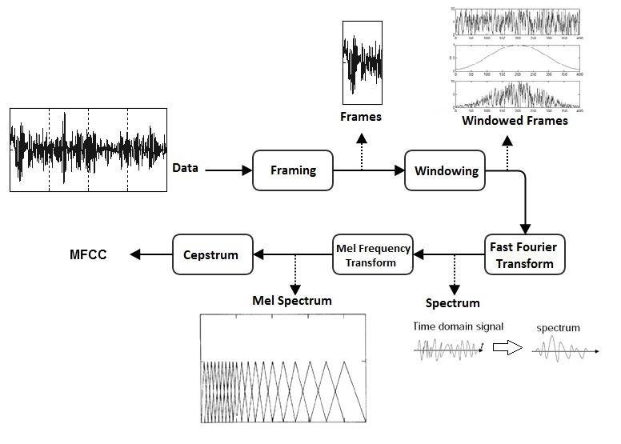
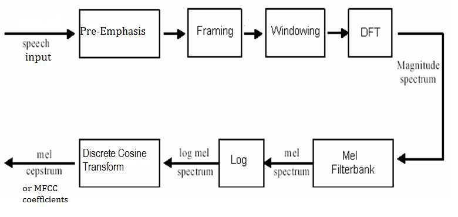

MFCC [[Back](note_kws.md)]
---

梅爾倒頻譜(MFC, Mel-Frequency Cepstrum)是一個可用來代表**短期音訊**的頻譜,
梅爾倒譜係數 (MFCC, Mel-scaleFrequency Cepstral Coefficients) 則是一組用來建立梅爾倒頻譜的關鍵係數

根據人耳聽覺模型的研究發現, 人耳對不同頻率的聲波有不同的聽覺敏感度.
> 從 `200 ~ 5000 Hz`的訊號, 對 Speech 的清晰度影響對大

兩個音量(響度)不等的聲音作用於人耳時, 則音量較大的音頻成分, 會影響到對音量較小的音頻成分的感受, 使其變得不易察覺, 這種現象稱為**掩蔽效應**
> 由於低頻的聲音在內耳蝸基底膜上, 傳遞的速度, 大於高頻的聲音, 故一般來說, 低音容易掩蔽高音, 而高音掩蔽低音較困難

因此人們從低頻到高頻這一段頻帶內, 按臨界頻寬的大小, 由密到疏安排一組濾波器, 對輸入訊號進行濾波.
> MFCC 的在低頻部分的解析度高, 跟人耳的聽覺特性是相符的

將每個濾波器輸出的訊號能量, 作為訊號的基本特徵, 對此特徵經過進一步處理後, 就可以作為語音的輸入特徵.
由於這種特徵不依賴於訊號的性質, 對輸入訊號不做任何的假設和限制, 又利用了聽覺模型的研究成果。

因此, MFCC 參數比基於聲道模型的 LPCC 相比, 具有更好的 robost, 更符合人耳的聽覺特性, 而且**當訊號雜訊比降低時, 仍然具有較好的識別性能**

+ 產生 MFCC Curve

    ```python
    # MFCC curve
    import numpy as np
    import matplotlib.pyplot as plt

    x = np.arange(8001)
    y = 2595 * np.log10(1+x/700)

    plt.plot(x, y, color='blue', linewidth=3)

    plt.xlabel("f", fontsize=17)
    plt.ylabel("Mel(f)", fontsize=17)
    plt.xlim(0, x[-1])
    plt.ylim(0, y[-1])

    # plt.savefig('mel_f.png', dpi=500)
    plt.show()
    ```

+ The flow procedure of the MFCC feature extraction

    

+ Example

    - use librosa

        ```python
        #!/usr/bin/env/ python

        import librosa
        import matplotlib.pyplot as plt
        import scipy, sklearn
        from sklearn import preprocessing
        import numpy as np

        plt.rcParams['font.size'] = 8

        filename = "right.wav"
        y, sr = librosa.load(filename)
        mfccs = librosa.feature.mfcc(y=y, sr=sr, n_mfcc=40)

        # print(np.shape(mfccs))
        # print(mfccs)


        fig, ax = plt.subplots(4, 1)

        # 繪製波形圖
        plt.subplot(4, 1, 1)
        librosa.display.waveshow(y, sr=sr, ax=ax[0])
        ax[0].set_title('nutcracker waveform')

        # 繪製梅爾頻譜圖
        plt.subplot(4, 1, 2)
        S = librosa.feature.melspectrogram(y=y, sr=sr, n_mels=40, fmax=8000)
        S_dB = librosa.power_to_db(S, ref=np.max)
        librosa.display.specshow(S_dB, x_axis='time',
                                 y_axis='mel', sr=sr,
                                 fmax=8000, ax=ax[1])
        ax[1].set_title('Mel-frequency spectrogram')


        img = librosa.display.specshow(mfccs, x_axis='time', ax=ax[2])
        fig.colorbar(img, ax=ax[2])
        ax[2].set_title('MFCC')


        mfccs = sklearn.preprocessing.scale(mfccs, axis=1)
        img = librosa.display.specshow(mfccs, x_axis='time', ax=ax[3])
        fig.colorbar(img, ax=ax[3])
        ax[3].set_title('MFCC Log Energy')

        plt.tight_layout()
        plt.show()
        ```

    - MFCC flow of math

        1. ref. `z_mfcc_procedure.py`

    - Voice Activity Detection

        1. ref. `z_VAD.py`

# MFCC 對應的物理含義

以 Speaker Recognition 中常用的 39-Dimension MFCC 為例, 分為
> + 13 靜態係數
> + 13 一階差分係數
> + 13 二階差分係數

其中差分係數用來描述動態特徵, 也即聲學特徵在相鄰幀間的變化情況

+ 靜態 mfcc 假設 frame 與 frame 之間相互獨立, 這與實際情況未必符合,
比如濁音時, 相鄰 frame 之間相關程度很高, 對應的靜態 mfcc 可能也有較大相關,
而動態係數描述了相鄰幀的聯絡, 解決了靜態mfcc不合理假設可能帶來的問題
    > 極限情況下, 假設濁音時, 相鄰 frame 靜態 mfcc 完全相等, 則差分係數為零, 而清音時, 差分係數則和靜態 mfcc 幅度相當
    >> 這種相鄰 frame 特徵的關係, 通過差分特徵得以獲取

## 13-Dimension 靜態係數

由  `1 log Energy 係數 +  12 dct 係數` 構成,
> log Energy 可以用來區分語音 fram 和非語音 frame

下面分析 12 DCT 係數的含義

+ N 個 samples 取出 24 features
    > 首先對一 frame 訊號做短時 FFT, 得到能量譜(幅度譜平方), 若直接將所有頻點 (N-Dimension)能量作為特徵, 有非常大的冗餘
    >> 因為聽覺掩蔽效應, 許多相鄰 frequency 對人耳作用結果相似

    > 通常用少量 filter bank (fBank) 將 frequency domain 劃分成少量子帶
    >> 比如 24 個 fbank, 這些子帶在 Mel frequency domain 是均勻劃分的, 相鄰子帶有一半重疊, 在自然頻域則是低頻窄高頻寬

    > 每個子帶, 輸出子帶能量和, 作為**該頻段的能量水平**的特徵, 這樣就得到 24 個 features

+ 24 features 降維度到 12 個係數
    > 這裡先要對 24 個子帶能量求對數, 這也是叫它**倒譜係數**的原因
    >> 這裡求對數只是壓縮一下動態範圍, 也可能是模仿人耳對數式感知聲強的特點

    > 由於子帶有重疊, 所以相鄰子帶能量有一定冗餘, 可以採用 Karhunen-Loeve 變換, 去相關並選擇主成分, 以進行降維(也就是主成分分析)
    >> 這個轉換比較複雜, 而 DCT 是 K-L 轉換的一個很好近似

    > 通過 DCT 轉換, 對 24 個子帶能量特徵, 進行 de-correlation 並降到 13-Dimension (包括 C0 ~ C12)
    >> C0 (DC value) 其實就是各個子帶的總能量水平, 因此可選擇使用 C0 或是 log Energy (主流方式是捨棄 C0,  保留 C1 ~ C12 共 12-Dimension 特徵)

    > 另外也有文獻認為, 低階和高階 DCT 係數都很容易受 noise 影響, 而中階係數則相對穩定許多,
    因此也有一些實作中, 帶有倒譜提升環節, 其目的就是抑制 C1 和 C12 兩端的係數, 加強 C6 和 C7 這些中間的係數


# Computational Flow of MFCC



+ Prepart speech data

    ```python
    import numpy as np
    import scipy.io.wavfile
    from matplotlib import pyplot as plt
    from scipy.fftpack import dct

    plt.rcParams['font.size'] = 8

    # read wav data as input (1 second)
    sample_rate, signal = scipy.io.wavfile.read('right.wav')
    original_signal = signal[0:int(1*sample_rate)]

    signal_num = np.arange(len(signal))
    sample_num = np.arange(len(original_signal))

    # draw the signal envelope
    plt.figure(figsize=(5, 2), dpi=200)

    plt.subplot(2, 1, 1)
    plt.plot(signal_num/sample_rate, signal, color='black')
    plt.plot(sample_num/sample_rate, original_signal, color='blue')
    plt.ylabel("Amplitude", fontsize=10)
    plt.title("signal of Voice", fontsize=10)

    plt.subplot(2, 1, 2)
    plt.plot(sample_num/sample_rate, original_signal, color='blue')
    plt.xlabel("Time (sec)", fontsize=10)
    plt.ylabel("Amplitude", fontsize=10)
    plt.title("1s signal of Voice ", fontsize=10)

    # plt.savefig('mfcc_01.png')
    plt.show()
    ```

+ 預強調 (Pre-emphasis)
    > 目的是為了消除發聲過程中, 聲帶和嘴唇的效應, 來補償語音信號受到發音系統所壓抑的高頻部分
    >> 另一種說法則是要突顯在高頻的共振峰

    > 經過了預強調之後, 聲音變的比較尖銳清脆, 但是音量會變小

    ```python
    import numpy as np
    import scipy.io.wavfile
    from matplotlib import pyplot as plt
    from scipy.fftpack import dct

    plt.rcParams['font.size'] = 8

    # read wav data as input (1 second)
    sample_rate, signal = scipy.io.wavfile.read('right.wav')
    original_signal = signal[0:int(1*sample_rate)]

    signal_num = np.arange(len(signal))
    sample_num = np.arange(len(original_signal))

    # draw the signal envelope
    plt.figure(figsize=(8, 6), dpi=150)

    # draw plot 1:
    plt.subplot(3, 1, 1)
    plt.plot(signal_num/sample_rate, signal, color='black')
    plt.plot(sample_num/sample_rate, original_signal, color='blue')
    plt.ylabel("Amplitude", fontsize=8)
    plt.title("signal of Voice", fontsize=8)

    # draw plot 2:
    plt.subplot(3, 1, 2)
    plt.plot(sample_num/sample_rate, original_signal, color='blue')
    plt.xlabel("Time (sec)", fontsize=8)
    plt.ylabel("Amplitude", fontsize=8)
    plt.title("1s signal of Voice ", fontsize=8)

    pre_emphasis = 0.97
    emphasized_signal = np.append(original_signal[0], original_signal[1:] - pre_emphasis * original_signal[:-1])
    emphasized_signal_num = np.arange(len(emphasized_signal))

    # draw plot 3:
    plt.subplot(3, 1, 3)

    plt.plot(emphasized_signal_num/sample_rate, emphasized_signal, color='blue')
    plt.xlabel("Time (sec)", fontsize=8)
    plt.ylabel("Amplitude", fontsize=8)
    plt.title("emphasized signal of Voice", fontsize=8)

    plt.tight_layout()

    # plt.savefig('mfcc_02.png')
    plt.show()
    ```

+ 音框化 (Framing)
    > 音訊中的頻率會隨時間而變化, 所以在大多數情況下, 對整個訊號進行 FFT 是沒有意義的, 因為我們會隨著時間的推移, 而丟失訊號頻率的輪廓. <br>
    因此假設訊號中的頻率, 在很短的時間內是平穩的, 對這短時間的訊號做 FFT, 就可以獲得前後訊號頻率輪廓的良好近似

    - 通常情況下, 將 256 或 512 個 samples 集合成一個 frame (約為 `20 ~ 30 ms`左右)
        > Speaker Recognition 的 Sample Rate 為 `8KHz or 16KHz`, 以 8KHz 來說, 256個 Samples 所對應的時間長度是 `1000ms * 256/8000 = 32ms`

    - 為了避免相鄰 frame 的變化過大, 會讓兩個相鄰 frame, 重疊 `1/2` or `1/3` 的 frame length

        ```python
        # framing
        frame_size = 0.025      # msec of 1-frame
        frame_stride = 0.01     # filter move length, the overlap length = (0.025 - 0.01) msec
        frame_length = int(round(frame_size * sample_rate))
        frame_step = int(round(frame_stride * sample_rate))
        signal_length = len(emphasized_signal)
        num_frames = int(np.ceil(float(np.abs(signal_length - frame_length)) / frame_step))

        pad_signal_length = num_frames * frame_step + frame_length
        pad_signal = np.append(emphasized_signal, np.zeros((pad_signal_length - signal_length)))

        indices = np.tile(np.arange(0, frame_length), (num_frames, 1)) + np.tile(np.arange(0, num_frames * frame_step, frame_step), (frame_length, 1)).T
        frames = pad_signal[np.mat(indices).astype(np.int32, copy=False)]

        # draw plot
        plt.figure(figsize=(11,4), dpi=500)

        pad_signal_num = np.arange(len(pad_signal))
        plt.plot(pad_signal_num/sample_rate, pad_signal, color='blue')
        plt.xlabel("Time (sec)", fontsize=8)
        plt.ylabel("Amplitude", fontsize=8)
        plt.title("pad signal of Voice", fontsize=8)

        # plt.savefig('mfcc_03.png')
        plt.show()
        ```

+ 漢明窗 (Hamming windowing)
    > 將每一 frame 乘以 Hamming window, 以增加 frame 左端和右端的連續性,
    > 同時也為了抵消 FFT 資料無限長的假設, 並減少頻譜洩漏(leakage)
    >> 當取樣的時間波形, 無法取得**完整的週期**時, 就會造成 leakage

    ```
    假設 framing 後的訊號為 S(n), n= 0, 1, ..., N-1, N 為 frame 的大小,
    那麼乘上漢明窗後

    S'(n) = S(n) * W(n)
    W(n, a) = (1 - a) - a*cos((2π*n)/(N-1)), 0 <= n <= N-1
    ```

    - Waveform of Hamming window

        ```python
        N = 200
        x = np.arange(N)
        y = 0.54 * np.ones(N) - 0.46 * np.cos(2*np.pi*x/(N-1))

        plt.plot(x, y, label='Hamming')
        plt.xlabel("Samples")
        plt.ylabel("Amplitude")
        plt.legend()
        # plt.savefig('hamming.png', dpi=500)
        plt.show()
        ```

    - frame with Hamming window

        ```
        #
        # Explicit Implementation
        # frames *= 0.54 - 0.46 * np.cos((2 * np.pi * n) / (frame_length - 1))
        #
        frames *= np.hamming(frame_length)
        ```

+ 快速傅利葉轉換 (FFT)
    > 從 spatial domain 轉換到 frequency domain, 已獲得 spectrum

    ```python
    NFFT = 512
    mag_frames = np.absolute(np.fft.rfft(frames, NFFT))  # Magnitude of the FFT
    pow_frames = (1.0 / NFFT) * (mag_frames ** 2)
    ```

+ 三角帶通濾波器 (Triangular Bandpass Filters, Mel-Filters)
    > 將能量頻譜能量乘以一組 20 ~ 40 個三角帶通濾波器, 求得每一個濾波器輸出的 Log Energy (對數能量)
    >> 這 20 ~ 40 個三角帶通濾波器在**梅爾頻率(Mel Frequency)**上是平均分佈的

    ```python
    # Mel Frequency
    low_freq_mel = 0

    nfilt = 40
    high_freq_mel = (2595 * np.log10(1 + (sample_rate / 2) / 700))
    mel_points = np.linspace(low_freq_mel, high_freq_mel, nfilt + 2)    # Equally spaced in Mel scale
    hz_points = (700 * (10**(mel_points / 2595) - 1))                   # Convert Mel to Hz

    bin = np.floor((NFFT + 1) * hz_points / sample_rate)

    fbank = np.zeros((nfilt, int(np.floor(NFFT / 2 + 1))))

    for m in range(1, nfilt + 1):
        f_m_minus = int(bin[m - 1])   # left
        f_m = int(bin[m])             # center
        f_m_plus = int(bin[m + 1])    # right
        for k in range(f_m_minus, f_m):
            fbank[m - 1, k] = (k - bin[m - 1]) / (bin[m] - bin[m - 1])
        for k in range(f_m, f_m_plus):
            fbank[m - 1, k] = (bin[m + 1] - k) / (bin[m + 1] - bin[m])

    filter_banks = np.dot(pow_frames, fbank.T)
    filter_banks = np.where(filter_banks == 0, np.finfo(float).eps, filter_banks)  # Numerical Stability
    filter_banks = 20 * np.log10(filter_banks)  # dB
    ```

    - 梅爾頻率代表一般人耳, 對於頻率的感受度, 由此也可以看出人耳對於頻率 f 的感受是呈對數變化的
        > + 在低頻部分,人耳感受是比較敏銳
        > + 在高頻部分, 人耳的感受就會越來越粗糙

    - 三角帶通濾波器有兩個主要目的

        1. 對頻譜進行平滑化, 並消除諧波的作用, 突顯原先語音的共振峰
            > 因此一段語音的音調或音高, 是不會呈現在 MFCC 參數內
            >> 換句話說, 以 MFCC 為特徵的語音辨識系統, 並不會受到輸入語音的音調不同而有所影響
        1. 降低資料量

+ 離散餘弦轉換 (DCT)
    > 將三角濾波器和頻譜能量的 20 ~ 40 個內積值(對數能量)帶入 DCT 轉換, 求出 L 階 (通常取 12) 的 Mel-scale Cepstrum 參數

    > 由於之前作了 FFT, 所以採用 DCT 轉換, 是期望能轉回類似 Time Domain 的情況來看, 又稱 `Quefrency Domain`(其實也就是 Cepstrum)
    >> 因為之前採用 Mel- Frequency 來轉換至梅爾頻率, 所以才稱之 Mel-scale Cepstrum

    - Mel-Filters 係數間有高度相關, 在某些演算法中可能存在問題.
    因此使用 DCT de-correlation coefficients of Mel-Filters 並產生濾波器組的壓縮表示

+ 對數能量 (Log energy)
    > 一個音框的音量(即能量), 也是語音的重要特徵, 而且非常容易計算.

    - 通常會再加上一個 frame 的對數能量
        > 定義為一個 frame 內 sample 的平方和, 再取以 10 為底的對數值, 再乘以 10,
        使得每一個 frame 基本的語音特徵就有 **13-Dimensio** (包含了 1 個 Log energy 和 12 個倒頻譜參數)
        >>若要加入其他語音特徵以測試辨識率, 也可以在此階段加入, 這些常用的其他語音特徵, 包含音高, 過零率, 共振峰等

+ 差量倒頻譜參數 (Delta cepstrum)
    > 上述雖然已經求出 13 個特徵參數, 然而在實際應用於語音辨識時, 我們通常會再加上**差量倒頻譜參數**, 以顯示倒頻譜參數對時間的變化
    >> 它的意義為, 倒頻譜參數相對於時間的斜率, 也就是代表**倒頻譜參數**在時間上的動態變化

# Reference

+ [語音識別第4講：語音特徵參數MFCC](https://zhuanlan.zhihu.com/p/88625876)
+ [MFCC 梅爾倒頻譜係數](https://blog.maxkit.com.tw/2019/12/mfcc.html)
+ [Speech Processing for Machine Learning: Filter banks, Mel-Frequency Cepstral Coefficients (MFCCs) and What's In-Between](https://haythamfayek.com/2016/04/21/speech-processing-for-machine-learning.html)


