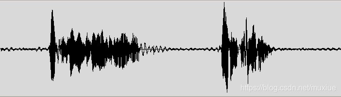

Speaker Recognition
---

# 語音識別簡介

Speech 其實上是一個複雜的現象, 人們很少理解 Speech 是怎麼產生和感知的
> 最直觀的理解就是語言是由多個 words 組成的, 而每個 words 又是由多個 phones (音素)組成的,
>> 現實中 Speech 是一個連續動態的過程, 下面是一個 speech waveform 的例子



Speech 實際上是一個機率問題, 意味著在一段連續的 Speech 中, word 之間沒有明顯的分界,
> 所以從 Speech 到 text 的轉換, **永遠不可能 100% 正確**

+ phone (音素)
    > 人在說話時, 所能發出最短小最簡潔, 無法再分割的發音
    > + 英語音標中的**母音**與**子音**
    > + 台灣的注音符號
    > + 日語的五十音


# 語音的構成

Speech 是一種連續的 audio stream, 是由**穩定狀態**與**動態改變狀態**的疊加, 產成一個狀態的序列, 在這樣的序列中, 可以定義相似類別的聲音或音素
> 對應到每個 phone  waveform 的聲學特性, 受許多因素影響, e.g 環境, 揚聲器, 語音風格, ...etc.
>> 各種發聲的物件, 可以對應到類似的 phone, 但聲學特性卻不相同

協同發音 (coarticulation) 的存在使得 phone 的感知與標準產生差異, 所以我們需要根據上下文來辨別 phone,
或者將一個 phone 再切分為幾個 sub-phonetic (e.g. diphones, 雙音子)
> 協同發音指的是一個音, 受前後相鄰音的影響, 而發生變化.
從發聲機制及理論來看, 就是人的發聲器官, 在一個音轉向另一個音時,
其特性只能漸變, 進而使後一個音的 spectrum, 與其他條件下的 spectrum 產生差異

> 以 `three`來說, 音素的第一部分與在它之前的音素存在關聯, 中間部分是穩定的部分, 而最後一部分則與下一個音素存在關聯
>> 這就是為何在用 HMM 模型做語音識別時, 使用音素的三狀態

上下文相關建模方法, 在建模時考慮了這一影響, 從而使模型能更準確地描述語音
> Multi-phones (多元音素) 與 sub-phonetic 不同, Multi-phones 在 waveform 中匹配時, 其長度和單音素是一樣的
>> 檢測 Multi-phones 的一部分, 而不是全部, 因此長度與單音素一樣
> + Bi-Phone (雙音素)
>> 只考慮前一音的影響
> + Tri-phones (3音素)
>>考慮前一音和後一音的影響
> + Quin-phones (4音素)


從計算角度出發, 只檢測 Tri-Phones 的一部分, 比把 Tri-Phones 作為整體考慮, 要有用的多,
> 例如建立一個 Tri-Phones 頭部部分的 filter, 那麼你只需要一小部分 (大約4000個) 不同的短聲音 filters, 我們稱這些 filter 為 `senones`
>> senones 是一個可以被 decision tree 或其他方式來定義的複雜函數 (一個 senone 的上下文依賴, 會比單純的左右上下文複雜得多)

+ Syllables (音節), Word (單詞), Utterance (語句)
    > 多個 phones (音素) 構成 syllables (音節),
    而多個 syllables (音節) 構成 Word (單詞),
    多個 Word (單詞) 構成 Utterance (語句)

    - Syllables (音節) 是一個比較穩定的實體, 因為當語音變得比較快的時候, 音素往往會發生改變, 但是音節卻不變
        > 音節與節奏語調的輪廓有關, 音節經常在**語義識別**中使用
        >> 有幾種方式去產生音節
        >> + 形態學
        >> + 語音學

    - Word (單詞) 在語音識別中很重要, 因為 word 約束了音素的組合
        > 假如共有 40 個音素, 而每個 word 平均有 7 個音素, 那麼就會存在`40^7`個單詞,
        但幸運的是就算一個受過優等教育的人也很少使用過20k個單詞, 這就使識別變得可行。

    - Utterance (語句)
        > Word 和一些語助詞構成了 utterances (語句),
        >> 其中把語助詞稱為填充物(fillers), e.g. um, uh, 咳嗽等.
        語助詞在音訊中, 是**以停頓做分離**的, 所以它們更多只是語義上的概念, 並不算是一個句子

# 識別過程

語音識別一般的方法是
> + 錄製語音 waveform
> + 再把 waveform 通過靜音(語句之間的間斷, silences), 分割為多個語句, 然後去識別每個語句所表達的意思

為了達到這個目的, 需要用單詞的所有可能組合, 去匹配這段音訊, 然後選擇匹配度最高的組合.
在匹配過程中, 有幾個關鍵的概念需要瞭解

+ Features (特徵)
    > 由於描述一個語音需要的參數個數非常多, 這樣對處理速度的要求就很高
    >> 實際上也沒必要處理那麼多的資料, 只需處理對識別有幫助的就行

    > 所以需要進行**降維**來做最佳化
    >> 用 frames 去分割語音 waveform, 每 frames 大概 10ms, 然後每 frames 提取可以代表該幀語音的 39 個數字,
    這 39 個數字也就是該 frames 的特徵, 用 feature vector 來表示

    > 而如何提取 feature vector, 是當下熱門的研究課題, 不過簡單說來, 這些提取方法都是由 spectrum (frequency domain) 衍生出來的

+ Model (模型)
    > Model 用來做 Domain Transform, 將資料轉換到特定 domain, 以便於解析

    - 在實際應用中, senone 的音訊模型, 就是**三態高斯混合模型**

    - 設計 Model 有幾個問題需要考慮
        1. 模型到底多大程度上可以描述實際情況?
        1. 在模型本身的侷限情況下模型能表現得更優嗎?
        1. 自適應模型如何改變條件?

    - 經典的語言模型, 稱為隱藏式馬可夫模型(Hidden Markov Model, HMM),
        > 在該模型中, 過程被描述為, 以一定機率彼此改變的狀態序列
        >> HMM 已被證明對語音解碼非常實用

+ Matching process (匹配演算法)
    > 語音識別需要對所有的特徵向量和所有的模型, 做比較匹配, 這是一個非常耗時的工作.
    而在這方面的最佳化, 往往是使用一些技巧,
    在每一點的匹配時, 藉由保留最好的匹配變體(variants), 然後通過它在 next frame 產生最好的匹配變體

# 模型

根據語音結構, 在語音識別中, **需要用到三種模型**
> [CMU Sphinx Models](https://sourceforge.net/projects/cmusphinx/files/Acoustic%20and%20Language%20Models/)

+ Acoustic model (聲學模型)
    > 一個聲學模型, 包含每個 senone 的聲學屬性, 其包括
    > + Context-independent model (不依賴於上下文)
    >> 尋找每個 phone 最大可能的特徵向量
    > + Context-dependent model (依賴於上下文)
    >> 根據上下文建構 senone

+ Phonetic dictionary (語音學字典)
    > 字典包含了從 words 到 phones 之間的對應
    >> 這種對應並不是十分有效 (e.g. 在字典中只標註了兩到三個發音變體), 但是在大多數時候是夠用的

    > 字典並不是描述 words 到 phones 之間對應的唯一方法, 也可透過機器學習演算法, 去學習一些複雜的函數, 來完成對應功能

+ Language model (語言模型)
    > 語言模型是用來約束單詞搜尋的
    >> 它定義了哪些 word, 能在上一個已經識別的 word 之後 (匹配是一個順序的處理過程),
    這樣就可以為匹配過程, 排除一些不可能的單詞

    - 最常用的語言模型是 `N-Gram` 模型, 它包含了**單詞序列的統計**和**有限狀態**模型,
    通過有限狀態機來定義語音序列 (有時候會加入 weighting)
        > 語言模型若能很好的約束空間搜尋, 就可以達到比較好的識別精準率

        1. `N-Gram` 是一種基於統計語言模型的演算法.
            > 基本想法是將文字裡面的內容, 按照 byte 進行大小為 N 的 Sliding Window 操作, 形成了長度為 N 的 Byte Slice 序列
            >> 每一個 Byte Slice 稱為 Gram
            > 對所有 Gram 的出現頻率進行統計, 並且按照事先設定好的 threshold 進行過濾, 生成 Gram table (也就是這個文字的 Eigen-space)
            >> Gram table 中的每一種 Gram 就是一個 Eigen-vector

        1. `N-Gram` 模型是基於一種假設, 當第 N 個 word 的出現, 只與前面 `N-1` 個 word 相關, 而與其它任何 word 都不相關.
            > 整句的機率, 就是各個 word 出現機率的乘積, 這些機率可以從語言資料庫中, 統計 N 個 word 同時出現的次數得到
            >> 常用的是二元的 Bi-Gram 和三元的 Tri-Gram

    - 語言模型是約束詞彙包含的單詞的, 但卻不利於**名字識別**(因為名字可以隨便由幾個單詞組成)
        > 為了處理這種情況, 語言模型可以包含更小的塊, e.g. sub-word, phones, etc, 但是這種情況, 識別精準率將會低於基於單詞的語言模型


Features, Models and Matching process 構成了一個語音識別系統
> 如果需要識別不同的語言, 那麼就需要修改這三個部分
>> 很多語言, 都已經存在聲學模型, 字典, 甚至大詞彙量語言模型可供下載了

# 其他需要的觀念

+ 網格(Lattice)是一個代表識別不同結果的有向圖
    > 一般來說, 很難去獲得一個最好的語音匹配結果, 所以 Lattices 就是一個比較好的格式, 去存放語音識別的中間結果

+ N-best lists of variants 和 網格(lattice)有點像, 但是它沒有網格那麼密集(也就是保留的結果沒有網格多)
    - N-best 搜尋和多遍搜尋
        > 為在搜尋中利用各種知識源, 通常要進行多遍搜尋,
        > + 第一遍使用代價低的知識源(如聲學模型, 語言模型和音標詞典), 產生一個候選列表或 word 候選網格
        >> 快速減少資料量
        > + 第二遍搜尋則是在候選列表上, 使用代價高的知識源(e.g. 4階或5階的 N-Gram, 4階或更高的上下文相關模型), 以獲得到最佳路徑
        >> 核心搜尋演算法

+ 單詞混淆網路
    > 是從網格的邊緣, 得到的一個嚴格的節點順序序列

+ 語音資料庫
    > 是一個從任務資料庫, 得到的典型錄音集, 也是用來訓練, 調整和測試解碼系統的(也就是語音識別系統)
    >> 如果是一個**對話的系統**, 那麼資料庫就是包含了**多個使用者的對話錄音**
    >> 如果是**聽寫系統**, 包含的就是**朗讀的錄音**


+ 文字資料庫
    > 是為了訓練語言模型而收集的文字, 一般是以樣本文字的方式來收集形成的
    >> 需要將文件檔(e.g. pdf, web-page, scan), 進行轉檔並取出 raw data,
    同時將數字展開成語音形式(e.g. 1 展開為英文的 one 或是中文的 yi),
    另外還需要把縮寫還原為完整 words

# 效能

隨著語音識別技術的發展, 最複雜的難題是如何使搜尋更加精準和快速(也就是語音解碼),
還有在模型並不完美的前提下, 如何匹配語音和模型.

一般來說, 系統需要通過一個測試資料庫, 來驗證精準性, 也就是是否達到了我們的預定目標.

假設有一個 N 個 word 長度的**原始文字**和**識別出來的文字**, 先對 **識別出來的文字** 定義評估的變數
> + `I` 表示被插入的 word 個數
> + `D` 表示被刪除的 word 個數
> + `S` 表示被替換的 word 個數

通過以下幾個參數來表徵系統的性能

+ Word error rate (單詞錯誤率)

    ```
    單詞錯誤率為:

    WER (%) = (I + D + S) / N
    ```

+ Accuracy (精準度)
    > 和 Word error rate 大部分是相似的, 但是它不計算插入 word 的個數

    ```
    Accuracy = (N - D - S) / N
    ```

    > 事實上, 對於大部分任務來說, 精準度是一個比較差的度量方法, 因為插入的情況對於識別結果的影響, 也是很重要的
    但對於某些任務而言, 精準度也是一個合理的評價解碼器性能的參數

+ Speed (識別速度)
    > 假設音訊檔案是 2 個小時, 而解碼花費了 6 個小時, 那麼計算出來的速度就是 `3xRT` (3倍速)

+ ROC Curves (ROC曲線)
    > 對於一個檢測任務, 檢測會出現誤報和命中兩種情況, ROC 曲線就是描述**誤報**和**命中數目**的比例
    >> 可以通過 ROC 曲線取尋找一個最優點, 在這個點誤報最小, 而命中最大 (接近 100% 的命中率)


# Reference

+ [語音識別基礎：（二）語音識別方法](https://open.toutiao.com/a7005115530088792587/?utm_source=vivoliulanqi&utm_medium=webview&utm_campaign=open&label=related_news&item_id=7005115530088792587&gy=b691c991707e75f40b6951b1cceca90329bdb717425a006fa5011b560d941a44c4eae172607b0a013717b8e4a11d6a5d9470f31a174313de3a01795104f7f461&crypt=1408&req_id=2021100100200401021218803214C84507&fr=normal&isRelated=1&isNews=1&vivoRcdMark=1&from_gid=6975347078952223236&channel_id=88805669586)
+ [開源語音識別工具包 - CMUSphinx](https://blog.csdn.net/muxiue/article/details/90292977?spm=1001.2101.3001.6650.5&utm_medium=distribute.pc_relevant.none-task-blog-2%7Edefault%7EBlogCommendFromBaidu%7ERate-5-90292977-blog-53729304.235%5Ev30%5Epc_relevant_default_base3&depth_1-utm_source=distribute.pc_relevant.none-task-blog-2%7Edefault%7EBlogCommendFromBaidu%7ERate-5-90292977-blog-53729304.235%5Ev30%5Epc_relevant_default_base3&utm_relevant_index=6)
+ [Basic concepts of speech recognition](https://cmusphinx.github.io/wiki/tutorialconcepts/)
+ [語音的基本概念--譯自CMU sphinx](https://blog.csdn.net/zouxy09/article/details/7941055)
