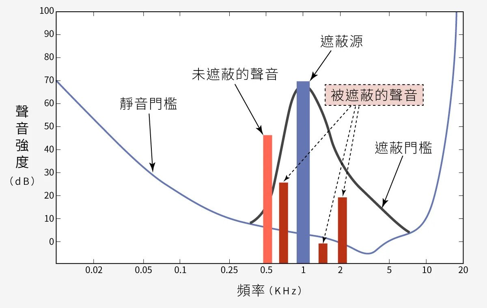
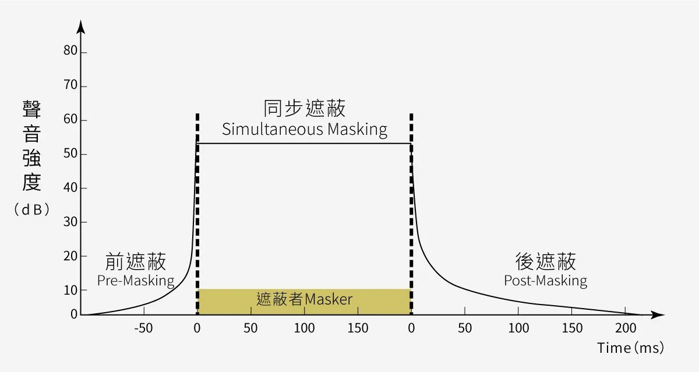

KeyWord Spotting, KWS
---

# 人類聽覺特性

人耳對不同強度、不同頻率聲音的聽覺範圍稱為聲域.
在人耳的聲域範圍內, 聲音聽覺心理的主觀感受主要有`音量(響度)`, `音調(音高)`, `音色(音品)`等特徵和`掩蔽效應`, `高頻定位`等特性
> 聲音構成的三要素對應物理量
> + 音量 => 振幅
> + 音調 => 頻率
> + 音色 => 相位

而在多種音源場合, 人耳掩蔽效應等特性更重要, 它是心理聲學的基礎

## 音量 (Loudness)

又稱聲強或響度, 它表示的是聲音能量的強弱程度, 主要取決於聲波振幅的大小.
> 聲音的音量一般用聲壓(達因/平方釐米)或聲強(瓦特/平方釐米)來計量,
聲壓的單位為帕(Pa), 它與基準聲壓比值的對數值稱為聲壓級, 單位是分貝(dB)

+ 對於響度的心理感受, 一般用單位 `Sone` 來度量, 並定義**基準響度(1-Sone)**為 `lkHz, 40dB` 純音

+ 響度的相對量, 稱為**響度級**, 表示某響度與**基準響度**比值的對數值, 單位為 `Phon`,
    > 即當人耳感到某聲音, 與 1kHz 單一頻率的純音同樣響時, 該聲音聲壓級的分貝數, 即為其響度級

+ 正常人聽覺的強度範圍為 `0dB ~ 140dB` (也有人認為是 `-5dB ~ 130dB`)
    > 超出人耳的可聽 frequency 範圍(即頻域)的聲音, 即使響度再大, 人耳也聽不出來(即響度為零),
    >> 同理在人耳的可聽頻域內, 若聲音弱到或強到一定程度, 人耳同樣是聽不到的

+ 當聲音減弱到人耳剛剛可以聽見時, 此時的聲音強度稱為**聽閾**
    > 以 1kHz 純音為準, 人耳剛能聽到的聲壓為 0dB (通常大於 0.3dB 即有感受), 聲強為 `10 ~ 16 W/cm62` 時的響度級定為 0-Phon

+ 當聲音增強到使人耳感到疼痛時, 這個閾值稱為**痛閾**
    > 以 1kHz 純音為準, 使人耳感到疼痛時的聲壓級, 約達到 140dB 左右

人耳對 `3k ~ 5k Hz`聲音最敏感, 幅度很小的信號都能被人耳聽到, 而在低頻區(< 800Hz)和高頻區(> 5kHz), 人耳對聲音的靈敏度要低得多.
> 響度級較小時, 聲音靈敏度降低較明顯, 而低頻段比高頻段靈敏度降低更加劇烈, 一般應特別重視**加強低頻音量**

通常 `200 ~ 3k Hz` Speech 聲壓級以 `60 ~ 70dB`為宜, 頻率範圍較寬的 Audio, 聲壓以 `80 ~ 90dB`最佳

## 音準 (Pitch)

也稱音高或音調, 表示人耳對聲音調子高低的主觀感受.
> + 客觀上音高大小主要取決於聲波基頻的高低, 頻率高則音調高, 反之則低, 單位用 `Hz` 表示
> + 主觀感覺的音高單位是 `Mel`, 通常定義響度為 40-Phon 的 1kHz 純音的音高為 1000-mel

> Hz 與 Mel 同樣是表示音高的兩個不同概念而又有聯繫的單位

人耳對頻率的感覺, 同樣有一個從最低可聽頻率 `20Hz` 到最高可聽頻率 `20kHz`的範圍.  
響度的測量是以 1kHz 純音為基準, 同樣, 音調的測量是以 40dB 聲強的純音為基準.
實驗證明, 音調與頻率之間的變化並非線性關係, 除了頻率之外, 音高還與聲音的響度及波形有關

音調的變化與兩個頻率, 相對變化的對數成正比.
> 不管原來頻率多少, 只要兩個 40dB 的純音, 其頻率都增加 1 倍, 人耳感受到的音調變化則相同
>> 在音樂聲學中, 音調的連續變化稱為滑音, **`1 倍頻` 相當於樂音提高了一個八度音階**

根據人耳對音調的實際感受, 人的語音頻率範圍可放寬到 `80 ~ 12k Hz`, 樂音較寬 `44.1K ~ 48K Hz`

## 音色 (Timbre)

又稱音品, 當發聲物體的主體振動時, 會發出一個基音, 同時其餘各部分也有複合的振動, 這些振動組合產生**泛音(Overtone)**,
正是這些泛音決定了發聲物體的音色
> 所有泛音都比基音的頻率高, 但強度都相當弱, 否則就無法調準樂器的音高了

+ 泛音其實就是物理學上的**諧波(Harmonic)**, 但次數的定義稍許有些不同
    > 傅立葉展開後, 最小正週期等於原函數的週期的部分, 稱為基波或一次諧波,
    最小正週期的若干倍, 等於原函數的週期的部分, 稱為高次諧波, 不管幾次諧波, 都是正弦波
    >> **高次諧波的頻率, 必然也等於基波的頻率的若干倍**
    >> + 基波頻率 3 倍的波稱為三次諧波
    >> + 基波頻率 5 倍的波稱為五次諧波

# 人耳的掩蔽效應

一個較弱的聲音(被掩蔽音, Masked-tone)的聽覺感受, 被另一個較強的聲音(掩蔽音, Masking-tone)影響的現象, 稱為人耳的**掩蔽效應(Masking Effects)**.

Masked-tone 在安靜環境中, 能被人耳聽到的純音的最小值(unit:dB), 稱為**絕對聞閾(Absolute threshold)**

## 頻域掩蔽效應

由上圖表明, 當強度在**靜音門檻(絕對聞閾)**以下的, 人耳將聽不到聲音, 而在**遮蔽門檻**範圍外的訊號會遮蔽範圍內的訊號
> + 提高 Masked-tone 的強度, 使人耳能夠聽見的聞閾, 稱為**遮蔽門檻**
> + 提高 Masked-tone 的分貝值, 稱為遮蔽量(或稱閾移)

`3k ~ 5k Hz` **絕對聞閾**值最小(即人耳對它的微弱聲音最敏感), 而在高頻區(> 15Khz)**絕對聞閾**值要大得多,
在 `800 ~ 1.5k Hz`範圍內, **絕對聞閾**隨頻率變化最不顯著(斜率平緩), 即在這個範圍內, 語言可儲度最高.

由於聲音訊率與掩蔽曲線不是線性關係, 為從感知上來統一度量聲音訊率, 引入了`臨界頻帶(criticalband)`的概念

所謂臨界頻帶, 是指當某個純音, 被以它為中心頻率, 且具有一定帶寬的連續雜訊所掩蔽時,
如果該純音, 剛好能被聽到時的功率等於這一頻帶內雜訊的功率, 那麼這一帶寬稱為臨界頻帶寬度.

臨界頻帶的單位叫 Bark(1-Bark 為一個臨界頻帶寬度).
> + 頻率小於 500Hz 時, 1-Bark 約等於`freq/100`
> + 頻率大於 500Hz 時, 1-Bark 約等於 `9 + 41og(freq/1000)`, 即約為某個純音中心頻率的 20%

通常認為, 在 `20 ~ 16k Hz`範圍內有 24 個臨界頻帶,
而當某個純音位於掩蔽聲的臨界頻帶之外時, 掩蔽效應仍然存在

## 時域掩蔽效應

除了同時發出的聲音之間有掩蔽現象之外, 在時間上相鄰的聲音之間也有掩蔽現象, 並且稱為**時域掩蔽**.

**時域掩蔽**又分為`前掩蔽(pre-masking)`, `後掩蔽(post-masking)`, `和同步遮蔽(Simultaneous-masking)`
> 產生**時域掩蔽**的主要原因是, 人的大腦處理資訊需要花費一定的時間, 一般來說
> + Pre-masking 很短, 只有大約 `5 ~ 20ms`
> + Post-masking 可以持續 `50 ~ 200 ms`
> + Simultaneous-masking 指一種聲音被另一種同時發出的聲音所掩蓋
>> 在 1kHz 頻率上發出的聲強較大的聲音, 可能會將在 1.1kHz 頻率上聲強較小的聲音掩蓋.
同樣在 440Hz 和 450Hz 上, 分別先後發出的兩個聲音, 可以被清楚地分辨, 但當它們同時發出時, 就會變得難以識別

# CMU Sphinx

CMU Sphinx(簡稱 Sphinx) 是美國卡內基梅隆大學開發的一系列語音識別工具包以及相關工具
> e.g. 聲學模型訓練軟體, 語言模型編輯軟體, 和語音詞典 CMUDICT 等的總稱

在 2000 年, 卡內基梅隆的 Sphinx 小組致力於開源幾個語音識別器元件, 包括 Sphinx 2 和後來的 Sphinx 3(2001 年).
> Sphinx 包括許多工具包, 可以用於搭建具有不同需求的應用.
> + Pocketsphinx
>> 用 C 語言編寫的輕量級的語音識別庫
> + Sphinxbase
>> 提供了公共的函數功能, 為 Pocketsphinx 依賴的函式庫
> + Sphinx4
>> 用 Java 編寫的自適應的, 可修改的語音識別庫
> + Sphinxtrain
>> 聲學模型訓練軟體

Sphinx 除了是 open source 之外, 還可以自己定製聲音模型, 語言模型, 語音學字典, 用於多個不同的場景
> e.g. 語音搜尋, 語義分析, 翻譯, 智能助手等

+ 如何選擇需要的工具包呢
    > 由於 Sphinx 有用不同的程式語言開發的工具包, 所以開發者可以根據自己的習慣, 選擇相應的語言識別包
    > + 如果想要 lite 和 portable, 那麼選擇 `pocketsphinx`
    > + 如果你想要靈活和可管理, 那麼可以選擇 `sphinx4`

## [CMUSphinx-Practice](note_CMUSphinx_practice.md)

# Concept

## [MFCC, Mel-scaleFrequency Cepstral Coefficients](note_MFCC.md)

# Reference

+ [MFCC 梅爾倒頻譜係數](https://blog.maxkit.com.tw/2019/12/mfcc.html)
+ [遮蔽效應](https://medium.com/@timshu/%E9%81%AE%E8%94%BD%E6%95%88%E6%87%89-bf773e445468)
+ [開源語音識別工具包 - CMUSphinx](https://blog.csdn.net/muxiue/article/details/90292977?spm=1001.2101.3001.6650.5&utm_medium=distribute.pc_relevant.none-task-blog-2%7Edefault%7EBlogCommendFromBaidu%7ERate-5-90292977-blog-53729304.235%5Ev30%5Epc_relevant_default_base3&depth_1-utm_source=distribute.pc_relevant.none-task-blog-2%7Edefault%7EBlogCommendFromBaidu%7ERate-5-90292977-blog-53729304.235%5Ev30%5Epc_relevant_default_base3&utm_relevant_index=6)
+ [利用PocketSphinx在Windows上搭建一個語言識別應用](https://blog.csdn.net/muxiue/article/details/90294594)

